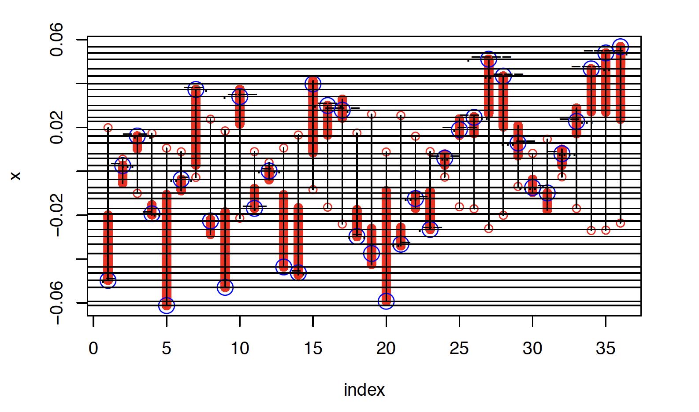
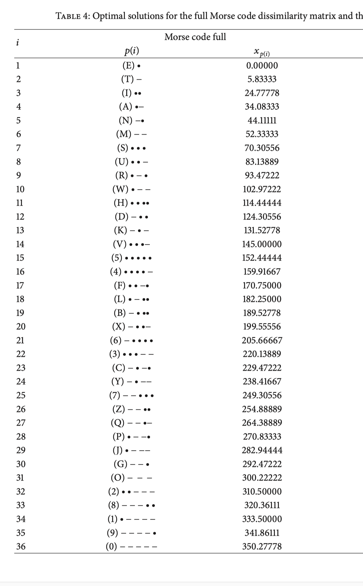

# In Search of Global Minima {#global}

We have already discussed the problem of finding the global minimum, instead of merely one or more local minima, in chapters \@ref(fullchapter) and \@ref(unidimensional). In the uni-dimensional case the basic MDS problem becomes combinatorial, we have to minimize over all $n!$ permutations of $\iota_n$, and there usually are very many local minima, all of them strict. The case in which all $\delta_{ij}$ are the same shows there can be $n!$ local minima, all global. All these minima are strict and isolated, and thus a small perturbation of the equal-dissimilarity case still has $n!$ local minima (@pliner_96). In the full-dimensional case there is only one minimum, which is by definition the global minimum. For $1<p<n-1$ we can expect to be somewhere between these two extremes, with in addition the possibility that some of the critical points are saddle points and not local minima. But note that if all dissimilarities are equal all permutations of the points in the global minimum configuration also give global minima, which means that even in higher dimensional cases we may have $n!$
local minima.

One way to protect against non-global minima is to start with a really good initial configuration. Generally, the Torgerson and Guttman initial configurations are helpful, and so are the first $p$ principal components of the full-dimensional solution. Another important tool is to stop iterations using the size of the gradient (or the difference between $X$ and $\gamma(X)$), with a cut-off value of at least $1e-7$, but preferably $1e-10$ or even $1e-15$. Earlier implementations of smacof may have stopped too soon if the target local minimum is in a
flat region of the configuration space, or if the iterations stray too close to a saddle point and must flex their muscle to get away from it.

In this chapter we will discuss some methods to find the global minimum, or, more modestly, to move from one local minimum to another better local minimum. The global optimization battlefield is in constant flux. New methods for general of specific global optimization problems seem to be invented every day, all struggling with the curse of dimensionality. The field is riddled with the remains of methods that died in infancy. So I am not saying I will discuss the best, or even the most promising, global optimization methods for MDS. I simply choose the ones I like best, and the ones that fit nicely into the smacof framework.

## Random Starts

The simplest way to get an idea about the local minima of stress in any specific example is to run smacof with multiple random initial configurations. The implementation is simple. Put the smacof runs in a loop from 1 to $N$,
start each run with a random initial configuration, and collect the results in some data structure. It is true that our analysis will take $N$ times as long to finish, but just start up your PC and go and do something else while it runs. It seems to me that this ought to be standard practice for actual MDS applications. Not only do we find the best local minimum in terms of stress, but we get valuable information about the stability of our result. 
If we take, for example, $N=1000$ and we find the same local minimum in all runs, we can be reasonably confident
that we have found the global minimum. A small change in the dissimilarities will probably find the same global minimum. If we find multiple local minima, all with about the same frequency and with stress values that are close, then a small change may very well switch to another local minimum with the smallest stress value.

There is some freedom in the choice of method to generate random initial configurations. In the examples in this chapter we sample from the standard multivariate normal, but since we know that at local minima $\eta(X)\leq 1$ 
it may be more appropriate to sample from the unit ball in $\mathbb{R}^{n\times p}$ (@harman_lacko_10). In fact, since we also know that at a local minimum $\rho(X)=\eta^2(X)$, we may project our intial configurations on that surface.

metric - nonmetric

### Examples

#### Ekman

We use the Ekman data to illustrate this. We use 1000 random starts, and we stop iterating when the decrease in stress is less than 1e-15. We find 8 local minima, listed in table \@ref(tab:ekmanminima).

```{r ekmanthousand, echo = FALSE, cache = TRUE}
source("data/ekman.R")
lbekman <- as.character(attr(ekman, "Labels"))
set.seed(12345)
ekman <- as.matrix(ekman)
ekman <- ekman + diag(14)
ekman <- 1 - ekman
w <- 1 - diag (14)
ekman <- ekman / sqrt(sum(ekman ^ 2))
hekman <- as.list(1:1000)
for (i in 1:1000) {
  hekman[[i]] <- smacofR(w, ekman, 2, xold = smacofRandomStart(w, ekman, 14, 2), eps = 1e-15, verbose = FALSE)
}
```

```{r ekmanminima, echo = FALSE}
s <- format(sort(sapply(hekman, function(x) x$s)))
t <- unique(s)
u <- colSums(ifelse(outer(s, t, "=="), 1, 0))
ekdf <- data.frame(no = 1:length(t), minimum = as.double(t), frequency = u)
kable(ekdf, booktabs = TRUE, caption = "Local Minima in Ekman Example")
```

```{r ekmanhistplot1, echo = FALSE, fig.align = "center", fig.cap = "Ekman Stress Values"}
hist(sapply(hekman, function (x) x$s), xlab = "stress", main = "")
```

```{r ekmanhistplot2, echo = FALSE, fig.align = "center", fig.cap = "Ekman Iteration Counts"}
hist(sapply(hekman, function (x) x$itel), xlab = "itel", main = "")
```

The results are encouraging, because they indicate that, at least in the Ekman example, the lower the local minimum, the more attractive it is for the smacof iterations. The lowest local minima seem to have the largest regions of attraction. Specifically, we find what is presumably the global minimum in more than 80\% of the cases. Nevertheless, if our clients were so unwise to start their MDS analysis with a random initial configuration then about 20% of them will get the wrong answer. 

In the example we also see a number of local minima, found only in a small number of cases, whose stress values are very close to each other. It seems likely that others of roughly the same stress level will be found if we continue sampling additional random initial configurations.

```{r ekmanlmtwo, echo = FALSE}
x1 <- hekman[[1]]$x
x2 <- hekman[[59]]$x
```

The configurations corresponding with the two dominant local minima are in \@ref(fig:ekmanlmplot1) and \@ref(fig:ekmanlmplot2). if we compare them we see that the color circle has two separate circular segments. In the second local minimum the order of the colors on one of these two segments is reversed.

```{r ekmanlmplot1, fig.align = "center", echo = FALSE, fig.cap = "Global (?) Minimum"}
par(pty="s")
plot(x1, type = "n", xlim = c(-.055, .055), ylim = c(-.055, .055), xlab = "", ylab = "")
text(x1, lbekman, col = "RED", cex = .85)
```

```{r ekmanlmplot2, fig.align = "center", echo = FALSE, fig.cap = "Largest (?) Non-global Minimum"}
par(pty="s")
plot(x2, type = "n", xlim = c(-.055, .055), ylim = c(-.055, .055), xlab = "", ylab = "")
text(x2, lbekman, col = "RED", cex = .85)
```

#### De Gruijter

The Ekman example is somewhat atypical, because it has an exceptionally good fit. We perform the same computations for the De Gruijter example, still using a cut-off at 1e-15, but now allowing for up to 10,000 iterations. 

The data in this example are averages of preference rankings for nine Dutch political parties by 100 students. Due to the heterogeneity of the population there is a considerable regression to the mean. Typically this would suggest splitting the students into more homogeneous groups (which is what @degruijter_67 did), and/or using a form of non-metric scaling (which is what De Gruijter did as well).


```{r gruijterthousand, echo = FALSE, cache = TRUE}
source("data/gruijter.R")
set.seed(12345)
lbgruijter <- as.character(attr(gruijter, "Labels"))
gruijter <- as.matrix(gruijter)
w <- 1 - diag (9)
gruijter <- gruijter / sqrt(sum(gruijter ^ 2))
hgruijter <- as.list(1:1000)
for (i in 1:1000) {
  hgruijter[[i]] <- smacofR(w, gruijter, 2, xold = smacofRandomStart(w, gruijter, 9, 2), eps = 1e-15, itmax = 10000, verbose = FALSE)
}
```  

Our 1000 runs produce 21 local minima, in table \@ref{tab:gruijterlocalminima}, with stress values that are close to each other. In this case it is easy to imagine that more runs will produce many more local minima, with low frequencies, mainly permuting the political parties on the horseshoe. In other words, the situation is somewhat like the case in which all dissimilarities between the nine objects are equal, in which case we have $9!=$`r factorial(9)` local minima, all with the same stress value.


```{r gruijterminima, echo = FALSE}
s <- format(sort(sapply(hgruijter, function(x) x$s)))
t <- unique(s)
u <- colSums(ifelse(outer(s, t, "=="), 1, 0))
grdf <- data.frame(no = 1:length(t), minimum = as.double(t), frequency = u)
kable(grdf, booktabs = TRUE, caption = "Local Minima in De Gruijter Example")
```

Another comparison may be useful. The Ekman example is like a matrix with two dominant eigenvalues,
the De Gruijter example is like a matrix will all eigenvalues approximately equal to each other.
Since smacof is somewhat like the power method, we expect poor convergence in the De Gruijter example,
and histogram \@ref(fig:histgruijter2) shows exactly that. There is even one random start from which there is no convergence in 10,000 iterations. In the Ekman example the frequency of 
the local minima seems closely related to the stress value at the local minimum, in the De Gruijter
example the frequency of the local minims seems more random. In the Ekman case we can be pretty sure we 
have found the global minimum, in the De Gruijter case we are far from sure.

```{r histgruijter1, echo = FALSE, fig.align = "center", fig.cap = "De Gruijter Stress Values"}
hist(sapply(hgruijter, function (x) x$s), main = "", xlab = "stress")
```

```{r histgruijter2, echo = FALSE, fig.align = "center", fig.cap = "De Gruijter Iteration Count"}
hist(sapply(hgruijter, function (x) x$itel), main = "", xlab = "itel")
```


```{r}
x1 <- hgruijter[[14]]$x
x3 <- hgruijter[[1]]$x
```

```{r gruijterlmplot1, fig.align = "center", echo = FALSE, fig.cap = "Largest Local Minimum"}
par(pty="s")
plot(x1, type = "n", xlab = "", ylab = "")
text(x1, lbgruijter, col = "RED", cex = .85)
```

```{r gruijterlmplot2, fig.align = "center", echo = FALSE, fig.cap = "Another Local Minimum"}
plot(x3, type = "n", xlab = "", ylab = "")
text(x3, lbgruijter, col = "RED", cex = .85)
```


## Tunneling, Filling, Annealing, etc.


## Cutting Planes {#globcutplanes}

In cutting plane methods we approximate a non-polyhedral compact convex set $\mathcal{C}$ by a sequence $\mathcal{P}_n$ of convex polyhedra. Approximation is from the outside, i.e. $\mathcal{C}\subset\mathcal{P}_n$,  strictly monotonic, i.e $\mathcal{P}_{n+1}\subset\mathcal{P}_n$, and convergent, i.e. $\lim_{n\rightarrow\infty}\mathcal{P_n}=\mathcal{C}$. Under suitable conditions the maximum/minimum $f^\star_n$ of a function $f$ on $\mathcal{P}_n$ will converge to $f^\star$, the maximum/minimum of $f$ on $\mathcal{C}$.

If we are maximizing a convex function on $\mathcal{C}$ then the maximum on the approximating polyhedron $\mathcal{P}_n$ will be at one of the vertices $x^\star$. If 
$x^\star\not\in\mathcal{C}$ we cut it off by finding a hyperplane that separates $x$
and $\mathcal{C}$. We can, for example, project $x^\star$ on $\mathcal{C}$ and use the tangent hyperplane to $\mathcal{C}$ in the projection $\hat x$.  Define $\mathcal{P}_{n+1}\cap\{x\mid a'x\leq b\}$, with $a'x=b$ the separating hyperplane that has $a'x\leq b$ for each $x\in\mathcal{C}$ and $a'x^\star > b$.

The basic MDS problem can be reformulated as maximization of $\rho(x)$ on the unit ball $\eta^2(x)=x'x\leq 1$. See sections \@ref(propcoefspace) and \@ref(propspherespace) for the reformulation tools. The cutting plane method in the case of a ball is particulary simple, at least conceptually. If $x^\star\not\in\mathcal{C}$ then its projection on the ball is $\hat x=x^\star/\|x^\star\|$ and the tangent hyperplane in $\hat x$ is $\hat x'x\leq 1$.

Computationally, however, matters are not so simple. The polyhedron $\mathcal{P}_n$ is described by an increasing number of linear inequalities.
Finding all vertices requires a non-trivial effort, and in the general case the method seems practical only for small or moderately small examples. In an actual implementation we would have to have a scheme for dropping or not adding redundant inequalities (that are implied by earlier inequalities) and a scheme for dropping inequalities generating vertices that can never be the global maximum. Such strategfies will depend on the nature of the function $f$ and on the convex set $\mathcal{S}$.

### On the Circle {#globalcircle}

For the circle the cutting plane method can be made very simple. Suppose we start with a $n$ distinct inner points $x_1,\cdots,x_n$ on the unit circle $\mathcal{S}$, ordered clockwise so that $x_1$ is at the top of the circle (high noon). Let $\mathcal{Q}_n$ be their convex hull. Then $\mathcal{Q}_n\subset\mathcal{S}$.
The tangent lines at $x_i$ and $x_{i+1}$ intersect outside the circle in an outer point $y_i$, with $y_n$ the intersection of the tangents at $x_n$ and $x_1$. Let $\mathcal{P}_n$ be the convex hull of the $y_i$. Then $\mathcal{Q}_n\subset\mathcal{S}\subset\mathcal{P}_n$ and thus 
$$
\max_{i=1}^n\rho(x_i)=\max_{x\in\mathcal{Q}_n}\rho(x)\leq\max_{x\in\mathcal{S}}\rho(x)\leq\max_{x\in\mathcal{P}_n}\rho(x)=\max_{i=1}^n\rho(y_i).
$$
Thus we have easily computable lower and upper bounds for the global maximum of $\rho$ on $\mathcal{S}$. The next step is to add the $n$ projections $y_i/\|y_i\|$ to the $n$ inner points to have a new set of $2n$ inner points. Then compute the corresponding $2n$ outer points, and so on. After $k$ steps we have $2^kk_0$ inner and outer points, where $k_0$ is the number of inner points we started with. 

```{r circseg, fig.align = "center", fig.cap = "Circle Segment", echo = FALSE}
par(pty="s")
s <- seq(0, 2*pi, length = 100)
plot(sin(s), cos(s), type = "l", lwd = 2, col = "RED", 
     xlim = c(-1.25, 1.25), ylim = c(-1.25, 1.25), xlab = "alpha", ylab = "beta")
x1 <- c(sin(0.1 * pi), cos(0.1 * pi))
points(x=x1[1],y=x1[2], cex = 1.5, pch = 19)
x2 <- c(sin(1.55 * pi), cos(1.55 * pi))
points(x=x2[1],y=x2[2], cex = 1.5, pch = 19)
abline(1/x1[2], -x1[1]/x1[2], lwd = 2, col = "BLUE")
abline(1/x2[2], -x2[1]/x2[2], lwd = 2, col = "BLUE")
points(x=0,y=0, cex = 1.5, pch = 19)
lines(matrix(c(x1,x2), 2, 2, byrow = TRUE), lwd = 2, col = "BLUE")
d <- x1[1] * x2[2] - x1[2] * x2[1]
xi <- (x2[2] - x1[2]) / d
yi <- (x1[1] - x2[1]) / d
points(x = xi, y = yi, cex = 1.5, pch = 19)
lines(matrix(c(0,0,xi,yi), 2, 2, byrow = TRUE), lwd = 2, col = "BLUE")
```

As figure \@ref(fig:circseg) shows, the outer point corresponding with two consecutive points on the circle lies on the perpendicular bisector of the line connecting the points. Using non-consecutive points will produce tangent lines which intersect farther away from the  circle, and which consequently leads to a larger convex hull, and a worse approximation.

```{r basematrices, echo = FALSE}
m <- 10
set.seed(12345)
z <- matrix(rnorm(2 * m), m, 2)
delta <- dist(z)
delta <- delta / sqrt(sum(delta ^ 2))
xbase <- apply(matrix(rnorm(2 * m), m, 2), 2, function(z) z - mean(z))
xbase <- xbase / sqrt (m * sum(xbase ^ 2))
dbase <- dist (xbase)
gbase <- -as.matrix(delta)/(as.matrix(dbase) + diag(m))
gbase <- gbase - diag(rowSums(gbase))
rho <- sum (delta * dbase)
gbase <- (gbase %*% xbase) / m
ybase <- gbase - rho * xbase
ybase <- ybase / sqrt (m * sum(ybase ^ 2))
```

```{r globalcirclestart, echo = FALSE}
n <- 4
s <- ((0:n) / n) * 2 * pi
x <- sin(s)[-(n + 1)]
y <- cos(s)[-(n + 1)]
```

The next three figures illustrate the first iterations of the algorithm. We always start with $n$ inner points equally distributed on the unit circle, in this case $n=4$. The circle is in red, the convex hulls of the outer and inner points are in blue.

```{r globalcircleplotfirst, fig.align = "center", fig.cap = "Starting Point", echo = FALSE}
inner1 <- cbind(x,y)
rhomax2Plot (inner1)
```

```{r globalcircleplotsecond, fig.align = "center", fig.cap = "After First Iteration", echo = FALSE}
b <- sqrt(1/2)
inner2 <- matrix (c(0,1,b,b,1,0,b,-b,0,-1,-b,-b,-1,0,-b,b), 8, 2, byrow = TRUE)
rhomax2Plot (inner2)
```

```{r globalcircleplotthird, fig.align = "center", fig.cap = "After Second Iteration", echo = FALSE}
inner3 <-matrix (0, 16, 2)
inner3[c(1,3,5,7,9,11,13,15), ] <- inner2
for (i in c(2,4,6,8,10,12,14)) {
  a <- (inner3[i-1, ] + inner3[i+1, ]) / 2
  inner3[i, ] <- a / sqrt(sum(a ^ 2))
}
a <- (inner3[1, ] + inner3[15, ]) / 2
inner3[16, ] <- a / sqrt(sum(a ^ 2))
rhomax2Plot (inner3)
```

We see rapid convergence of the convex hulls to the circle. The figures also suggest
an improvement of the method. Suppose $\rho_0$ is a lower bound of the global minimum
$\rho_\star$ equal to the largest $\rho$ value of the inner points. Suppose an outer point has a $\rho$ value less than or equal to $\rho_0$, consider the triangle with the outer point and the two inner points. All three vertices have a $\rho$ value less than or equal to $\rho_0$, and because $\rho$ is convex so have all points in the triangle, including a segment of the circle. Thus we can *phantom* that segment of the circle and create no new inner points there. If $\rho_0$ get closer to $\rho_\star$ more and more segments of the circle are eliminated, which will presumably lead to faster computation. It seems advantageous to start with a value of $\rho_0$ that is as large as possible, for example by using the value the smacof algorithm converges to. We can then use the inner and outer points to check if the $\rho$ value is a global minimum. 


### Cauchy Step Size

The standard smacof update of $X$ (update method $\text{up}_A$ of section \@ref(accelsimple)) is $\gamma(X)=V^+B(X)X$. The relaxed update is $X(\lambda):=\lambda \gamma(X)+(1-\lambda)X$. We usually choose
$\lambda=2$, which gives update method $\text{up}_B$ of section \@ref(accelsimple).

The Cauchy or steepest descent update is $X(\hat\lambda)$, with 
\begin{equation}
\hat\lambda=\mathop{\text{argmin}}_{\lambda\geq 0}\sigma(X(\lambda)).
(\#eq:globlbdopt)
\end{equation}
There are some examples of the use of $\hat\lambda$ in @deleeuw_heiser_C_80, but there the optimal step-size is computed by using constrained smacof iterations, which may 
actually take us to just a local minimum along the line. In this example we use our circle
methodology to compute the global minimum.

Now $\text{tr}\ X'V\gamma(X)=\rho(X)$ and thus if $\text{tr}\ X'VX=1$
then $Y=\gamma(X)-\rho(X)X$ satisfies $\text{tr}\ X'VY=0$ and 
$\eta^2(Y)=\eta^2(\gamma(X))-\rho^2(X)$. Normalize
$Y$ such that $\text{tr}\ Y'VY=1$, and now maximize $\rho$ over $\alpha$ and 
$\beta$, i.e. in configuration space maximize $\rho(\alpha X+\beta Y)$, 
where $\alpha^2+\beta^2=1$.

In the example we choose $X$ to be a $10\times 2$ matrix filled with random standard normals, and we start with 10 inner points on the circle. The iterations until convergence are as follows.

```{r globalcircleexample, echo = FALSE, cache = TRUE, eval = TRUE}
n <- 10
s <- ((0:n) / n) * 2 * pi
x <- sin(s)[-(n + 1)]
y <- cos(s)[-(n + 1)]
h <-rhomax2Comp (cbind(x, y))
th <- h$inval
z <- th[1] * xbase + th[2] * ybase
a <- matrix(c(sum(xbase * xbase), sum(xbase * gbase), sum(xbase * gbase), sum(gbase * gbase)), 2, 2)
b <- c(sum(xbase * z), sum(gbase * z))
u <- solve (a, b)
```

The optimal $\alpha$ and $\beta$ are `r th`. In configuration space this translates to
`r u[1]`$\ X+$`r u[2]`$\ \gamma(X)$.

### Balls

In dimension $p>2$, where $\rho$ must be maximized on the unit ball in $\mathbb{R}^p$, matters are not so simple any more. There is no single compelling natural ordering of the points on the sphere or hypersphere, and thus we have to improvise more.
We would like to maintain both upper and lower bounds for the global minimum that both keep improving in every iteration.

#### Outer Approximation

Let's first discuss a possible initial set of inner and outer points that are more or less regularly spaced inside or outside the unit sphere. For the inner points we can use the vertices of the cross-polytope (or the $\ell_1$-ball), which is the set of all $x$ in $\mathbb{R}^n$ with $\sum_{i=1}^n|x_i|\leq 1$. If $|x_i|\leq 1$ then $x_i^2\leq|x_i|$ with equality iff $x_i\in\{-1,0,1\}$. Thus $x'x\leq\sum_{i=1}^n|x_i|$ and $x'x=\sum_{i=1}^n|x_i|=1$ iff exactly one of
$x_i$ is $\pm 1$, i.e. there are $2n$ inner points on the sphere.

For the outer points we choose the vertices of $\max_{i=1}^n|x_i|\leq 1$, or equivalently $-1\leq x_i\leq +1$ for all $i$. Thus there are $2^n$ vertices which have $x_i=\pm 1$ for all $i$.

## Distance Smoothing

$$
d_{ij}(X,\epsilon):=\sqrt{d_{ij}^2(X)+\epsilon^2}
$$
$$
d_{ij}^\epsilon(X):=\sqrt{d_{ij}^2(X)+\epsilon^2}
$$
$$
\mathcal{D}d_{ij}^\epsilon(X)=\frac{1}{d_{ij}^\epsilon(X)}A_{ij}X
$$
$$
\nabla\sigma_\epsilon(X)=2(V-B_\epsilon(X))X
$$

$$
\mathcal{D}^2\sigma_\epsilon(X)=
$$
```{theorem, label = smoothsconvex}
If $\epsilon\geq\max_{i,j}\delta_{ij}$ then $B(X_\epsilon)\lesssim V$ and thus $\mathcal{D}^2(X_\epsilon)\gtrsim 0$ for all $X$ and  $\sigma_\epsilon$ is convex.
```

$$
\mathcal{D}_1d_{ij}(X,\epsilon)=\frac{1}{d_{ij}(X,\epsilon)}A_{ij}X
$$

$$
\nabla\sigma_\epsilon(X)=2\left(V-\mathop{\sum\sum}_{1\leq i<j\leq n}w_{ij}\frac{\delta_{ij}}{d_{ij}(X_\epsilon)}A_{ij}\right)X
$$
$$
\nabla^2\sigma_\epsilon(X)=2V-\mathop{\sum\sum}_{1\leq i<j\leq n}w_{ij}\frac{\delta_{ij}}{d_{ij}(X_\epsilon)}A_{ij}X
$$

## Penalizing Dimensions

In @shepard_62a and @shepard_62b an NMDS technique is developed that minimizes a loss function over configurations in full dimensionality $n-1$. In that sense the technique is similar to FDS. Shepard's iterative process, however, aims to maintain monotonicity between distances and dissimilarities and at the same time concentrate as much of the variation as possible in a small number of dimensions (@deleeuw_E_17e).

Let us explore the idea of concentrating variation in $p<n-1$ dimensions, but use an approach which is quite different from the one used by Shepard. We remain in the FDS framework, but we aim for solutions in $p<n-1$ dimensions by penalizing $n-p$ dimensions of the full configuration, using the classical Courant quadratic penalty function.

Partition a full configuration
$Z=\begin{bmatrix}X&\mid&Y\end{bmatrix}$, with $X$ of dimension $n\times p$ and $Y$ of dimension $n\times(n-p)$. Then
\begin{equation}\label{E:part}   
\sigma(Z)=1-\mathbf{tr}\ X'B(Z)X - \mathbf{tr}\ Y'B(Z)Y+\frac12 \mathbf{tr}\ X'VX+\frac12 \mathbf{tr}\ Y'VY.
\end{equation}
Also define the *penalty term*
\begin{equation}\label{E:tau}
\tau(Y)=\frac12\mathbf{tr}\ Y'VY,
\end{equation}
and *penalized stress*
\begin{equation}\label{E:pi}
\pi(Z,\lambda)=\sigma(Z)+\lambda\ \tau(Y).
\end{equation}

Our proposed method is to minimize penalized stress over $Z$ for a sequence of values $0=\lambda_1<\lambda_2<\cdots\lambda_m$. For $\lambda=0$ this is simply the FDS problem, for which we know we can compute the global minimum. For fixed $0<\lambda<+\infty$ this is a Penalized FDS or PFDS problem. PFDS problems with increasing values of $\lambda$ generate a *trajectory* $Z(\lambda)$ in configuration space.

The general theory of exterior penalty functions, which we review in section XX  of this paper, shows that increasing $\lambda$ leads to an increasing sequence of stress values $\sigma$ and a decreasing sequence of penalty terms $\tau$.
If $\lambda\rightarrow+\infty$ we approximate the global minimum of the FDS problem with $Z$ of the form $Z=\begin{bmatrix}X&\mid&0\end{bmatrix}$, i.e. of the pMDS problem. This assumes we do actually compute the global minimum for each value of $\lambda$, which we hope we can do because we start at the FDS global minimum, and we slowly increase $\lambda$. There is also a local version of the exterior penalty result, which implies that $\lambda\rightarrow\infty$ takes us to a local minimum of pMDS, so there is always the possibility of taking the wrong trajectory to a local minimum of pMDS.

### Local Minima

The stationary equations of the PFDS problem are solutions to the equations

\begin{align}
(V-B(Z))X&=0,\\
((1+\lambda)V-B(Z))Y&=0.
\end{align}

We can easily related stationary points and local minima of the FDS and PFDS problem.

```{theorem, label = "globlocal"}
1: If $X$ is a stationary point of the pMDS problem then $Z=[X\mid 0]$ is a stationary point of the PFDS problem, no matter what $\lambda$ is. 

2: If $Z=[X\mid 0]$ is a local minimum of the PFDS problem then $X$ is a local minimum of pMDS and 
$(1+\lambda)V-B(X)\gtrsim 0$, or $\lambda\geq\|V^+B(X)\|_\infty-1$, with $\|\bullet\|_\infty$ the spectral radius (largest eigenvalue).
```

::: {.proof}

Part 1 follows by simple substitution in the stationary equations.

Part 2 follows from the expansion for $Z=[X+\epsilon P\mid\epsilon Q]$.
\begin{multline}\label{E:expand2}
\pi(Z)=\pi(X)+\epsilon\ \text{tr}\ P'\mathcal{D}\sigma(X)\ +\\+\frac12\epsilon^2\ \mathcal{D}^2\sigma(X)(P,P)+\frac12\epsilon^2\ \text{tr}\ Q'((1+\lambda)V-B(X))Q+o(\epsilon^2).
\end{multline}
At a local minimum we must have $\mathcal{D}\sigma(X)=0$ and $\mathcal{D}^2\sigma(X)(P,P)\gtrsim 0$, which are the necessary conditions for a local minimum of pMDS. We also must have $((1+\lambda)V-B(X))\gtrsim 0$.
:::

Note that the conditions in part 2 of theorem \@ref(thm:globlocal) are also sufficient for PFDS to have a local minimum at $[X\mid 0]$, provided we eliminate translational and rotational indeterminacy by a suitable reparametrization, as in @deleeuw_R_93c. 

### Algorithm

The smacof algorithm for penalized stress is a small modification of the unpenalized FDS algorithm (ref). We start our iterations for $\lambda_j$ with the solution for $\lambda_{j-1}$ (the starting solution for $\lambda_1=0$ can be completely arbitrary). The update rules for fixed $\lambda$ are

\begin{align}
X^{(k+1)}&=V^+B(Z^{(k)})X^{(k)},\\
Y^{(k+1)}&=\frac{1}{1+\lambda}V^+B(Z^{(k)})Y^{(k)}.
\end{align}

Thus we compute the FDS update $Z^{(k+1)}=V^+B(Z^{(k)})Z^{(k)}$ and then divide the last $n-p$ columns by $1+\lambda$.

Code is in the appendix. Let us analyze a number of examples.

### Examples

This section has a number of two-dimensional and a number of one-dimensional examples. The one-dimensional examples are of interest, because of the documented large number of local minima of stress in the one-dimensional case, and the fact that for small and medium $n$ exact solutions are available (for example, @deleeuw_C_05h). By default we use `seq(0, 1, length = 101)` for $\lambda$ in most examples, but for some of them we dig a bit deeper and use longer sequences with smaller increments.

If for some value of $\lambda$ the penalty term drops below the small cutoff $\gamma$, for example `r 1E-10`, then there is not need to try larger values of $\lambda$, because they will just repeat the same result. We hope that result is the global minimum of the 2MDS problem.

The output for each example is a table in which we give, the minimum value of stress, the value of the penalty term at the minimum, the value of $\lambda$, and the number of iterations needed for convergence. Typically we print for the first three, the last three, and some regularly spaced intermediate values of $\lambda$. Remember that the stress values increase with increasing $\lambda$, and the penalty values decrease.

For two-dimensional examples we plot all two-dimensional configurations, after rotating to optimum match (using the function `matchMe()` from the appendix). We connect corresponding points for different values of $\lambda$. Points corresponding to the highest value of $\lambda$ are labeled and have a different plot symbol. For one-dimensional examples we put `1:n` on the horizontal axes and plot the single dimension on the vertical axis, again connecting corresponding points. We label the points corresponding with the highest value of $\lambda$, and draw horizontal lines through them to more clearly show their order on the dimension.

The appendix also has code for the function `checkUni()`, which we have used to check the solutions in the one dimensional case are indeed local minima. The function checks the necessary condition for a local minimum $x=V^+u$, with 
$$
u_i=\sum_{j=1}^nw_{ij}\delta_{ij}\ \mathbf{sign}\ (x_i-x_j).
$$
It should be emphasized that all examples are just meant to study convergence of penalized FDS. There is no interpretation of the MDS results

#### Chi Squares

In this example, of order 10, the $\delta_{ij}$ are independent draws from a chi-square distribution with two degrees of freedom. There is no structure in this example, everything is random.

```{r chi, size = "tiny", fig.align = "center", fig.cap = "10 Chi Squares", echo = FALSE, cache = TRUE}
set.seed(12345)
chi <- matrix (0, 10, 10)
for (i in 2:10) for (j in 1:(i-1))
  chi[i,j] <- chi[j,i] <- rchisq(1, 2)
w <- matrix(1, 10, 10)- diag(10)
chi <- 2 * chi / sqrt (sum (w * chi * chi))
lbd <- seq(0, 1, length = 101)
hChi <-runPenalty (w, chi, lbd = lbd, write = FALSE)
writeSelected (hChi, 10*(1:10)+1)
plotMe2 (hChi, as.character(1:10))
```

It seems that in this example the first two dimensions of FDS are already close to optimal for 2MDS. This is because the Gower rank of the dissimilarities is only three (or maybe four, the fourth singular value of the FDS solution $Z$ is very small).


#### Regular Simplex

The regular simplex has all dissimilarities equal to one. We use an example with $n=10$, for which the global minimum (as far as we know) of pMDS with $p=2$ is a configuration with nine points equally spaced on a circle and one point in the center.

```{r simplex10a, size = "tiny", fig.align = "center", echo = FALSE, cache = TRUE}
simplex <- w <- matrix(1, 10, 10)- diag(10)
simplex <- 2 * simplex / sqrt (sum (w * simplex * simplex))
lbd <- seq(0, 1, length = 101)
hSimplex <-runPenalty (w, simplex, lbd = lbd, write = FALSE)
writeSelected (hSimplex, 10*(1:10)+1)
plotMe2 (hSimplex, as.character(1:10))
```

Next, we look at the regular simplex with $n=4$, for which the global minimum has four points equally spaced on a circle (i.e. in the corners of a square). We use `seq(0, 1, length = 101)` for the $\lambda$ sequence.

```{r simplex4a, size = "tiny", fig.align = "center", echo = FALSE, cache = TRUE}
simplex <- w <- matrix(1, 4, 4)- diag(4)
simplex <- 2 * simplex / sqrt (sum (w * simplex * simplex))
lbd <- seq(0, 1, length = 101)
hSimplex <-runPenalty (w, simplex, lbd = lbd, write = FALSE)
writeSelected (hSimplex, 10*(1:10)+1)
plotMe2 (hSimplex, as.character(1:4))
```
The solution converges to an equilateral triangle with the fourth point in the centroid. This is a local minimum. What basically happens is that the first two dimensions of the FDS solution are too close to the local minimum. Or, what amounts to the same thing, the Gower rank is too large (it is $n-1$ for a regular simplex) , there is too much variation in the higher dimensions, and as a consequence the first two dimensions of FDS are a bad 2MDS solution. We try to repair this by refining the trajectory, using `seq(0, 1, 10001)`.

```{r simplex4b, size = "tiny", fig.align = "center", echo = FALSE, cache = TRUE}
simplex <- w <- matrix(1, 4, 4)- diag(4)
simplex <- 2 * simplex / sqrt (sum (w * simplex * simplex))
lbd <- seq(0, 1, length = 10001)
hSimplex <-runPenalty (w, simplex, lbd = lbd, write = FALSE)
writeSelected (hSimplex, NULL)
plotMe2 (hSimplex, as.character(1:4))
```

Now the trajectories move us from what starts out similar to an equilateral triangle to the corners of the square, and thus we do find the global minimum in this way. It is remarkable that we manage to find the square even when we start closer to the triangle with midpoint. 

#### Intelligence

These are correlations between eight intelligence tests, taken from the smacof package. We convert to dissimilarities by taking the negative logarithm of the correlations. As in the chi-square example, the FDS and the 2MDS solution are very similar and the PMDS trajectories are short. 

```{r intelligence, size = "tiny", fig.align = "center", echo = FALSE, cache = TRUE}
data(intelligence, package="smacof")
cor <- as.matrix (intelligence[, c("T1","T2","T3","T4","T5","T6","T7","T8")])
intel <- -log(cor)
w <- matrix(1, 8, 8) - diag (8)
lbd <- seq(0, 1, length = 101)
hIntel <-runPenalty (w, intel, lbd = lbd, write = TRUE)
plotMe2 (hIntel, dimnames(intel)[[1]])
```
The singular values of the FDS solution are `r format(svd(hIntel[[1]]$z)$d, digits = 3)`, which shows that the Gower rank is probably five, but approximately two.

#### Countries

This is the wish dataset from the smacof package, with similarities between 12 countries. They are converted to dissimilarties by subtracting each of them from seven.

```{r countries, size = "tiny", fig.align = "center", echo = FALSE, cache = TRUE}
data(wish, package="smacof")
countries <- as.matrix (wish)
w <- matrix(1, 12, 12) - diag (12)
countries <- 7 * w - countries
lbd <- seq(0, 1, length = 101)
hCountries <-runPenalty (w, countries, lbd = lbd, write = FALSE)
writeSelected (hCountries, 10*(1:10)+1)
plotMe2 (hCountries, dimnames(countries)[[1]])
```
The singular values of the FDS solution are `r format(svd(hCountries[[1]]$z)$d, digits = 3)`, and the Gower rank is six or seven.


#### Dutch Political Parties

In 1967 one hundred psychology students at Leiden University judged the similarity of nine Dutch political parties, using the complete method of triads (@degruijter_67). Data were aggregated and converted to dissimilarities. We first print the matrix of dissimilarities.

```{r poldist_data, size = "tiny", fig.align = "center", echo = FALSE, cache = TRUE}
poldist <-
structure(c(5.63, 5.27, 4.6, 4.8, 7.54, 6.73, 7.18, 6.17, 6.72, 
5.64, 6.22, 5.12, 4.59, 7.22, 5.47, 5.46, 4.97, 8.13, 7.55, 6.9, 
4.67, 3.2, 7.84, 6.73, 7.28, 6.13, 7.8, 7.08, 6.96, 6.04, 4.08, 
6.34, 7.42, 6.88, 6.36, 7.36), Labels = c("KVP", "PvdA", "VVD", 
"ARP", "CHU", "CPN", "PSP", "BP", "D66"), Size = 9L, 
call = quote(as.dist.default(m = polpar)), 
class = "dist", Diag = FALSE, Upper = FALSE)
poldist <- as.matrix(poldist)
w <- matrix(1, 9, 9) - diag(9)
poldist <- 2 * poldist / sqrt (sum (w * poldist * poldist))
matrixPrint(poldist, d = 3, w = 5)
```

The trajectories from FDS to 2MDS show some clear movement, especially of the D'66 party, which was new at the time.

```{r poldist_run, size = "tiny", fig.align = "center", echo = FALSE, cache = TRUE}
lbd <- seq(0, 1, length = 101)
hPoldist <-runPenalty (w, poldist, lbd = lbd, write = FALSE)
writeSelected (hPoldist, 10*(1:10)+1)
plotMe2 (hPoldist, dimnames(poldist)[[1]])
```

There seems to be some bifurcation going on at the end, so we repeat the analysis using `seq(0, 1, length = 1001)` for $\lambda$. The results turn out to be basically the same.

```{r poldist2, size = "tiny", fig.align = "center", echo = FALSE, cache = TRUE}
lbd <- seq(0, 1, length = 1001)
hPoldist <-runPenalty (w, poldist, lbd = lbd, cut = 1e-10, write = FALSE)
writeSelected (hPoldist, NULL)
plotMe2 (hPoldist, dimnames(poldist)[[1]])
```
The singular values of the FDS solution are `r format(svd(hPoldist[[1]]$z)$d, digits = 3)`, and the Gower rank is probably eight. This is mainly because these data, being averages, regress to the mean and thus have a substantial additive constant. If we repeat the analysis after subtracting .1 from all dissimilarities we get basically the same solution, but with somewhat smoother trajectories.


```{r poldist3, size = "tiny", fig.align = "center", echo = FALSE, cache = TRUE}
lbd <- seq(0, 1, length = 1001)
poldist <- poldist - .1 * w
hPoldist <-runPenalty (w, poldist, lbd = lbd, cut = 1e-10, write = FALSE)
writeSelected (hPoldist, NULL)
plotMe2 (hPoldist, dimnames(poldist)[[1]])
```

Now the singular values of the FDS solution are `r format(svd(hPoldist[[1]]$z)$d, digits = 3)`, and the approximate Gower rank is more like five or six.

#### Ekman

The next example analyzes dissimilarities between 14 colors, taken from @ekman_54. The original similarities $s_{ij}$, averaged over 31 subjects, were transformed to dissimilarities by $\delta_{ij}=1-s_{ij}$.

```{r ekman_global, size = "tiny", fig.align = "center", echo = FALSE, cache = TRUE}
data (ekman, package = "smacof")
ekman <- as.matrix(1 - ekman)
w <- matrix(1, 14, 14)- diag(14)
ekman <- 2 * ekman / sqrt (sum (w * ekman * ekman))
lbd <- seq(0, 1, length = 101)
hEkman <-runPenalty (w, ekman, lbd = lbd, cut = 1e-10, write = FALSE)
writeSelected (hEkman, 10*(1:10)+1)
plotMe2 (hEkman, dimnames(ekman)[[1]])
```

If we transform the Ekman similarities by $\delta_{ij}=(1-s_{ij})^3$ then its is known (@deleeuw_E_16k) that the Gower rank is equal to two. Thus the FDS solution has rank 2, and the 2MDS solution is the global minimum.

```{r okman, size = "tiny", fig.align = "center", echo = FALSE, cache = TRUE}
data (ekman, package = "smacof") 
okman <- as.matrix((1 - ekman) ^ 3)
w <- matrix(1, 14, 14)- diag(14)
okman <- 2 * okman / sqrt (sum (w * okman * okman))
lbd <- seq(0, 1, length = 101)
hOkman <-runPenalty (w, okman, lbd = lbd, cut = 1e-10, write = FALSE)
writeSelected (hOkman, 10*(1:10)+1)
plotMe2 (hOkman, dimnames(ekman)[[1]])
```

#### Morse in Two

Next, we use dissimilarities between 36 Morse code signals (@rothkopf_57). We used the symmetrized version `morse` from the `smacof` package (@deleeuw_mair_A_09c).

```{r morse, size = "tiny", fig.align = "center", echo = FALSE, cache = TRUE}
data(morse, package = "smacof")
morse <- as.matrix (morse)
w <- matrix (1, 36, 36) - diag (36)
morse <- 2 * morse / sqrt (sum (w * morse * morse))
lbd <- seq(0, 1, length = 101)
hMorse <-runPenalty (w, morse, lbd = lbd, cut = 1e-10, write = FALSE)
writeSelected (hMorse, 10*(1:10)+1)
plotMe2 (hMorse, dimnames(morse)[[1]])
```

#### Vegetables

Our first one-dimensional example uses paired comparisons of 9 vegetables, originating with @guilford_54. The proportions are transformed to dissimilarities by using the absolute values of the normal quantile function, i.e. $\delta_{ij}=|\Phi^{-1}(p_{ij})|$. We use a short sequence for $\lambda$.

```{r veg, size = "tiny", fig.align = "center", echo = FALSE, cache = TRUE}
lbd <- c(0, 0.01, 0.1, 1.0)
w <- 1 - diag(9)
hVeg <- runPenalty (w, veggies, lbd = lbd, p = 1)
plotMe1 (hVeg, dimnames(veggies)[[1]])
```

This example was previously analyzed by me in @deleeuw_C_05h using enumeration of all permutations. I found 14354 isolated local minima, and a global minimum equal to the one we computed here.

#### Plato

@mair_groenen_deleeuw_A_19 use seriation of the works of Plato, from the data collected by @cox_brandwood_59, as an example of unidimensional scaling. We first run this example with our usual sequence of five $\lambda$ values.

```{r plato, size = "tiny", fig.align = "center", echo = FALSE, cache = TRUE}
data(Plato7, package = "smacof")
plato <- as.matrix (dist (t (Plato7)))
w <- matrix (1, 7, 7) - diag (7)
plato <- 2 * plato / sqrt (sum (w * plato * plato))
hPlato <- runPenalty (w, plato, p = 1, lbd = c(0, .01, .1, 1, 10))
plotMe1 (hPlato, dimnames(plato)[[1]])
```
This gives the order

```{r p1, echo = FALSE}
m <- length (hPlato)
matrix(dimnames(plato)[[1]][order(hPlato[[m]]$x)], 7, 1)
```
which is different from the order at the global minimum that has Republic before Timaeus. Thus we have recovered a local minimum, and it seems our sequence of $\lambda$ values was not fine enough to do the job properly. So we try a longer and finer sequence.

```{r plato2, size = "tiny", fig.align = "center", echo = FALSE, cache = TRUE}
lbd <- c(0, .0001, .001, .01, 1:10/10, 2:10)
hPlato <- runPenalty (w, plato, p = 1, lbd = lbd)
plotMe1 (hPlato, dimnames(plato)[[1]])
```

Now the order is

```{r p2, echo = FALSE}
m <- length (hPlato)
matrix(dimnames(plato)[[1]][order(hPlato[[m]]$x)], 7, 1)
```
which does indeed correspond to the global minimum.

With a different $\lambda$ sequence we find the same solution.

```{r plato3, size = "tiny", fig.align = "center", echo = FALSE, cache = TRUE}
lbd <- c(0, .001 * (2 ^ (0:15))) 
hPlato <- runPenalty (w, plato, p = 1, lbd = lbd)
plotMe1 (hPlato, dimnames(plato)[[1]])
```

The order is

```{r p3, echo = FALSE}
m <- length (hPlato)
matrix(dimnames(plato)[[1]][order(hPlato[[m]]$x)], 7, 1)
```

#### Morse in One

Now for a more challenging example. The Morse code data have been used to try out exact unidimensional MDS techniques, for example by @palubeckis_13. We will enter the global minimum contest by using 10,000 values of $\lambda$, in an equally spaced sequence from 0 to 10. This is not as bad as it sounds. For the 10,000 FDS solutions `system.time()` tells us

```{r morse_one, echo = FALSE, cache = TRUE}
data(morse, package = "smacof")
morse <- as.matrix (morse)
w <- matrix (1, 36, 36) - diag (36)
morse <- 2 * morse / sqrt (sum (w * morse * morse))
lbd <- (0:10000)/1000
system.time(hMorse <-runPenalty (w, morse, p = 1, lbd = lbd, eps = 1e-10, cut = 1e-10, write = FALSE))
m <- length (hMorse)
```

The one-dimensional plot show quite a bit of movement, but much of it seems to be contained in the very first change of $\lambda$.

```{r plotmorseone, fig.align = "center", echo = FALSE, out.width = "85%"}

```

We can also plot stress and the penalty term as functions of $\lambda$. Again, note the big change in the penalty term when $\lambda$ goes from zero to 0.001.

```{r iter, fig.align="center", echo = FALSE, cache = TRUE}
ss <- sapply(hMorse, function (k) k$s)
tt <- sapply(hMorse, function (k) k$t)
plot ((0:(m-1))/10000, ss, xlab = "lambda", ylab = "stress (RED) and tau (BLUE) ", ylim = c(0,0.5), type = "l", col = "RED", lwd = 3)
lines (matrix (c((0:(m-1))/10000, tt), m, 2), col = "BLUE", lwd =3)
```

After the first `r m` values of $\lambda$ the penalty term is zero and we stop, i.e. we estimate $\lambda_+$ is `r m/1000`. At that point we have run a total of `r sum (sapply (hMorse, function (k) k$itel))` FDS iterations, and thus on average about two iterations per $\lambda$ value. Stress has increased from `r formatC(hMorse[[1]]$s, width = 15, digits = 10, format = "f")` to `r formatC(hMorse[[m]]$s, width = 15, digits = 10, format = "f")` and the penalty value has decreased from `r formatC(hMorse[[1]]$t, width = 15, digits = 10, format = "f")` to `r formatC(hMorse[[m]]$t, width = 15, digits = 10, format = "f")`. We find the following order of the points on the dimension.

```{r morseuni_order, echo = FALSE}
m <- length(hMorse)
matrix(dimnames(morse)[[1]][order(hMorse[[m]]$x)], 36, 1)
```

Our order, and consequently our solution, is the same as the exact global solution given by @palubeckis_13. See his table 4, reproduced below. The difference is that computing our solution takes 10 seconds, while his takes 494 seconds. But of course we would not have known we actually found the global mimimum if the exact exhaustive methods had not analyzed the same data as well. 

```{r echo=FALSE, fig.align="center", out.width="75%", eval = FALSE}

```
