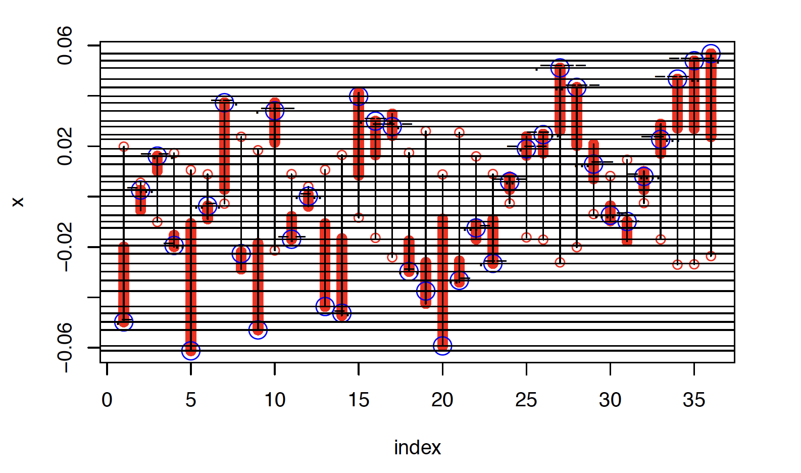
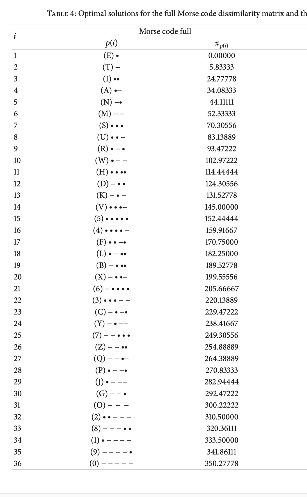

```{=html}
<style type="text/css">

body{ /* Normal  */
   font-size: 18px;
}
td {  /* Table  */
   font-size: 18px;
}
h1 { /* Header 1 */
 font-size: 28px;
 color: DarkBlue;
}
h2 { /* Header 2 */
 font-size: 22px;
 color: DarkBlue;
}
h3 { /* Header 3 */
 font-size: 18px;
 color: DarkBlue;
}
code.r{ /* Code block */
  font-size: 18px;
}
pre { /* Code block */
  font-size: 18px
}
</style>
```
```{r function_code, echo = FALSE}
source("rcode/common/cutting.R")
source("rcode/common/indexing.R")
source("rcode/common/io.R")
source("rcode/common/linear.R")
source("rcode/common/nextPC.R")
source("rcode/common/smacof.R")
source("rcode/properties.R")
source("rcode/pictures.R")
source("rcode/classical.R")
source("rcode/accelerate.R")
source("rcode/full.R")
source("rcode/unfolding.R")
source("rcode/constrained.R")
source("rcode/nominal.R")
source("rcode/sstress.R")
source("rcode/inverse.R")
source("rcode/global.R")
source("rcode/smacofEps.R")
source("rcode/mathadd.R")
```

```{r shlibs, echo = FALSE}
dyn.load("lib/deboor.so")
dyn.load("lib/nextPC.so")
dyn.load("lib/cleanup.so")
dyn.load("lib/jeffrey.so")
dyn.load("lib/jacobi.so")
dyn.load("lib/jbkTies.so")
dyn.load("lib/matrix.so")
#dyn.load("lib/mySort.so")
```

```{r packages, echo = FALSE}
suppressPackageStartupMessages (library (knitr, quietly = TRUE))
suppressPackageStartupMessages (library (kableExtra, quietly = TRUE))
suppressPackageStartupMessages (library (microbenchmark, quietly = TRUE))
suppressPackageStartupMessages (library (polynom, quietly = TRUE))
suppressPackageStartupMessages (library (hasseDiagram, quietly = TRUE))
suppressPackageStartupMessages (library (rlist, quietly = TRUE))
suppressPackageStartupMessages (library (MASS, quietly = TRUE))
suppressPackageStartupMessages (library (lsei, quietly = TRUE))
suppressPackageStartupMessages (library (rcdd, quietly = TRUE))
suppressPackageStartupMessages (library (numDeriv, quietly = TRUE))
suppressPackageStartupMessages (library (vertexenum, quietly = TRUE))
suppressPackageStartupMessages (library (lpSolve, quietly = TRUE))
suppressPackageStartupMessages (library (quadprog, quietly = TRUE))
```

```{r data, echo = FALSE}
source("data/dsmall.R")
source("data/ekman.R")
source("data/gruijter.R")
source("data/veggies.R")
```

# Note {.unnumbered}

This book will be expanded/updated frequently. The directory
[deleeuwpdx.net/pubfolders/stress](http://deleeuwpdx.net/pubfolders/stress)
has a pdf version, the bib file, the complete Rmd file with the
codechunks, and the R and C source code. All suggestions for improvement
of text or code are welcome, and some would be really benificial. For
example, I only use base R graphics, nothing more fancy, because base
graphics is all I know.

All text and code are in the public domain and can be copied, modified,
and used by anybody in any way they see fit. Attribution will be
appreciated, but is not required. For completeness we include a slighty
modified version of the Unlicense as appendix \@ref(apunlicense).

I number and label *all* displayed equations. Equations are displayed,
instead of inlined, if and only if

-   they are important, or
-   they are referred to elsewhere in the text, or
-   if not displaying them messes up the line spacing.

All code chunks in the text are named. Theorems, lemmas, chapters,
sections, subsections and so on are also named and numbered, using
bookdown/Rmarkdown.

I have been somewhat hesitant to use lemmas, theorems, and corollaries
in this book. I am not a mathematician, and, given the level of almost
all of the text, their use seems somewhat pretentious. But ultimately
they do provide a useful, maybe even indispensable, organizational tool.
As a compromise I use *result* for those results that are too trivial to
be elevated to theorem status. These results often do not even need a
proof. If there is a proof of a lemma, theorem, corollary, or result, it
ends with a $\blacksquare$.

Another idiosyncracy: if a line in multiline displayed equation ends
with "=", then the next line begins with "=". If it ends with "+", then
the next line begin with "+", and if it ends with "-" the next line
begins with "+" as well. I'll try to avoid ending a line with "+" or
"-", especially with "-", but if it happens you are warned. A silly
example is

```{=tex}
\begin{align}
&(x+y)^2-\\
&+4x=\\
&=x^2+y^2-2x=\\
&=(x-y)^2\geq\\
&\geq 0.
\end{align}
```
Just as an aside: if I refer to something that has been mentioned
"above" I mean something that comes earlier in the book and "below"
refers to anything that comes later. This always confuses me, so I had
to write it down.

The dilemma of whether to use "we" or "I" throughout the book is solved
in the usual way. If I feel that a result is the work of a group (me, my
co-workers, and the giants on whose shoulders we stand) then I use "we".
If it's an individual decision, or something personal, then I use "I".
The default is "we", as it always should be in scientific writing.

Chapter \@ref(mathadd) has some of the necessary mathematical background
material, both notation and results, sometimes with specific
eleborations that seem useful for the book. Other mathematical material
is worked into the individual chapters, if it is central to the
developmen of MDS technique, or too bulky to be in a mathematical
appendix. Examples are splines, majorization, unweighting, monotone
regression, and the basic Zangwill and Ostrowski fixed point theorems we
need. Other chapters just have references to chapter \@ref(mathadd) when
additional background is needed.

There is an appendix \@ref(apcode) with code, and an appendix
\@ref(apdatasets) with data sets. These contain brief descriptions and
links to the supplementary materials directories, which contain the
actual code and data.

Something about code and R/C

I will use this note to thank Rstudio, in particular J. J. Allaire and
Yihui Xi, for their contributions to the R universe, and for their
promotion of open source software and open access publications. Not too
long ago I was an ardent LaTeX user, firmly convinced I would never use
anything else again in my lifetime. As I was convinced before that, by
the way, that I would never use anything besides, in that order,
FORTRAN, PL/I, APL, and (X)Lisp. But I lived too long. And then R,
Rstudio, (R)Markdown, bookdown, and blogdown came along.

```{r lajollapic, echo = FALSE, fig.align = "center", out.width="60%", fig.cap = "Forrest Young, Bepi Pinner, Jean-Marie Bouroche, Yoshio Takane, Jan de Leeuw \n at La Jolla, August 1975"}
include_graphics("graphics/lajolla_08_75.png")
```

# Preface {.unnumbered}

This book is definitely *not* an impartial and balanced review of all of
multidimensional scaling (MDS) theory and history. It emphasizes the
computation, and the mathematics needed for computation. In addition, it
is a summary of over 50 years of MDS work by me, either solo or together
with my many excellent current or former co-workers and co-authors. It
is heavily biased in favor of the **smacof** formulation of MDS
(@deleeuw_C_77, @deleeuw_heiser_C_77, @deleeuw_mair_A_09c), and the
corresponding majorization (or MM) algorithm. And, moreover, I am
shamelessly squeezing in as many references to my published and
unpublished work as possible, with links to the corresponding pdf's if
they are available.

I have not organized the book along historical lines because most of the
early techniques and results have been either drastically improved or
completely abandoned. Nevertheless, some personal historical perspective
may be useful. I will put most of it in this preface, so uninterested
readers can easily skip it.

I got involved in MDS in 1968 when John van de Geer returned from a
visit to Clyde Coombs in Michigan and started the Department of Data
Theory in the Division of Social Sciences at Leiden University. I was
John's first hire, although I was still a graduate student at the time.

Remember that Clyde Coombs was running the Michigan Mathematical
Psychology Program, and he had just published his remarkable book "A
Theory of Data" (@coombs_64). The name of the new department in Leiden
was taken from the title of that book, and Coombs was one of the first
visitors to give a guest lecture there.

This is maybe the place to clear up some possible misunderstandings
about the name "Data Theory". Coombs was mainly interested in a taxonomy
of data types, and in pointing out that "data" were not limited to a
table or data-frame of objects by variables. In addition, there were
also similarity ratings, paired comparisons, and unfolding data. Coombs
also emphasized that data were often non-metric, i.e. ordinal or
categorical, and that it was possible to analyze these ordinal or
categorical relationships directly, without first constructing numerical
scales to which classical techniques could be applied. One of the new
techniques discussed in @coombs_64 was a non-metric form of MDS, in
which not only the data but also the representation of the data in
Euclidean space was non-metric.

John van de Geer had just published @vandegeer_67. In that book, and in
the subsequent book @vandegeer_71, he developed his unique geometric
approach to multivariate analysis. Relationship between variables, and
between variables and individuals, were not just discussed using matrix
algebra, but were also visualized in diagrams. This was related to the
geometry in Coombs' Theory of Data, but it concentrated on numerical
data in the form of rectangular matrices of objects by variables.

Looking back it is easy to see that both Van de Geer and Coombs
influenced my approach to data analysis. I inherited the emphasis on
non-metric data and on visualization. But, from the beginning, I
interpreted "Data Theory" as "Data Analysis", with the emphasis shifting
almost completely to techniques, loss functions, implementations,
algorithms, optimization, computing, and programming. This is of
interest because in 2020 my old Department of Statistics at UCLA,
together with the Department of Mathematics, started a bachelor's
program in Data Theory, in which "Emphasis is placed on the development
and theoretical support of a statistical model or algorithmic approach.
Alternatively, students may undertake research on the foundations of
data science, studying advanced topics and writing a senior thesis."
This sounds like a nice hybrid of Data Theory and Data Analysis, with a
dash of computer science mixed in.

Computing and optimization were in the air in 1968, not so much because
of Coombs, but mainly because of Roger Shepard, Joe Kruskal, and Doug
Carroll at Bell Labs in Murray Hill. John's other student Eddie Roskam
and I were fascinated by getting numerical representations from ordinal
data by minimizing explicit least squares loss functions. Eddie wrote
his dissertation in 1968 (@roskam_68). In 1973 I went to Bell Labs for a
year, and Eddie went to Michigan around the same time to work with Jim
Lingoes, resulting in @lingoes_roskam_73.

My first semi-publication was @deleeuw_R_68g, quickly followed by a long
sequence of other, rather rambling, internal reports. Despite this very
informal form of publication the sheer volume of them got the attention
of Joe Kruskal and Doug Carroll, and I was invited to spend the academic
year 1973-1974 at Bell Laboratories. That visit somewhat modified my
cavalier approach to publication, but I did not become half-serious in
that respect until meeting with Forrest Young and Yoshio Takane at the
August 1975 US-Japan seminar on MDS in La Jolla. Together we used the
alternating least squares approach to algorithm construction that I had
developed since 1968 into a quite formidable five-year publication
machine, with at its zenith @takane_young_deleeuw_A_77.

In La Jolla I gave the first presentation of the majorization method for
MDS, later known as smacof, with the first formal convergence proof. The
canonical account of smacof was published in @deleeuw_C_77. Again I did
not bother to get the results into a journal or into some other
effective form of publication. The basic theory for what became known as
smacof was also presented around the same time in the book chapter
@deleeuw_heiser_C_77.

In 1978 I was invited to the Fifth International Symposium on
Multivariate Analysis in Pittsburgh to present what became
@deleeuw_heiser_C_80. There I met Nan Laird, one of the authors of the
basic paper on the EM algorithm (@dempster_laird_rubin_77). I remember
enthusiastically telling her on the conference bus that EM and smacof
were both special case of the general majorization approach to algorithm
construction, which was consequently born around the same time. But that
is a story for a companion volume, which currently only exists in a very
preliminary stage (@deleeuw_B_16b).

My 1973 PhD thesis (@deleeuw_B_73, reprinted as @deleeuw_B_84) was
actually my second attempt at a dissertation. I had to get a PhD, any
PhD, before going to Bell Labs, because of the discrepancy in the Dutch
and American academic title and reward systems. I started writing a
dissertation on MDS, in the spirit of what later became
@deleeuw_heiser_C_82. But halfway through I lost interest and became
impatient, and I decided to switch to nonlinear multivariate analysis.
This second attempt did produced a finished dissertation, which
blossomed, with the help of many, into @gifi_B_90. But that again is a
different history, which I will tell some other time in yet another
companion volume (@deleeuw_B_16a). For a long time I did not do much
work on MDS, until the arrival of the R language and Patrick Mair led to
a resurgence of my interest, and ultimately to @deleeuw_mair_A_09c and
@mair_groenen_deleeuw_A_19.

I consider this MDS book to be a summary and extension of the basic
papers @deleeuw_C_77 (reprinted as @deleeuw_R_05b),
@deleeuw_heiser_C_77, @deleeuw_heiser_C_80, @deleeuw_heiser_C_82, and
@deleeuw_A_88b (published version of @deleeuw_R_84c), all written 30-40
years ago. Footprints in the sands of time. It can also be seen as an
elaboration of the more mathematical sections of the excellent and
comprehensive textbook of @borg_groenen_05. That book has much more
information about the origins, the data, and the applications of MDS, as
well as on the interpretation of MDS solutions. In this book we
concentrate almost exclusively on the mathematical, computational, and
programming aspects of MDS.

For those who cannot get enough of me, there is a data base of my
publications since 1965, with links to pdf's, at
<http://deleeuwpdx.net/janspubs/0_bib_material/>. Unpublished reports
written since my retirement in 2014 are at
<http://deleeuwpdx.net/publication/>.

There are many, many people I have to thank for my scientific education.
Fifty-five years is a long time, and so many important teachers and
researchers have crossed my path. Since I will join them in the not too
distant future I will gratefully mention those researchers who had a
major influence on my work and who are not with us any longer: Louis
Guttman (died 1987), Clyde Coombs (died 1988), Warren Torgerson (died 1999),
Forrest Young (died 2006), John van de Geer (died 2008), Joe Kruskal (died 2010), 
Doug Carroll (died 2011), and Rod McDonald (died 2012).

<!--chapter:end:index.Rmd-->

# Introduction {#intro}

In this book we study the smacof family of *Multidimensional Scaling* (*MDS* from now on) techniques. In MDS the data consist of some type of
information about the *dissimilarities* between a number of *objects*.
The information we have about these dissimilarities can be numerical,
ordinal, or categorical. Thus we may have the actual values of some or
all of the dissimilarities, we may know their rank order, or we may have
a classification of them into a small number of qualitative bins.

MDS techniques map the objects into *points* in a metric space in such a
way that the relation between the distances between the points mirrors
or approximates the relation between dissimilarities of the objects. For
numerical dissimilarities it is clear what "approximation" means,
although it can be measured in many different ways. For ordinal and
categorical dissimilarities the notion of approximation is less clear,
and we have to develop more specialized techniques to measure fit.

## Brief History {#introhist}

@deleeuw_heiser_C_80

This is reviewed ably in the presidential address of @torgerson_65. 

As I mentioned in the preface, a complete overview of the state of the art until 2005 is @borg_groenen_05. 

A more recent review paper, emphasizing smacof, is @groenen_vandevelden_16.

This section has a different emphasis. We limit ourselves to developments in Euclidean MDS, to contributions with direct computational consequences with a direct or indirect link to psychometrics, and to work before 1960.

Our history review takes the form of brief summaries of what we consider to be milestone papers or books.

### Milestones


@torgerson_52
@torgerson_65

@shepard_62a
@shepard_62b

@kruskal_64a
@kruskal_64b

@guttman_68

@deleeuw_C_77
@deleeuw_heiser_C_77

There was some early work by Richardson, Messick,
Abelson and Torgerson who combined Thurstonian scaling of similarities
with the mathematical results of @schoenberg_35 and
@young_householder_38.  Despite these early contributions it makes sense,
certainly from the point of view of my personal history, but probably
more generally, to think of MDS as starting as a widely discussed, used,
and accepted technique since the book by @torgerson_58. This was despite
the fact that in the fifties and sixties computing eigenvalues and
eigenvectors of a matrix of size 20 or 30 was still a challenge.

A few years later the popularity of MDS got a large boost by
developments centered at Bell Telephone Laboratories in Murray Hill, New
Jersey, the magnificent precursor of Silicon Valley. First there was
nonmetric MDS by @shepard_62a, @shepard_62b and @kruskal_64a,
@kruskal_64b, And later another major development was the introduction
of individual difference scaling by @carroll_chang_70 and @harshman_70.
Perhaps even more important was the development of computer
implementations of these new techniques. Some of the early history of
nonmetric MDS is in @deleeuw_E_17e.

Around the same time there were interesting theoretical contributions in
@coombs_64, which however did not really influence the practice of MDS.
And several relatively minor variations of the Bell Laboratories
approach were proposed by @guttman_68, but Guttman's influence on
further MDS implementations turned out to be marginal.

The main development after the Bell Laboratories surge was probably
smacof. Initially, in @deleeuw_C_77, this stood for 
*Scaling by Maximizing a Convex Function*. 
Later it was also used to mean 
*Scaling by Majorizing a Complicated Function*. Whatever. In this book smacof just stands for smacof. No capitals.

The first smacof programs were written in 1977 in FORTRAN at the Department of Data Theory in Leiden (@heiser_deleeuw_R_77). Eventually they migrated to SPSS (for example, @meulman_heiser_12) and to R (@deleeuw_mair_A_09c). The SPSS branch and the R branch have diverged somewhat, and continue to be developed independently.

## Basic MDS {#introbasic}

Following Kruskal and Shepard we measure the fit of distances to
dissimilarities using an explicit real-valued *loss function* (a.k.a.
*badness-of-fit measure*), which is minimized over the possible maps of
the objects into the metric space. This is a very general definition of MDS,
covering all kinds of variations in the target metric space and in the
way fit is measured. Obviously we can not discuss all possible forms and implementations, which also includes various techniques more properly discussed as cluster analysis, classification, or discrimination.

To outline our scope we define *basic MDS*, which is short for
*Least Squares Euclidean Metric MDS* (LSEM-MDS). It is defined as MDS
with the following characteristics.

1.  The space is a finite dimensional linear space.
2.  The metric is Euclidean.
3.  The dissimilarities are numerical, symmetric, and non-negative.
4.  The loss function is a weighted sum of squares of the *residuals*,
    which are the differences between dissimilarities and distances.
5.  Weights are numerical, symmetric, and non-negative.
6.  Self-dissimilarities are zero and the corresponding terms in the
    loss function have weight zero.

The *loss function* we use is called *stress*. It was first explicitly introduced in MDS by @kruskal_64a and @kruskal_64b. We define stress in a slightly different way, because we want to be consistent over the whole range of the smacof versions and implementations. In smacof stress is the real-valued function $\sigma$, defined on the space $\mathbb{R}^{n\times p}$ of configurations, as

\begin{equation}
\sigma(X):=\frac{\mathop{\sum\sum}_{1\leq i<j\leq n} w_{ij}(\delta_{ij}-d_{ij}(X))^2}{\mathop{\sum\sum}_{1\leq i<j\leq n} w_{ij}\delta_{ij}^2}.
(\#eq:stressall)
\end{equation}

We use the notation $\mathop{\sum\sum}_{1\leq i<j\leq n}$ for summation over the upper-diagonal elements of a matrix. Note also that we use $:=$ for definitions, i.e. for concepts and symbols that are not standard mathematical usage, when they occur for the first time in this book. 

In definition \@ref(eq:stressall) we use the following objects and symbols.

1.  $W=\{w_{ij}\}$ is a symmetric, non-negative, and hollow matrix of
    *weights*, where 'hollow' means zero diagonal.
2.  $\Delta=\{\delta_{ij}\}$ is a symmetric, non-negative, and hollow
    matrix of *dissimilarities*.
3.  $X$ is an $n\times p$ *configuration*, containing coordinates of $n$
    *points* in $p$ dimensions.
4.  $D(X)=\{d_{ij}(X)\}$ is a symmetric, non-negative, and hollow matrix
    of *Euclidean distances* between the $n$ points in $X$. Thus
    $d_{ij}(X):=\sqrt{\sum_{s=1}^p(x_{is}-x_{js})^2}$.
    
Observe that we distinguish the linear space $\mathbb{R}^{n\times p}$ of $n\times p$ matrices from the linear space $\mathbb{R}^{np}$ of $np$ element vectors. The two spaces are isomorphic, and connected by the vec operator and its inverse. Some formulas in MDS are more easily expressed in $\mathbb{R}^{np}$, but we prefer to work in the more natural space $\mathbb{R}^{n\times p}$ of configurations.

The function $D$, which computes the distance matrix $D(X)$ from a configuration $X$, is matrix-valued. It maps the $n\times p$-dimensional
linear space $\mathbb{R}^{n\times p}$ of configuration matrices into the
set $D(\mathbb{R}^{n\times p})$ of Euclidean distance matrices between $n$ points in $\mathbb{R}^p$, which is a subset of the convex cone of hollow, symmetric, non-negative matrices in the linear space $\mathbb{R}^{n\times n}$. 

In basic MDS the weights and dissimilarities are given
numbers, and we minimize stress over all $n\times p$ configurations $X$.
Note that the *dimensionality* $p$ is also supposed to be known
beforehand, and that MDS in $p$ dimensions is different from MDS in
$q\not= p$ dimensions. We sometimes emphasize this by writing $pMDS$,
which shows that we will map the points into $p$-dimensional space.

Two boundary cases that will interest us are *Unidimensional Scaling* or
*UDS*, where $p=1$, and *Full-dimensional Scaling* or *FDS*, where
$p=n$. Thus UDS is 1MDS and FDS is nMDS. Most actual MDS applications in the sciences use 1MDS, 2MDS or 3MDS, because configurations in one, two, or three dimensions can easily be plotted with standard graphics tools. Thus MDS is not primarily a tool to tests hypotheses about dimensionality and the find meaningful dimensions. It is a mostly a mapping tool for data reduction, to graphically find interesting aspects of dissimilarity matrices. The projections on the dimensions are very much ignored, it is the configuration of points that is the interesting outcome. This distinguishes MDS from, for example, factor analysis. Exceptions are applications of MDS in the conformation of molecules, in genetic mapping along the chromosome, in archeological seriation, and in geographic applications. There the dimensionality and general structure of the configuration are given by prior knowledge, we just do not the precise location and distances of the points. For more discussion of the different uses of MDS we refer to @deleeuw_heiser_C_82.

### Kruskal's stress

Definition \@ref(eq:stressall) differs from Kruskal's original stress in at least three ways: in Kruskal's use of the square root, in our use of weights, and in our different approach to normalization.

Remember that Kruskal's definition was intended for ordinal multidimensional scaling only. He first defined *raw stress* as
\begin{equation}
\sigma^\star(X):=\mathop{\sum\sum}_{1\leq i<j\leq n} (\hat d_{ij}-d_{ij}(X))^2,
(\#eq:rawstress1)
\end{equation}
where the $\hat d_{ij}$ is a set of numbers monotone with the dissimilarities. 

> To simplify the discussion, we delay the precise definition of 
> $\hat d$, for a little while. (@kruskal_64a, p. 8)

Kruskal then mentions that raw stress satisfies $\sigma^\star(\alpha X)=\alpha^2\sigma^\star(X)$, which is clearly undesirable because 
the size of the configuration should not influence the quality of 
the fit. 

> An obvious way to cure this defect in the raw stress is to divide it by a > scaling factor, that is, a quantity which has the same quadratic
> dependence on the scale of the configuration that raw stress does.
> (@kruskal_64a, p. 8).

By the way, although the precise definition of $\hat D$
has been delayed, the uniform stretching result already assumes that
if we multiply $D$ by $\alpha$ then $\hat D$ also gets multiplied
by $\alpha$. Thus it sort of gives away that $\hat D$ is also a
function of $X$, at least of the scale of $X$. 

$$
\sigma^\star(X):=\mathop{\sum\sum}_{1\leq i<j\leq n} (\hat d_{ij}-d_{ij}(X))^2,
$$

For the normalization of raw stress Kruskal chooses

\begin{equation}
\tau^\star(X):=\mathop{\sum\sum}_{1\leq i<j\leq n} d_{ij}^2(X),
(\#eq:rawtau)
\end{equation}

> Finally, it is desirable to use the square root of this expression, which
> is analogous to choosing the standard deviation in place of the variance. 
> (@kruskal_64a, p. 9)

Thus Kruskal's normalized loss function for ordinal MDS becomes

\begin{equation}
\sigma(X):=\sqrt{\frac{\sigma^\star(X)}{\tau^\star(X)}}=\sqrt{\frac{\mathop{\sum\sum}_{1\leq i<j\leq n} (\hat d_{ij}-d_{ij}(X))^2}{\mathop{\sum\sum}_{1\leq i<j\leq n} d_{ij}^2(X)}}.
(\#eq:kruskalstress)
\end{equation}

At this point in @kruskal_64a the definition of $\hat D$ still hangs in the
air, although we know that the $\hat D$ are monotone with $\Delta$, and that multiplying $X$ by a constant will multiply
both $D(X)$ and $\hat D$ by the same constant. Matters are clarified 
right after the definition of stress.

> Now it is easy to define the $\hat d_{ij}$. They are the numbers which 
> minimize $\sigma$ (or equivalently, $\sigma^\star$ subject to the 
> monotonicity constraints. (@kruskal_64a, p. 9)

Thus, actually, raw stress is the minimum over the pseudo-distance matrices
$\Omega$ in $\mathfrak{D}$, the set of all monotone transformations of the dissimilarities. 

\begin{equation}
\sigma^\star(X):=\min_{\Omega\in\mathfrak{D}}\mathop{\sum\sum}_{1\leq i<j\leq n} (\omega_{ij}-d_{ij}(X))^2,
(\#eq:rawstressfinal)
\end{equation}

and $\hat D$ is the minimizer, which is now clearly a function of $X$,

\begin{equation}
\hat D(X):=\mathop{\text{argmin}}_{\Omega\in\mathfrak{D}}\mathop{\sum\sum}_{1\leq i<j\leq n} (\omega_{ij}-d_{ij}(X))^2.
(\#eq:dhatdef)
\end{equation}

So, finally,

\begin{equation}
\sigma(X):=\min_{\Omega\in\mathfrak{D}}\sqrt{\frac{\sigma^\star(X)}{\tau^\star(X)}}=\sqrt{\frac{\mathop{\sum\sum}_{1\leq i<j\leq n} (\omega_{ij}-d_{ij}(X))^2}{\mathop{\sum\sum}_{1\leq i<j\leq n} d_{ij}^2(X)}}.
(\#eq:kruskalstressfinal)
\end{equation}

We have paid so much attention to Kruskal's original definition, because 
the choices made there will play a role in the normalization discussion
in the ordinal scaling chapter (section \@ref(nmdsnorm)), in the 
comparison of Kruskal's and Guttman's approach to OMDS (sections \@ref(nmdskruskal) and \@ref(nmdsguttman)), and in our discussions about the
differences between Kruskal's stress \@ref(eq:kruskalstressfinal) and
smacof's stress \@ref(eq:stressall) in the next three sections of this chapter.

#### Square root

Let's discuss the square root first. Using it or not using it
does not make a difference for the minimization. Using the square root  does give a more sensible root-mean-square scale, in which stress is homogeneous of degree one, insteda of two. But I do not want to compute
all those unnecessary square roots in my algorithms, and I do not want to drag them along through my derivations. Moreover it potentially causes problems with differentiability at those $X$ where $\sigma(X)$ is zero. Thus, througout the book, we do not use the square root in our formulas and derivations. In fact, we do not even use it in our computer programs, except at the very last moment when we return the final stress after the algorithm has completed.


#### Weights {#bweights}

There were no weights $W=\{w_{ij}\}$ in the original definition of stress by @kruskal_64a, and neither are they there in most of the basic later contributions to MDS by Guttman, Lingoes, Roskam, Ramsay, or Young. We will use weights throughout the book, because they have various interesting applications within basic MDS, without unduly complicating the derivations and computations. In @groenen_vandevelden_16, section 6, the various uses of weights in the stress loss function are enumerated. They generously, but correctly, attribute the consistent use of weights in MDS to me. My turn. I quote from their paper:

> 1. Handling missing data is done by specifying $w_{ij} = 0$ for missings and 1  otherwise thereby ignoring the error corresponding to the missing dissimilarities.
> 2. Correcting for nonuniform distributions of the dissimilarities to avoid dominance of the most frequently occurring dissimilarities.
> 3. Mimicking alternative fit functions for MDS by minimizing Stress with $w_{ij}$ being a function of the dissimilarities.
> 4. Using a power of the dissimilarities to emphasize the fitting of either large or small dissimilarities.
> 5. Special patterns of weights for specific models.
> 6. Using a specific choice of weights to avoid nonuniqueness.

In some situations, for example for huge data sets, it is computationally convenient, or even necessary, to minimize the influence of the weights on the computations. We can use *majorization* to turn the problem from a weighted least squares problem to an iterative unweighted least squares problem. The technique is discussed in detail in chapter \@ref(mathadd), section \@ref(minunweight).

#### Normalization {#intronorm}

This section deals with a rather trivial problem, which has however caused problems in various stages of smacof's 45-year development history. Because the problem is trivial, and the choices that must be made are to a large extent arbitrary, it has been overlooked and somewhat neglected.

Multiplying all weights by a constant does not change the value of stress, and consequently the minimization problem remains exactly the same. No matter how we scale $W$ the numerator of stress is the weighted mean square of the *residuals* $\delta_{ij}-d_{ij}(X)$ and the denominator is the weighted mean square of the dissimilarities.  So there is no need to normalize the weights, and we leave them just as the user inputs them (or as they are chosen by default). 

We do scale the dissimilarities, however. It is clear that if we multiply the dissimilarities by a constant, then the optimal approximating distances $D(X)$ and the optimal configuration $X$ will be multiplied by the same constant. Consequently we always scale dissimilarities by $\mathop{\sum\sum}_{1\leq i<j\leq n} w_{ij}^{\ }\delta_{ij}^2=1$. This simplifies our formulas and makes them look better. It presupposes, of course, that $w_{ij}\delta_{ij}\not=0$ for at least one $i\not= j$, which we will happily assume in the sequel. Using normalized dissimilarities amounts to the same as minimizing stress defined as

\begin{equation}
\sigma(X)=\frac{\mathop{\sum\sum}_{1\leq i<j\leq n}w_{ij}(\delta_{ij}^2-d_{ij}(X))^2}{\mathop{\sum\sum}_{1\leq i<j\leq n}w_{ij}\delta_{ij}^2}.
(\#eq:stressrat)
\end{equation} 

This is useful to remember when we discuss the various normalizatons of non-metric MDS in chapter \@ref(nonmtrmds), section \@ref(nmdsnorm).

In *output* using the scaling $\mathop{\sum\sum}_{1\leq i<j\leq n} w_{ij}^{\ }\delta_{ij}^2=1$ has some disadvantages. There are $\binom{n}{2}$ weights, and, say, $M$ non-zero weights. The summation in the numerator and denominator of \#ref(eq:stressall) is really over $M$ terms only. If $n$ is at all large the scaled dissimilarities, and consequently the distances and configuration, will become very small. Thus, in actual computation, we scale our dissimilarties as $\mathop{\sum\sum}_{1\leq i<j\leq n} w_{ij}^{\ }\delta_{ij}^2=\binom{n}{2}$. So, we scale our dissimilarities to one in formulas and to $\binom{n}{2}$ in computations. Thus the computed stress will be

\begin{align}
\begin{split}
\sigma(X)&=\frac{1}{\binom{n}{2}}\mathop{\sum\sum}_{1\leq i<j\leq n}w_{ij}(\delta_{ij}^2-d_{ij}(X))^2=\\
&=1-2\mathop{\sum\sum}_{1\leq i<j\leq n}w_{ij}\delta_{ij}d_{ij}(X)+\mathop{\sum\sum}_{1\leq i<j\leq n}w_{ij}d_{ij}^2(X).
\end{split}
(\#eq:stressnrm)
\end{align} 


... we shall find ourselves doing arithmetic with dissimilarities. This we must not do, because we are committed to using only the rank ordering of the dissimilarities. (a, p 6-7)


### Data Asymmetry {#datasym}

The non-basic situation in which there are asymmetric weights and/or
dissimilarities in basic MDS is analyzed in @deleeuw_C_77,
although it is just standard linear least squares projection theory.

For all $i\not= j$ let $\underline{w}_{ij}=\frac12(w_{ij}+w_{ji})$ and
$\underline{\delta}_{ij}=(w_{ij}\delta_{ij}+w_{ji}\delta_{ji})/(w_{ij}+w_{ji}).$
Then

\begin{equation}
\frac12\sum_{i=1}^n\sum_{j=1}^nw_{ij}d_{ij}^2(X)=\mathop{\sum\sum}_{1\leq i<j\leq n}\underline{w}_{ij}d_{ij}^2(X),
(\#eq:emadsym)
\end{equation}

and

\begin{equation}
\sum_{i=1}^n\sum_{j=1}^nw_{ij}\delta_{ij}d_{ij}(X)=2\mathop{\sum\sum}_{1\leq i<j\leq n}\underline{w}_{ij}\underline{\delta}_{ij}d_{ij}(X).
(\#eq:rmadsym)
\end{equation}

Thus

\begin{align}
\begin{split}
\sigma(X)&=1-2\mathop{\sum\sum}_{1\leq j<i\leq n}\underline{w}_{ij}\underline{\delta}_{ij}d_{ij}(X)+\mathop{\sum\sum}_{1\leq j<i\leq n}\underline{w}_{ij}d_{ij}^2(X)\\&=(1-\mathop{\sum\sum}_{1\leq j<i\leq n}\underline{w}_{ij}\underline{\delta}_{ij}^2)+
\mathop{\sum\sum}_{1\leq j<i\leq n}\underline{w}_{ij}(\underline{\delta}_{ij}-d_{ij}(X))^2
\end{split}
(\#eq:smadsym)
\end{align}

### Local and Global 

In this book will study both the properties of the stress loss function
and a some of its generalizations, and the various ways to minimize these 
loss functions over configurations (and sometimes over transformations of the
dissimilarities as well).

Emphasis local minima


## Generalizations {#introgeneralize}

In basic MDS our goal is to compute both $\min_X\sigma(X)$ and $\mathop{\text{Argmin}}_X\sigma(X)$, where $\sigma(X)$ is defined as 
\@ref(eq:stressall), and where we minimize over all configurations in
$\mathbb{R}^{n\times p}$. Note we use the notation $\mathop{\text{Argmin}}_{x\in X}f(x)$ for the set of minimizers of $f$ over $X$. Thus $z\in\mathop{\text{Argmin}}_{x\in X}f(x)$ means $z$ minimizes $f$ over $X$. If it is clear from theory that the minimimum is necessarily unique, we use $\text{argmin}$ instead of $\text{Argmin}$.

The most important generalizations of basic MDS 
we will study in later chapters of this book are discussed briefly in the following sections.

### Non-metric {#gennonmetric}

Basic MDS studies *Metric Multidimensional Scaling* or
*MMDS*, in which dissimilarities are either known or missing. In chapter \@ref(nonmtrmds) we relax this assumption. Dissimilarities may be partly known, for example we may know they are in some interval, we may only know their order, or we may know them up to some smooth transformation. MDS with partly known dissimilarities is *Non-metric Multidimensional Scaling* or *NMDS*. Completely unknown (missing) is an exception, because we can just handle this in basic MDS by setting the corresponding weights equal to zero.

In NMDS we minimize stress over all configurations, but also over the unknown dissimilarities. What we know about them (the interval they are in, the transformations that are allowed, the order they are in) defines a subset of the space of non-negative, hollow, and symmetric matrices. Any matrix in that subset is a matrix of what @takane_young_deleeuw_A_77 call *disparities*, i.e. imputed dissimilarities. The imputation provides the missing information and transforms the non-numerical information we have about the dissimilarities into a numerical matrix of disparities. Clearly this is an *optimistic imputation*, in the sense that it chooses from the set of admissible disparities to minimize stress (for a given configuration). 

One more terminological point. Often *non-metric* is reserved for ordinal MDS, in which only know the (partial or complete) order of the dissimilarities. Allowing linear or polynomial transformations of the dissimilarities, or estimating an additive constant, is not supposed to be non-metric. There is something to be said for that. Maybe it makes sense to distinguish non-metric *in the wide sense* (in which stress must be minimized over both $X$ and $\Delta$) and *non-metric in the narrow sense* in which the set of admissible disparities is defined by linear inequalities. Nonmetric in the narrow sense will also be called *ordinal MDS* or
*OMDS*.

It is perhaps useful to remember that @kruskal_64a introduced explicit loss functions in MDS to put the somewhat heuristic NMDS techniques of @shepard_62a onto a firm mathematical and computational foundation. Thus, more or less from the beginning of iterative least squares MDS, there was a focus on non-metric rather than metric MDS, and this actually contributed a great deal to the magic and success of the technique. In this book most of the results are derived for basic MDS, which is metric MDS, with non-metric MDS a relatively straightforward extension not discussed until chapter \@ref(nonmtrmds). So, at least initially, we take the numerical values of the dissimilarities seriously, as do @torgerson_58 and @shepard_62a, @shepard_62b.
It may be the case that in the social and behavioural sciences 
only the ordinal information in the dissimilarities is reliable and
useful. But, since 1964, MDS has also been applied in moleculkar conformation, chemometrics, genetic sequencing, archelogical seriation, and in network design and location analysis. In these areas the numerical information in the dissimilarities is usually meaningful and should not be thrown out right away. Also, the use of the Shepard plot,
with dissimilarities on the horizontal axis and fitted distances on the
vertical axis, suggests there is more to dissimilarities than just their
rank order.

### fstress {#genfstress}

Instead of defining the residuals in the least squares loss function as $\delta_{ij}-d_{ij}(X)$ chapter \@ref(chrstress) discusses the more general cases where the residuals are $f(\delta_{ij})-f(d_{ij}(X))$ for some known non-negative increasing function $f$. This defines the *fstress* loss function.

If $f(x)=x^r$ with $r>0$ then fstress is called *rstress*. Thus stress is rstress with $r=1$, also written as *1stress* or $\sigma_1$. In more detail we
    
### Constraints {#gencons}

Instead of minimizing stress over all $X$ in
$\mathbb{R}^{n\times p}$ we will look in chapter \@ref(cmds) at various generalizations where minimization is over a subset $\mathcal{\Omega}$ of
$\mathbb{R}^{n\times p}$. This is often called *Constrained Multidimensional Scaling* or *CMDS*.

exp vs conf FA

### Replications {#inreplic}

ind diff {#chindif}

### Distance Asymmetry {#genasym}

We have seen in section \@ref(datasym) of this chapter that in basic MDS the assumption that $W$ and $\Delta$ are symmetric and hollow can be made without loss of generality. The simple partitioning which proved this was based on the fact that $D(X)$ is symmetric and hollow. By the way, the assumption that $W$ and $D$ are non-negative cannot be made without loss of generality, as we will see below.

In \@ref(asymmds) we relax the assumption that $D(X)$ is symmetric (still requiring it to be non-negative and hollow). This could be called *Asymmetric MDS*, or *AMDS*. I was reluctant at first to include this chapter, because asymmetric distances do not exist. And certainly are not Euclidean distances, so they are not covered by the title of this book. But as long as we stay close to Euclidean distances, least squares, and the smacof approach, I now feel reasonably confident the chapter is not too much of a foreign body.

When Kruskal introduced gradient based methods to minimize stress he also discussed the possibility to use Minkovski metrics other than the Euclidean metric. This certainly was part of the appeal of the new methods, in fact it seemed as if the gradient methods made it possible to use any distance function at all. This initial feeling of empowerment was somewhat naive, because it ignored the seriousness of the local minimum problem, the combinatorial nature of one-dimensional scaling, the problems with nonmetric unfolding, and the problematic nature of gradient methods if the distances are not everywhere differentiable. All these complications will be discussed later in this book. But it made me decide to ignore Minkovski distances (and hyperbolic and elliptic non-Euclidean distances), because life with stress is complicated and challenging enough as it is.


<!--chapter:end:01_intro.Rmd-->

# Properties of Stress {#propchapter}

## Notation {#propnotation}

The notation used in the smacof approach to MDS first appeared in @deleeuw_C_77, and was subsequently used in several of the related smacof references, such as @deleeuw_heiser_C_82, @deleeuw_A_88b, chapter 8 of @borg_groenen_05, and @deleeuw_mair_A_09c.

### Expanding {#propexpand} 

We expand stress by writing out the squares of the residuals and then summing. Define

\begin{align}
\eta_\delta^2&:=\mathop{\sum\sum}_{1\leq i<j\leq n}w_{ij}\delta_{ij}^2,(\#eq:comps1)\\
\rho(X)&:=\mathop{\sum\sum}_{1\leq i<j\leq n}w_{ij}\delta_{ij}d_{ij}(X),(\#eq:comps2)\\
\eta^2(X)&:=\mathop{\sum\sum}_{1\leq i<j\leq n}w_{ij}d_{ij}^2(X).(\#eq:comps3)
\end{align}

More precisely, using conditional summation, 

\begin{align}
\rho(X)&:=\mathop{\sum\sum}_{1\leq i<j\leq n}\left\{w_{ij}\delta_{ij}d_{ij}(X)\mid w_{ij}\delta_{ij}>0\right\},(\#eq:compszero1)\\
\eta^2(X)&:=\mathop{\sum\sum}_{1\leq i<j\leq n}\left\{w_{ij}d_{ij}^2(X)\mid w_{ij}>0\right\}(\#eq:compszero2).
\end{align}

Remember that we have normalized by $\eta_\delta^2=1$. With our newly defined functions $\rho$ and $\eta^2$ we can write stress as

\begin{equation}
\sigma(X)=1-2\rho(X)+\eta^2(X)=(1-\rho(x))^2+(\eta^2(X)-\rho^2(X)).
(\#eq:expand)
\end{equation}

The CS inequality implies that for all $X$

\begin{equation}
\rho(X)=\mathop{\sum\sum}_{1\leq i<j\leq n}w_{ij}\delta_{ij}d_{ij}(X)\leq\eta_\delta\eta(X)=\eta(X),
(\#eq:propcsrhoeta)
\end{equation}

and thus, from \@ref(eq:expand),

\begin{align}
\sigma(X)&\geq(1-\eta(X))^2,(\#eq:propcssigeta1)\\
\sigma(X)&\geq(1-\rho(X))^2.(\#eq:propcssigeta2)
\end{align}


### Matrix Expressions {#propmatrix}

Using matrix notation allows us to arrive at compact expressions, which suggest various mathematical and computational shortcuts. In order to use matrix notation for distances we use the difference matrices $A_{ij}$, discussed in section \@ref(difmat). 

We start with $d_{ij}^2(X)=\text{tr}\ X'A_{ij}X$. Define

\begin{equation}
V:=\mathop{\sum\sum}_{1\leq i<j\leq n}w_{ij}A_{ij},
(\#eq:vdef)
\end{equation}

so that

\begin{equation}
\eta^2(X)=\text{tr}\ X'VX.
(\#eq:etav)
\end{equation}

The matrix $V$ has off-diagonal elements equal to $-w_{ij}$ and diagonal elements $v_{ii}=\sum_{j\not= i} w_{ij}$ It is symmetric, positive semi-definite, and doubly-centered. Thus it is singular, because $Ve=0$.

Section \@ref(apsdc) discusses the rank of $V$ in more detail and defines reducibility of $W$. If $W$ is reducible the MDS problem separates into a number of smaller independent MDS problems. We will assume in the sequel, without loss of generality, that this does not occur, and that consequently $W$ is irreducible.

The Moore-Penrose inverse, defined in section \@ref(apmpi) of chapter \@ref(mathadd), of $V$ is

\begin{equation}
V^{-1}=(V+\frac{ee'}{n})^{-1}-\frac{ee'}{n}.
(\#eq:mpv)
\end{equation}

If all weights are one, then $V=nJ$ and $V^{-1}=\frac{1}{n}J$, with $J$ the centering matrix $I-\frac{1}{n}ee'$ from section \@ref(apconstants).

Writing out $\rho(X)$ from \@ref(eq:comps2) in matrix form is a bit more complicated. Define

\begin{equation}
r_{ij}(X):=\begin{cases}0&\text{ if }d_{ij}(X)=0,\\
\frac{\delta_{ij}}{d_{ij}(X)}&\text{ if }d_{ij}(X)>0,
\end{cases}
(\#eq:rdef)
\end{equation}

and


\begin{equation}
B(X):=\mathop{\sum\sum}_{1\leq i<j\leq n}w_{ij}r_{ij}(X)A_{ij}.
(\#eq:bdef)
\end{equation}

Then we have

\begin{equation}
\rho(X)=\text{tr}\ X'B(X)X.
(\#eq:rhob)
\end{equation}

Just like $V$, the matrix-valued function $B$ is symmetric, positive-semidefinite, and doubly-centered. If all dissimilarities and distances are positive then irreducibility of $W$ implies that the rank of $B(X)$ is equal to $n-1$. Note that if $\delta_{ij}=d_{ij}(X)>0$ for all $i,j$ (perfect fit), then the $r_{ij}$ from \@ref(eq:rdef) are all equal to one, and $B(X)=V$.

In \@ref(eq:rdef) we have set $r_{ij}(X)=0$ if $d_{ij}(X)=0$. This is arbitrary. Since $b_{ij}(X)=r_{ij}(X)$ if $d_{ij}(X)=0$ we get a different matrix $B(X)$ if we choose to set, say, $r_{ij}(X)=1$ or $r_{ij}(X)=\delta_{ij}$ whenever $d_{ij}(X)=0$. But

\begin{equation}
B(X)X=\mathop{\sum\sum}_{1 leq i<j\leq n}w_{ij}r_{ij}(X)(e_i-e_j)(x_i-x_j)'
(\#eq:propbinvar)
\end{equation}

is the same, no matter how we choose $r_{ij}(X)$ if $d_{ij}(X)=0$. And, consequently, so is $\rho(X)=\text{tr}\ X'B(X)X$.

We now see, from equation \@ref(eq:expand), that

\begin{equation}
\sigma(X)=1-2\ \text{tr}\ X^TB(X)X+\text{tr}\ X^TVX.
(\#eq:propmatexp)
\end{equation}

## Global Properties {#propglobal}

### Boundedness {#propbounded}

Stress is a sum of squares, and thus it is non-negative, i.e. bounded below by zero. Because $\sigma(\lambda X)=1-\lambda\rho(X)+\frac12\lambda^2\eta^2(X)$ we see that $\sigma$ is unbounded above. In fact, it is an unbounded convex quadratic on each ray through the origin.

### Invariance {#propinvariance}

Stress only depends on the distances between the points in the configuration, and thus it is invariant under rigid geometrical transformations (rotations, reflections, and translations). Thus $\sigma(XK)=\sigma(X)$ for all $K$ with $K'K=KK'=I$. Also $\sigma(X+eu')=\sigma(X)$ for all $u\in\mathbb{R}^p$. And stress is even, i.e. $\sigma(-X)=\sigma(X)$.

It follows directly that the minimizer of stress, if it exists, cannot possibly be unique. Whatever the value at a minimum, it is shared by all rigid transformations of the configuration.

It also follows from translational invariance that we can minimize stress over the $p(n-1)$ dimensional subspace of $\mathbb{R}^{n\times p}$ of all $n\times p$ matrices which are centered, i.e. have $e'X=0$. Or over all matrices which have the first row $x_1$ equal to xero. Rotational invariance implies we can also require without loss of generality that $X$ is orthogonal, i.e. that $X'X$ is diagonal.

### Continuity {#propcontinuity}

Both $d_{ij}$ and $d_{ij}^2$ are continuous on $\mathbb{R}^{n\times p}$. This follows easily from the formula for Euclidean distance, together with the composition rules for continuous functions and the continuity of the square and the square root.

Continuity also follows from the continuity of the norm, because $d_{ij}(X)=\|X'(e_i-e_j\|$, and it follows from the general result that in any metric space $\mathcal{X}=\langle X,d\rangle$ the metric $d$ is continuous on $\mathcal{X}\otimes\mathcal{X}$ with the product topology.

Convexity, discussed in section \@ref(propconvex) of this chapter, also implies continuity.

### Coercivity {#propcoercive}

Stress is not a convex function of the configuration. But it is bowl shaped around the origin, in a way we are going to make more precise. First a definition: A function is *coercive* if for every sequence $\{X_k\}$ with $\lim_{k\rightarrow\infty}\|X_k\|=\infty$ we also have $\lim_{k\rightarrow\infty}\sigma(X_k)=+\infty$.

It is easy to see that $\sigma$ is coercive. We know that $\sigma(X)=1-2\rho(X)+\eta^2(X)$. Now the CS inequality gives $\rho(X)\leq\eta(X)$, and thus $\sigma(X)\geq(1-\eta(X))^2$, which shows that stress is coercive.

It follows from coercivity (@ortega_rheinboldt_70, section 4.3) that all level sets of stress $\mathcal{L}_s:=\{X\mid \sigma(X)=s\}$ are compact, and that there is at least one configuration for which the global minimum of stress is attained.

## Convexity {#propconvex}

Stress is definitely not a convex function of the configuration. Although if it actually was convex there would not be as much motivation for writing this book. Nevertheless convexity still play an important part in our analysis of MDS, ever since @deleeuw_C_77.

### Distances

The convexity in the MDS problem comes from the convexity of the distance and the squared distance.

By the triangle inequality

$$
d_{ij}(\lambda X +(1-\lambda) Y)=\|(\lambda X +(1-\lambda) Y)'(e_i-e_j)\|=\|\lambda X'(e_i-e_j) +(1-\lambda) Y'(e_i-e_j)\|\leq\lambda d_{ij}(X)+(1-\lambda)d_{ij}(Y).
$$
If $g$ is convex and $f$ is convex and increasing then $f\circ g$ is convex.

Because $g$ is convex $g(\lambda x + (1-\lambda)y)\leq\lambda g(x) + (1-\lambda)g(y)$.
Because $f$ is increasing and convex

$$
f(g(\lambda x + (1-\lambda)y))\leq f(\lambda g(x) + (1-\lambda)g(y))\leq\lambda f(g(x))+(1-\lambda)f(g(y)).
$$


First, for $0\leq\lambda\leq 1$,

\begin{equation}
d_{ij}^2(\lambda X+(1-\lambda)Y)
=\lambda^2d_{ij}^2(X) + (1-\lambda)^2d_{ij}^2(Y)+ 2\lambda(1-\lambda)(x_i-x_j)'(y_i-y_j)
(\#eq:lbdcv1)
\end{equation}

Thus, using \@ref(cor:mathaddamcor),

\begin{equation}
2\lambda(1-\lambda)(x_i-x_j)'(y_i-y_j)
\leq\lambda(1-\lambda)(d_{ij}^2(X)+d_{ij}^2(Y)).
(\#eq:lbdcv2)
\end{equation}

Combining \@ref(eq:lbdcv1) and \@ref(eq:lbdcv2) proves convexity of the squared distance.

Now use equation \@ref(eq:lbdcv1) and the CS inequality in the form $(x_i-x_j)'(y_i-y_j)\leq d_{ij}(X)d_{ij}(Y)$. This gives

\begin{equation}
d_{ij}^2(\lambda X +(1-\lambda)Y)\leq (\lambda d_{ij}(X)+(1-\lambda)d_{ij}(Y))^2.
(\#eq:lbdcv3)
\end{equation}

Taking square roots on both sides of equation \@ref(eq:lbdcv3) proves convexity of the distance.

### DC Functions {#propdc}

In basic MDS 

1. $\rho$ is a non-negative convex function, homogeneous of degree one. 
2. $\eta^2$ is a non-negative convex quadratic form, homogeneous of degree two. 
3. $\sigma$ is a non-negative difference of two convex functions.

This follows because $\eta^2$ is a weighted sum of squared distances and $\rho$ is a weighted sum of distances, both with non-negative coefficients, and thus they are both convex.

Real-valued functions that are differences of two convex functions are also known as a *DC functions* or *delta-convex function*. DC functions are important in optimization, especially in non-convex and global optimization. For excellent reviews of the various properties of DC functions, see @hiriart-urruty_88, @vesely_zajicek_89, @tuy_98, chapter 3, and @bacak_borwein_11.

It follows from the general properties of convex and DC functions that $\sigma$ is both uniformly continuous and locally Lipschitz, in fact Lipschitz on each compact subset of $\mathbb{R}^{n\times p}$ (@rockafellar_70, theorem 10.4). The fact that $\sigma$ is only locally Lipshitz is due entirely to the quadratic part $\eta^2$, because $\rho$ is globally Lipschitz.  

ae twice differentiable
all twice differentiable are DC


```{theorem}
$\rho$ is Lipschitz, with Lipschitz constant $\mathop{\sum\sum}_{1\leq i<j\leq n}w_{ij}\delta_{ij}$.
```

In the first place 

$$
|\rho(X)-\rho(Y)|=
\mid\mathop{\sum\sum}_{1\leq i<j\leq n}w_{ij}\delta_{ij}(d_{ij}(X)-d_{ij}(Y))\mid\leq
\mathop{\sum\sum}_{1\leq i<j\leq n}w_{ij}\delta_{ij}|(d_{ij}(X)-d_{ij}(Y))|,
$$

and, using the reverse triangle inequality,

$$
|d_{ij}(X)-d_{ij}(Y)|=|\|X^T(e_i-e_j)\|-\|Y^T(e_i-e_j))\||\leq\|(X-Y)^T(e_i-e_j)\|\leq\|X-Y\|.
$$


On the other hand $\eta^2$ is only locally Lipschitz.


### Subdifferentials

To compute the subdifferential (defined in chapter \@ref(mathadd) section \@ref(mathsubdif)) of $\rho$ we represent distances as maximum functions over the unit ball $\mathfrak{S}_p$ in $\mathbb{R}^p$.

\begin{equation}
d_{ij}(X)=\max_{\|z\|\leq 1}\ \text{tr}\ z'X'(e_i-e_j).
(\#eq:propdistmax)
\end{equation}

If $d_{ij}(X)>0$ the maximum is attained at the unique $z$ equal to $(x_i-x_j)/d{ij}(X)$. Thus $\partial d_{ij}(X)$ is the singleton containing this $z$. If $d_{ij}(X)=0$ we find

\begin{equation}
\partial d_{ij}(X)=\{Y\in\mathbb{R}^{n\times p}|Y=(e_i-e_j)z', \|z\|\leq 1\}
(\#eq:propsubdiff0)
\end{equation}

Thus $Y\in\partial d_{ij}(X)$ if and only if $Y$ is zero, except for $y_i=z$ and $y_j=-z$, where $z$ is
any vector in $\mathfrak{S}_p$. By the sum rule for subdifferentials

\begin{equation}
\partial\rho(X)=\mathop{\sum\sum}_{d_{ij}(X)>0}w_{ij}\delta_{ij}\frac{(e_i-e_j)(x_i-x_j)'}{d_{ij}(X)}+\mathop{\sum\sum}_{d_{ij}(X)=0}w_{ij}\delta_{ij}(e_i-e_j)z_{ij}',
(\#eq:propsubdiffrho)
\end{equation}

where again the $z_{ij}$ are arbitrary vectors in $\mathfrak{S}_p$.

### Negative Dissimilarities  {#propnegdis}

There are perverse situations in which some weights and/or dissimilarities are negative (@heiser_91). Define $w_{ij}^+:=\max(w_{ij},0)$ and $w_{ij}^-:=-\min(w_{ij},0)$. Thus both $w_{ij}^+$ and $w_{ij}^-$ are non-negative, and $w_{ij}=w_{ij}^+-w_{ij}^-$. Make the same decomposition of the $\delta_{ij}$.

Then

\begin{equation}
\rho(X)=\sum (w_{ij}^+\delta_{ij}^++w_{ij}^-\delta_{ij}^-)d_{ij}(X)-\sum(w_{ij}^+\delta_{ij}^-+w_{ij}^-\delta_{ij}^+)d_{ij}(X),
(\#eq:proprhoneg)
\end{equation}

and

\begin{equation}
\eta^2(X)=\sum w_{ij}^+d_{ij}^2(X)-\sum w_{ij}^-d_{ij}^2(X).
(\#eq:propetaneg)
\end{equation}

Note that both $\rho$ and $\eta^2$ are no longer convex, but both are DC, and consequently so is $\sigma$.

A bit more

## Guttman Transform {#propguttman}

The Guttman Transform is named to honor the contribution of Louis Guttman to non-metric MDS (mainly, but by no means exclusively, in @guttman_68). Guttman introduced the transform in a slightly different way, and partly for 
different reasons. In chapter \@ref(minstr) we shall see that the Guttman Transform plays a major role in defining and understanding the smacof algorithm.

The *Guttman Transform* of a configuration $X$ (for given weights and dissimilarities) is defined as 

\begin{equation}
\mathfrak{G}(X):=V^{-1}B(X)X,
(\#eq:guttrans)
\end{equation}

which is simply equal to $\mathfrak{G}(X)=n^{-1}B(X)X$ if all weights are equal.

What we have called $B(X)$ is what Guttman calls the *correction matrix* or C-matrix (see @deleeuw_heiser_C_77 for a comparison). 

Completing the square in equation \@ref(eq:propmatexp) gives

\begin{equation}
\sigma(X)=1+\eta^2(X-\mathfrak{G}(X))-\eta^2(\mathfrak{G}(X)),
(\#eq:gutsquare)
\end{equation}

which shows that

\begin{equation}
1-\eta^2(\mathfrak{G}(X))\leq\sigma(X)\leq 1+\eta^2(X-\mathfrak{G}(X)).
(\#eq:propsbounds)
\end{equation}

Note that it follows from \@ref(eq:propsbounds) that $\sigma(X)\geq 1-\eta^2(\mathfrak{G}(X))$, with equality if and only if $X=\mathfrak{G}(X)$.

The Guttman transform is *self-scaling* (a.k.a. homogeneous of degree zero) because $\mathfrak{G}(\alpha X)=\mathfrak{G}(X)$
for all $-\infty<\alpha<+\infty$. With our definition \@ref(eq:bdef) of $B(X)$ we also have $\mathfrak{G}(0)=0$. The Guttman transform is also *self-centering*, because $\mathfrak{G}(X+e\mu')=\mathfrak{G}(X)$ for all $\mu\in\mathbb{R}^p$.

We already know, from the CS inequality, that 
\begin{equation}
\rho(X)\leq\eta(X).
(\#eq:csagain)
\end{equation}

With the Guttman transform in hand we can apply CS once more, and find

\begin{equation}
\rho(X)=\text{tr}\ X'B(X)X=\text{tr}\ X'V\mathfrak{G}(X)\leq\eta(X)\eta(\mathfrak{G}(X))
(\#eq:csagainagain)
\end{equation}

Note that the Guttman transform is bounded. In fact, using the Euclidean norm
throughout,

$$
\mathfrak{G}(X)\leq\|V^+\|\|B(X)X\|
$$
Now

$$
B(X)X=\mathop{\sum\sum}_{1\leq i<j\leq n}w_{ij}\delta_{ij}\frac{x_i-x_j}{d_{ij}(X)}(e_i-e_j),
$$
and thus

$$
\|B(X)X\|\leq\mathop{\sum\sum}_{1\leq i<j\leq n}w_{ij}\delta_{ij}\left\|\frac{x_i-x_j}{d_{ij}(X)}\right\|\|e_i-e_j\|=\sqrt{2}\mathop{\sum\sum}_{1\leq i<j\leq n}w_{ij}\delta_{ij},
$$
and

$$
\|\mathfrak{G}(X)\|\leq\sqrt{2}\|V^+\|\mathop{\sum\sum}_{1\leq i<j\leq n}w_{ij}\delta_{ij}.
$$
In fact

$$
B(X)X-B(Y)Y=\mathop{\sum\sum}_{1\leq i<j\leq n}w_{ij}\delta_{ij}\left\{\frac{x_i-x_j}{d_{ij}(X)}-\frac{y_i-y_j}{d_{ij}(Y)}\right\}(e_i-e_j),
$$
and thus

$$
\|\mathfrak{G}(X)-\mathfrak{G}(Y)\|\leq 2\|V^+\|
\mathop{\sum\sum}_{1\leq i<j\leq n}w_{ij}\delta_{ij},
$$
and thus the Guttman transform is Lipschitz.

## Differentiability {#propdiff}

The fact that $d_{ij}(X)$ can be zero creates some problems with differentiability. Clearly $d_{ij}^2(X)=\text{tr}\ X'A_{ij}X$ is
quadratic, and thus inifinitely many times differentiable. But $d_{ij}(X)=\sqrt{\text{tr}\ X'A_{ij}X}$ is not differentiable
at points where $x_i=x_j$ and thus $d_{ij}(X)=0$, because the square root is not differentiable at zero. For stress this means that $\eta^2(X)$ is differentiable but $\rho(X)$ is not if $d_{ij}(X)=0$
for some $i$ and $j$ with $w_{ij}\delta_{ij}>0$.

These problems have been largely ignored in the MDS literature, and there are indeed reasons why they are not of great practical importance (see section \@ref(proplocmin) of this chapter), at least not in basic MDS. But for reasons of completeness we discuss zero distances in some detail. Historically the complications caused by zero distances were one of the reasons why I switched from differentiability to convexity in @deleeuw_C_77 and from derivatives to directional derivatives in @deleeuw_A_84f. It turned out that the important characteristics of the smacof algorithm, and several important aspects of stress surfaces, were better described by inequalities than by equations.

### Regularity

A configuration $X$ is *regular* if $d_{ij}(X)>0$ for all $i\not= j$ with $w_{ij}\delta_{ij}>0$. I apologize for yet another instance of overloading the word "regular". 

#### Distances

If $X$ is regular then all $d_{ij}$ are differentiable at $X$, in fact infinitely many times differentiable. Remembering that $d_{ij}(X)=\sqrt{\text{tr}\ X'A_{ij}X}$ we see that

\begin{equation}
\mathcal{D}d_{ij}(X)=\frac{1}{d_{ij}(X)}A_{ij}X=(e_i-e_j) \frac{(x_i-x_j)'}{d_{ij}(X)}.
(\#eq:distder1)
\end{equation}

If we collect the partials in an $n\times p$ matrix, then row $i$ matrix of this matrix is $(x_i-x_j)/\|x_i-x_j\|$ and row $j$ is $(x_j-x_i)/\|x_i-x_j\|$. The rest of the matrix are zeroes, and the matrix is column-centered. Both non-zero rows have norm one. It also follows that the sum of squares of the elements of $\mathcal{D}d_{ij}(X)$ is equal to two, and thus all partial derivatives are less than or equal to $\sqrt{2}$.

For the quadratic form defined by the second derivatives we find

\begin{equation}
\mathcal{D}^2 d_{ij}(X)(Y,Y)=\frac{1}{d_{ij}(X)}\left\{
\text{tr}\ Y'A_{ij}Y-\frac{(\text{tr}\ Y'A_{ij}X)^2}{d_{ij}^2(X)}\right\}.
(\#eq:distder2)
\end{equation}

From the CS inequality we see that $\mathcal{D}^2d_{ij}(X)(Y,Y)\geq 0$, as we would expect from any decent twice-differentiable convex function.

Of course $\mathcal{D}d_{ij}^2(X)=2A_{ij}X,$ and $\mathcal{D}^2d_{ij}^2(X)(Y,Y)=2\text{tr}\ Y'A_{ij}Y$.

#### Rho and stress

At a regular configuration $\rho$ is twice differentiable, with $\mathcal{D}\rho(X)=B(X)X$, and

\begin{equation}
\mathcal{D}^2\rho(X)(Y,Z)=\mathop{\sum\sum}_{1\leq i<j\leq n}w_{ij}\frac{\delta_{ij}}{d_{ij}(X)}\left\{\text{tr}\ Y'A_{ij}Y-\frac{\text{tr}\ Y'A_{ij}X\text{tr}\ Y'A_{ij}X\text{tr}\ Z'A_{ij}X}{d_{ij}^2(X)}\right\}
(\#eq:rhoder2)
\end{equation}

By substituting $Y=e_i^{\ }e_s'$ and $Z=e_je_t'$ we get the order $np$ Hessian of $\rho$ at $X$.

$$
\{\nabla^2\rho(X)\}_{is,jt}=\mathop{\sum\sum}_{1\leq i<j\leq n}w_{ij}\frac{\delta_{ij}}{d_{ij}(X)}\left\{\delta^{st}A_{ij}-\frac{(x_{is}-x_{js})(x_{it}-x_{jt})}{d_{ij}^2(X)}\right\}.
$$
We reserve the symbol $\mathfrak{H}$ for this matrix valued function. Note that $0\lesssim\mathfrak{H}(X)\lesssim I_p\otimes B(X)$ for all $X$.

Thus, again assuming regularity,

\begin{equation}
\mathcal{D}\sigma(X)=2(V-B(X))X.
(\#eq:stressder1)
\end{equation}

For the second derivatives of stress at a regular configuration we obtain

\begin{equation}
\mathcal{D}^2\sigma(X)(Y,Z)=2\text{tr}\ Y'(V-B(X))Z+2\mathop{\sum\sum}_{1\leq i<j\leq n}w_{ij}\frac{\delta_{ij}}{d_{ij}(X)}\left\{\frac{(\text{tr}\ Y'A_{ij}X)(\text{tr}\ Z'A_{ij}X)}{d_{ij}^2(X)}\right\}.
(\#eq:stressder2)
\end{equation}

Formula \@ref(eq:stressder2) was first given by @deleeuw_A_88b. It was used, for various purposes, in @deleeuw_R_93c, @deleeuw_groenen_A_97, and @deleeuw_E_17q. Most of these uses will also be detailed in this book.

### Expansions

We now take a step back from regularity and expand stress at $X$ in the direction $Y$, i.e. we look at $\sigma(X+\epsilon Y)$ for small positive $\epsilon$. 

If $d_{ij}(X)>0$ then

\begin{align}
\begin{split}
d_{ij}(X+\epsilon Y)&=d_{ij}(X)+\epsilon\frac{\text{tr}\ X'A_{ij}Y}{d_{ij}(X)}+\\
&+\frac12\epsilon^2\frac{1}{d_{ij}(X)}\left\{d_{ij}^2(Y)-\frac{(\text{tr}\ X'A_{ij}Y)^2}{d_{ij}^2(X)}\right\}+o(\epsilon^2).
\end{split}
(\#eq:propexpd)
\end{align}

Remember that $o(\epsilon^2)$ is any function $f$ of $\epsilon$ with
$\lim_{\epsilon\rightarrow 0}f(\epsilon)/\epsilon^2=0$.
If $d_{ij}(X)=0$ then of course $d_{ij}(X+\epsilon Y)=\epsilon d_{ij}(Y)$. Thus

\begin{align}
\begin{split}
\rho(X+\epsilon Y)&=
\rho(X)+\\
&+\epsilon\ \left(\text{tr}\ X'B(X)Y+
\mathop{\sum\sum}_{1\leq i<j\leq n}\left\{w_{ij}\delta_{ij}d_{ij}(Y)\mid w_{ij}\delta_{ij}>0\text{ but }d_{ij}(X)=0\right\}\right)+\\
&+\frac12\epsilon^2\mathop{\sum\sum}_{1\leq i<j\leq n}\left\{w_{ij}\frac{\delta_{ij}}{d_{ij}(X)}\left(d_{ij}^2(Y)-\frac{(\text{tr}\ X'A_{ij}Y)^2}{d_{ij}^2(X)}\right)\mid w_{ij}\delta_{ij}d_{ij}(X)>0\right\}+o(\epsilon^2).
\end{split}
(\#eq:propexprho)
\end{align}

### Directional Derivatives {#propdirderivs}

This section computes first and second directional derivatives of stress. For definitions of the directional derivatives we refer to chapter \@ref(mathadd), section \@ref(apdirder).

#### First Order

If $d_{ij}(X)>0$ then $d_{ij}$ is differentiable at $X$ and thus, not surprisingly,

\begin{equation}
\mathcal{D}_+d_{ij}(X;Y)=\lim_{\epsilon\downarrow 0}\frac{d_{ij}(X+\epsilon Y)-d_{ij}(X)}{\epsilon}=\frac{\text{tr}\ X'A_{ij}Y}{d_{ij}(X)}=\text{tr}\ Y'\mathcal{D}d_{ij}(X).
(\#eq:propdddpos)
\end{equation}
If $d_{ij}(X)=0$ then

\begin{equation}
\mathcal{D}_+d_{ij}(X;Y)=\lim_{\epsilon\downarrow 0}\frac{d_{ij}(X+\epsilon Y)-d_{ij}(X)}{\epsilon}=d_{ij}(Y).
(\#eq:propdddzero)
\end{equation}

Thus

\begin{equation}
\mathcal{D}_+\sigma(X;Y)=2\ \text{tr}\ Y'(V-B(X))X-2\ \mathop{\sum\sum}_{d_{ij}(X)=0}w_{ij}\delta_{ij}d_{ij}(Y)
(\#eq:propddstress)
\end{equation}

#### Second Order

\begin{equation}
\mathcal{D}_+^2d_{ij}(X;Y)=\lim_{\epsilon\downarrow 0}\frac{d_{ij}(X+\epsilon Y)-d_{ij}(X)-\epsilon \mathcal{D}_+d_{ij}(X;Y)}{\frac12\epsilon^2}
(\#eq:d2dinidef)
\end{equation}

Since if $d_{ij}(X)>0$ 

\begin{equation}
d_{ij}(X+\epsilon Y)=d_{ij}(X)+\epsilon\frac{\text{tr}\ X'A_{ij}Y}{d_{ij}(X)}+\frac12\epsilon^2\left\{\frac{d_{ij}^2(Y)}{d_{ij}(X)}-
\frac{(\text{tr}\ X'A_{ij}Y)^2}{d_{ij}^3(X)}\right\}+o(\epsilon^2),
(\#eq:d2dinidexp)
\end{equation}

we see that

\begin{equation}
\mathcal{D}_+^2d_{ij}(X;Y)=\frac{1}{d_{ij}(X)}\left\{d_{ij}^2(Y)-
\frac{(\text{tr}\ X'A_{ij}Y)^2}{d_{ij}^2(X)}\right\}=
\mathcal{D}^2d_{ij}(X)(Y,Y).
(\#eq:d2dinid)
\end{equation}

If $d_{ij}(X)=0$ then $\mathcal{D}_+^2d_{ij}(X;Y)=0$. Thus

$$
\mathcal{D}_+^2\sigma(X;Y)=\mathop{\sum\sum}_{\substack{{1\leq i<j\leq n}\\d_{ij}(X)>0}} w_{ij}\frac{\delta_{ij}}{d_{ij}(X)}\left\{d_{ij}^2(Y)-
\frac{(\text{tr}\ X'A_{ij}Y)^2}{d_{ij}^2(X)}\right\}
$$

For the Ben-Tal and Zowe second directional derivative, assuming $d_{ij}(X>0$, we need the expansion

\begin{multline}
d_{ij}(X+\epsilon Y+\epsilon^2 Z)=\\
=d_{ij}(X)+\epsilon\frac{\text{tr}\ X'A_{ij}Y}{d_{ij}(X)}+\frac12\epsilon^2\left\{\frac{d_{ij}^2(Y)}{d_{ij}(X)}+2\frac{\text{tr}\ X'A_{ij}Z}{d_{ij}(X)}-\frac{(\text{tr}\ X'A_{ij}Y)^2}{d_{ij}^3(X)}\right\}+o(\epsilon^2),
(\#eq:propbzdexp)
\end{multline}

and thus

\begin{equation}
\mathcal{D}^2_{BZ}d_{ij}(X;Y,Z)=\frac{1}{d_{ij}(X)}\left\{d_{ij}^2(Y)-\frac{(\text{tr}\ X'A_{ij}Y)^2}{d_{ij}^2(X)}\right\}+2\frac{\text{tr}\ X'A_{ij}Z}{d_{ij}(X)}.
(\#eq:propbzd)
\end{equation}

If $d_{ij}(X)=0$ and $d_{ij}(Y)>0$ then 

$$
d_{ij}(X+\epsilon Y+\epsilon^2 Z)=
\epsilon\ d_{ij}(Y)+\epsilon^2\ \frac{\text{tr}\ Y'A_{ij}Z}{d_{ij}(Y)}+o(\epsilon^2)
$$ 

and thus 

$$
\mathcal{D}^2_{BZ}d_{ij}(X;Y,Z)=\frac{\text{tr}\ Y'A_{ij}Z}{d_{ij}(Y)}=\text{tr}\ Z'\mathcal{D}d_{ij}(Y).
$$

If both $d_{ij}(X)=0$ and $d_{ij}(Y)=0$ then 
$$
d_{ij}(X+\epsilon Y+\epsilon^2 Z)=\epsilon^2d_{ij}(Z)
$$ 
and thus
$$
\mathcal{D}^2_{BZ}d_{ij}(X;Y,Z)=d_{ij}(Z).
$$

### Special Expansions {#propspecexp}

```{example, label="exantisym"}
Suppose $Y=XT$, with $T$ antisymmetric, so that $X+\epsilon Y=X(I+\epsilon T)$. Then

\begin{equation}
\sigma(X+\epsilon
Y)=\sigma(X)+\frac12\epsilon^2\text{tr}\ Y'(V-B(X))Y+o(\epsilon^2)
(\#eq:antisym)
\end{equation}

```

```{example, label = "exzeroes"}
Suppose $\underline{X}=[X\mid 0]$ and $\underline{Y}=[0\mid Y]$ so that $\underline{X}+\epsilon\underline{Y}=[X\mid\epsilon Y]$. Here $\underline{X}$ and $\underline{Y}$ are $n\times p$, $X$ is $n\times r$, with $r<p$, and $Y$ is $n\times(p-r)$. Then

\begin{equation}
\sigma(\underline{X}+\epsilon
\underline{Y})=\sigma(X)-\epsilon\sum_{d_{ij}(X)=0}w_{ij}\delta_{ij}d_{ij}(Y)
+\frac12\epsilon^2\text{tr}\ Y'(V-B(X))Y+o(\epsilon^2)
(\#eq:exzeroes)
\end{equation}

```

```{example label = "exsingular"}
Suppose $\underline{X}=[X\mid 0]$ and $\underline{Y}=[Z\mid Y]$ so that $\underline{X}+\epsilon\underline{Y}=[X+\epsilon Z\mid\epsilon Y]$. Here $\underline{X}$ and $\underline{Y}$ are $n\times p$, $X$ is $n\times r$, with $r<p$, and $Y$ is $n\times(p-r)$. Then

\begin{equation}
\sigma(\underline{X}+\epsilon
\underline{Y})=\sigma(X)-\epsilon\sum_{d_{ij}(X)=0}w_{ij}\delta_{ij}d_{ij}(Y)
+\frac12\epsilon^2\text{tr}\ Y'(V-B(X))Y+o(\epsilon^2)
(\#eq:exsingular)
\end{equation}

```

### Zero Distance Subspaces {#propzerodist}

A *zero-distance subspace* is a subspace of configuration space in which one or more distances are zero. That a zero distance indeed defines a subspace follows from the fact that $d_{ij}(X)=0$ is equivalent to $x_i=x_j$.

How many zero-distance subspaces are there ? The same as the number of set partitions of $n$ objects, which is the Bell number $B_n$. Bell numbers are defined by the recursion 
\begin{equation}
B_{n+1}=\sum_{k=0}^n\binom{n}{k}B_k, 
(\$eq:bellnums)
\end{equation}
with $B_0=1$. The next ten Bell numbers $B_1,\cdots,B_{10}$ are 1, 2, 5, 15, 52, 203, 877, 4140, 21147, 11597. So there are lots of zero-distance subspaces.

As we know in basic MDS zero distances cause problems with differentiability. But if we know ahead of time where we want the zero distances (i.e. which points we want to coincide) then we can work around this.

Suppose the $n$ objects are partitioned into $r$ subsets. Define the $n\times r$ indicator matrix $G$, which codes which subset each object belongs to. Then we minimize stress over $X$ with the constraint $X=GZ$, where $Z$ is $r\times p$, i.e. we really minimize $\sigma$ over $Z$.
$B(Z):=G'B(X)G$ and $V=G'VG$

$$G'B(X)GZ=G'VGZ$$ 

$$G'(B(X)X-VX)$$

Stability

### Distance Smoothing {#propdistsmo}

In sections \@ref(propconvex) and \@ref(propstationary) we show the lack of differentiability 
in basic MDS is not a serious problem in the actual computation of local minima. There is another
rather straightforward way to circumvent the differentiabily issue, which actually may have additional
benefits. The idea is to use an approximation of the Euclidean distance that is as
close as possible on the positive real axis but smooth at zero. This was first applied in unidimensional MDS by Pliner (@pliner_86,  @pliner_96) and later taken up and generalized to pMDS for arbitrary $p$, and even for arbitrary Minkovski metrics, by @groenen_heiser_meulman_98 and @groenen_heiser_meulman_99. They coined the term *distance smoothing* for this variation of the smacof framework for MDS.

Pliner uses a smooth approximation of the sign function, while Groenen et al. use a smooth Huber approximation of the absolute value function. We use a classical and efficient approximation $|x|\approx\sqrt{x^2+\epsilon^2}$ to the absolute value function, used in image analysis, location analysis, and computational geometry (@deleeuw_E_18f, @ramirez_sanchez_kreinovich_argaez_14). In our context that becomes $d_{ij}(X)\approx d_{ij}(X,\epsilon):=\sqrt{d_{ij}^2(X)+\epsilon^2}$. Note that on the non-negative reals

\begin{equation}
\max(\epsilon,d_{ij}(X))\leq d_{ij}(X,\epsilon)\leq d_{ij}(X)+\epsilon.
(\#eq:smoothineq)
\end{equation}

Figures \@ref(fig:dfsmoother) and \@ref(fig:ddsmoother) show the absolute value function and its derivative are approximated for $\epsilon$ equal to `r  c(0, .01, .05, .1, .5)`.

```{r dfsmoother, fig.align = "center", fig.cap = "Function for Various Epsilon", echo = FALSE}
par(pty="s")
plot(0, type = "n", xlab = "x", ylab = "y", xlim = c(0,1), ylim = c(0, 1))
x <- seq(0, 2, length = 100)
for (eps in c(0, .01, .05, .1, .5)) {
  lines (x, sqrt(x^2 + eps ^ 2), col = "RED", lwd = 2)
}
```

```{r ddsmoother, fig.align = "center", fig.cap = "Derivative for Various Epsilon", echo = FALSE}
par(pty="s")
plot(0, type = "n", xlab = "x", ylab = "y", xlim = c(0,1), ylim = c(0, 1))
x <- seq(0, 2, length = 100)
for (eps in c(0, .01, .05, .1, .5)) {
  lines (x, x / sqrt(x^2 + eps ^ 2), col = "RED", lwd = 2)
}
```

The distance smoother we use fits nicely into smacof. Define $X_\epsilon:=\begin{bmatrix}X&\mid&\epsilon I\end{bmatrix}$. Then $d_{ij}(X_\epsilon)=\sqrt{d_{ij}^2(X)+\epsilon^2}$. Thus we can define

\begin{equation}
\sigma_\epsilon(X):=\sigma(X_\epsilon)=\mathop{\sum\sum}_{1\leq i<j\leq n}w_{ij}(\delta_{ij}- d_{ij}(X_\epsilon))^2,
(\#eq:sigmaepsilon)
\end{equation}

with $\rho_\epsilon$ and $\eta^2_\epsilon$ defined in the same way.

For a fixed $\epsilon>0$ now $d_{ij}(X_\epsilon)$, and thus stress, is (infinitely many times) differentiable n all of $\mathbb{R}^{n\times p}$. Moreover $d_{ij}(X,\epsilon)$ is convex in $X$ for fixed $\epsilon$ and jointly convex in $X$ and $\epsilon$, and as a consequence so are $\rho_\epsilon$ and $\eta^2_\epsilon$.


## Stationary Points {#propstationary}

```{theorem, label = "statpointsbound"}
At a stationary point of stress we have $\eta(X)\leq 1$.
```


If $X$ is stationary we have $VX=B(X)X$ and thus $\rho(X)=\eta^2(X)$. Consequently $\sigma(X)=1-2\rho(X)+\eta^2(X)=1-\eta^2(X)$ and because $\sigma(X)\geq 0$ we see that $X$ must be in the ellipse $\{Z\in\mathbb{R}^{n\times p}\mid\eta^2(Z)\leq 1\}$.

Theorem \@ref(thm:statpointsbound) is important, because it means that we can require without loss of generality that $X$ is in the ellipsoidal disk $\eta(X)\leq 1$, which is a compact convex set.

### Local Maxima

```{theorem, label = "locmax"}
stress has a single local maximum at $X=0$ with value 1.
```

::: {.proof}
At $X=0$ we have for the one-sided directional derivative 

\begin{equation}
\mathbb{D}_+\sigma(0,Y)=\lim_{\alpha\downarrow 0}\frac{\sigma(0+\alpha Y)-\sigma(0)}{\alpha}=-2\rho(Y)\leq 0,
(\#eq:datzero)
\end{equation} 

which implies that stress has a local maximum at zero.

By contradiction: suppose that there is a local maximum at $X\not= 0$. Then on the line through zero and $X$ there should be a local maximum at $X$ as well. But  

\begin{equation}
\sigma(\alpha X)=1-2\alpha\rho(X)+\alpha^2\eta^2(X),
(\#eq:propnomax)
\end{equation}

is a convex quadratic, which consequently cannot have a local maximum at $X$.
:::

### Local Minima {#proplocmin}

The main result on local minima of stress is due to @deleeuw_A_84f. We
give a slight strengthening of the result, along the lines of 
@deleeuw_E_18c, and a slightly simplifed proof.

```{theorem label="locmin"}
stress is differentiable at local minima.
```

::: {.proof}
It suffices to prove that if stress has a local minimum at $X$ we have $d_{ij}(X)>0$ for all $w_{ij}\delta_{ij}>0$, in other words that $\rho$ in equation \@ref(eq:compszero1) is differentiable at $X$. Since $\eta^2$ is
differentiable everywhere this will show stress is differentiable at
$X$.

  
From equation \@ref(eq:propddstress) we see


Because 
:::

Note: suppose
$\delta_{12}=0$ and $\delta_{13}=\delta_{23}=\frac12\sqrt{2}$ and all weights are one. Thus
$$
\sigma(X)=1+d_{12}^2(X)+(\frac12\sqrt{2}-d_{13}(X))^2+(\frac12\sqrt{2}-d_{23}(X))^2
$$
If in addition $w_{12}=0$ then
$$
\sigma(X)=1+(\frac12\sqrt{2}-d_{13}(X))^2+(\frac12\sqrt{2}-d_{23}(X))^2
$$
### Saddle Points {#propsaddle}

At a saddle point $X$ stress is differentiable and $\mathcal{D}\sigma(X)=0$. But there are directions of decrease and increase from $X$, and thus stress does not have a local minimum there.

If $VX=B(X)X$ and $d_{ij}=0$ then saddle point ? No.

If $VX=B(X)X$ then $\mathbb{D}_+\sigma(X,Y)\leq 0$

Theo Suppose $VX=B(X)X$ then $V(X\mid 0)=B(X|0)(X|0)$

Corr Suppose $VX=B(X)X$ and $X$ is of rank $r<p$. Then $XL=(Z|0)$ and thus $VZ=B(Z)Z$.

If $VX=B(X)X$ and $X$ is singular then $X$ is a saddle point.


## Stress Envelopes {#propenvelopes}

intro

### CS Majorization {#propcsmaj}

```{theorem, label = "proplowenv", mname = "Lower Envelop"}
$\sigma$ is the lower envelop of an infinite number of convex quadratics.
```

::: {.proof}
By the CS inequality

\begin{equation}
d_{ij}(X)=\max_Y \frac{\text{tr}\ X^TA_{ij}Y}{d_{ij}(Y)},
(\#eq:dasmax)
\end{equation}

which implies

\begin{equation}
\sigma(X)=\min_Y\left(1-\text{tr}\ X^TB(Y)Y+\frac12\text{tr}\ X^TVX\right),
(\#eq:sigasmin)
\end{equation}

which is what we set out to prove.
:::

We can use the lower envelop of a finite number of the quadratics from theorem \@ref(thm:proplowenv) to approximate stress. This is illustrated graphically, using a small example in which the configuration is a convex combination of two fixed configurations. Thus in the example stress is a function of the single parameter $0\leq\lambda\leq 1$ defining the convex combination. In figure \@ref(fig:upperfig) stress is in red, and we have used the three quadratics corresponding with $\lambda$ equal to `r (1:3)/4`. The maximum of the three quadratics is in blue, and the approximation is really good, in fact almost perfect in the areas where the blue is not even visible. As an aside, we also see three points in the figure where stress is not differentiable. The minimum of the three quadratics is also not differentiable at a point, but that point is different from the points where stress is non-smooth.

Note that by definition stress and the lower envelop of the quadratics are equal at the three points where $\lambda$ is `r (1:3)/4`, i.e at the three vertical lines in the plot.

```{r duality, echo = FALSE}
delta <- dist(1:4)
ndel <- sqrt (sum (delta ^ 2))
delta <- delta / ndel
x <- 1:4
x <- x / ndel
nx <- 1
z <- c(4, 1, 1, 2) / 2
z1 <- x - z
z2 <- x + z
lbd <- seq(0.0, 1.0, length = 1000)
mbdu <- c(.25,.5,.75)
mbdl <- (0:10)/10
```


```{r upperfig, fig.align = "center", fig.cap = "Piecewise Quadratic Upper Approximation", echo = FALSE, cache = TRUE}
csupper(lbd,mbdu)
```

### AM/GM Minorization {#propamgmmin}

Instead of approximating stress from above, we can also approximate it from below.

```{theorem}
$\sigma$ is the upper envelop of an infinite number of quadratics.
```

::: {.proof}
By AM/GM

\begin{equation}
d_{ij}(X)\leq\min
\frac12\frac{1}{d_{ij}(Y)}\{d_{ij}^2(X)+d_{ij}^2(Y)\}
(\#eq:dasmin)
\end{equation}

Thus

\begin{equation}
\sigma(X)=\max_Y \left(1-\frac12\rho(Y)+\frac12\text{tr}\ X'(V-B(Y))X\right)
(\#eq:sigmax)
\end{equation}
:::

```{r lowerfig, fig.align = "center", fig.cap = "Piecewise Quadratic Lower Approximation", echo = FALSE, cache = TRUE}
aglower(lbd,mbdl)
```

Again we illustrate this result using a finite number of quadratics. In figure \@ref(fig:lowerfig) we choose $\lambda$ equal to `r (0:10)/10`. Although we now use 11 quadratics, and thus force the envelop to be equal to the function at the 11 points on the vertical lines in the plot, the approximation is poor. This seems to be mainly because the convex-like function stress must be approximated from below by quadratics which are often concave.

### Dualities

\begin{multline}
\min_X\sigma(X)=\min_Y \left(1 - \frac12\text{tr}\ Y'B(Y)V^+B(Y)Y\right)=\\1-\frac12\max_Y\text{tr}\ Y'B(Y)V^+B(Y)Y.
\end{multline}

Thus minimizing stress is equivalent to maximizing $\eta^2(V^+B(X)X)$.

$$
\min_X\sigma(X)\geq\max_{B(Y)\lesssim V}(1-\rho(Y))
$$

By the minimax inequality $\min_X\sigma(X)=\min_X\max_Y\theta(X,Y)\geq\max_Y\min_X\theta(X,Y).$ Now $\min_X\theta(X,Y)$ is $-\infty$, unless $B(Y)\lesssim V$, in which case $\min_X\theta(X,Y)=0$. Thus $$
\max_Y\min_X\theta(X,Y)=\max_{B(Y)\lesssim V}(1-\rho(Y))
$$

## How Large is My Stress ?

Kruskal

Thurstonian

Ramsay

Monte Carlo

$$
\mathbb{E}(\chi_p)=\sqrt{2}\frac{\Gamma(\frac{p+1}{2})}{\Gamma(\frac{p}{2})}
$$

<!--chapter:end:02_properties.Rmd-->

# Stress Spaces {#propspaces}

intro 

Much of this chapter is a modified, and in some places expanded, version of @deleeuw_E_16l.

## Configuration Space {#propconfspace}

So far we have defined stress on $\mathbb{R}^{n\times p}$, the space of all matrices with $n$ rows and $p$ columns. We call this *configuration space*.

Even for $n$ as small as four and $p$ as small as two the dimension of
the space of centered configurations is six, and there is no natural way
to visualize a function of six variables. 

coordinates

## Coefficient Space {#propcoefspace}

### On the Planes

What we can do is plot stress
on two-dimensional subspaces, either as a contour plot or as a perspective plot. Our two-dimensional subspaces are of the form $\alpha X+\beta Y$, where $X$ and $Y$ are fixed configurations. 

### General

Now let $Y_1,Y_2,\cdots,Y_r$ be linearly independent configurations in $\mathbb{R}^{n\times p}$, and consider minimizing stress over all linear combinations $X$ of the form $X=\sum_{s=1}^r \theta_sY_s$.

Each linear combination can be identified with a unique vector $\theta\in\mathbb{R}^r$, the coefficients of the linear combination. Thus we can also formulate our problem as minimizing stress over *coefficient space*, which is simply $\mathbb{R}^r$. We write $d_{ij}(\theta)$ for $d_{ij}(X)$ and 
$\sigma(\theta)$ for $\sigma(X)$. Note that 
$d_{ij}(\theta)=\sqrt{\theta'C_{ij}\theta}$, where
$C_{ij}$ has elements $\{C_{ij}\}_{st}:=\text{tr}\ Y_s'A_{ij}Y_t$.

If the $Y_t$ are actually a basis for configuration space (i.e. if $r=np$) then minimizing over configuration space and coordinate space is the same thing. For the $Y_t$ we could choose all rank one matrices, for example, of the form $a_i^{\ }b_s'$ where the $a_i$ are a basis for $\mathbb{R}^n$ and the $b_s$ are a basis for $\mathbb{R}^p$. And, in particular, the $a_i$ and $b_s$ can be chosen as unit vectors of length $n$ and $p$, respectively. That case we have $C_{ij}=I_p\otimes A_{ij}$, i.e. the direct sum of $p$ copies of $A_{ij}$. Also if $\theta=\text{vec}(X)$ then $d_{ij}(X)=\sqrt{\theta'(I_p\otimes A_{ij})\theta}$

If $r<np$ then coefficient space defines a proper subspace of configuration space. If it happens to be the $(n -1)p$ dimensional subspace of all column-centered matrices, then the two approaches still define the same minimization problem. But in general $r<(n-1)p$ with the $Y_s$ column-centered defines a *constrained MDS problem*, which we analyze in more detail in chapter \@ref(cmds).

Coefficient space is also a convenient place to deal with rotational indeterminacy in basic MDS. It follows from QR decomposition that any configuration matrix can be rotated in such a way that it upper diagonal elements (the $x_{ij}$ with $i<j$) are zero (define $X_p$ to be the first $p$ rows of $X$, compute $X_p'=QR$ with $Q$ square orthonormal and $R$ upper triangular, thus $X_p=R'Q'$ and $X_pQ=R'$, which is
lower triangular). The column-centered upper triangular configurations are a subspace of dimension $p(n-1)-p(p-1)/2$, and we can choose the $Y_s$ as a basis for this subspace. In this way we eliminate rotational indeterminacy in a relatively inexpensive way.

If $X=\sum_{s=1}^r \theta_sY_s$ then we define the symmetric positive definite matrix $B(\theta)$ of order $r$ with elements

\begin{equation}
b_{st}(\theta):=\text{tr}\ Y_s'B(X)Y_t,
(\#eq:propcoefb)
\end{equation}

where $B(X)$ is the usual B-matrix of order $n$ in configuration space, defined in equation \@ref(eq:bdef). Also define $V$ of order $r$ by

\begin{equation}
v_{st}:=\text{tr}\ Y_s'VY_t,
(\#eq:propcoefv)
\end{equation}

where the second $V$, of order $n$, is given by equation \@ref(eq:vdef). Then

\begin{equation}
\sigma(\theta)=1-2\ \theta'B(\theta)\theta+\theta'V\theta.
(\#eq:propcoefs)
\end{equation}

The relationship between the stationary points in configuration
space and coefficient space is fairly straightforward.

```{theorem, label = "confcoef"}

Suppose $\theta$ is in coefficient space and $X=\sum_{s=1}^r\theta_s Y_s$ is the corresponding point in configuration space.

1. If $X$ is a stationary point in configuration space then $\theta$ is a stationary point in coefficient space.
2. If $\theta$ is a stationary point in coefficient space then $X$ is a stationary point in configuration space
if and only if $\text{rank}(Y_1\mid\cdots\mid Y_r)\geq n-1$. (THIS IS WRONG)

```

::: {.proof}
We have $B(X)X=VX$, i.e. 
\begin{equation}
\sum_{s=1}^r \theta_s B(X)Y_s=\sum_{s=1}^r \theta_s VY_s.
(\#eq:propfitoff)
\end{equation}
Premultiplying both sides by $Y_t^T$ and taking the trace gives $B(\theta)\theta=V\theta$. This proves the first part.

For the second part, suppose $B(\theta)\theta=V\theta$ and define
$X=\sum_{s=1}^r\theta_s Y_s$. Then

\begin{equation}
\sum_{t=1}^r\text{tr}\ Y_s^T(B(X)-V)X=0.
(\#eq:propfftofi)
\end{equation}
  
Thus $B(X)X=VX$ if and only if $Y_s^T(B(X)-V)X=0$ for all $s$, which translates to the rank condition in the theorem (this is WRONG, correct).
:::
  
The advantage of working in coefficient space is that formulas tend to become more simple. Functions are defined on $\mathbb{R}^r$, and not a space of matrices, in which some coordinates belong to the same point (row) and others to other points (rows), and some are on the same dimension (column), while others are on different dimensions (columns).

Note that expressions such as \@ref(eq:propfitoff)
and \@ref(eq:propfitoff)
simplify if the $Y_s$ are $V$-orthonormal, i.e. if $\text{tr}\ Y_s'VY_t=\delta^{st}$ and thus $V=I$. It is easy to generate such an orthonormal set from the original $Y_s$ by using the Gram-Schmidt process. The R function gramy() in utilities.R does exactly that. Coefficient space, which is the span of the $Y_s$, is not changed by the orthogonalization process. 

For a $V$-orthonormal set $Y$ we have the stationary equations $B(\theta)\theta=\theta$, which says that $\theta$ is an eigenvector of $B(\theta)$ with eigenvalue 1.

The Hessian is

\begin{equation}
\mathcal{D}^2\sigma(\theta)=I-H(\theta),
(\#eq:hessmat)
\end{equation}

with 

\begin{equation}
H(\theta):=\mathcal{D}^2\rho(\theta)=\mathop{\sum\sum}_{1\leq i<j\leq n}w_{ij}\frac{\delta_{ij}}{d_{ij}(\theta)}\left\{C_{ij}-\frac{C_{ij}\theta\theta'C_{ij}}{\theta'C_{ij}\theta}\right\}.
(\#eq:rhohessdef)
\end{equation}

We have $0\lesssim H(\theta)\lesssim B(\theta)$ and thus $I-B(\theta)\lesssim\mathcal{D}^2\sigma(\theta)\lesssim I$.

Hessian in coef and conf space

## Sphere Space {#propspherespace}

\begin{equation}
\min_X\sigma(X)=\min_{\lambda\geq 0}\min_{\eta^2(X)=1}\sigma(\lambda X)=\min_{\eta^2(X)=1}\min_{\lambda\geq 0}\sigma(\lambda X)=
\min_{\eta^2(X)=1}1-\rho^2(X).
(\#eq:homequ)
\end{equation}

We see that basic MDS can also be formulated as maximization of $\rho$ over the ellipsoid $\{X\mid \eta^2(X)=1\}$ or, equivalently, over the convex ellipsoidal disk $\{X\mid \eta^2(X)\leq 1\}$. A similar formulation is available in coefficient space.

This shows that the MDS problem can be seen as a rather special nonlinear eigenvalue problem. @guttman_68 also discussed the similarities of MDS and eigenvalue problems, in particular as they related to the power method. In linear eigenvalue problems we maximize a convex quadratic form, in the MDS problem we maximize the homogeneous convex function $\rho$, in both cases over an ellipsoidal disk. The sublevel sets of $\rho$ defined as $\mathcal{L}_r:=\{X\mid \rho(X)\leq r\}$ are nested convex sets containing the origin. The largest of these sublevel sets that still intersects the ellipsoid $\eta^2(X)=1$ corresponds to the global minimum of stress (see section \@ref(picsphere)).

$\alpha X+\beta Y$ in sphere space one-dimensional \@ref(picline)

## Cross-Product Space

We can write

$$
d_{ij}^2(X)=\text{tr}\ X'A_{ij}X = \text{tr}\ A_{ij}C,
$$
with $C=XX'$. This shows minimizing stress can also be formulated as minimizing

\begin{equation}
\sigma(C)=1+\text{tr}\ VC-2\mathop{\sum\sum}_{1\leq i<j\leq n}w_{ij}\delta_{ij}\sqrt{\text{tr}\ A_{ij}C}
(\#eq:stresspsd)
\end{equation}

over all positive semi-definite $C$ of rank $r\leq p$. A fundamental result, which forms the basis of chapter \@ref(fullchapter) in this book, is that $\sigma$ is convex on *Cross-Product Space*, i.e. the closed convex cone of all $C\gtrsim 0$.

<!--chapter:end:03_spaces.Rmd-->


# Pictures of Stress {#picsstress}

Even for $n$ as small as four and $p$ as small as two the dimension of
the space of centered configurations is six, and there is no natural way
to visualize a function of six variables. What we can do is plot stress
on two-dimensional subspaces, either as a contour plot or as a perspective plot. Our two-dimensional subspaces are of the form $\alpha X+\beta Y$, where $X$ and $Y$ are fixed configurations. Much of
this chapter is a modified, and in some places expanded, version of @deleeuw_E_16l.

```{r example, echo = FALSE}
delta <- as.matrix (dist (diag (4)))
delta <- delta * sqrt (2 / sum (delta ^ 2))
w <- 1 - diag(4)
x <- matrix (c(0,0,1,0,0,1,1,1), 4, 2, byrow = TRUE)
y <- matrix (c(0,0,1,0,.5,.5*sqrt(3)), 3, 2, byrow = TRUE)
y <- rbind(y, colSums(y) / 3)
x <- apply (x, 2, function (z) z - mean (z))
y <- apply (y, 2, function (z) z - mean (z))
d1 <- as.matrix (dist (x))
d2 <- as.matrix (dist (y))
lbd1 <- sum (delta * d1) / sum (d1 ^ 2)
x <- x * lbd1
d1 <- d1 * lbd1
lbd2 <- sum (delta * d2) / sum (d2 ^ 2)
y <- y * lbd2
d2 <- d2 * lbd2
sx<-sum((delta-d1)^2)/2
sy<-sum((delta-d2)^2)/2
```

Throughout we use a small example of order $n=4$ which all
dissimilarities equal. The same example has been analyzed by
@deleeuw_A_88b, @deleeuw_R_93c, @trosset_mathar_97, and
@zilinskas_podlipskyte_03. For this example a global minimum in two
dimensions has its four points in the corners of a square. That is our
$X$, which has stress `r sx`. Our $Y$ is another stationary point, which
has three points in the corners of an equilateral triangle and the
fourth point in the center of the triangle. Its stress is `r sy`. We
column-center the configurations and scale them so that they are
actually stationary points, i.e. so that $\eta^2(X)=\rho(X)$ and
$\eta^2(Y)=\rho(Y)$. The example is chosen in such a way that there are non-zero $\alpha$ and $\beta$ such that $d_{12}(\alpha X+\beta Y)=0$. In fact $d_{12}$ is the only distance that can be made zero by a non-trivial linear combination.

Another way of looking at the two configurations is that $X$ are four
points equally spaced on a circle, and $Y$ are three points equally
spaced on a circle with the fourth point in the center of the circle.
@deleeuw_A_88b erroneously claims that $Y$ is a non-isolated local
minimum of stress, but @trosset_mathar_97 have shown there exists a
descent direction at $Y$, and thus $Y$ is actually a saddle point. Of
course the stationary points defined by $X$ and $Y$ are far from unique,
because we can permute the four points over the corners of the square
and the triangle in many ways.

## Coefficient Space

Configurations as a linear combination of a number of given
configurations have already been discussed in general in chapter
\@ref(propchapter), section \@ref(propspaces) as the transformation from
configuration space to coefficient space. Since we are dealing here with
the special case of linear combinations of only two configurations we
specialize some of these general results.

We start with $d_{ij}^(\theta)=\theta'T_{ij}\theta$, where $\theta$ has
elements $\alpha$ and $\beta$, and where $T$ is the $2\times 2$ matrix
with elements \begin{equation}
t_{ij}:=\begin{bmatrix}
\text{tr}\ X'A_{ij}X&\text{tr}\ X'A_{ij}Y\\
\text{tr}\ Y'A_{ij}X&\text{tr}\ Y'A_{ij}Y
\end{bmatrix}
(\#eq:pictbform)
\end{equation}

Then

\begin{equation}
\tilde\sigma(\theta):=1-2\ \theta'C(\theta)\theta+\theta'U\theta,
(\#eq:picstress2)
\end{equation}

where, using $Z(\theta)=\alpha X+\beta Y$,

\begin{equation}
C(\theta):=
\begin{bmatrix}
\text{tr}\ X'B(Z(\theta))X&\text{tr}\ X'B(Z(\theta))Y\\
\text{tr}\ Y'B(Z(\theta))X&\text{tr}\ Y'B(Z(\theta))Y
\end{bmatrix},
(\#eq:pictbformc)
\end{equation}

and

\begin{equation}
U:=\begin{bmatrix}
\text{tr}\ X'VX&\text{tr}\ X'VY\\
\text{tr}\ Y'VX&\text{tr}\ Y'VY
\end{bmatrix}.
(\#eq:pictbformu)
\end{equation}

We have used $\tilde\sigma$ in equation \@ref(eq:picstress2) to
distinguish stress on the two-dimensional space of coefficients from
stress on the eight-dimensional space of $4\times 2$ configurations.
Thus $\tilde\sigma(\alpha,\beta)=\sigma(\alpha X + \beta Z)$.

The gradient at $\theta$ is

\begin{equation}
\nabla\tilde\sigma(\theta)=U\theta-C(\theta)\theta,
(\#eq:picgrad2)
\end{equation}

and the Hessian is

\begin{equation}
\nabla^2\tilde\sigma(\theta)=U-\mathop{\sum\sum}_{1\leq i<j\leq n}
w_{ij}\frac{\delta_{ij}}{d_{ij}(\theta)}\left\{T_{ij}-\frac{T_{ij}\theta\theta'T_{ij}}{\theta'T_{ij}\theta}\right\}.
(\#eq:pichess2)
\end{equation}

------------------------------------------------------------------------

```{theorem, label = "pictpreserve"}
If $B(X)X=VX$ and $\theta=\begin{bmatrix}1&0\end{bmatrix}$ then  $C(\theta)\theta=U\theta$.
```

------------------------------------------------------------------------

::: {.proof}
If $B(X)X=VX$ and $\theta=\begin{bmatrix}1&0\end{bmatrix}$ then, by equations \@ref(eq:pictbformc) and \@ref(eq:pictbformu),

\begin{equation}
U-C(\theta)=\begin{bmatrix}0&0\\0&\text{tr}\ Y'(V-B(X))Y\end{bmatrix}.
(\#eq:picuminc)
\end{equation}

Thus $(U-C(\theta))\theta=0$.
:::

------------------------------------------------------------------------

Thus each stationary point of $\sigma$ gives a stationary point of
$\tilde\sigma$. The other way around, however, we are not so lucky.

------------------------------------------------------------------------

```{theorem, label = "pictaround"}
If $C(\theta)\theta=U\theta$ and if the $n\times 2p$ matrix
$\begin{bmatrix}X&Y\end{bmatrix}$ has rank $n-1$ then  $B(Z)Z=VZ$.
```

------------------------------------------------------------------------

::: {.proof}
If  $C(\theta)\theta=U\theta$ then both $\text{tr}\ X'(V-B(Z)Z)=0$
and $\text{tr}\ Y'(V-B(Z))Z=0$. If the $n\times 2p$ matrix
$\begin{bmatrix}X&Y\end{bmatrix}$ has rank $n-1$ then this implies
$(V-B(Z))Z=0$.
:::

------------------------------------------------------------------------

In our example the singular values of $\begin{bmatrix}X&Y\end{bmatrix}$
are `r svd(cbind(x,y))$d` and thus there is a one-one correspondence
between stationary points of $\sigma$ and $\tilde\sigma$.

------------------------------------------------------------------------

```{theorem, label = "picsecder"}
If $B(X)X=VX$ and $\theta=\begin{bmatrix}1&0\end{bmatrix}$ then 

1. If $\text{tr}\ Y'(V-B(X))Y > 0$ then $\sigma$ has a local minimum at theta.
2. If $\sigma$ has a saddle point at $\theta$ then $\text{tr}\ Y'(V-B(X))Y < 0$.

```

------------------------------------------------------------------------

::: {.proof}
Suppose $B(X)X=VX$ and $\theta=\begin{bmatrix}1&0\end{bmatrix}$. Then,
from \@ref(eq:pichess2)  and \@ref(eq:picuminc),
$$
\nabla^2\sigma(\theta)=\begin{bmatrix}0&0\\0&\text{tr}\ Y'(V-B(X))Y\end{bmatrix}+\mathop{\sum\sum}_{1\leq i<j\leq n}
w_{ij}\frac{\delta_{ij}}{d_{ij}(\theta)}\frac{T_{ij}\theta\theta'T_{ij}}{\theta'T_{ij}\theta}.
$$
:::

------------------------------------------------------------------------

In our example $\text{tr}\ X'(V-B(Y))X$ is
`r 4 * sum (x ^ 2) - sum(x * (smacofBmatR(d2, w, delta) %*% x))` and
$\text{tr}\ Y'(V-B(X))Y$ is
`r 4 * sum (y ^ 2) - sum(y * (smacofBmatR(d1, w, delta) %*% y))`.

## Global Perspective

```{r pictmores, echo = FALSE}
by <- - delta/(d2+diag(4))
diag(by)<--rowSums(by)
z <- matrix (0, 2, 2)
z[, 1] <- x[1, ] - x[2, ]
z[, 2] <- y[1, ] - y[2, ]
gm0<-eigen(crossprod(z))$vectors[,2]
xint<-gm0[1]*x+gm0[2]*y
asum <- 2 * 4 * matrix (c (sum(x ^ 2), sum (x * y), sum (x * y), sum (y ^ 2)), 2, 2)
bsum <- chol (asum)
csum <- solve (bsum)
th0 <- bsum %*% gm0
sth1 <- smacof2 (1.0406404, 0.8849253, x, y, delta, eps=1e-15,verbose=FALSE)
sth2 <- smacof2 (1, 0, x, y, delta, eps=1e-15,verbose=FALSE)
sth3 <- smacof2 (0, 1, x, y, delta, eps=1e-15,verbose=FALSE)
th1 <- csum %*% sth1$theta
xso1 <- th1[1] * x + th1[2] * y
th2 <- csum %*% sth2$theta
xso2 <- th2[1] * x + th2[2] * y
th3 <- csum %*% sth3$theta
xso3 <- th3[1] * x + th3[2] * y
sth4 <- newton2(0, 1, x, y, delta, eps=1e-15,verbose = FALSE)
th4 <- csum %*% sth4$theta
xso4 <- th4[1] * x + th4[2] * y
sth5<-newton2(1.12383710,0.77620456,x,y,delta,eps=1e-15,verbose=FALSE)
th5 <- csum %*% sth5$theta
xso5 <- th5[1] * x + th5[2] * y
```

We first make a global perspective plot, over the range $(-2.5,+2.5)$.

```{r first_array, echo = FALSE, cache = TRUE}
aa <- bb <- seq (-2.5, 2.5, length = 100)
z <- matrix (0, 100, 100)
for (i in 1:100) for (j in 1:100)
  z[i, j]<- stress2 (aa[i], bb[j], x, y, delta)
```

```{r globalperspective, fig.align= "center", fig.cap = "Global Perspective", fig.width = 10, fig.height = 10, echo = FALSE, cache = TRUE}
par(pty="s")
persp(aa, bb, z, col = "RED", xlab = "theta_1", ylab = "theta_2", zlab = "stress")
```

We see the symmetry, following from the fact that stress is even. We
also see the local maximum at the origin, where stress is not
differentiable. Also note the ridge, where $d_{12}(\theta)=0$ and where
stress is not differentiable either. The ridge shows nicely that on rays
emanating from the origin stress is a convex quadratic. Also, far away
from the origin, stress globally behaves very much like a convex
quadratic (except for the ridge). Clearly local minima must be found in
the valleys surrounding the small mountain at the origin, all within the
sphere with radius $\sqrt{2}$.

## Global Contour

Figure \@ref(fig:globalperspective) is a contour plot of stress over
$(-2,+2)\otimes(-2,+2)$. The red line is
$\{\theta\mid d_{12}(\theta) = 0\}$. The blue line has the minimum of
the convex quadratic on each of the rays through the origin. Thus all
local minima, and in fact all stationary points, are on the blue line.
Note that the plot uses $\theta$ to define the coordinate axes, not
$\gamma=(\alpha,\beta)$. Thus there are no stationary points at $(0,1)$
and $(1,0)$, but at the corresponding points (`r bsum[,1]`) and
(`r bsum[,2]`) in the $\theta$ coordinates (and, of course, at their
mirror images).

Besides the single local maximum at the origin, it turns out that in
this example there are five pairs of stationary points. Or, more
precisely, I have not been able to find more than five. Each stationary
point $\theta$ has a mirror image $-\theta$. Three of the five are local
minima, two are saddle points. Local minima are plotted as blue points,
saddle points as red points.

```{r globalcontour, fig.align= "center", fig.cap = "Global Contour", fig.width = 10, fig.height = 10, echo = FALSE, cache = TRUE}
contour(aa, bb, z, levels = seq(0,.30,length=50))
aa <- seq (-2 * pi,  2 * pi, length = 100)
bb <- sin (aa)
cc <- cos (aa)
xxx <- matrix (0, 100, 2)
for (k in 1:100) {
  z <- c (bb[k], cc[k])
  dd <- matrix (0, 4, 4)
  for (i in 1:4)
    for (j in 1:4) {
      dd[i, j] <- sqrt (sum (uu (i, j, x, y) * outer (z, z)))
    }
  lbd <- sum (dd * delta) / sum (dd ^ 2)
  xxx[k, ] <- lbd * z
}
lines (xxx[ ,1], xxx[, 2], lwd = 2, col = "BLUE")
abline (0, th0[2] /th0[1], col = "RED", lwd = 2)
th <-sth1$theta
points (th[1], th[2], pch = 19, cex = 1.0, col = "BLUE")
th <- -th
points (th[1], th[2], pch = 19, cex = 1.0, col = "BLUE")
th <-sth2$theta
points (th[1], th[2], pch = 19, cex = 1.0, col = "BLUE")
th <- -th
points (th[1], th[2], pch = 19, cex = 1.0, col = "BLUE")
th <-sth3$theta
points (th[1], th[2], pch = 19, cex = 1.0, col = "BLUE")
th <- -th
points (th[1], th[2], pch = 19, cex = 1.0, col = "BLUE")
th <-sth4$theta
points (th[1], th[2], pch = 19, cex = 1.0, col = "RED")
th <- -th
points (th[1], th[2], pch = 19, cex = 1.0, col = "RED")
th <-sth5$theta
points (th[1], th[2], pch = 19, cex = 1.0, col = "RED")
th <- -th
points (th[1], th[2], pch = 19, cex = 1.0, col = "RED")
```

## Stationary Points

### First Minimum

We zoom in on the first local minimum at (`r sth1$theta`). Its stress is
`r sth1$stress`, and the corresponding configuration has three points in
the corners of an equilateral triangle and the fourth point in its
centroid. Note that this local minimum is a saddle point in
configuration space $\mathbb{R}^{4\times 2}$ (@trosset_mathar_97). The
eigenvalues of $B(\theta)$ are (`r zapsmall(eigen(sth1$b)$values)`) and
those of the Hessian $I-H(\theta)$ are
(`r zapsmall(eigen(sth1$h)$values)`). The area of the contour plot
around the stationary value is in figure \@ref(fig:contfirstmin).

```{r valfirstmin, echo = FALSE, cache = TRUE}
aa <- bb <- seq (.7, 1.2, length = 100)
z <- matrix (0, 100, 100)
for (i in 1:100) for (j in 1:100)
  z[i, j]<- stress2 (aa[i], bb[j], x, y, delta)
```

```{r contfirstmin, fig.align= "center", fig.cap = "Contour Plot First Minimum", fig.width = 10, fig.height = 10, echo = FALSE, cache = FALSE}
par(pty="s")
contour(aa, bb, z, levels = seq(0.065,.08,length=100))
th <- sth1$theta
points (th[1], th[2], pch = 19, cex = 1.5, col = "BLUE")
```

### Second Minimum

The second local minimum (which is the global minimum) at
(`r zapsmall(sth2$theta)`) has stress `r sth2$stress`. The configuration
are the four points at the corners of a square. The eigenvalues of
$B(\theta)$ are (`r zapsmall(eigen(sth2$b)$values)`) and those of the
Hessian $I-H(\theta)$ are (`r zapsmall(eigen(sth2$h)$values)`). The area
of the contour plot around the stationary value is in figure
\@ref(fig:contsecmin).

```{r values_second_minimum, echo = FALSE, cache = TRUE}
aa <- seq (1, 2, length = 100)
bb <- seq (-.5,.5, length=100)
z <- matrix (0, 100, 100)
for (i in 1:100) for (j in 1:100)
  z[i, j]<- stress2 (aa[i], bb[j], x, y, delta)
```

```{r contsecmin, fig.align= "center", fig.cap = "Contour Plot Second Minimum", fig.width = 10, fig.height = 10, echo = FALSE, cache = FALSE}
par(pty="s")
contour(aa, bb, z, levels = seq(0.02,.10,length=100))
th <- sth2$theta
points (th[1], th[2], pch = 19, cex = 1.5, col = "BLUE")
```

### Third Minimum

The third local minimum at (`r sth3$theta`) has stress `r sth3$stress`,
and the corresponding configuration is in figure
\@ref(fig:confthirdmin).

<hr>

```{r confthirdmin, fig.align= "center", fig.cap = "Configuration Third Minimum",echo = FALSE, cache = FALSE}
par(pty="s")
plot(xso3, type = "n", xlab = "dim 1", ylab = "dim 2")
text (xso3, as.character(1:4),col = "RED")
```

The eigenvalues of $B(\theta)$ are (`r zapsmall(eigen(sth3$b)$values)`)
and those of the Hessian $I-H(\theta)$ are
(`r zapsmall(eigen(sth3$h)$values)`). The area of the contour plot
around the stationary value is in figure \@ref(fig:contthirdmin)

```{r values_third_minimum, echo = FALSE, cache = TRUE}
aa <- seq (-.5, .5, length = 100)
bb <- seq (1, 2, length = 100)
z <- matrix (0, 100, 100)
for (i in 1:100) for (j in 1:100)
  z[i, j]<- stress2 (aa[i], bb[j], x, y, delta)
```

<hr>

```{r contthirdmin, fig.cap = "Contour Plot Third Minimum",fig.align= "center", fig.width = 10, fig.height = 10, echo = FALSE, cache = FALSE}
par(pty="s")
contour(aa, bb, z, levels = seq(.11,.20,length=100))
th <- sth3$theta
points (th[1], th[2], pch = 19, cex = 1.5, col = "BLUE")
```

### First Saddle Point

The saddle point at (`r sth4$theta`) has stress `r sth4$stress`, and the
corresponding configuration is in figure \@ref(fig:conffirstsad).

<hr>

```{r conffirstsad, fig.cap = "Configuration First Saddlepoint", fig.align= "center", echo = FALSE, cache = FALSE}
par(pty="s")
plot(xso4, type = "n", xlab = "dim 1", ylab = "dim 2")
text (xso4, as.character(1:4),col = "RED")
```

The eigenvalues of $B(\theta)$ are (`r zapsmall(eigen(sth4$b)$values)`)
and those of the Hessian $I-H(\theta)$ are
(`r zapsmall(eigen(sth4$h)$values)`). The area of the contour plot
around the stationary value is in figure \@ref(fig:contfirstsad)

```{r values_first_saddlepoint, echo = FALSE, cache = TRUE}
aa <- seq (.30, .34, length = 100)
bb <- seq (1.25, 1.30, length = 100)
z <- matrix (0, 100, 100)
for (i in 1:100) for (j in 1:100)
  z[i, j]<- stress2 (aa[i], bb[j], x, y, delta)
```

```{r contfirstsad, fig.cap = "Contour First Saddlepoint", fig.align= "center", fig.width = 10, fig.height = 10, echo = FALSE, cache = FALSE}
par(pty="s")
contour(aa, bb, z, levels = seq (.112, .113, length=100))
th <- sth4$theta
points (th[1], th[2], pch = 19, cex = 1.5, col = "RED")
```

### Second Saddle Point

The saddle point at (`r sth5$theta`) has stress `r sth5$stress` and the
corresponding configuration is in figure \@ref(fig:confsecsad)

```{r confsecsad, fig.cap = "Configuration Second Saddlepoint", fig.align= "center", echo = FALSE, cache = FALSE}
par(pty="s")
plot(xso5, type = "n", xlab = "dim 1", ylab = "dim 2")
text (xso5, as.character(1:4),col = "RED")
```

The eigenvalues of $B(\theta)$ are (`r zapsmall(eigen(sth5$b)$values)`)
and those of the Hessian $I-H(\theta)$ are
(`r zapsmall(eigen(sth5$h)$values)`). The area of the contour plot
around the stationary value is in figure \@ref(fig:contsecsad)

```{r values_second_saddlepoint, echo = FALSE, cache = TRUE}
aa <- seq (1.11, 1.14, length = 100)
bb <- seq (.76, .79, length = 100)
z <- matrix (0, 100, 100)
for (i in 1:100) for (j in 1:100)
  z[i, j]<- stress2 (aa[i], bb[j], x, y, delta)
```

```{r contsecsad, fig.cap = "Contour Plot Second Saddlepoint", fig.align= "center", fig.width = 10, fig.height = 10, echo = FALSE, cache = FALSE}
par(pty="s")
contour(aa, bb, z, levels = seq (.0672, .0678, length=100))
th <- sth5$theta
points (th[1], th[2], pch = 19, cex = 1.5, col = "RED")
```

## Another Look {#picsphere}

Remember that $\rho(\theta)=\theta'B(\theta)\theta$. Thus
$\sigma(\lambda\theta)=1-\lambda\rho(\theta)+\frac12\lambda^2\theta'\theta$,
and $$
\min_\lambda\sigma(\lambda\theta)=1-\frac12\frac{\rho^2(\theta)}{\theta'\theta}.
$$ Thus we can minimize $\sigma$ over $\theta$ by maximizing $\rho$ over
the unit circle $\mathcal{S}:=\{\theta\mid\theta'\theta=1\}$. This is a
nice formulation, because $\rho$ is norm, i.e. a homogeneous convex
function of $\theta$. Consequently we have transformed the problem from
unconstrained minimization of the DC function (i.e. difference of convex
functions) stress to that of maximization of a ratio of norms. In turn
this is equivalent to maximization of the convex function $\rho$ over
the unit circle, or, again equivalently, over the unit ball, a compact
convex set. This transform was first used in MDS by @deleeuw_C_77,
partly because it made the theory developed by @robert_67 available.

The levels sets $\{\theta\mid\rho(\theta)=\kappa\}$ are the
$\rho$-circles defined by the norm $\rho$. The corresponding
$\rho$-balls $\{\theta\mid\rho(\theta)\leq\kappa\}$ are closed and
nested convex sets containing the origin. Thus we want to find the
largest $\rho$-circle that still intersects $\mathcal{S}$. The
similarity with the geometry of eigenvalue problems is obvious.

```{r ropt, echo = FALSE}
ph<-sth2$theta / sqrt (sum (sth2$theta ^ 2))
ropt <- rho2 (ph[1], ph[2], x, y, delta)
```

In our example we know that the global optimum of stress is at
(`r zapsmall(sth2$theta)`), and if we project that point on the circle
it becomes (`r zapsmall(ph)`). The corresponding optimal $\rho$ is
`r ropt`. Figure \@ref(fig:rhocontour) gives the contourplot for $\rho$,
with the outer $\rho$-circle corresponding with the optimal value. The
fact that the optimal value contour is disjoint from the interior of
$\mathcal{S}$ is necessary and sufficient for global optimality
(@dur_horst_locatelli_98). Notice the sharp corners in the contour plot,
showing the non-diffentiability of $\rho$ at the points where
$d_{12}(\theta)=0$. We could also look for the minimum of $\rho$ on the
unit circle, which means finding the largest $\rho$-circle that touches
$\mathcal{S}$ on the inside. Inspecting figure \@ref(fig:rhocontour)
shows that this will be a point where $\rho$ is not differentiable, i.e.
a point with $d_{12}(\theta)=0$. This minimum $\rho$ problem does not
make much sense in the context of multidimensional scaling, however, and
it not related directly to the minimization of stress.

```{r rho_values, echo = FALSE, cache = TRUE}
aa <- bb <- seq (-1.2, 1.2, length = 100)
z <- matrix (0, 100, 100)
for (i in 1:100) for (j in 1:100)
  z[i, j]<- rho2 (aa[i], bb[j], x, y, delta)
```

```{r rhocontour, fig.cap = "Contour Plot for Rho",fig.align= "center", fig.width = 10, fig.height = 10, echo = FALSE, cache = TRUE}
par(pty="s")
contour(aa, bb, z, levels = c(seq(0,1.3,length = 14), ropt), lwd = 2, col = "BLUE")
av <- seq (0,  2 * pi, length = 100)
bv <- sin (av)
cv <- cos (av)
lines(bv,cv,col="RED",lwd=3)
```

## A Final Look {#picline}

Now that we know that the MDS problem is equivalent to maximizing $\rho$
on the unit circle, we can use nonlinear coordinates
$(\theta_1,\theta_2)=(\sin\xi,\cos\xi)$ to reduce the problem to a
one-dimensional unconstrained one in, say, \`\`circle space''. Thus,
with the same abuse of notation as for stress,
$\rho(\xi):=\rho(\sin\xi,\cos\xi)$, and we have to maximize $\rho$ over
$0\leq\xi\leq\pi$.

In figure \@ref(fig:rhononlinearplot) we have plotted $\rho$ as a
function of $\eta$. There are blue vertical lines at the three local
minima in coefficient space, red vertical lines at the stationary
points, and a green vertical line where $d_{12}(\xi)=0$. Note that in
circle space stress has both multiple local minima and multiple local
maxima.

<hr>

```{r rho_nonlinear_values, echo = FALSE, cache = TRUE}
par(pty="s")
av <- seq (0,  pi, length = 10000)
bv <- rep(0, 10000)
sav <- sin (av)
cav <- cos (av)
for (i in 1:10000)
  bv[i] <- rho2 (sav[i], cav[i], x, y, delta)
```

```{r rhononlinearplot, fig.cap = "One-dimensional Rho",fig.align= "center", fig.width = 10, fig.height = 10, echo = FALSE, cache = FALSE}
plot (av, bv, type = "l", col = "RED", lwd = 2, xlab = "xi", ylab = "rho")
th1 <- sth1$theta
th1 <- th1 / sqrt (sum (th1 ^ 2))
xi1 <- asin (th1[1])
abline (v = xi1, col = "BLUE")
th2 <- sth2$theta
th2 <- th2 / sqrt (sum (th2 ^ 2))
xi2 <- asin (th2[1])
abline (v = xi2, col = "BLUE")
th3 <- sth3$theta
th3 <- th3 / sqrt (sum (th3 ^ 2))
xi3 <- asin (th3[1])
abline (v = xi3, col = "BLUE")
th4 <- sth4$theta
th4 <- th4 / sqrt (sum (th4 ^ 2))
xi4 <- asin (th4[1])
abline (v = xi4, col = "RED")
th5 <- sth5$theta
th5 <- th5 / sqrt (sum (th5 ^ 2))
xi5 <- asin (th5[1])
abline (v = xi5, col = "RED")
th0 <- th0 / sqrt (sum (th0 ^ 2))
xi0 <- asin (th0[1])
abline (v = pi+xi0, col = "GREEN")
```

```{r second_derivatives, echo = FALSE, eval = FALSE}
th <- sth1$theta
th <- th / sqrt (sum (th ^ 2))
bh <- bmat2 (th[1], th[2], x, y, delta)
eh <- max (eigen (bh$h)$values)
rh <- rho2 (th[1], th[2], x, y, delta)
hes1 <- eh - rh
th <- sth2$theta
th <- th / sqrt (sum (th ^ 2))
bh <- bmat2 (th[1], th[2], x, y, delta)
eh <- max (eigen (bh$h)$values)
rh <- rho2 (th[1], th[2], x, y, delta)
hes2 <- eh - rh
th <- sth3$theta
th <- th / sqrt (sum (th ^ 2))
bh <- bmat2 (th[1], th[2], x, y, delta)
eh <- max (eigen (bh$h)$values)
rh <- rho2 (th[1], th[2], x, y, delta)
hes3 <- eh - rh
th <- sth4$theta
th <- th / sqrt (sum (th ^ 2))
bh <- 2 (th[1], th[2], x, y, delta)
eh <- max (eigen (bh$h)$values)
rh <- rho2 (th[1], th[2], x, y, delta)
hes4 <- eh - rh
th <- sth5$theta
th <- th / sqrt (sum (th ^ 2))
bh <- bmat2 (th[1], th[2], x, y, delta)
eh <- max (eigen (bh$h)$values)
rh <- rho2 (th[1], th[2], x, y, delta)
hes5 <- eh - rh
```

From lemma xxx we see that the
second derivative $\mathcal{D}^2\rho(\xi)$ is equal to
$\mathbf{tr}\ H(\xi)-\rho(\xi)$. For the three local minima in
coordinate space we find second derivatives
`r c(hes1=0, hes2=0, hes3=0)` in circle space, i.e. they are properly
converted to local maxima. The two stationary points in coordinate space
have second derivatives `r c(hes4=0, hes5=0)`, and are turned into local
minima.

For more general cases, with a basis of $n$ configurations, we know from
@lyusternik-schnirelmann_34 that a continuously differentiable even
function on the unit sphere in $\mathbb{R}^n$ has at least $n$ distinct
pairs of stationary points.

## Discuss

Note that we have used $\sigma$ for three different functions. The first
one with argument $Z$ is defined on *configuration space*, the second
one with argument $\gamma$ on *coefficient space*, and the third one
with argument $\theta$ also on *coefficient space*. This is a slight
abuse of notation, rather innocuous, but we have to keep it in mind.

From lemma xxx we see that
$\mathcal{D}\sigma(X)=\mathcal{D}\sigma(Y)=0$ then
$\mathcal{D}\sigma(1,0)=\mathcal{D}\sigma(0,1)=0$. Thus stationary
points in configuration space are preserved as stationary points in
coefficient space, but the reverse implication may not be true. If
$\mathcal{D}^2\sigma(X)$ and $\mathcal{D}^2\sigma(Y)$ are positive
semi-definite, then so are $\mathcal{D}^2\sigma(1,0)$ and
$\mathcal{D}^2\sigma(0,1)$. Thus local minima are preserved. But it is
entirely possible that $\mathcal{D}^2\sigma(X)$ and/or
$\mathcal{D}^2\sigma(Y)$ are indefinite, and that
$\mathcal{D}^2\sigma(1,0)$ and/or $\mathcal{D}^2\sigma(0,1)$ are
positive semi-definite. Thus saddle points in configuration space can be
mapped into local minima in coefficient space. As we will see this
actually happens with $Y$, the equilateral triangle with center, in our
example.

## Coordinates

```{r coordinates1, echo = FALSE, cache = TRUE}
set.seed(12345)
x <- matrix(rnorm(10), 5, 2)
delta <- dist(x)
eps <- (-500:500) / 100
sy <- rep (0, 1001)
plot (0,
      0,
      xlim = c(-5, 5),
      ylim = c(0, 20),
      xlab = "epsilon",
      ylab = "stress",
      type = "n")
for (i in 1:5) {
  for (j in 1:2) {
    for (k in 1:1001) {
      y <- x
      y[i, j] <- x[i, j] + eps[k]
      dy <- dist (y)
      sy[k] <- sum ((delta - dy) ^ 2)
    }
    lines (eps, sy, lwd = 2, col = "RED")
  }
}
```

```{r coordinates2, echo = FALSE, cache = TRUE}
set.seed(12345)
x <- matrix(rnorm(10), 5, 2)
delta <- dist(matrix(rnorm(10),5,2))
eps <- (-500:500) / 100
sy <- rep (0, 1001)
plot (0,
      0,
      xlim = c(-5, 5),
      ylim = c(0, 20),
      xlab = "epsilon",
      ylab = "stress",
      type = "n")
for (i in 1:5) {
  for (j in 1:2) {
    for (k in 1:1001) {
      y <- x
      y[i, j] <- x[i, j] + eps[k]
      dy <- dist (y)
      sy[k] <- sum ((delta - dy) ^ 2)
    }
    lines (eps, sy, lwd = 2, col = "RED")
  }
}
```

```{r sq4, echo = FALSE}
a <- (2 + sqrt (2)) / 8
xtr <- matrix (c(a,a,-a,-a,a,-a,a,-a), 4, 2)
d <- dist(xtr)
delta <- dist(diag(4))
delta <- delta/sqrt(sum(delta^2))
lbd <- sum (delta * d) / sum (d ^ 2)
xtr <- xtr * lbd
d <- d * lbd
str <- sum((delta-d)^2)
b <- -as.matrix (delta / d)
diag(b) <- -rowSums(b)
g<-4 * xtr - b%*% xtr
ev<-eigen (b / 4)$values
```

```{r tr4, echo = FALSE, cache = TRUE}
a <- (1 + sqrt (3)) / 4
b <- (3 + sqrt (3)) / 8
xsq <- matrix (c(a,-a/2,-a/2,0,0,-b,b,0), 4, 2)
d <- dist (xsq)
delta <- dist(diag(4))
delta <- delta/sqrt(sum(delta^2))
lbd <- sum (delta * d) / sum (d ^ 2)
xsq <- xsq * lbd
d <- d * lbd
ssq <-sum((delta-d)^2)
b <- -as.matrix (delta / d)
diag(b) <- -rowSums(b)
g<-4 * xsq - b%*% xsq
e<-eigen (b / 4)$values
```

Let's look at a small example with four points, all dissimilarities
equal, and all weights equal to one. There is a local minimum with four
points in the corners of a square, with stress equal to `r str`. And
there is another local minimum with three points forming an equilateral
triangle, and the fourth point in the center. This has stress `r ssq`.
We can compute stress for all points of the form $\alpha X+\beta Y$,
where $X$ and $Y$ are the two local minima. Figure
\@ref(fig:equalcontourplot) has a contour plot of
$\sigma(\alpha,\beta)$, showing the local minima at $(1,0)$ and $(0,1)$,
and the local maximum at $(0,0)$.

```{r qcont, echo = FALSE, cache = TRUE}
stresser <- function (a, b) {
  u <- a * xsq + b * xtr
  d <- dist (u)
  return (sum((delta - d) ^ 2))
}
xl <- yl <- seq (-.5, 1.5, length = 100)
z <- matrix (0, 100, 100)
for (i in 1:100) for (j in 1:100)
  z[i,j] <- stresser (xl[i], yl[j])
za <- rep(0, 1000)
xa <- seq (-.5, 1.5, length = 1000)
for (i in 1:1000)
  za[i] <- stresser(xa[i], 1 - xa[i])
```

```{r equalcontourplot, fig.align = "center", echo = FALSE, fig.cap = "Plane spanned by two local minima, equal dissimilarities"}
contour (xl, yl, z, levels = seq(0, 1, length = 100), col = "RED")
points (rbind (diag (2), c(0,0)), pch = 19)
```

Alternatively, we can plot stress on the line connecting $X$ and $Y$.
Note that although stress only has a local maximum at the origin in
configuration space, it can very well have local maxima if restricted to
lines. In fact on a line connecting two local minima there has to be at
least one local maximum.

```{r equallineplot, fig.align = "center", echo = FALSE, fig.cap="Line connecting two local minima, equal dissimilarities"}
plot (xa, za, type = "l", col = "RED", ylab = "stress", xlab = "alpha", lwd =2)
abline(v=0)
abline(v=1)
```

<!--chapter:end:03a_pictures.Rmd-->

# Classical Multidimensional Scaling

In the early days, exemplified by @messick_abelson_56, the key
mathematical result used in MDS was Schoenberg's theorem
(@schoenberg_35), which was made available to psychometricians by
@young_householder_38. Statisticians came to the scene much later,
not until @gower_66.

Schoenberg's theorem gives necessary and sufficient conditions for a symmetric, hollow, 
and non-negative matrix of dissimilarities to be the distance matrix of $n$ points in
$\mathbb{R}^p$. Several variations of this basic theorem are possible
(see @blumenthal_53, chapter 43). We give the result in the form
popularized by @torgerson_58, with a simplified proof, using notation
and terminology due to @critchley_88.

Classical scaling can be thought of as an independent MDS method, in fact as the only MDS method available until the early 1960's. More commonly these days it is a method to provide a generally excellent starting point for iterative procedures to minimize stress.

## Algebra

### Torgerson Transform

The *Torgerson transform* of a matrix is a linear function from the
space of real symmetric hollow matrices to the space of doubly-centered
real symmetric matrices defined as

\begin{equation}
\tau(S):=-\frac12 JSJ,
(\#eq:torgerson)
\end{equation}

with $J$ the centering matrix $I-\frac{1}{n}ee'$. For historical reasons
\@(eq:torgerson) may be more familiar in elementwise notation. Spelled
out it is

\begin{equation}
\tau_{ij}(S)=-\frac12\{s_{ij}-s_{i\bullet}-s_{\bullet j}+s_{\bullet\bullet}\},
(\#eq:torgelem)
\end{equation}

where bullets are indices over which we average.

Some simple calculation with \@ref(eq:torgelem), using the hollowness of
$S$, gives

\begin{equation}
\tau_{ii}(S)+\tau_{jj}(S)-2\tau_{ij}(S)=s_{ij}.
(\#eq:torginv)
\end{equation}

Accordingly, @critchley_88 defines a linear operator $\kappa$ on the
space of real symmetric matrices by $\kappa(S):=s_{ii}+s_{jj}-2s_{ij}$.
From \@ref(eq:torginv) we see that $\kappa(\tau(S))=S$. Also for all
double-centered $S$ we have $\tau(\kappa(S))=S$. Thus $\tau$ and
$\kappa$ are mutually inverse (@critchley_88, theorem 2.2).

### Schoenberg's Theorem

::: {#schoenberg .theorem}
There is an $X\in\mathbb{R}^{n\times p}$ such that $\Delta=D(X)$ if and
only if $\tau(\Delta^{(2)})$ is positive semi-definite of rank
$r\leq p$.
:::

::: {.proof}
If $\Delta$ are the distances of a column-centered $p$-dimensional
configuration $X$, then the squared dissimilarities $\Delta^{(2)}$
are of the form $ue'+eu'-2XX'$, where $u_i=x_i'x_i^{\ }$ are the squared
row lengths. This implies $\tau(\Delta^{(2)})=XX'$, which is
positive semi-definite of rank $r=\text{rank}(X)\leq p$.

Conversely, suppose $\tau(\Delta^{(2)})=XX'$. Applying $\kappa$ to both sides and using $\kappa(XX')=D^{(2)}(X)$ gives $\Delta^{(2)}=D^{(2)}(X)$.
:::

Accordingly, we call a dissimilarity matrix $\Delta$ *Euclidean* if it is symmetric, hollow, and non-negative and has $\tau(\Delta^{(2)})\gtrsim 0$. The *dimension* of a Euclidean dissimilarity matrix is the rank of $\tau(\Delta^{(2)})$, which is always less than or equal to $n-1$.

## Approximation

### Low Rank Approximation of the Torgersen Transform

In classical MDS we minimize
\begin{equation}
\sigma(X)=\text{tr}\ \left\{W(\tau(\Delta^{(2)})-XX')W\right\}^2
(\#eq:spapp)
\end{equation}
over $X\in\mathbb{R}^{n\times p}$, where $W$ is a square non-singular matrix of weights. 
The minimizer $X$ for the loss function in \@ref(eq:spapp) is given by a slight variation of @eckart_young_36, discussed first by @keller_62. See also @deleeuw_R_74c and the generalizations to rectangular and singular weight matrices in @deleeuw_A_84b. The solution is $X=W^{-1}K\Lambda$, where $K$ are the normalized eigenvectors corresponding with the $p$ largest eigenvalues of the positive part of  $W(\tau(\Delta^{(2)})W$ (i.e. the matrix that results by replacing the negative eigenvalues with zeroes). Thus the rank of the solution $X$ is equal to the minimum of $p$ and the number of positive eigenvalues of $\tau(\Delta^{(2)}$. 

In the most classical versions of classical scaling (@torgerson_52, @torgerson_58) there are no weights and the problem that the Torgerson transform may be indefinite is ignored. In fact, going from $\tau(\Delta^{(2)}$ to $X$ is done by "any method of factoring", including the centroid method, so no specific loss function is minimized.

The loss function \@ref(eq:spapp) has been called, somewhat jokingly, *strain* by @takane_young_deleeuw_A_77, mainly because *stress* and *sstress* had already been taken. Stress is a weighted least squares loss function defined on the distances,
sstress on the squared distances, and strain on the inner products.

### Minimization of Strain                                 

It may be considered a disadvantage of the classical approach, even if it is
described as the minimization of strain, that the MDS equations are $\Delta^{(2)}= D^{(2)(X)}$ while loss is measured on the scalar products and not the distances.

It was first pointed out by @deleeuw_heiser_C_82 that strain can also be written as a loss function defined on the squared distances. In fact strain is equal to
\begin{equation}
\sigma(X)=\frac14\text{tr}\ \left\{WJ(\Delta^{(2)}-D^{(2)}(X))JW\right\}^2,
(\#eq:strainer)
\end{equation}
i.e. to an appropriately weighted version of sstress.

An advantage of the classical scaling approach via minimizing strain is that there is no local minimum problem. Finding the optimal configuration is an eigenvalue problem, which allows us to find the global minimum. This has not been emphasized enough, so I'll emphasize it here once again. If iterative basic MDS algorithms use the classical minimum strain solution as their starting point, then they start at the global minimum of a related loss function. Since they are descent algorithms they will improve their own loss functions, but having such an excellent starting point means they avoid many local minima.

Another advantage of the loss function formulation in \@ref{eq:strainer} is that it is immediately obvious how to generalize classical scaling when there are missing data or when there is only rank order information. As with stress and sstress we minimize strain over both the configuration $X$ and the missing information.


### Approximation from Below

Suppose the Torgerson transform $\tau(\Delta^{(2)}$ is PSD of rank $r$, with eigen decomposition $K\Lambda^2 K'$, and, using the largest $p$ eigenvalues with corresponding eigenvectors, define $C_p:=K_p\Lambda_p^2 K_p'$. Then, in the Loewner order,
$$
C_1\lesssim C_2\lesssim\cdots\lesssim C_r=\tau(\Delta^{(2)}).
$$
Define $X_p=K_p\Lambda_p$. Then applying Critchley's inverse Torgerson transform $\kappa$ it follows from ... that elementwise
$$
D^{(2)}(X_1)\leq D^{(2)}(X_2)\leq\cdots\leq D^{(2)}(X_r)=\Delta^{(2)},
$$
and thus also
$$
D(X_1)\leq D(X_2)\leq\cdots\leq D(X_r)=\Delta.
$$
Thus in the PSD case classical scaling we approximate the dissimilarities *from below*. This result is implicit in @gower_66 and explicit in @deleeuw_meulman_C_86 and @meulman_86.

Benzecri plot


<!--chapter:end:04_classical.Rmd-->

# Minimization of Stress {#minstr}


## Gradient Methods

The initial algorithms for nonmetric MDS
@kruskal_64b and @guttman_68 were gradient methods. Thus the gradient,
or vector of partial derivatives, was computed in each iteration step,
and a step was taken in the direction of the negative gradient (which is
also known as the direction of steepest descent).

Informally, if $f$ is differentiable at $x$ then
$f(x+h)\approx f(x)+h'\mathcal{D}f(x)$ and the
direction $h$ that minimizes the diferential (the second term) is
$-\mathcal{D}f(x)/\|\mathcal{D}f(x)\|$, the normalized negative
gradient. Although psychometricians had been in the business of
minimizing least squares loss functions in the linear and bilinear case,
this result for general nonlinear functions was new to them. And I, and
probably many others, hungrily devoured the main optimization reference
in @kruskal_64b, which was the excellent early review by @spang_62.

Kruskal's paper also presents an elaborate step-size procedure, to
determine how far we go in the negative gradient direction. In the
long and convoluted paper @guttman_68 there is an important contribution to
gradient methods in basic MDS. Let's ignore the complications
arising from zero distances, which is after all what both Kruskal and Guttman do as well, and assume all distances at configuration $X$ are positive.
Then stress is differentiable at $X$, with gradient

$$
\nabla\sigma(X)=
-\sum_{i=1}^n\sum_{j=1}^nw_{ij}(\delta_{ij}-d_{ij}(X))\frac{1}{d_{ij}(X)}
(e_i-e_j)(x_i-x_j)'
$$


Geometrical interpretation - Gleason

Guttman C-matrix

Ramsay C-matrix

## Initial Configurations

Random

L

Torgerson

Guttman

## On MM Algorithms {#apmajmin}

The term *majorization* is used in mathematics in many different ways. In
this book we use it as a general technique for the construction of
*stable* iterative minimization algorithms. An iterative minimization 
algorithm is stable if it decreases the objective function in each 
iteration.

Ortega, Rheinboldt
Weber
Bohning, Lindsay
Vosz, Eckart

Special cases of majorization had been around earlier, most notably the smacof algorithm for MDS and the EM algorithm for maximum likelihood with missing data, but in full generality majorization was first discussed in @deleeuw_C_94c and @heiser_95.

Majorization can be used to construct minimization methods,
while minorization can construct maximization methods. This cleverly
suggests to use the acronym MM algorithms for this class of techniques.
An excellent comprehensive account of MM algorithms is @lange_16.
Another such account is slowly growing in one of the companion volumes in this
series of personal research histories (@deleeuw_B_16b).

Here we just give a quick introduction to majorization. Suppose $f$ is a
real-valued function on $X\subseteq\mathbb{R}^n$. Then a real-valued
function $g$ on $X\otimes X$ is said to majorize $f$ on $X$ if


\begin{equation}
g(x,y)\geq f(x)\qquad\forall (x,y)\in X\otimes X,
(\#eq:majorineq)
\end{equation}

and

\begin{equation}
g(y,y)=f(y)\qquad\forall y\in X.
(\#eq:majoreq)
\end{equation}

Thus for each $y\in X$ the function $g(\bullet,y)$ lies above $f$, and
it touches $f$ from above at $x=y$. Majorization is *strict* if
$g(x,y)=f(x)$ if and only if $x=y$, i.e. if $y$ is the only point in $X$
where $g(\bullet,y)$ and $f$ touch.

A *majorization algorithm* to minimize $f$ on $X$ starts with an initial
estimate, and then updates the estimate in iteration $k$ by

\begin{equation}
x^{(k+1)}\in\mathop{\text{argmin}}_{x\in X}g(x,x^{(k)}),
(\#eq:majoralg)
\end{equation}


with the understanding that the algorithms stops when
$x^{(k)}\in\mathop{\text{argmin}}_{x\in X}g(x,x^{(k)})$.

If we do not stop we have an infinite sequence satisfying the 
*sandwich inequality*

\begin{equation}
f(x^{(k+1)})\leq g(x^{(k+1)},x^{(k)})\leq g(x^{(k)},x^{(k)})=f(x^{(k)}).
(\#eq:sandwich)
\end{equation}

The first inequality in this chain comes from \@ref(eq:majorineq). It is
strict when majorization is strict. The second inequality comes from
\@ref(eq:majoralg), and it is strict if $g(\bullet,y)$ has a unique
minimum on $X$ for each $y$.

## Smacof Algorithm

The basic smacof algorithm, which is the main building block for most of the MDS techniques discussed in this book, updates the configuration $X^{(k)}$ in iteration $k$ by

\begin{equation}
X^{(k+1)}=\mathfrak{G}(X^{(k)})=V^+B(X^{(k)})X^{(k)}.
(\#eq:smacofupdate)
\end{equation}

so that first $X^{(1)}=\mathfrak{G}(X^{(0)})$, then
$X^{(2)}=\mathfrak{G}(X^{(1)})=\mathfrak{G}(\mathfrak{G}(X^{(0)}))$, 
and generally $X^{(k)}=\mathfrak{G}^k(X^{0}),$
where $\mathfrak{G}^k$ is the k-times composition (or iteration) of $\mathfrak{G}.$

We shall show in this chapter that as $k\rightarrow\infty$ both  
$\sigma(X^{(k+1)})-\sigma(X^{(k)})\rightarrow 0$, and 
$\eta^2(X^{(k)}-X^{(k+1)})=(X^{(k+1)}-X^{(k)})'V(X^{(k+1)}-X^{(k)})\rightarrow 0$.
The iterations stop either if $\sigma(X^{(k)})-\sigma(X^{(k+1)})<\epsilon$ or if
$\eta^2(X^{(k)}-X^{(k+1)})<\epsilon$, where the $\epsilon$ are small cut-off numbers chosen by the user, or if we reach a user-defined maximum number of iterations, and we give up on convergence. The user also chooses if the stop criterion is based on function value changes or configuration changes. 

Some quick remarks on implementation. We only have to compute $V^+$ once, but
premultiplying by a full symmetric matrix in each iteration does add quite a few
multiplications to the algorithm. If all $w_{ij}$ are one, then $V^+=\frac{1}{n}J$
and thus $\mathfrak{G}(X^{(k)})=\frac{1}{n}B(X^{(k)})X^{(k)}$. In fact we do not 
even have to carry out this division by $n$, because the basic algorithm is *self scaling*. which means in this context that $\mathfrak{G}(\alpha X)=\mathfrak{G}(X)$ for all 
$\alpha\geq 0$.

### Global Convergence

The iterations in \@ref(eq:smacofupdate) start  at some $X^{(0)}$ and then generate five sequences of non-negative numbers. Define $\lambda(X):=\rho(X)/\eta(X)$
and $\gamma(X):=\eta^2(X-\mathfrak{G}(X))$. The five sequences we will look at are

\begin{align}
\begin{split}
\sigma_k&:=\sigma(X^{(k)}),\\
\rho_k&:=\rho(X^{(k)}),\\
\eta_k&:=\eta(X^{(k)}),\\
\lambda_k&:=\lambda(X^{(k)}),\\
\gamma_k&:=\gamma(X^{(k)}),
\end{split}
(\#eq:smacofseq)
\end{align}

Depend on $X^{(0)}$

Zangwill

Argyros

### From the CS Inequality


```{theorem, label="smacoffunc"}
&nbsp;

1. $\sigma_k$ is a decreasing sequence, bounded below by 0.

2. $\rho_k$, $\eta_k$, amd $\lambda_k$ are increasing sequences, bounded above by 1.

3. $\gamma_k$ is a null-sequence. 

```

To prove convergence of these sequences we slightly modify and extend the proofs in @deleeuw_C_77 and @deleeuw_heiser_C_77 (while I say to myself: that's 44 years ago). 

::: {.proof}

1. For each $X\in\mathbb{R}^{n\times p}$ we have $\rho(X)\leq\eta(X)$ and thus
   $\lambda(X)\leq 1$.

2. For each $X,Y\in\mathbb{R}^{n\times p}$ we have $\rho(X)\geq\text{tr}\ X'B(Y)Y$
   and thus $\rho(X)\geq\text{tr}\ X'V\mathfrak{G}(Y)$. Taking $X=\mathfrak{G}(Y)$
   we see that $\rho(X)\geq\eta^2(\mathfrak{G}(Y))$. Now $\sigma(\mathfrak{G}(Y))=1-2\rho(\mathfrak{G}(Y))+\eta^2(\mathfrak{G}(Y))\leq 1-\eta^2(\mathfrak{G}(Y))$ and thus for all $X$ $\eta^2(\mathfrak{G}(X)) \leq 1$.


3. For each $X\in\mathbb{R}^{n\times p}$ we have $\rho(X)=\text{tr}\ X'B(X)X$ and thus
   $\rho(X)\leq\eta(X)\eta(\mathfrak{G}(X))$ and thus $\lambda(X)\leq\eta(\mathfrak{G}(X))$
  

$$
\rho(X^{(k)})=\text{tr}\ \{X^{(k)}\}'VX^{(k+1)}\leq\eta(X^{(k)})\eta(X^{(k+1)}),
$$
  
$$
\rho(X^{(k+1)})\geq\text{tr}\ \{X^{(k+1)}\}'B(X^{(k)})X^{(k)}=\eta^{2}(X^{(k+1)}),
$$

$$
\eta(X^{(k)})\leq\lambda(X^{(k)})\leq\eta(X^{(k+1)})
$$

and

$$
\rho(X^{(k)})\leq\frac{\eta(X^{(k)}}{X^{(k+1)}}\rho(X^{(k+1)})\leq\rho(X^{(k+1)})
$$
:::

### From Majorization

Smacof is based on the majorization, valid for all configurations $X$ and $Y$,

\begin{equation}
\sigma(X)\leq 1+\eta^2(X-\mathfrak{G}(Y))-\eta^2(\mathfrak{G}(Y)),
(\#eq:upbmajineq)
\end{equation}

with equality if and only if $X\propto Y$. If $Y=\alpha X$ for some $\alpha$ then
\begin{equation}
\sigma(X)=1+\eta^2(X-\mathfrak{G}(Y))-\eta^2(\mathfrak{G}(Y)),
(\#eq:upbmajeq)
\end{equation}
and specifically we have \@ref(eq:upbmajeq) if $Y=X$. 

Now suppose we have an $Y$ with $Y\not=\mathfrak{G}(Y)$. If  $\eta^2(X-\mathfrak{G}(Y))\leq\eta^2(Y-\mathfrak{G}(Y))$ then

\begin{align}
\begin{split}
\sigma(X)%\leq 1+\eta^2(X-\mathfrak{G}(Y))-\eta^2(\mathfrak{G}(Y))\leq\\
&\leq 1+\eta^2(Y-\mathfrak{G}(Y))-\eta^2(\mathfrak{G}(Y))=\sigma(Y)
\end{split}
(\#eq:upbmajimp)
\end{align}

The obvious choice for $X$ is $X=\mathfrak{G}(Y)$, which makes $\eta^2(X-\mathfrak{G}(Y))=0$, and thus

\begin{equation}
\sigma(X)\leq 1-\eta^2(\mathfrak{G}(Y))<
1+\eta^2(Y-\mathfrak{G}(Y))-\eta^2(\mathfrak{G}(Y))=\sigma(Y)
(\#eq:upbmajmin)
\end{equation}


### Component Rotated Smacof {#mincomprot}

Consider the modified smacof iterations $\tilde X^{(k+1)}=X^{(k+1)}L^{(k+1)}$, where $L^{(k+1)}$ are the normalized eigenvectors of $\{X^{(k+1)}\}^TVX^{(k+1)}$. Then

$$
\sigma(\tilde X^{(k)})=\sigma(X^{(k)})
$$
Thus the modified update produces the same sequence of stress values as the basic update. Also 
$$
\mathfrak{G}(\tilde X^{(k)})=\mathfrak{G}(X^{(k)})L^{(k)}
$$

Thus $\tilde X^{(k)}$ and $X^{(k)}$ differ by a rotation for each $k$. It follows that
we can actually compute $\tilde X^{(k)}$ from the basic sequence $X^{(k)}$ by rotating
the $X^{(k)}$ to principal components. Specifically if $X_\infty$ is a subsequential
limit of $X^{(k)}$ then the corresponding limit of $\tilde X^{(k)}$ is $X_\infty$ rotated to principal components. Modifying the intermediate updates is just a waste of time, we
can simply rotate the final smacof solution. And we should, as we explain in the next section, \@ref(minlocconv).


### Local Convergence {#minlocconv}


$$
\mathcal{D}\mathfrak{G}(X)(Y)=V^+\left\{B(X)Y-\mathop{\sum\sum}_{1\leq i<j\leq n} w_{ij}\frac{\delta_{ij}}{d_{ij}(X)}\left(\frac{\text{tr}\ Y'A_{ij}X}{d_{ij}^2(X)}\right)A_{ij}\right\}
$$

For any X: one zero eigenvalue $\mathcal{D}\mathfrak{G}(X)(X)=0$

If on $\mathbb{R}^{n\times p}$ then an additional $p$ zero eigenvalues $\mathcal{D}\mathfrak{G}(X)(e\mu^T)=0$


For $X=\mathfrak{G}(X)$ and $M$ anti-symmetric: $\frac12 p(p-1)E$ unit eigenvalues $\mathcal{D}\mathfrak{G}(X)(XM)=\mathfrak{G}(X)M=XM$


#### Rotation to PC

We suppose the configfuration $X$ is $n\times p$, with rank $p$.
If the singular value decomposition is $X=K\Lambda L'$ then the rotation to principle components is $\Gamma(X):=K\Lambda=XL$. Thus $\mathcal{D}\Gamma(X)(Y)=YL+X\mathcal{D}L(X)(Y)$. So we need to compute $\mathcal{D}L(X)$, with $L$ the right singular vectors of
$X$, i.e. the eigenvectors of $X^TX$. We use the methods and results from @deleeuw_R_07c, which were applied to similar problems in @deleeuw_R_08b, @deleeuw_sorenson_U_12b, and @deleeuw_E_16p.

```{theorem, label = "minrotpc"}
If the $n\times p$ matrix has rank $p$, singular value decomposition $X=K\Lambda L^T$,  with all singular values different, then
$\Gamma(X+\Delta)=\Gamma(X)+\Delta L+XLM+o(\|\Delta\|)$, where $M$ is antisymmetric
with off-diagonal elements

\begin{equation}
m_{ij}=\frac{\lambda_is_{ij}+\lambda_js_{ji}}{\lambda_i^2-\lambda_j^2}.
(\#eq:minsvdmsolve)
\end{equation}
  
```

::: {.proof}
The proof involves computing the derivatives of the singular value decomposition of $X$, which is defined by the equations

\begin{align}
XL&=K\Lambda,(\#eq:minsvd1)\\
X^TK&=L\Lambda,(\#eq:minsvd2)\\
K^TK&=I,(\#eq:minsvd3)\\
L^TL&=LL^T=I.(\#eq:minsvd4)
\end{align}
  
We now perturb $X$ to $X+\Delta$, which perturbs $L$ to $L+L_\Delta+o(\|\Delta\|)$,
$K$ to $K+K_\Delta+o(\|\Delta\|)$, and $\Lambda$ to $\Lambda+\Lambda_\Delta+o(\|\Delta\|)$. Substutute this into the four SVD equations
for $X+\Delta$ and keep the linear terms.

\begin{align}
XL_\Delta+\Delta L&=K_\Delta\Lambda+K\Lambda_\Delta,(\#eq:minsvdperb1)\\
X^TK_\Delta+\Delta^TK&=L_\Delta\Lambda+L\Lambda_\Delta,(\#eq:minsvdperb2)\\
L_\Delta^TL+L^TL_\Delta&=0,(\#eq:minsvdperb3)\\
K_\Delta^TK+K^TK_\Delta&=0.(\#eq:minsvdperb4)
\end{align}

Define $M:=L^TL_\Delta$ and $N:=K^TK_\Delta$. Then equations \@ref(eq:minsvdperb3) and \@ref(eq:minsvdperb4) say that $M$ and $N$ are antisymmetric. Also define $S:=K^T\Delta L$. Premultiplying equation \@ref(eq:minsvdperb1) by $K^T$ and \@ref(eq:minsvdperb2)
by $L^T$ gives

\begin{align}
\Lambda M+S&=N\Lambda+\Lambda_\Delta,(\#eq:minsvdred1)\\
\Lambda N+S^T&=M\Lambda+\Lambda_\Delta.(\#eq:minsvdred2)
\end{align}

Either of these two equations gives, using the antisymmetry, and thus hollowness, of $M$ and $N$, that $\Lambda_\Delta=\text{diag}(S)$. Define the hollow matrix $U:=S-\text{diag}(S)$. Then

\begin{align}
\Lambda M-N\Lambda&=U,(\#eq:minsvdu1)\\
\Lambda N-M\Lambda&=U^T.(\#eq:minsvdu2)
\end{align}

Premultiply \@ref(eq:minsvdu1) and postmultiply \@ref(eq:minsvdu2) by $\Lambda$.

\begin{align}
\Lambda^2 M-\Lambda N\Lambda&=\Lambda U,(\#eq:minsvdu3)\\
\Lambda N\Lambda-M\Lambda^2&=U^T\Lambda.(\#eq:minsvdu4)
\end{align}

If we add these two equations we can solve for the off-diagonal elements of $M$
and find the expression in the theorem. Since $L_\Delta=LM$ this completes the proof.
:::

### Negative Dissimilarities

\begin{equation}
\sigma(X)=1-\sum_{k\in\mathcal{K}_{1+}} w_k\delta_kd_k(X)
+\sum_{k\in\mathcal{K}_{1-}} w_k|\delta_k|d_k(X)+\frac12\sum_{k\in\mathcal{K}} w_kd_k^2(X)).
(\#eq:disneg)
\end{equation}

Split rho

@heiser_91

### Unweighting {#minunweight}

Consider the problem of minimizing a least squares loss function, defined as $f(x):=(x-y)'W(x-y)$ over $x$ in some set $X$, where $W$ is a symmetric weight matrix. Sometimes $W$ complicates the problem, maybe because it is too big, too full, singular, or even indefinite. We will use iterative majorization to work around $W$. See also  @kiers_97 and @groenen_giaquinto_kiers_03.

Suppose $z$ is another element of $X$. Think of it as the current best approximation to $y$ that we have, which we want to improve. Then

\begin{align}
\begin{split}
f(x)&=(x-y)'W(x-y)\\
&=((x-z)+(z-y))'W((x-z)+(z-y))\\
&=f(z)+2(x-z)'W(z-y)+(x-z)'W(x-z)
\end{split}
(\#eq:unwgth)
\end{align}

Now choose a non-singular $V$ such that $W\lesssim V$ and define $u:=V^{-1}W(z-y)$. Then we have the majorization

\begin{equation}
f(x)\leq f(z)+2(x-z)'W(z-y)+(x-z)'V(x-z)=\\
f(z)+2(x-z)'Vu+(x-z)'V(x-z)=\\
f(z)+(x-(z-u))'V(x-(z-u))-u'Vu.
(\#eq:compsq)
\end{equation}

Here are some ways to choose $V$. We use $\lambda_{\text{max}}(W)$
and $\lambda_{\text{min}}(W)$ for the largest and smallest eigenvalues of the symmetric matrix $W$.

For any $W$ we can choose $V=\lambda_{\text{max}}(W)I$. Or, more generally,
$V=\lambda_{\text{max}}(D^{-1}W)D$ for any positive definite $D$. If $W$ is singular we can choose $V=W+\epsilon D$ for any positive definite $D$. And in the unlikely case that $W$ is indefinite we can choose $V=W+(\epsilon-\lambda_{\text{min}}(W))I$. But if $W$ is indefinite we have more
serious problems.

In appendix \@ref(apcodemathadd) the
R function lsuw(), implements the iterative majorization algorithm minimizing
$(x-y)'W(x-y)$ over $x$ in some set $X$. One of the parameters of lsuw() is a function proj(), which projects a vector on $X$ in the metric define by
$V$. The projection could be on the positive orthant, on a cone with isotone vectors, on a linear subspace, on a sphere, on a set of low-rank matrices, and so on. 

As an example choose $W$ as a banded matrix of order 10 with
$w_{ij}=1$ if $|i-j|\leq 3$ and $i\not= j$, $w_{ij}=i$ if $i=j$, and $w_{ij}=0$ otherwise.
We require all 10 elements of $x$ to be the same, and we use $V=\lambda_{\text{max}}(W)I$ (the default).

The iterations are
```{r unwex1}
w<-ifelse(outer(1:10,1:10,function(x,y) abs(x-y) <= 3),1,0)
w <- w + diag(0:9)
h1 <- lsuw(1:10, w, projeq)
```

If we use $\lambda_{\text{max}}(D^{-1}W)D$ with $D=\text{diag}(W)$ for $V$ we see the following majorization iterations.

```{r unwex2}
d <- diag(w)
v <- max(eigen((1 / d) * w)$values) * diag(d)
h2 <- lsuw(1:10, w, v = v, projeq)
```

So the second method of choosing $V$ is a tiny bit less efficient in this case, but it really does not make much of a difference. In both cases $x$ is `r h2$x` with function value `r h2$f`.

Apply to stress and to

$$
\sigma_c(X):=\mathop{\sum\sum}_{1\leq i<j\leq n}\mathop{\sum\sum}_{1\leq k<l\leq n}w_{ijkl}(\delta_{ij}-d_{ij}(X))(\delta_{kl}-d_{kl}(X))
$$
If $A\leq B$ (elementwise) then $\sum\sum(b_{ij}-a_{ij})(x_i-x_j)^2\geq 0$
and thus $V(A)\lesssim V(B)$.

### Smacof in Coefficient Space

[## Newton in MDS

## Regions of Attraction

```{r}
delta <- as.matrix (dist (diag (4)))
delta <- delta * sqrt (2 / sum (delta ^ 2))
```

### Smacof

We use the smacof() function from the code in the appendix with 100 different starting points of $\theta$, equally spaced on the circle. Figure \@ref(fig:histsmacof) is a histogram of the number of smacof iterations to convergence within 1e-15. In all cases smacof converges to a local minimum in coefficient space, never to a saddle point.  Figure \@ref(fig:pathsmacof) shows which local minima are reached from the different starting points.  This shows, more or less contrary to what @trosset_mathar_97 suggests, that non-global minima can indeed be points of attraction for smacof iterations.

```{r one_hundred_smacof, echo = FALSE, cache = TRUE}
xx <- seq (-2*pi, 2*pi, length = 100)
aa <- sin (xx)
bb <- cos (xx)
zs <- as.list(1:100)
ss <- ts <- gs <- rep (0, 100)
for (i in 1:100) {
  zs[[i]] <- smacof2(aa[i], bb[i], x, y, delta, eps = 1e-15, verbose = FALSE)
  ss[i] <- zs[[i]]$stress
  gs[i] <- max(zs[[i]]$g)
  ts[i] <- min(eigen (zs[[i]]$h)$values)
}
```

```{r histsmacof, fig.cap = "Histogram Number of Smacof Iterations", fig.align= "center", echo = FALSE, cache = FALSE}
iterations <- sapply(zs, function (z) z$itel)
hist(iterations)
```

```{r pathsmacof, fig.cap = "Path Endpoints of Smacof Iterations", fig.align= "center", fig.width = 10, fig.height = 10, echo = FALSE, cache = FALSE}
par(pty="s")
plot (0, xlim = c(-2,2), ylim = c(-2,2), type = "n")
lines (aa, bb, col = "RED")
for (i in 1:100) {
  points (zs[[i]]$theta[1], zs[[i]]$theta[2], pch = 19, cex = 1.5, col = "BLUE")
  lines (matrix(c(aa[i], bb[i], zs[[i]]$theta), 2, 2, byrow = TRUE))
}
```

### Newton

```{r one_hundred_newton, echo = FALSE, cache = TRUE}
xx <- seq (-2*pi, 2*pi, length = 100)
aa <- sin (xx)
bb <- cos (xx)
zn <- as.list(1:100)
sn <- tn <- gn <- rep (0, 100)
for (i in 1:100) {
  zn[[i]] <- newton2(aa[i], bb[i], x, y, delta, eps = 1e-15, verbose = FALSE)
  sn[i] <- zn[[i]]$stress
  gn[i] <- max(zn[[i]]$g)
  tn[i] <- min(eigen (zn[[i]]$h)$values)
}
```
We repeat the same exercise with Newton's method, which converges from all 100 starting points. In higher dimensions we may not be so lucky. The histogram of
iteration counts is in figure \@ref(fig:histnewton). It shows in this example that `smacof` needs about 10 times the number of iterations that Newton needs. Because `smacof` iterations are much less expensive than Newton ones, this does not really say much about computing times. If we look at figure \@ref(fig:pathnewton) we see the problem with non-safeguarded Newton. Although we have fast convergence from all 100 starting points, Newton converges to a saddle point in `r length(which(tn < 0))` cases.

<hr>
```{r histnewton, fig.cap = "Histogram Number of Newton Iterations",fig.align= "center", echo = FALSE, cache = FALSE}
iterations <- sapply(zn, function (z) z$itel)
hist(iterations)
```

```{r pathnewton, fig.cap = "Path Endpoints of Newton Iterations", fig.align= "center", fig.width = 10, fig.height = 10, echo = FALSE, cache = FALSE}
par(pty="s")
plot (0, xlim = c(-2,2), ylim = c(-2,2), type = "n")
lines (aa, bb, col = "RED")
for (i in 1:100) {
  points (zn[[i]]$theta[1], zn[[i]]$theta[2], pch = 19, cex = 1.5, col = "BLUE")
  lines (matrix(c(aa[i], bb[i], zn[[i]]$theta), 2, 2, byrow = TRUE))
}
```

```{r calcuttapic, echo = FALSE, fig.align = "center", out.width="60%", fig.cap = "Jan de Leeuw, Gilbert Saporta, Yutaka Kanaka in Kolkata, December 1985"}
include_graphics("graphics/calcutta_12_85.png")
```

<!--chapter:end:05_minimization.Rmd-->

# Acceleration of Convergence {#chacceleration}

## Simple Acceleration {#accelsimple}

A simple and inexpensive way to accelerate smacof iterations was proposed by
@deleeuw_heiser_C_80. 

On the other hand, if we choose $X=2\mathfrak{G}(Y)-Y$ then again $X\not= Y$, but
$\eta^2(X-\mathfrak{G}(Y))=\eta^2(Y-\mathfrak{G}(Y))$. Thus

\begin{equation}
\sigma(X)\leq 1+\eta^2(X-\mathfrak{G}(Y))-\eta^2(\mathfrak{G}(Y))=
1+\eta^2(Y-\mathfrak{G}(Y))-\eta^2(\mathfrak{G}(Y))=\sigma(Y).
(\#eq:upbmajupb)
\end{equation}

Let's define the two update rules $\text{up}_A(X):=\mathfrak{G}(X)$ and $\text{up}_B(X)=2\mathfrak{G}(X)-X$.

```{r updtstrategy, echo = FALSE}
library(polynom)
f<-polynomial(c(1,1,-.6,-.3,.01))
plot(f,xlim=c(-4,2), lwd = 4, col = "RED")
g <- deriv(f)
h <- min(solve(g))
fh <- predict(f, h)
gg <- deriv(g)
y <- -3
gp <- predict(g, y)
fp <- predict(f, y)
gy <- polynomial (c(fp - gp * y + 4 * y ^ 2, gp - 8 * y, 4))
fy <- as.function(gy)
curve(fy, from=-4, to = 2, lwd = 3, col = "BLUE", add = TRUE)
abline(v=-3, lwd = 2)
ymin <- solve(deriv(gy))
abline(h=fp, lwd = 2)
yext <- 2 * ymin - y
abline(v=yext, lwd = 2)
abline(v=ymin, lwd = 2)
```

This is illustrated in figure .... We want to locate a local minimum of $f$, in red, 
in the interval $(-4,2)$. In this case we happen to know that $f$ is a quartic polynomial, with minimum `r fh` at `r h`.  In the interval we are looking at we have $f''(x)\leq 8$. Suppose our initial guess for the location of the minimum is $x=-3$, the first vertical line from the left, with $f(-3)$ equal to `r fp`. The upper bound on the second derivative  allows us to construct a quadratic majorizer $g$, in blue, touching $f$ at $-3$. Update rule $\text{up}_A$ tells us to go to the minimum of $g$, which is at `r ymin`, the second vertical line. Here $g$ is equal to
`r predict(gy, ymin)` and $f$ is `r predict(f, ymin)`.

Rule $\text{up}_B$ "overrelaxes" and goes all the way to `r yext`, the third vertical line from the left, where $g$ is equal to both $g(-3)$ and $f(-3)$, and where $f$ is `r predict(f, yext)`, indeed much closer to the minimum. Examples such as this make $\text{up}_B$ really look good.

De Leeuw and Heiser give a rather informal theoretical justification of $\text{up}_B$ as well. Suppose the sequence $X^+=\mathfrak{G}(X)$ generated by $\text{up}_A$ has slow linear convergence with ACR $1-\epsilon$, where $\epsilon$ is positive and small. Then choosing the  $\text{up}_B$ will change the ACR of $1-\epsilon$ to  $2(1-\epsilon)-1=1-2\epsilon\approx(1-\epsilon)^2$, and will approximately halve the number of iterations to convergence. This argument is supported by numerical experiments which seem to show that indeed about half the number of iterations are needed. It seems that $\text{up}_B$ will get you something for almost nothing, and thus it has been implemented in many versions of the smacof programs as the default update. Unfortunately this means that many users have obtained, and presumably reported, MDS results that are incorrect.

What is ignored in @deleeuw_heiser_C_80 is that majorization only guarantees that the sequence of loss function values converges for both update methods. The general convergence theory discussed earlier in this chapter shows that for both $\text{up}_A$ and $\text{up}_B$ the sequence $\{X^{(k)}\}$ has at least one accumulation point, and that the accumulation points of the sequence $\{X^{(k)}\}$ are fixed points of the update rule, which means for both $\text{up}_A$ and $\text{up}_B$ that at accumulation points $X$ we have $X=\mathfrak{G}(X)$.  But it does **not** say that $\{X^{(k)}\}$ converges.

The argument also ignores that at any $X$ the derivative of $\text{up}_A$ has a zero eigenvalue, with eigenvector $X$. For $\text{up}_B$ the eigenvector $X$ has eigenvalue equal to $-1$, which is the largest one in modulus near any local minimum. And so ...

Suppose we have a configuration of the form $\alpha X$ with $X=\mathfrak{G}(X)$.
Then $\text{up}_B(\alpha X)=2\mathfrak{G}(\alpha X)-\alpha X=(2-\alpha)X$ and
$\text{up}_B((2-\alpha)X)=\alpha X$. Thus starting with $X^{(1)}=\alpha X$ 
$\text{up}_B$ generates a sequence with even members $(2-\alpha)X$ and odd members
$\alpha X$. Thus there are two convergent subsequences with accumulation points
$\alpha X$ and $(2-\alpha)X$. And never the twain shall meet.    

As far as stress is concerned, note that if $X=\mathfrak{G}(X)$ then $\sigma(\alpha X)=\sigma((2-\alpha)X)$. Thus the stress values never change, and consequently form a convergent sequence. 

We also see that $\text{up}^{(2)}_B(\alpha X):=\text{up}_B(\text{up}_B(\alpha X))=\alpha X$, which means that $\alpha X$ is a fixed point of $\text{up}_B^{(2)}$ for any fixed point $X$ of $\text{up}_A$ and any $\alpha$.

Another way to express the difference between the two update rule is that $\text{up}_A$
is *self-scaling*, i.e. $\mathfrak{G}(\alpha X)=\mathfrak{G}(X)$, while $\text{up}_B$
is not. Self-scaling implies $\mathcal{D}\mathfrak{G}(X)(X)=0$, while for $\text{up}_B$
$\mathcal{D}(2\mathfrak{G}(X)-X)(X)=-X$.
 
Let's now look at a real example. We use the Ekman color similarity data again, this time transformed by $\delta_{ij}=(1-s_{ij})^3$, The analysis is in two dimensions, with no weights.  We run four analyses, by crossing update rules $\text{up}_A$ and $\text{up}_B$ with stopping criteria  $\sigma(X^{(k)})-\sigma(X^{(k+1)})<\epsilon$ and $\max_{i,s}|x^{(k)}_{is}-x^{(k+1)}_{is}|<\epsilon$. Let's call these stopping criteria *stop_f* and *stop_x*. In all cases we allow a maximum of 1000 iterations and we set $\epsilon$ to 1e-10.

```{r ekstrategydata, echo = FALSE}
data(ekman, package = "smacof")
delta <- as.matrix ((1-ekman) ^ 3)
w <- 1 - diag(14)
m <- 91
delta <- delta / sqrt(m /sum (w * delta ^ 2))
v <- smacofVmatR(w)
```
```{r updsinglestep, echo = FALSE}
h10 <- smacofRelaxR(w, delta, 2, strategy = 1, xstop = FALSE)
h11 <- smacofRelaxR(w, delta, 2, strategy = 1, xstop = TRUE)
h20 <- smacofRelaxR(w, delta, 2, strategy = 2, xstop = FALSE)
h21 <- smacofRelaxR(w, delta, 2, strategy = 2, xstop = TRUE)
```

The results are in table ... The first subtable gives the number of iterations, the second the final stress value.
We see that generally stop_x requires more iterations than stop_f, because it is a stricter criterion. If we use
stop_x then $\text{up}_B$ does not converge at all. Both with stop_f and stop_x $\text{up}_B$ gves a higher stress value than $\text{up}_A$. And yes, with stop_f (which is the default stop criterion in all smacof programs so far)
$\text{up}_B$ use fewer iterations than $\text{up}_A$.

```{r echo = FALSE, cache = TRUE, results = "asis"}
ha <- data.frame("stop_f"= c(h10$itel, h20$itel), "stop_x" = c(h11$itel, h21$itel), 
                row.names=c("rule A", "rule B"))
hb <- data.frame("stop_f"= c(h10$s, h20$s), "stop_x" = c(h11$s, h21$s), 
                row.names=c("rule A", "rule B"))
kable(list(ha,hb))
```

```{r echo = FALSE, cache = TRUE}
mga <- formatC(max(abs(smacofGradientR(h11$x, h11$b, v))), width = 15, digits = 10, format = "f")
mgb <- formatC(max(abs(smacofGradientR(h21$x, h21$b, v))), width = 15, digits = 10, format = "f")
```

To verify that something is seriously wrong with running $\text{up}_B$, we compute the maximum absolute value of the gradient at convergence for both rules and stop_f. For $\text{up}_A$ it is 
`r mga` and for $\text{up}_B$ it is `r mgb`. 
Once again, with $\text{up}_B$ both loss function  and configuration converge to an incorrect value. 

This can also be illustrated
graphically. We see from table ... that $\text{up}_B$ with stop_x ends after 1000 iteration. We perform an extra iteration, number 1001, and see how the configuration changes. In figure ... iteration 1000 is in black, iteration 1001 in red with slightly bigger characters. Except for a scaling factor the two configurations are the same.
Elementwise dividing the $\text{up}_B$ by the $\text{up}_A$ final configuration gives a shrink factor $\alpha$ of `r mean(h21$x/h11$x)`. This shrink factor can also be computed from the final stress values. Using $\rho(X)=\eta^2(X)$ and $\sigma(X)=1-\eta^2(X)$ we find $\sigma(\alpha X)-\sigma(X)=(\alpha-1)\eta^2(X)$, and thus

\begin{equation}
\alpha=1\pm\sqrt{\frac{\sigma(\alpha X)-\sigma(X)}{1-\sigma(X))}}.
(\#eq:minshrink)
\end{equation}

There are two values $\alpha$ and $2-\alpha$, equal to `r 1-sqrt((h21$s-h11$s) / (m - h11$s))` and
`r 1+sqrt((h21$s-h11$s) / (m - h11$s))`, because the sequence has two accumulation points.


```{r echo = FALSE}
par(pty="s")
x <- h21$x
d <- as.matrix(dist(x))
s <- smacofLossR (d, w, delta)
b <- smacofBmatR (d, w, delta)
vinv <- ginv (smacofVmatR (w))
z<- 2 * smacofGuttmanR (x, b, vinv) - x
plot(x, type = "n")
text(x, labels(delta)[[1]])
text(z, labels(delta)[[1]], col = "RED", cex = 1.5)
```

Things do not look good for $\text{up}_B$ but simple remedies are available. The first one is renormalization. After
the iterations, with say stop_f, have converged, we scale the configuration such that $\rho(X)=\eta^2(X)$ and recompute stress. This corrects both stress and the confguration to the correct outcome. Another way to normalize is to
do another single $\text{up}_A$ step after convergence of $\text{up}_B$. This has the same effect. We tried $\text{up}_B$
with both renormalization approaches and both stof_f and stop_b.  The number of $\text{up}_B$ iterations
is still the same as in table ... because we just compute something additional at the end. All stress values for the four combinations are now the correct `r h10$s`. It seems that using $\text{up}_B$ with stop_f and renorm at the end gives us the best of both worlds. It accelerates convergence and it gives the correct loss function values.
                    
```{r echo = FALSE, cache = TRUE}
h20r <- smacofRelaxR(w, delta, 2, strategy = 2, xstop = FALSE, renormalize = 1)
h21r <- smacofRelaxR(w, delta, 2, strategy = 2, xstop = TRUE, renormalize = 1)
h20s <- smacofRelaxR(w, delta, 2, strategy = 2, xstop = FALSE, renormalize = 2)
h21s <- smacofRelaxR(w, delta, 2, strategy = 2, xstop = TRUE, renormalize = 2)
```


```{r echo = FALSE, cache = TRUE}
h202 <- smacofRelaxR(w, delta, 2, strategy = 3, xstop = TRUE, renormalize = 1)
h212 <- smacofRelaxR(w, delta, 2, strategy = 4, xstop = TRUE, renormalize = 1)
```
Of course $\text{up}_B$ with stop_x still does not converge, and probably the best way to deal with that unfortunate fact is to avoid that combination. We can still use stop_x and get acceleration by define a single interation as $\text{up}_{AB}(x):=\text{up}_A(\text{up}_B(X))$. For comparison purposes we also run $\text{up}_{AA}(x):=\text{up}_A(\text{up}_A(X))$. Both converge to the correct values, $\text{up}_{AA}$ in `r h202$itel` and $\text{up}_{AB}(x)$ in `r h212$itel` iterations. Again $\text{up}_{AB}$ is an attractive strategy. It works with both
stop_f and stop_x and it accelerates. Less so than $\text{up}_B$, however. If the ACR of $\text{up}_A$ is $1-\epsilon$, then, by the same reasoning as before, the ACR of $\text{up}_{AB}$ is $(1-\epsilon)^\frac32$.

## One-Parameter Methods

Ramsay

@deleeuw_R_06b

## SQUAREM

## Vector extrapolation methods

@deleeuw_R_08h

@deleeuw_R_08i

Sidi


<!--chapter:end:06_accelaration.Rmd-->


# Nonmetric MDS {#nonmtrmds}

## Generalities

In non-metric MDS the dissimilarities are not a vector of known non-negative numbers,
but they are only known up to a transformation or quantification. Ever since @kruskal_64a the approach for dealing with this aspect of the MDS problem is to define stress as a function of both $X$ and $\Delta$, and to minimize

\begin{equation}
\sigma(X,\Delta):=\mathop{\sum\sum}_{1\leq i<j\leq n}w_{ij}(\delta_{ij}-d_{ij}(X))^2
(\#eq:nmstress)
\end{equation}

over both configurations $X$ and feasible *disparities* (i.e. transformed
dissimilarities). The name *disparities* was coined, as
far as I know, by Forrest Young and used in our joint ALS work from the seventies
(@takane_young_deleeuw_A_77). Kruskal's name for the transformed or
quantified dissimilarities is *pseudo-distances*.

To work with a general notion of the feasability of a matrix of disparities we use the
notation $\Delta\in\mathfrak{D}$. Typically, although not necessarily,
$\mathfrak{D}$ is a convex set in disparity space. In interval, polynomial,
splinical, and ordinal MDS it usually is a convex cone with apex at the origin.       This implies that $0\in\mathfrak{D}$, and consequently that

\begin{equation}
\min_{X\in\mathbb{R}^{n\times p}}\min_{\Delta\in\mathfrak{D}}=0,
(\#eq:nmtrivial)
\end{equation}

with the minimum attained at $X=0$ and $\Delta=0$. This is a trivial solution, independent of the data. Thus we cannot formulate the 
NMDS problem as the minimization of stress from equation \@ref(eq:nmstress) over 
unconstrained $X$ and over $\Delta$ in its cone. We need some way to exclude
either $X=0$ or $\Delta=0$, or both, from the feasible solutions. This we can do either by normalization of the loss function, or by using constraints that explicitly
exclude one or both zero solutions. The commonly used options will be discussed in section \@ref(nmdsnorm) of this chapter.


## Single and Double Phase {#nmssingledouble}

The distinction between *single phase* and *double phase* NMDS algorithms, names we borrow from @guttman_68, has caused a great deal of confusion in the early stages of non-metric MDS (say between 1960 and 1970). 

> This beguiling complex distinction has given rise to an almost endless debate (among > Guttman, Kruskal, Lingoes, Roskam, and Shepard -- for all permutations of five 
> things taken two at a time) and has caused anguish and despair (accompanied by
> an imprecation or two by at least four of the five) extending over a three year 
> period -- only occasionally alleviated by evanescent flashes of partial insight
> (@lingoes_roskam_73)

I was an active, although late-arriving, participant in discussing and perhaps perpetuating the confusion (@deleeuw_R_73g). For raking up this debate
at this late stage I was sternly spoken to by Jim Lingoes, who pointed me to the
discussion in @lingoes_roskam_73.

> I would hate to believe that after this heroic attempt on our part that "we all"
> would once more be engaged in a "correspondence musical chairs" on these issues.
> (Lingoes in @deleeuw_R_73g).

Nevertheless, even in later discussions of the distinction between single-phanse and double-phase (@roskam_79) I get the feeling that there are still some unresolved misunderstandings. Thus I will pay some more attention to it here.

By the very definition of the minimum of a function we have the mathematical truism

\begin{equation}
\min_{(X,\Delta)\in\mathfrak{X}\otimes\mathfrak{D}}\sigma(X,\Delta)=
\min_{X\in\mathfrak{X}}\min_{\Delta\in\mathfrak{D}}\sigma(X,\Delta)=\min_{X\in\mathfrak{X}}\left\{\min_{\Delta\in\mathfrak{D}}\sigma(X,\Delta)\right\}=\min_{\Delta\in\mathfrak{D}}\left\{\min_{X\in\mathfrak{X}}\sigma(X,\Delta)\right\},
(\#eq:nmsminmin)
\end{equation}

no matter what the subsets $\mathfrak{X}$ of configuration space and $\mathfrak{D}$ of
disparity space are.

### Double Phase

In a *double phase algorithm* we alternate the minimization of stress over $X$ and $\Delta$. Thus

\begin{align}
X^{(k+1)}&=\mathop{\text{argmin}}_{X\in\mathfrak{X}}\sigma(X,\Delta^{(k)}),(\#eq:nmsals1)\\
\Delta^{(k+1)}&=\mathop{\text{argmin}}_{\Delta\in\mathfrak{D}}\sigma(X^{(k+1)},\Delta).(\#eq:nmsals2).
\end{align}

Thus double phase algorithms are *alternating least squares* or ALS algorithms.
The designation "alternating least squares" was first used, AFAIK, by @deleeuw_R_68d, and of course it was widely disseminated by the series of ALS algorithms of Young, Takane, and De Leeuw in the seventies (see @young_81 for a retrospective summary).

There are some possible variations in the ALS scheme. In equation \@ref(eq:nmsals1)
we update $X$ first, and then in equation \@ref(eq:nmsals1) we update $\Delta$. That order can be reversed without any essential changes. More importantly, we have to realizethat minimizing over $X$ in equation \@ref(eq:nmsals1) is a basic metric MDS problem, which will generally take an infinite number of iterations for an exact solution. This means we have to truncate the minimization, and stop at some point. And, in addition, equation \@ref(eq:nmsals1) implies we have to find the global minimum over $X$, which is generally infeasible as well.Thus the ALS scheme as defined cannot really be implemented. 

We remedy this situations by switching from minimization in each substep to 
a decrease, or, notationwise, from $\text{argmin}$ to $\text{arglower}$. The resulting
update sequence

\begin{align}
X^{(k+1)}&=\mathop{\text{arglower}}_{X\in\mathfrak{X}}\sigma(X,\Delta^{(k)}),(\#eq:nmslte1)\\
\Delta^{(k+1)}&=\mathop{\text{arglower}}_{\Delta\in\mathfrak{D}}\sigma(X^{(k+1)},\Delta).(\#eq:nmslte2).
\end{align}

is much more loosely defined as the previous one, because arglower can be implemented in many different ways. More abouyt that later. But at least the new scheme can actually be implmented.

Algorithm \#ref(eq:nmslte1), \#ref(eq:nmslte1) is still considered to be ALS, but it is also firmly in the class of *block relaxation* algorithms. General block relaxation, which has alternating least squares, coordinate relaxation, augmentation, EM, and majorization as special cases, was used to describe many data analysis algorithms in @deleeuw_C_94c. As with ALS, special cases of block relaxation have been around for a long time.

### Single Phase {#nmssinglephase}

From equation \@ref(eq:nmsminmin)

\begin{equation}
\min_{X\in\mathfrak{X}}\min_{\Delta\in\mathfrak{D}}\sigma(X,\Delta)=\min_{X\in\mathfrak{X}}\left\{\min_{\Delta\in\mathfrak{D}}\sigma(X,\Delta)\right\}.
(\#eq:nmsminsin)
\end{equation}

So if we define

\begin{equation}
\sigma_\star(X):=\min_{\Delta\in\mathfrak{D}}\sigma(X,\Delta),
(\#eq:nmssingle)
\end{equation}

the NMDS problem is to minimize $\sigma_\star$ from \@ref(eq:nmssingle) over $X$.
Note there is a $\sigma$ defined by
equation \@ref(eq:nmstress)
on $\mathfrak{X}\otimes\mathfrak{D}$, and a $\sigma_\star$, defined by equation \@ref(eq:nmssingle), which is a function only of $X$. It is sometimes said that that $\Delta$ is *projected* when going from \@ref(eq:nmstress) to \@ref(eq:nmssingle), or that $\sigma_\star$ is a *marginal* function.

Once more with feeling. The two-phase $\sigma$ is a function of two matrix variables
$X$ and $\Delta$, the one-phase $\sigma_\star$is a function of the single matrix variable $X$. To make this even more clear we can write $\sigma_\star(X)=\sigma(X,\Delta(X))$, where 

\begin{equation}
\Delta(X):=\mathop{\text{argmin}}_{\Delta\in\mathfrak{D}}\sigma(X,\Delta).
(\#eq:nmsdeltasingle)
\end{equation}

Of course by projecting out $X$ instead of $\Delta$ we could also have defined a loss function which is a function of $\Delta$ only, but typically we do not use that alternative projection because it is complicated and heavily nonlinear. Projecting out $X$ is, in fact, solving a standard basic MDS problem.
Projecting out $\Delta$ is usually much simpler. In most applications $\mathfrak{D}$ is convex, so computing $\Delta(X)$ is computing the projection on a convex set, and projections on convex sets always exist and are unique.

As an aside, projection creates a function of one variable out of a function of
two variables. The inverse of projection is called *augmentation*, which starts with a function $f$ of one variable on $\mathfrak{X}$ and tries to find a function of two variables $g$ on $\mathfrak{X}\otimes\mathfrak{Y}$ such that
$f(x)=\min_{y\in\mathfrak{Y}} g(x,y)$. If we have found such a $g$ then we can
minimize $f$ over $\mathfrak{X}$ by minimizing $g$ over $\mathfrak{X}\otimes\mathfrak{Y}$, for example by block relaxation (@deleeuw_C_94c).

One reason there was some confusion, and some disagreement between Kruskal and Guttman,
was a result on differentiation of the minimum function, which was not known in the
psychometric community at the time. Guttman thought that $\sigma_\star$ was not differentiable at $X$, because $\Delta$ from \@ref(eq:nmsdeltasingle) is a step function. Kruskal proved in @kruskal_71 that $\sigma_\star$ is differentiable, and saw that the result is basically one in convex analysis, not in classical linear analysis.
The result follows easily from directional differentiability in Danskin's theorem (@danskin_67) or from the minimax theorems of, for example, @demyanov_malozemov_90, using the fact that the projection is unique. More directly, deleeuw_R_73g refers to discussion on page 255 of @rockafellar_70, following his corollary 26.3.2.
We will go into more detail about differentiability, and the differences between Kruskal's and Guttman's loss functions, in the next chapter \@ref(chapordinal).
For now it suffices to note that

\begin{equation}
\mathcal{D}\sigma_\star(X)=\mathcal{D}_1\sigma(X,\Delta(X)),
(\#eq:nmsdanskin)
\end{equation}

or, in words, that the derivative of $\sigma_\star$ at $X$ is the partial derivative of $\sigma$ at $(X,\Delta(X))$.


## Affine NMDS

Basic MDS can now be interpreted as the special case of NMDS in which
$\mathfrak{D}=\{\Delta\}$ is a singleton, a set with only one element. Thus $0\not\in\mathfrak{D}$ and we do not have to worry about trivial zero solutions for $X$.

This extends to missing data basic MDS. We have so far dealt with missing data by setting the corresponding $w_{ij}$ equal to zero. But for the non-missing part we still have fixed numbers in $\Delta$, and thus again $0\not\in\mathfrak{D}$ (unless all dissimilarities are missing). In a sense missing data are our first example of non-metric MDS, because $\mathfrak{D}$ can also be defined as the set 

\begin{equation}
\mathfrak{D}=
\left\{\Delta\mid\Delta_0+\mathop{\sum\sum}_{1\leq i<j\leq n}\{\alpha_{ij}(E_{ij}+E_{ji})\mid \delta_{ij}\text{ is missing}\}\right\},
(\#eq:nmsmissing)
\end{equation}

where the $E_{ij}$ are the unit matrices defined in section \@ref(difmat) and $\Delta_0$ is the non-missing part (which has zeroes for the )

Another example in which $0\not\in\mathfrak{D}$ is the additive constant problem, which we will discuss in detail in section \@ref(intadditive). Here $\mathfrak{D}$ is
the set of all hollow and symmetric matrices of the form
$\Delta+\alpha(E-I)$, where the dissimilarities in $\Delta_0$ are known real numbers and where $\alpha$ is the unknown additive constant.

The affine MDS problems also have single phase and double phase algorithms.
For missing data single phase stress is

\begin{equation}
\sigma_\star(X)=\min_{\Delta\in\mathfrak{D}}\ \mathop{\sum\sum}_{1\leq i<j\leq n}w_{ij}(\delta_{ij}-d_{ij}(X))^2=\mathop{\sum\sum}_{1\leq i<j\leq n}\tilde w_{ij}(\delta_{ij}-d_{ij}(X))^2,
(\#eq:nmssinglemis)
\end{equation}

where $\tilde w_{ij}=0$ if $\delta_{ij}$ is missing, and $\tilde w_{ij}=w_{ij}$
otherwise. In this case $\sigma_\star(X)=\sigma(X)$, the sigma of basic MDS
with zero weights for missing data.

For the additive constant problem single phase stress is

\begin{equation}
\sigma_\star(X)=\min_{\alpha}\mathop{\sum\sum}_{1\leq i<j\leq n}w_{ij}(\delta_{ij}+\alpha-d_{ij}(X))^2=\mathop{\sum\sum}_{1\leq i<j\leq n} w_{ij}(\delta_{ij}-d_{ij}(X))^2-(\overline\delta-\overline d(X))^2\mathop{\sum\sum}_{1\leq i<j\leq n}w_{ij},
(\#eq:nmssingleadd)
\end{equation}

where $\overline\delta$ and $\overline d(X)$ are the weighted means of the
dissimilarities and distances.

## Conic MDS {#nmdsconic}

### Normalization {#nmdsnorm}

In "wide-sense" non-metric MDS $\mathfrak{D}$ can be any set of hollow,
non-negative and symmetric matrices. In "narrow-sense" non-metric MDS
$\mathfrak{D}$ is defined by homogeneous linear inequality constraints
of the form $\delta_{ij}\leq\delta_{kl}$ (in addition to hollow,
non-negative, and symmetric). These constraints, taken together, define
a polyhedral convex cone in disparity space. This just means that if
$\Delta_1$ and $\Delta_2$ are in $\mathfrak{D}$ then so is
$\alpha\Delta_1+\beta\Delta_2$ for all non-negative $\alpha$ and
$\beta$.

The disparitieas are a cone, and thus $0\in\mathfrak{D}$. This implies
that always $\min_X\min_{\Delta\in\mathfrak{D}}\sigma(X,\Delta)=0,$
independently of the data. This is our first example of a **trivial
solution**, which have plagued non-metric scaling from the start. Note
that $\mathfrak{D}$ for missing data and for the additive constant are
not convex cones, and do not contain the zero matrix.

In our versions of *non-metric* MDS we actually require that the
transformed dissimilarities satisfy $\eta_\delta=1$, so that formula
\@ref(eq:expand) is still valid. We call this **explicit normalization of
the dissimilarities**.

To explain the different forms of normalization of stress that are
needed whenever $\mathfrak{D}$ is a cone we look at some general
properties of least squares loss functions. More details are in
@kruskal_carroll_69 and in @deleeuw_U_75a, @deleeuw_E_19d.

Suppose $K$ and $L$ are cones in $\mathbb{R}^n$, nor necessarily convex.
Our problem is to minimize $\|x-y\|^2$ over both $x\in K$ and
$y\in L$. Here $\|x\|^2=x'Wx$ for some positive definite $W$. In the MDS context, for $x$ think disparities, for $y$ think distances.

Of course minimizing $\|x-y\|^2$ is too easy, because $x=y=0$ is the
(trivial, and useless) solution. So we need some form of normalization.
We distinguish six different ones.

1. implicit x-normalization
$$
\min_{x\in K}\min_{y\in L}\frac{\|x-y\|^2}{\|x\|^2}
$$

2. implicit y-normalization
$$
\min_{x\in K}\min_{y\in L}\frac{\|x-y\|^2}{\|y\|^2}
$$

2. implicit xy-normalization
$$
\min_{x\in K}\min_{y\in L}\frac{\|x-y\|^2}{\|x\|^2\|y\|^2}
$$
4. explicit x-normalization
$$
\min_{x\in K\cap S}\min_{y\in L}\|x-y\|^2
$$

5. explicit y-normalization
$$
\min_{x\in K}\min_{y\in L\cap S}\|x-y\|^2
$$
6. explicit xy-normalization
$$
\min_{x\in K\cap S}\min_{y\in L\cap S}\|x-y\|^2
$$


If we use a positive definite $W$ to define our inner products and norms, then
implicit normalization of $x$ means 

$$
\min_{x\in X}\min_{y\in Y}\frac{(x-y)'W(x-y)}{x'Wx}.
$$ 
Let $\mathcal{S}_x$ and $\mathcal{S}_y$ be the ellipsoids of all $x$
with $x'Wx=1$ and of all $y$ with $y'Wy=1$. Then our implicit
normalization problem is equivalent to 

$$
\min_{\alpha\geq 0}\min_{\beta\geq 0}\min_{x\in X\cap\mathcal{S}_x}\min_{y\in Y\cap\mathcal{S}_y}\frac{(\alpha x-\beta y)'W(\alpha x-\beta y)}{\alpha^2 x'Wx}=\\\min_{x\in X\cap\mathcal{S}_x}\min_{y\in Y\cap\mathcal{S}_y}\min_{\alpha\geq 0}\min_{\beta\geq 0}\frac{\alpha^2+\beta^2-2\alpha\beta x'Wy}{\alpha^2}=\\
\min_{x\in X\cap\mathcal{S}_x}\min_{y\in Y\cap\mathcal{S}_y}\ \{1-(x'Wy)^2\}.
$$ 

Thus implicit normalization of $x$ means maximizing $(x'Wy)^2$ over
$x\in X\cap\mathcal{S}_x$ and $y\in Y\cap\mathcal{S}_y.$

In the same way implicit normalization of $y$ minimizes $$
\min_{x\in X}\min_{y\in Y}\frac{(x-y)'W(x-y)}{y'Wy},
$$ and in the same way it also leads to maximization of $(x'Wy)^2$ over
$x\in X\cap\mathcal{S}_x$ and $y\in Y\cap\mathcal{S}_y.$ In terms of
normalized stress it does not matter if we use the distances or the
dissimilarities in the denominator for implicit normalization.

In explicit normalization of $x$ we solve 

$$
\min_{x\in X\cap\mathcal{S}_x}\min_{y\in Y}\ \{1+y'Wy-2y'Wx\}=\\
\min_{\beta\geq 0}\min_{x\in X\cap\mathcal{S}_x}\min_{y\in Y\cap\mathcal{S}_y}\{1+\beta^2-2\beta x'Wy\}
=\\\min_{x\in X\cap\mathcal{S}_x}\min_{y\in Y\cap\mathcal{S}_y}\ \{1-(x'Wy)^2\},
$$ 

and the same thing is true for explicit normalization of $y$, which
is 

$$
\min_{x\in X}\min_{y\in Y\cap\mathcal{S}_y}\ \{1+x'Wx-2y'Wx\}
$$ 
So, again, it does not matter which one of the four normalizations we
use, explicit/implicit on disparities/distances, the solutions will all
be proportional, i.e. the same except for scale factors.

### Hard Squeeze and Soft Squeeze

### Inner Iterations


### Stress-1 and Stress-2

In his original papers @kruskal_64a and @kruskal_64b defined two
versions of normalized stress for nonmetric MDS. The first was 
$$
\sigma_{JBK1}(X):=\sqrt{\frac{\mathop{\sum\sum}_{1\leq i<j\leq n}(\hat d_{ij}-d_{ij}(X))^2}{\mathop{\sum\sum}_{1\leq i<j\leq n}d_{ij}^2(X)}}
$$ 
$$
\sigma_{JBK2}(X):=\sqrt{\frac{\mathop{\sum\sum}_{1\leq i<j\leq n}(\hat d_{ij}-d_{ij}(X))^2}{\mathop{\sum\sum}_{1\leq i<j\leq n}(d_{ij}(X)-\overline{d}(X))^2}}
$$ 
where the $hat d_{ij}$ (the d-hats) are the pseudo-distances obtaned
by projecting the $d_{ij}(X)$ on the isocone defined by the order of the
dissimilarities, i.e. by monotone regression (see section
\@ref(mathsimpiso)). The $\overline{d}(X)$ in the denominator of
$\sigma_{JBK2}$ is the average of the distances.

There are some differences with the definition of stress in this book.

1.  We do not use the square root.
2.  We use explicit and not implicit normalization.
3.  In NMDS we think of stress as a function of both $X$ and $\Delta$,
    not of $X$ only (see section \@ref(nmdskruskal)).

<!--chapter:end:06a_nonmetric.Rmd-->


# Interval MDS {#intinterval}

intro: additive vs interval
basic vs ratio

## The Additive Constant {#intadditive}

In the early history of MDS dissimilarities were computed from comparative judgments in the 
Thurstonian tradition. 

triads paired comparisons etc positive orthant

These early techniques only gave numbers on an interval scale, i.e. dissimilarities known only up to a linear transformation. In order to get positive dissimilarities a rational origin needed to be found in some way. This is the *additive constant problem*. It can be seen as the first example of nonmetric MDS, in which we have only partially known dissimilarities. 

\begin{align}
\begin{split}
(\delta_{ij}+\alpha)&\approx d_{ij}(X),\\
\delta_{ij}&\approx d_{ij}(X)+\alpha.
\end{split}
(\#eq:twoadd)
\end{align}

The additive constant techniques were more important in the fifties and sixties than they are these days, because they have largely been replaced by iterative nonmetric MDS techniques.

An early algorithm to fit the additive constant based on Schoenberg's
theorem was given by @messick_abelson_56. Torgerson based, i.e. the eigenvalues of $\tau(\Delta^{(2)})$. It was a somewhat hopeful iterative technique, without a convergence proof, designed to make the sum of the $n-p$ smallest eigenvalues equal to zero. This is of course only a necessary condition for best approximation, not a sufficient one.

In addition, the Messick-Abelson algorithm sometimes yielded solutions
in which the Torgerson transform of the squared dissimilarities had
negative eigenvalues, which could even be quite large. That is also
somewhat of a problem. Consequently @cooper_72 proposed an
alternative additive constant algorithm, taking his clue from the work
of Kruskal.

The solution was to redefine stress as a function of both the
configuration and the additive constant. Thus 

\begin{equation}
\sigma(X,\alpha):=\mathop{\sum\sum}_{1\leq j<i\leq n}w_{ij}(\delta_{ij}+\alpha-d_{ij}(X))^2,
(\#eq:nmcooper1)
\end{equation}

and we minimize this stress over both $X$ and $\alpha$.

Double phase (ALS)

$\delta_{ij}+\alpha\geq 0$

Single Phase

\begin{equation}
\sigma(X):=\min_\alpha\mathop{\sum\sum}_{1\leq j<i\leq n}w_{ij}(\delta_{ij}+\alpha-d_{ij}(X))^2,
(\#eq:nmcooper2)
\end{equation}


### Algebra {#exactad}

The additive constant problem is to find
$X\in\mathbb{R}^{n\times p}$ and $\alpha$ such that
$\Delta+\alpha(E-I)\approx D(X)$. In this section we look for 
all $\alpha$ such that $\Delta+\alpha(E-I)$ is Euclidean, i.e.
such that there is a configuration $X$ with $\Delta+\alpha(E-I)=D(X)$.
This is a one-parameter generalization of Schoenberg's theorem.

It makes sense to require $\alpha\geq 0$, because a negative
$\alpha$ would more appropriately be called a subtractive constant.
Also, we may want to make sure that the off-diagonal elements of $\Delta+\alpha(E-I)$ are non-negative, i.e. that $\alpha\geq-\delta_{ij}$ for all $i>j$. Note that if we allow a negative $\alpha$ then if all off-diagonal $\delta_{ij}$ are equal, say to $\delta>0$, we have the trivial solution $\alpha=-\delta$ and $X=0$.

We start with a simple construction.

```{theorem, label = "nmn1"}
For all $\Delta$ there is an $\alpha_0\geq 0$ such that for all $\alpha\geq\alpha_0$ we have $\Delta+\alpha(E-I))$ Euclidean of dimension $r\leq n-1$.
```

::: {.proof}
We have, using $\Delta\times(E-I)=\Delta$ and $(E-I)\times(E-I)=E-I$,

\begin{equation}
  \tau((\Delta+\alpha(E-I))\times(\Delta+\alpha(E-I)))=
  \tau(\Delta\times\Delta)+2\alpha\tau(\Delta)+\frac12\alpha^2J.
(\#eq:tau1)
\end{equation}

Thus each off-diagonal element is a concave quadratic in $\alpha$, which
is negative for $\alpha$ big enough. Choose $\alpha_0\geq 0$ to make all
off-diagonal elements negative (and all dissimilarities non-negative). A doubly-centered matrix with all off-diagonal elements negative is positive semi-definite of rank $n-1$ (@taussky_49).
:::

Note that by the same argument we can also find a negative $\alpha_0$ that makes all off-diagonal elements negative and thus $\Delta+\alpha(E-I))$ is again Euclidean of dimension $r\leq n-1$. But this $\alpha_0$ will usually result in negative dissimilarities.

Theorem \@ref(thm:nmn1) can be sharpened for non-Euclidean $\Delta$.
Define the following function of $\alpha$: 

\begin{equation}
\lambda_\star(\alpha):=\min_{x'x=1, x'e=0}x'\{\tau(\Delta\times\Delta)+2\alpha\tau(\Delta)+\frac12\alpha^2J\}x.
(\#eq:lambdas)
\end{equation}

This is the smallest non-trivial eigenvalue of the Torgerson transform in
\@ref(eq:tau1). The matrix $\Delta+\alpha(E-I)$ is Euclidean if and only if $\lambda_\star(\alpha)\geq 0$. Note that $\lambda_\star$ is continuous, by a simple special case of the Maximum Theorem (@berge_63, Chapter VI, section 3), and coercive, i.e. $\lambda_\star(\alpha)\rightarrow +\infty$ if $|\alpha|\rightarrow +\infty$.

```{theorem, label = "nmn2"}
For all non-Euclidean $\Delta$ there is an $\alpha_1>0$ such that for all $\alpha\geq\alpha_1$ we have that $\Delta+\alpha(E-I))$ Euclidean of dimension $r\leq n-2$.
```

::: {.proof}
Because $\Delta$ is non-Euclidean we have $\lambda_\star(0)<0$. By the construction in theorem \@ref(thm:nmn1) there is an $\alpha_0$ such that
$\lambda_\star(\alpha)>0$ for all $\alpha>\alpha_0$. By the Maximum Theorem
the function $\lambda_\star$ is continuous, and thus, by Bolzano's theorem, there is an $\alpha_1$ between $0$ and $\alpha_0$ such that $\lambda_\star(\alpha_1)=0$. If there is more than one zero between
$0$ and $\alpha_0$ we take the largest one as $\alpha_1$.
:::


The problem with extending theorem \@ref(thm:nmn2) to Euclidean $\Delta$ is that the equation $\lambda_\star(\alpha)=0$ may have only negative roots, or, even more seriously, no roots at all. This may not be too important from the practical point of view, because observed dissimilarities will usually not be exactly Euclidean. Nevertheless I feel compelled to address it.

```{theorem, label = "nmn3"}
If $\Delta$ is Euclidean then $\lambda_\star(\alpha)$ is non-negative and non-decreasing on $[0,+\infty)$.
```

::: {.proof}
If $\Delta$ is Euclidean, then $\sqrt{\Delta}$, which is short for the matrix with the square roots of the dissimilarities, is Euclidean as well. This follows because the square root is a Schoenberg transform (@schoenberg_37, @bavaud_11), and it implies that $\tau(\Delta)=\tau(\sqrt{\Delta}\times\sqrt{\Delta})$ is positive semi-definite. Thus the matrix \@ref(eq:tau1) is positive semi-definite for all $\alpha\geq 0$. By Danskin's Theorem the one-sided directional derivative of $\lambda_\star$ at $\alpha$ is $2x(\alpha)'\tau(\Delta)x(\alpha)+\alpha$, where $x(\alpha)$ is one of the minimizing eigenvectors. Because the one-sided derivative is non-negative, the function is non-decreasing (in fact increasing if $\alpha>0$).
:::

Of course $\lambda_\star(\alpha)=0$ can still have negative solutions, and in particular it will have at least one negative solution if $\lambda_\star(\alpha)\leq 0$ for any $\alpha$. There can even be negative solutions with $\Delta+\alpha(E-I)$ non-negative. 

The solutions of $\lambda_\star(\alpha)=0$ can be computed and studied in more detail, using results first presented in the psychometric literature by @cailliez_83. We reproduce his analysis here, with a somewhat different discussion that relies more on existing mathematical results.

In order to find the smallest $\alpha$ we solve the quadratic eigenvalue problem (@tisseur_meerbergen_01)

\begin{equation}
\{\tau(\Delta\times\Delta)+2\alpha\tau(\Delta)+\frac12\alpha^2J\}y=0.
(\#eq:qep1)
\end{equation}


A solution $(y,\alpha)$ of \#ref(eq:qep1) is an eigen pair, in which $y$ is an eigenvector, and $\alpha$ the corresponding eigenvalue. The trivial solution $y=e$ satisfies \#ref(eq:qep1) for any $\alpha$. We are not really interested in the non-trivial eigenvectors here, but we will look at the relationship between the eigenvalues and the solutions of $\lambda_\star(\alpha)=0$.

The eigenvalues can be complex, in which case they do not interest us. 
If $\alpha$ is a non-trivial real eigenvalue, then the rank of the Torgerson transform of the matrix in \#ref(eq:qep1) is $n-2$, but 

To get rid of the annoying trivial solution $y=e$ we use a square
orthonormal matrix whose first column is proportional to $e$. Suppose
$L$ contains the remaining $n-1$ columns. Now solve

\begin{equation}
\{L'\tau(\Delta\times\Delta)L+2\alpha L'\tau(\Delta)L+\frac12\alpha^2I\}y=0.
(\#eq:qep2)
\end{equation}

Note that the determinant of the polynomial matrix in \@ref(eq:qep2) is
a polynomial of degree $2(n-1)$ in $\alpha$, which has $2(n-1)$ real or
complex roots.

The next step is linearization (@gohberg_lancaster_rodman_09, chapter
1), which means finding a linear or generalized linear eigen problem with the 
same roots as \@ref(eq:qep2). In our case this is the eigenvalue problem for the matrix 

\begin{equation}
\begin{bmatrix}
\hfill 0&\hfill I\\
-2L'\tau(\Delta\times\Delta)L&-4L'\tau(\Delta)L
\end{bmatrix}
(\#eq:qep3)
\end{equation}


### Examples

#### Small Example

Here is a small artificial dissimilarity matrix.

```{r smallex, echo = FALSE}
matrixPrint(d<-as.matrix(dsmall), digits = 0, width = 2)
```

It is constructed such that $\delta_{14}>\delta_{12}+\delta_{24}$ and
that $\delta_{23}>\delta_{21}+\delta_{13}$. Because the triangle
inequality is violated the dissimilarities are not distances in any
metric space, and certainly not in a Euclidean one. Because the minimum
dissimilarity is $+1$, we require that the additive constant $\alpha$ is
at least $-1$.

The R function treq() in appendix \@ref(apcodeclass) finds the smallest
additive constant such that all triangle inequalities are satisfied. For
this example it is $\alpha=`r treq (d)`$.

The Torgerson transform of $\Delta\times\Delta$ is

```{r tsmall, echo = FALSE}
matrixPrint(s<- tau(d * d), digits = 3, width = 5, flag = "+")
```

with eigenvalues

```{r esmall, echo = FALSE}
matrixPrint(e<-eigen(s)$values, digits = 3, width = 5, flag = "+")
```

The smallest eigenvalue `r min(e)` is appropriately negative, and
theorem \@ref(thm:nmn2) shows that $\Delta\times\Delta+`r -min(e)`(E-I)$
are squared distances between four points in the plane.

The upper bound for the smallest $\alpha$ from theorem \@ref(thm:nmn1),
computed by the R function acbound(), is `r acbound(d)$ma`.

It is useful to look at a graphical representation of the minimum
non-trivial eigenvalue of
$\tau((\Delta+\alpha(E-I))\times(\Delta+\alpha(E-I)))$ as a function of
$\alpha$. The R function aceval() generates the data for the plot.

```{r acplot, echo = FALSE, cache = TRUE}
g <- aceval (d)
plot(g$a,g$b,xlab="alpha",ylab="min eval",col="RED")
abline(h = 0, col = "BLUE", lwd = 2)
```

We see that the minimum non-trivial eigenvalue is a continuous function of $\alpha$,but one which certainly is not convex or concave or differentiable. The graph crosses the horizontal axes near -8, -3, and +6.

To make this precise we apply the theory of section xxx. The R function
acqep() finds the six non-trivial eigenvalues

```{r aceqp, echo = FALSE}
ace<-acqep(d)$me
ace
```

Two of the eigenvalues are complex conjugates, four are real. Of the
real eigenvalues three are negative, and only one is positive, equal to
`r formatC(Re(ace[2]), digits = 3, width = 7, format = "f", flag = "+")`.
The table above gives the eigenvalues of the Torgerson transform, using
all four real eigenvalues for $\alpha$. The three negative ones do result in a positive semi-definite matrix with rank equal to $n-2$, but they also
create negative dissimilarities.

```{r szero, echo = FALSE, cache = TRUE}
for (i in c(1, 2, 5, 6)) {
a <- Re(ace[i])
t <- d+a*(1-diag(4))
b <- eigen(tau(t * t))$values
cat(formatC(a, digits = 3, width = 7, format = "f", flag = "+")," ****** ",
    formatC(b, digits = 3, width = 7, format = "f", flag = "+"), "\n")
}
```

#### De Gruijter Example

```{r gruadd, echo = FALSE, cache = TRUE}
g <- as.matrix(gruijter)
h <- aceval (g, c(-25,5))
plot(h$a, h$b, xlab="alpha",ylab="min eval",col="RED")
abline(h = 0, col = "BLUE", lwd = 2)
g <- acqep(g)
g$me
```

#### Ekman Example

```{r ekkadd, echo = FALSE, cache = TRUE}
g <- as.matrix(1 - ekman)
h <- aceval (g, c(-1,1))
plot(h$a, h$b, xlab="alpha",ylab="min eval",col="RED")
abline(h = 0, col = "BLUE", lwd = 2)
g <- acqep(g)
g$me
```

```{r ekk3add, echo = FALSE, cache = TRUE}
g <- as.matrix((1 - ekman)^3)
h <- aceval (g, c(-1,1))
plot(h$a, h$b, xlab="alpha",ylab="min eval",col="RED")
abline(h = 0, col = "BLUE", lwd = 2)
g <- acqep(g)
g$me
```

### A Variation {#variation}

Alternatively, we could define our approximation problem as finding
$X\in\mathbb{R}^{n\times p}$ and $\alpha$ such that
$\sqrt{\delta_{ij}^2+\alpha}\approx d_{ij}(X)$, or, equivalently,
$\Delta\times\Delta+\alpha(E-I)\approx D(X)\times D(X)$.

```{theorem, label = "nmn4"}
For any $X\in\mathbb{R}^{n\times p}$ with $p=n-2$ there is an $\alpha$
such that $\sqrt{\delta_{ij}^2+\alpha}= d_{ij}(X)$.
```

::: {.proof}
Now we have 

\begin{equation}
\tau(\Delta\times\Delta+\alpha(E-I)))=
  \tau(\Delta\times\Delta)+\frac12\alpha J.
(\#eq:tau2)
\end{equation} 
  
The eigenvalues of
$\tau(\Delta\times\Delta)+\frac12\alpha J$ are zero and
$\lambda_s+\frac12\alpha$, where the $\lambda_s$ are the $n-1$
non-trivial eigenvalues of $\tau(\Delta\times\Delta)$. If
$\underline{\lambda}$ is smallest eigenvalue we choose
$\alpha=-2\underline{\lambda}$, and
$\tau(\Delta\times\Delta)+\frac12\alpha J$ is positive semi-definite of
rank $r\leq n-2$.
:::

Note that theorem \@ref(thm:nmn2) implies that for any $\Delta$ there is
a strictly increasing differentiable transformation to the space of
Euclidean distance matrices in $n-2$ dimensions. This is a version of
what is sometimes described as *Guttman's n-2 theorem* (@lingoes_71).
The proof we have given is that from @deleeuw_R_70b, Appendix B.

ALS Negative delta


Euclidean
$$
\sqrt{2-2\ \cos |i-j|\theta}
$$
Circular
$$
|i-j|\frac{2\pi}{n}
$$
Linear 
$$
|i-j|
$$
```{r breakcircle1, echo = FALSE, fig.align = "center"}
par(pty="s")
xx <- 0:9 * ((2 * pi) / 10)
xs <- sin(xx)
xc <- cos(xx)
delta <- as.vector(dist(cbind(xs, xc)))
d <- as.vector(dist(xx))
m <- matrix(as.double(unique(format(cbind(delta, d)))), 9, 2)
plot(m, col= "RED", cex = 1.5, xlab = "delta", ylab = "dist")
for (i in 1:8) {
  lines(list(x = c(m[i, 1],m[i + 1, 1]),
             y = c(m[i, 2],m[i + 1, 2])), col = "RED", lwd = 2)
}
```

```{r breakcircle2, echo = FALSE, fig.align = "center"}
par(pty="s")
ind <- order(d)
plot(d, delta, col= "RED", cex = 1.5, ylab = "delta", xlab = "dist")
for (i in 1:8) {
  lines(list(x = c(m[i, 2],m[i + 1, 2]),
             y = c(m[i, 1],m[i + 1, 1])), col = "RED", lwd = 2)
}
```

<!--chapter:end:07_interval.Rmd-->

# Polynomial and Splinical MDS


## Polynomial MDS

$$
\sigma(X)=\mathop{\sum\sum}_{1\leq i<j\leq n}w_{ij}(P_r(\delta_{ij})-d_{ij}(X))^2
$$

$$
P_r(\delta_{ij}):=\sum_{s=0}^r\alpha_s^{\ }\delta_{ij}^s.
$$

The polynomial $P_r$ is *tied down* if $\alpha_0=0$, and thus $P_r(0)=0$.

Vandermonde matrix


### Monotone Polynomials


## Splinical MDS

## Splines {#mathsplines}

In this section we give a short introduction, with examples, to (univariate) splines, B-splines, and I-splines. It is taken from @deleeuw_E_17i, with some edits to make it fit into the book. The report it was taken from has more detail and more examples.

To define *spline functions*  we first define a finite sequence of *knots* $T=\{t_j\}$ on the real line, with $t_1\leq\cdots\leq t_p,$ and an *order* $m$. In addition each knot $t_j$ has a *multiplicity* $m_j$, the number of knots equal to $t_j$. We suppose throughout that $m_j\leq m$ for all $j$.

A function $f$ is a *spline function of order* $m$ for a knot sequence $\{t_j\}$ if

1. $f$ is a polynomial $\pi_j$ of degree at most $m-1$ on each half-open interval $I_j=[t_j,t_{j+1})$ for $j=1,\cdots,p$, 
2. the polynomial pieces are joined in such a way that $\mathcal{D}^{(s)}_-f(t_j)=\mathcal{D}^{(s)}_+f(t_j)$ for $s=0,1,\cdots,m-m_j-1$ and $j=1,2,\cdots,p$.

Here we use $\mathcal{D}^{(s)}_-$ and $\mathcal{D}^{(s)}_+$ for the left and right $s^{th}$-derivative operator. If $m_j=m$ for some $j$, then the second requirement is empty, if $m_j=m-1$ then the second requirement means $\pi_j(t_j)=\pi_{j+1}(t_j)$, i.e. we require continuity of $f$ at $t_j$. If $1\leq m_j<m-1$ then $f$ must be $m-m_j-1$ times differentiable, and thus continuously differentiable, at $t_j$. 

In the case of simple knots (with multiplicity one) a spline function of order one is a *step function* which steps from one level to the next at each knot. A spline of order two is piecewise linear, with the pieces joined at the knots so that the spline function is continuous. Order three means a piecewise quadratic function which is continuously differentiable at the knots. And so on. 

### B-splines {#mathbsplines}

Alternatively, a spline function of order $m$ can be defined as a linear combination of *B-splines* (or *basic splines*) of order $m$ on the same knot sequence. A B-spline of order $m$ is a spline function consisting of at most $m$ non-zero polynomial pieces. A B-spline $\mathcal{B}_{j,m}$ is determined by the $m+1$ knots $t_j\leq\cdots\leq t_{j+m}$, is zero outside the interval $[t_j,t_{j+m})$, and positive in the interior of that interval. Thus if $t_j=t_{j+m}$ then $\mathcal{B}_{j,m}$ is identically zero.

For an arbitrary finite knot sequence $t_1,\cdots,t_p$, there are $p-m$ B-splines to of order $m$ to be considered, although some may be identically zero. Each of the splines covers at most $m$ consecutive intervals, and at most $m-1$ different B-splines are non-zero at each point. 

#### Boundaries {#mathbboundaries}

B-splines are most naturally and simply defined for doubly infinite sequences of knots, that go to $\pm\infty$ in both directions. In that case we do not have to worry about boundary effects, and each subsequence of $m+1$ knots defines a B-spline. For splines on finite sequences of $p$ knots we have to decide what happens at the boundary points. 

There are B-splines for $t_j,\cdots,t_{j+m}$ for all $j=1,\cdots,p-m$. This means that the first $m-1$ and the last
$m-1$ intervals have fewer than $m$ splines defined on them. They are not part of what @deboor_01, page 94, calls the *basic interval*. For doubly infinite sequences of knots there is not need to consider such a basic interval.

If we had $m$ additional knots on both sides of our knot sequence we would also have $m$ additional B-splines for $j=1-m,\cdots,0$ and $m$ additional B-splines for $j=p-m+1,\cdots,p$. By adding these additional knots we make sure each interval $[t_j,t_{j+1})$ for $j=1,\cdots,p-1$ has $m$ B-splines associated with it. There is stil some ambiguity on what to do at $t_p$, but we can decide to set the value of the spline there equal to the limit from the left, thus making the B-spline left-continuous there.

In our software we will use the convention to define our splines on a closed interval $[a,b]$ with $r$ *interior knots*
$a<t_1<\cdots<t_r<b$, where interior knot $t_j$ has multiplicity $m_j$. We extend this to a series of $p=M+2m$ knots, with $M=\sum_{j=1}^r m_j$, by starting with $m$ copies of $a$, appending $m_j$ copies of $t_j$ for each $j=1,\cdots,r$, and finishing with $m$ copies of $b$. Thus $a$ and $b$ are both knots with multiplicity $m$. This defines the *extended partition* (@schumaker_07, p 116), which is just handled as any knot sequence would normally be. 

#### Normalization {#mathbnormalize}

The conditions we have mentioned only determine the B-spline up to a normalization. There are two popular ways of normalizing B-splines. The $N$-splines $N_{j,m}$, a.k.a. the *normalized B-splines* $j$ or order $m$, satisfies
\begin{equation}\label{E:nsum}
\sum_{j}N_{j,m}(t)=1.
\end{equation}
Note that in general this is not true for all $t$, but only for all $t$ in the *basic interval*. 

Alternatively we can normalize to $M$-splines, for which
\begin{equation}\label{E:mint}
\int_{-\infty}^{+\infty}M_{j,m}(t)dt=\int_{t_j}^{t_{j+k}}M_{j,m}(t)dt=1.
\end{equation}
There is the simple relationship
\begin{equation}\label{E:NM}
N_{j,m}(t)=\frac{t_{j+m}-t_j}{m}\ M_{j,m}(t).
\end{equation}

#### Recursion {#mathbrecursion}

B-splines can be defined in various ways, using piecewise polynomials, divided differences, or recursion. The recursive definition, first used as actually defining B-splines by @deboor_hollig_85, is the most convenient one for computational purposes, and that is the one we use. 

The recursion is due independently to @cox_72 for simple knots and to @deboor_72 in the general case, is
\begin{equation}\label{E:Mspline}
M_{j,m}(t)=\frac{t-t_j}{t_{j+m}-t_j}M_{j,m-1}(t)+\frac{t_{j+m}-t}{t_{j+m}-t_j}M_{j+1,m-1}(t),
\end{equation}
or
\begin{equation}\label{E:Nspline}
N_{j,m}(t)=\frac{t-t_j}{t_{m+j-1}-t_j}N_{j,m-1}(t)+\frac{t_{j+m}-t}{t_{j+m}-t_{j+1}}N_{j+1,m-1}(t).
\end{equation}

A basic result in the theory of B-splines is that the different B-splines are linearly independent and form a basis for the linear space of spline functions (of a given order and knot sequence). 

In section \@ref(apcodemathadd) the basic BSPLVB algorithm from @deboor_01, page 111, for normalized B-splines is translated to R and C. There are two auxiliary routines, one to create the extended partition, and one that uses bisection to locate the knot interval in which a particular value is located (@schumaker_07, p 191). The R function bsplineBasis() takes an arbitrary knot sequence. It can be combined with extendPartition(), which uses inner knots and boundary points to create the extended partion.

#### Illustrations

For our example, which is the same as the one from figure 1 in @ramsay_88, we choose $a=0$, $b=1$, with simple interior knots `r c(.3,.5,.6)`. First the *step functions*, which have order 1. 

```{r order1mult1, fig.align = "center", fig.cap = "Zero Degree Splines with Simple Knots", echo = FALSE}
innerknots <- c(.3, .5, .6)
multiplicities <- c(1, 1, 1)
order <- 1
lowend <- 0
highend <- 1
x <- seq (1e-6, 1 - 1e-6, length = 1000)
knots <-
  extendPartition (innerknots, multiplicities, order, lowend, highend)$knots
h <- bsplineBasis (x, knots, order)
k <- ncol (h)
par (mfrow = c(2, 2))
for (j in 1:k) {
  ylab <-
    paste("B-spline", formatC(
      j,
      digits = 1,
      width = 2,
      format = "d"
    ))
  plot (
    x,
    h[, j],
    type = "l",
    col = "RED",
    lwd = 3,
    ylab = ylab,
    ylim = c(0, 1)
  )
}
```

Now the *hat functions*, which have order 2, again with simple knots.

```{r order2mult1, fig.align = "center", fig.cap = "Piecewise Linear Splines with Simple Knots", echo = FALSE}
multiplicities <- c(1, 1, 1)
order <- 2
knots <-
  extendPartition (innerknots, multiplicities, order, lowend, highend)$knots
h <- bsplineBasis (x, knots, order)
k <- ncol (h)
par (mfrow = c(2, 3))
for (j in 1:k) {
  ylab <-
    paste("B-spline", formatC(
      j,
      digits = 1,
      width = 2,
      format = "d"
    ))
  plot (
    x,
    h[, j],
    type = "l",
    col = "RED",
    lwd = 3,
    ylab = ylab,
    ylim = c(0, 1)
  )
}
```

Next piecewise quadratics, with simple knots, which implies continuous differentiability at the knots. This are the N-splines corresponding with the M-splines in figure 1 of @ramsay_88.

```{r order3mult1, fig.align = "center", fig.cap = "Piecwise Quadratic Splines with Simple Knots", echo = FALSE}
multiplicities <- c(1, 1, 1)
order <- 3
knots <-
  extendPartition (innerknots, multiplicities, order, lowend, highend)$knots
h <- bsplineBasis (x, knots, order)
k <- ncol (h)
par (mfrow = c(2, 3))
for (j in 1:k) {
  ylab <-
    paste("B-spline", formatC(
      j,
      digits = 1,
      width = 2,
      format = "d"
    ))
  plot (
    x,
    h[, j],
    type = "l",
    col = "RED",
    lwd = 3,
    ylab = ylab,
    ylim = c(0, 1)
  )
}
```

If we change the multiplicities to `r c(1,2,3)`, then we lose some of the smoothness.

```{r order3mult2, fig.align = "center", fig.cap = "Piecewise Quadratic Splines with Multiple Knots", echo = FALSE}
multiplicities <- c(1, 2, 3)
order <- 3
knots <-
  extendPartition (innerknots, multiplicities, order, lowend, highend)$knots
h <- bsplineBasis (x, knots, order)
k <- ncol (h)
par (mfrow = c(3, 3))
for (j in 1:k) {
  ylab <-
    paste("B-spline", formatC(
      j,
      digits = 1,
      width = 2,
      format = "d"
    ))
  plot (
    x,
    h[, j],
    type = "l",
    col = "RED",
    lwd = 3,
    ylab = ylab,
    ylim = c(0, 1)
  )
}
```

### I-splines {#mathisplines}

There are several ways to require splines to be monotone increasing. Since B-splines are non-negative, the definite integral of a B-spline of order $m$ from the beginning of the interval to a value $x$ in the interval is an increasing spline of order $m+1$. Integrated B-splines are known as *I-splines* (@ramsay_88). Non-negative linear combinations I-splines can be used as a basis for the convex cone of increasing splines. Note, however, that if we use an extended partition, then all I-splines start at value zero and end at value one, which means their convex combinations are those
splines that are also probability distributions on the interval. To get a basis for the increasing splines we need to
add the constant function to the I-splines and allow it to enter the linear combination with either sign.

I-splines are most economically computed by using the formula first given by @gaffney_76. If $\ell$ is defined by $t_{j+\ell-1}\leq x<t_{j+\ell}$ then
$$
\int_{x_j}^x M_{j,m}(t)dt=\frac{1}{m}\sum_{r=0}^{ \ell-1}(x-x_{j+r})M_{j+r,m-r}(x)
$$
It is somewhat simpler, however, to use lemma 2.1 of @deboor_lyche_schumaker_76. This says
$$
\int_a^xM_{j,m}(t)dt=\sum_{\ell\geq j}N_{\ell,m+1}(x)-\sum_{\ell\geq j}N_{\ell,m+1}(a),
$$
If we specialize this to I-splines, we find , as in @deboor_76, formula 4.11,
$$
\int_{-\infty}^x M_{j,m}(t)dt=\sum_{\ell=j}^{j+r}N_{\ell,m+1}(x)
$$
for $x\leq t_{j+r+1}$. This shows that I-splines can be computed by using cumulative sums of B-spline values.

Note that using the definition using integration does not give a natural way to define increasing splines of degree one, i.e. increasing step functions. There is no such problem with the cumulative sum approach.

#### Increasing Coefficients

As we know, a spline is a linear combination of B-splines. The formula for the derivative of a spline, for example in @deboor_01, p 116, shows that a spline is increasing if the coefficients of the linear combination of B-splines are increasing. Thus we can fit an increasing spline by restricting the coefficients of the linear combination to be increasing, again using the B-spline basis. 

It turns out this is in fact identical to using I-splines. If the B-spline values at $n$ points are in an $n\times r$ matrix $H$, then non-decreasing coefficients $\beta$ are of the
form $\beta=S\alpha+\gamma e_r$, where $S$ is lower-diagonal with all elements on and below the diagonal equal to one, where $\alpha\geq 0$, where $e_r$ has all elements
equal to one, and where $\gamma$ can be of any sign. So $H\beta=(HS)\alpha+\gamma e_n$. Thus non-decreasing coefficients is the same thing as using cumnulative sums of the B-spline basis.

#### Increasing Values

Finally, we can simply require that the $n$ elements of $H\beta$ are increasing. This is a less restrictive requirement, because it allows for the possibility that the spline is decreasing between data values. It has the rather serious disadvantage, however, that it does
its computations in $n$-dimensional space, and not in $r$-dimensional space, where $r=M+m$, which is usually much smaller than $n$. Software for the increasing-value restrictions has been
written by @deleeuw_E_15e. In our software, however, we prefer the `cumsum()` approach. It is less general, but considerably more efficient.

We use the same Ramsay example as before, but now cumulatively. First we integrate step functions with simple knots, which have order one, using `isplineBasis()`. The corresponding I-splines are piecewise linear with order two.

```{r Iorder1mult1, echo = FALSE, fig.align = "center", fig.cap = "Not Sure"}
multiplicities <- c(1,1,1)
order <- 2
knots <- extendPartition (innerknots, multiplicities, order, lowend, highend)$knots
h <- isplineBasis (x, knots, order)
par (mfrow=c(2,2))
for (j in 2:ncol(h)) { 
  ylab <- paste("B-spline", formatC(j, digits = 1, width = 2, format = "d"))
  plot (x, h[, j], type="l", col = "RED", lwd = 3, ylab = ylab)
}
```

Now we integrate the hat functions, which have order 2, again with simple knots, to find piecewise quadratic I-splines of order 3. These are the functions in the example of @ramsay_88.

```{r Iorder2mult1, echo = FALSE, fig.align = "center", fig.cap = "Monotone Piecewise Linear Splines with Simple Knots"}
multiplicities <- c(1, 1, 1)
order <- 3
knots <-
  extendPartition (innerknots, multiplicities, order, lowend, highend)$knots
h <- isplineBasis (x, knots, order)
par (mfrow = c(2, 3))
for (j in 2:ncol(h)) {
  ylab <-
    paste("B-spline", formatC(
      j,
      digits = 1,
      width = 2,
      format = "d"
    ))
  plot (
    x,
    h[, j],
    type = "l",
    col = "RED",
    lwd = 3,
    ylab = ylab
  )
}
```

Finally, we change the multiplicities to `r c(1,2,3)`, and compute the corresponding piecewise quadratic I-splines.

```{r Iorder3mult2, echo = FALSE, fig.align = "center", 
fig.cap = "Monotone Piecewise Quadratic Splines with Multiple Knots"}
multiplicities <- c(1, 2, 3)
order <- 3
knots <-
  extendPartition (innerknots, multiplicities, order, lowend, highend)$knots
h <- isplineBasis (x, knots, order)
par (mfrow = c(3, 3))
for (j in 2:ncol(h)) {
  ylab <-
    paste("B-spline", formatC(
      j,
      digits = 1,
      width = 2,
      format = "d"
    ))
  plot (
    x,
    h[, j],
    type = "l",
    col = "RED",
    lwd = 3,
    ylab = ylab
  )
}
```

### Time Series Example

Our first example smoothes a time series by fitting a spline. We use the number of births in New York from 1946 to 1959 (on an unknown scale), from Rob Hyndman's time series archive.

```{r births_data}
births <- scan ("http://robjhyndman.com/tsdldata/data/nybirths.dat")
```

#### B-splines

First we fit B-splines of order three. The basis matrix uses $x$ equal to $1:168$,
with inner knots `r 12 * 1:13`, and interval $[1,168]$. 
```{r births_basis}
innerknots <- 12 * 1:13
multiplicities <- rep(1, 13)
lowend <- 1
highend <- 168
order <- 3
x <- 1:168
knots <-
  extendPartition (innerknots, multiplicities, order, lowend, highend)$knots
h <- bsplineBasis (x, knots, order)
u <- lm.fit(h, births)
res <- sum ((births - h %*% u$coefficients) ^ 2) / 2
```

```{r birthbsplineplot, fig.align = "center", echo = FALSE, cache = TRUE, fig.cap = "Monotone Piecewise Quadratic Splines with Simple Knots"}
birthsts <- ts (cbind (births, h%*%u$coefficients), frequency = 12, start = c(1946, 1))
plot (birthsts, lwd = 2, plot.type = "single", col = c("RED", "BLUE"))
```

The residual sum of squares is `r res`.

#### I-splines

We now fit the I-spline using the B-spline basis. Compute $Z=HS$ using `cumsum()`, and then $\overline y$ and $\overline Z$ by centering (substracting the column means). The formula is
$$
\min_{\alpha\geq 0,\gamma}\mathbf{SSQ}\ (y-Z\alpha-\gamma e_n)=\min_{\alpha\geq 0}\mathbf{SSQ}\ (\overline y-\overline Z\alpha).
$$
We use `pnnls()` from @wang_lawson_hanson_15.

```{r births_isplines_comp, cache = TRUE}
knots <- extendPartition (innerknots, multiplicities, order, lowend, highend)$knots
h <- isplineBasis (x, knots, order)
g <- cbind (1, h[,-1])
u <- pnnls (g, births, 1)$x
v <- g%*%u
```

```{r birthsisplinesplot, fig.align = "center", echo = FALSE, fig.cap = "Monotone Piecewise Linear Splines with Simple Knots"}
birthsts <- ts (cbind (births, v), frequency = 12, start = c(1946, 1))
plot (birthsts, lwd = 2, plot.type = "single", col = c("RED", "BLUE"))
```

The residual sum of squares is `r sum ((births - v)^2) / 2`.

#### B-Splines with monotone weights

Just to make sure, we also solve the problem
$$
\min_{\beta_1\leq\beta_2\leq\cdots\leq\beta_p}\mathbf{SSQ}(y-X\beta),
$$
which should give the same solution, and the same loss function value, because it is just another way to fit I-splines. We use the `lsi()` function from @wang_lawson_hanson_15.

```{r births_isplines_values, cache = TRUE}
knots <-
  extendPartition (innerknots, multiplicities, order, lowend, highend)$knots
h <- bsplineBasis (x, knots, order)
nb <- ncol (h)
d <- matrix(0, nb - 1, nb)
diag(d) = -1
d[outer(1:(nb - 1), 1:nb, function(i, j)
  (j - i) == 1)] <- 1
u <- lsi(h, births, e = d, f = rep(0, nb - 1))
v <- h %*% u
```

```{r birthsisplinesvaluesplot, fig.align = "center", echo = FALSE, fg.cap = "Monotone Piecewise Quadratic Splines with Simple Knots"}
birthsts <- ts (cbind (births, v), frequency = 12, start = c(1946, 1))
plot (birthsts, lwd = 2, plot.type = "single", col = c("RED", "BLUE"))
```

The residual sum of squares is `r sum ((births - v)^2) / 2`, indeed the same as before.

#### B-Splines with monotone values

Finally we solve
$$
\min_{x_1'\beta\leq\cdots\leq x_n'\beta} \mathbf{SSQ}\ (y-X\beta)
$$
using qpmaj() from section \@ref(mathquprog).

```{r births_bsplines_monotonic_comp, cache = TRUE}
knots <-
  extendPartition (innerknots, multiplicities, order, lowend, highend)$knots
h <- bsplineBasis (x, knots, order)
a <- diff(diag(nrow(h))) %*% h
u <- qpmaj(births, h = h, a = a)
```

```{r birthsbsplinesmonotonicplot,fig.align = "center", echo = FALSE, fig.cap = "Monotone Piecewise Quadratic Splines with Multiple Knots"}
birthsts <- ts (cbind (births, u$predict), frequency = 12, start = c(1946, 1))
plot (birthsts, lwd = 2, plot.type = "single", col = c("RED", "BLUE"))
```

The residual sum of squares is `r u$ftotal` , which is indeed smaller than the I-splines value, although only very slightly so.


### Monotone Splines

<!--chapter:end:08_polynomial.Rmd-->


# Ordinal MDS {#chapordinal}

## Monotone Regression {#mathmonreg}

Is it really what we want


### Simple Monotone Regression {#mathsimpiso}

Ever since @kruskal_64a and @kruskal_64b monotone regression has played an important part in non-metric MDS. Too important, perhaps. Initially there was some competition from the rank images of @guttman_68, but that competition has largely faded over time.

We only give the barest outline in this section. More details are
in @deleeuw_hornik_mair_A_09. In (simple least squares) monotone (or isotone) regression we minimize $(x-y)'W(x-y)$, where $W\gtrsim 0$ is diagonal, over $x$ satisfying $x_1\leq\cdots\leq x_n$. The vector $y$ is the *target* or the *data*.

The algorithm, which is extremely fast and of order $n$, is based on the simple rule that if elements are out of order, then you compute their weighted average, forming blocks, keeping track of the block sizes and block weights. A very efficient implementation is in @busing_21.

A simple illustration. The first column are the value that we compute the best monotone fit for, the second columns are the size of the blocks after merging. In this case there are no weights, in fact the block sizes serve as weights.

\begin{align}
&(1,2,1,3,2,-1,3) \qquad &(1,1,1,1,1,1,1)\\
&(1,\frac32,3,2,-1,3) \qquad &(1,2,1,1,1,1)\\
&(1,\frac32,\frac52,-1,3) \qquad &(1,2,2,1,1)\\
&(1,\frac32,\frac43,3) \qquad &(1,2,3,1)\\
&(1,\frac75,3) \qquad &(1,5,1)
\end{align}

Expanding using the block size gives the solution $(1,\frac75,\frac75,\frac75,\frac75,\frac75,3)$.

In the second example we do have weights, in the second column, and we use a third
column for blocks size.

\begin{align}
&(1,2,1,3,2,-1,3) \qquad &(1,2,3,4,3,2,1) \qquad &(1,1,1,1,1,1,1)\\
&(1,\frac75,3,2,-1,3) \qquad &(1,5,4,3,2,1) \qquad &(1,2,1,1,1,1)\\
&(1,\frac75,\frac{18}{7},-1,3) \qquad &(1,5,7,2,1) \qquad &(1,2,2,1,1)\\
&(1,\frac75,\frac{16}{9},3) \qquad &(1,5,9,1) \qquad &(1,2,3,1)
\end{align}

Expansion gives the solution $(1,\frac75,\frac75,\frac{16}{9},\frac{16}{9},\frac{16}{9},3)$.

The usual monotone regression algorithms used in MDS
allow for slightly more complicated orders to handle
ties in the data . There are basically three 
approaches to ties implemented. In what Kruskal calls the *primary approach*, 
only order relations between tie blocks are maintained. Within blocks no
order s mposed. In the *secondary approach* we require equality in tie
blocks. Ties in the data means we impose ties in the isotone regression.
Both approaches can be incorporated in simple monotone regresson by
preprocessing. The secondary approach starts with the weighted
averages of the tie blocks, the primary approach orders the data within 
tie blocks so they are non-decreasing. @deleeuw_A_77 showed that this preprocessing
does indeed give the least squares solution for both approaches. In the same paper he also
introduces a less restrictive *tertiary approach*, which merely requires that the averages of the tie blocks are in the required order.

### Weighted Monotone Regression {#mathweigmr}

$$
(x-y)'V(x-y)
$$
$$V(x-y)=A'\lambda$$
$$Ax\geq 0$$ $$\lambda\geq 0$$ $$\lambda'Ax=0$$ $$x=y+V^{-1}A'\lambda$$
go to the dual if $\lambda_i>0$ then $a_i'x=0$

unweighting actually proves weighted is unweighted for something else

$MR(x+\epsilon y)=MR(x)+\epsilon B(y)$ if $MR(x)=Bx$

### Normalized Cone Regression {#mathnorcone}

@deleeuw_U_75a

@bauschke_bui_wang_18


## Alternating Least Squares {#nmdsals}

smacof: hard squeeze double phase

## Kruskal's Approach {#nmdskruskal}

In Guttman's terminology Kruskal's approach is hard squeeze single phase.
Thus what is minimized is

$$
\sigma_{JBK}^{\ }(X):=\min_{ \Delta\in\mathfrak{D}}\sqrt{\frac{\mathop{\sum\sum}_{1\leq i<j\leq n}(\delta_{ij}-d_{ij}(X))^2}{\mathop{\sum\sum}_{1\leq i<j\leq n}d_{ij}^2(X)}}
$$ 


## Guttman's Approach {#nmdsguttman}

The main alternative to the Kruskal approach to MDS, besides smacof, is
the Smallest Space Analysis (SSA) of Guttman and Lingoes. I have ambiguous feelings about the fundamental SSA paper of @guttman_68. It is, no doubt, a milestone MDS paper, and some of the distinctions it makes (which we will discuss later in this section) are clearly important. Its use of matrix algebra, wherever possible, is an improvement over @kruskal_64a, and the correction matrix algorithm for  SSA is an immediate predecessor of smacof. But it seems to me the derivation of the correction matrix algorithm is incomplete and could even be called incorrect. The rank images used by Guttman and Lingoes in SSA seem an ad-hoc solution invented by someone who did not yet know about monotone regression. And, above all, the paper exudes a personality cult-like atmosphere that is somewhat repellent to me. There are no gurus in science. Or at least there should not be. It is true that between 1930 and 1960 Guttman invented and elucidated about 75% of the psychometrics of his time, but 75% is still less than 100%. This book you are reading now may set a record in self-citation, but that makes sense because it is supposed to document my work in MDS and to give access to the pdf's of my unpublished work. I try to be careful not to take credit for results that did not originate with me, and to give appropriate attributions in all cases. 

#### Rank Images

The rank image transformation, which replaces the monotone regression in Kruskal's approach, has a rather complicated definition. It is simple enough when both $\Delta$ and $D(X)$ have no ties. In that case
the rank image $D^\star$ is just the unique permutation of $D(X)$ that is monotone with $\Delta$. Thus

\begin{equation}
\delta_{ij}<\delta_{kl}\Leftrightarrow d_{ij}^\star<d_{kl}^\star.
(\#eq:nmrankimage0)
\end{equation}

If there are ties in $\Delta$ and/or $D(X)$ then some of the uniqueness and simplicity will get lost. @guttman_68 introduces an elaborate notation for rank images with ties, but that notation does neither him nor the reader any favors.

If there are ties in $D(X)$ you use the rank order of the corresponding
elements of $\Delta$ to order $D(X)$ within tie blocks. If two elements are tied both in $D(X)$ and $\Delta$, then their order in the tie block is arbitrary.

Suppose the $\Delta$ have $R$ tie-blocks, in increasing order, with $m_1,\cdots,m_R$ elements. The smallest $m_1$ elements of the vector of distances become the first $m_1$ elements of $D^\star$, the next $m_2$ elements of $D^\star$ are the next smallest $m^2$ elements of distance vector, and so on for all tie blocks. Thus tied elements in $\Delta$ can become untied in $D^\star$ and untied elements in $\Delta$ can becomes tied in
$D^\star$. We require

\begin{equation}
\delta_{ij}<\delta_{kl}\Rightarrow d_{ij}^\star\leq d_{kl}^\star
(\#eq:nmrankimage1)
\end{equation}

This corresponds with Kruskal's primary approach to ties. Guttman calls it *semi-strong monotonicity*. There is a small numerical example in table \@ref(tab:nmriexample1).

```{r nmriexample1, echo = FALSE}
m <- matrix(c(1,2,2,3,3,4,5,
              1,3,1,3,4,3,4,
              1,1,3,3,3,4,4,
              1,1,3,3,3,4,4),4, 7, byrow=TRUE)
row.names(m) <- c("$\\Delta$", "$D(X)$", "$D(X)\\ \\text{ordered}$","$D^\\star$")
kable(m, digits = 1, row.names = TRUE, col.names = as.character(1:7), caption ="Semi-strong Rank Images")
```
The sum of the squared differences between $D(X)$ and $D^\star$ is
6.

Alternatively, we can require that tied elements in $\Delta$ correspond
with tied elements in $D^\star$. Guttman calls this *strong monotonicity*, and requires in addition that $D^\star$ has the same number of blocks, with the same block sizes, as $\Delta$. Instead of copying ordered blocks from the sorted distances, we compute  averages of blocks, and copy those into
$D^star$. This corresponds with Kruskal's secondary approach to ties. Thus the elements of $D^\star$ are no longer a permutation of those in $D(X)$. We have \@eq:nmrankimage1, and also

\begin{equation}
\delta_{ij}=\delta_{kl}\Rightarrow d_{ij}^\star=d_{kl}^\star
(\#eq:nmrankimage2)
\end{equation}

Our numerical example is now in table \@ref(tab:nmriexample2).

```{r nmriexample2, echo = FALSE}
m <- matrix(c(1,2,2,3,3,4,5,
              1,3,1,3,4,3,4,
              1,1,3,3,3,4,4,
              1,2,2,3,3,4,4),4, 7, byrow=TRUE)
row.names(m) <- c("$\\Delta$", "$D(X)$", "$D(X)\\ \\text{ordered}$","$D^\\star$")
kable(m, digits = 1, row.names = TRUE, col.names = as.character(1:7), caption ="Strong Rank Images")
```

Now the sum of squared differences between $D(X)$ and $D^\star$ is 4, which 
means, surprisingly, that strong monotonicity gives a better fit than semi-strong monotonicity. This cannot happen with monotone regression, where the primary approch to ties always has a better fit than the secondary approach.

#### Single and Double Phase

Note: suppose $\|D_1^\star-D(X_2)\|^2<\|D_1^\star-D(X_1)\|^2$ but
$\|D_2^\star-D(X_2)\|^2>\|D_1^\star-D(X_2)\|^2$


$$
\sigma_G(X)=\frac{\mathop{\sum\sum}_{1\leq i<j\leq n}w_{ij}(d^\star_{ij}(X)-d_{ij}(X))^2}{\mathop{\sum\sum}_{1\leq i<j\leq n}w_{ij}d_{ij}^2(X)}.
$$

$$
\sigma_G(X,D^\star)=\frac{\mathop{\sum\sum}_{1\leq i<j\leq n}(d^\star_{ij}-d_{ij}(X))^2}{\mathop{\sum\sum}_{1\leq i<j\leq n}d_{ij}^2(X)}.
$$

#### Hard and Soft Squeeze

$$
\sigma(X):=\min_{\delta\in\mathbb{K}\cap\mathbb{S}}\sum_{k\in\mathcal{K}}w_k(\delta_k-d_k(X))^2
$$

question: in double phase do rank images decrease stress ? My guess is yes.
Are they continuous ?

$$\rho_G(X)=\max_{P\in\Pi} \delta'Pd(X)$$ is a continuous function of $X$. Also (Shepard)
$$
D_+\rho_G(X)=\max_{P\in\Pi(X)}\delta'P\mathcal{D}d(X)
$$

rank-images $Pd$ are not continuous

### Smoothness of Ordinal Loss Functions

Kruskal

$$
\min_{\hat D\in\mathfrak{D}}\sum\sum w_{ij}(\hat d_{ij}-d_{ij}(X))^2
$$
is a differentiable function of $X$

Double phase rank image

$$
\sigma_{LG}(X)=\min_P\|Pd(X)-d(X)\|^2
$$
$P$ in the Birkhoff polytope and satisfying inequalities, equalities.

$P$ given by $\max_P d(X)'Pd(X)$
@deleeuw_R_73g


## Scaling with Distance Bounds


## Bounds on Stress


<!--chapter:end:09_ordinal.Rmd-->

---
editor_options: 
  markdown: 
    wrap: 72
---

# Unidimensional Scaling {#unidimensional}

For Unidimensional Scaling (UDS or 1MDS) the configuration is a matrix
$X\in\mathbb{R}^{n\times 1}$. We can trivially identify the
single-column matrix $X$ with the vector $x$ of coordinates of
$n$ points on the real line. All our previous general MDS results remain
valid for UDS, but we will use the additional structure that comes with
$p=1$ to discuss a number of special results.

Unidimensional scaling under different names in the literature such a seriation in archeology and  sequencing in genetics. Often the algorithms permute the rows and columns of a matrix of dissimilarities to approximate some special structure. In this book seriation and sequencing are always understood to be
the minimization of stress over $x$, i.e. minimization of

\begin{equation}
\sigma(x)=\mathop{\sum\sum}_{1\leq i<j\leq n}w_{ij}(\delta_{ij}-|x_i-x_j|)^2
(\#eq:unistress)
\end{equation} 

## An example


We start the chapter with some pictures, similar to the ones in chapter \@ref(picsstress). There are four objects. Dissimilarities are again chosen to be all equal, in this case to $\frac16\sqrt{6}$.  Weights are all equal to one. 

We look at stress on the two-dimensional subspace spanned by the two vectors $y=(0,-1,+1,0)$ and $z=(-1.5,-.5.,+.5,+1.5)$. First we normalize both $y$ and $z$ by $\rho=\eta^2$. This gives $y=(0,-\frac18\sqrt{6},+\frac18\sqrt{6},0)$ and $z=(-\frac18\sqrt{6},-\frac{1}{24}\sqrt{6},+\frac{1}{24}\sqrt{6},+\frac18\sqrt{6})$. 

We know from previous results (for example, @deleeuw_stoop_A_84) that the equally spaced configuration $z$ is the global minimizer of stress over $\mathbb{R}^4$. Of course it is far from unique, because all 24 permutations of $z$ have the same function value, and are consequently also global minima. In fact, there are 24 local minima, which are all global minima as well.

In the example, we do not minimize over all of $\mathbb{R}^4$, but only over the subspace of linear combinations of $y$ and $z$. These linear combinations, with coefficients $\alpha$ and $\beta$, are given by

\begin{equation}
x=\alpha y+\beta z=\frac{1}{24}\sqrt{6}\begin{bmatrix}\hfill-3\beta\\\hfill-3\alpha-\beta\\
\hfill3\alpha+\beta\\\hfill3\beta\end{bmatrix},
(\#eq:umdslincom)
\end{equation}

with distances

\begin{equation}
D(x)=\frac{1}{24}\sqrt{6}\begin{bmatrix}0&&&\\
|3\alpha-2\beta|&0&&\\
|3\alpha+4\beta|&|6\alpha+2\beta|&0&\\
|6\beta|&|3\alpha+4\beta|&|3\alpha-2\beta|&0
\end{bmatrix}.
(\#eq:umdsdist)
\end{equation}

We see that on the line $\beta=\frac32\alpha$ both $d_{12}(x)$ and $d_{34}(x)$ are zero, on $\beta=-3\alpha$ we have $d_{23}(x)=0$, on $\beta=0$ we have $d_{14}(x)=0$, and finally $d_{13}(x)=d_{24}(x)=0$ on $\beta=-\frac34\alpha$.
On those lines, through the origin, stress is not differentiable.


### Perspective

```{r example2, echo = FALSE}
delta <- w <- as.dist(matrix(1, 4, 4))
s <- sum(w * delta ^ 2)
delta <- delta / sqrt (s)
y1 <- matrix (c(0,-1,1,0), 4, 1, byrow = TRUE)
y2 <- matrix (1:4, 4, 1, byrow = TRUE)
y1 <- apply (y1, 2, function (z) z - mean (z))
y2 <- apply (y2, 2, function (z) z - mean (z))
d1 <- dist(y1)
d2 <- dist(y2)
r1 <- sum (delta * d1)
r2 <- sum (delta * d2)
e1 <- sum (d1 ^ 2)
e2 <- sum (d2 ^ 2)
y1 <- y1 * (r1 / e1)
y2 <- y2 * (r2 / e2)
```

We first make a global perspective plot, with both $\alpha$ and $\beta$ in the range $(-2.0,+2.0)$.

```{r first_array2, echo = FALSE, cache = FALSE}
aa <- bb <- seq (-2.0, 2.0, length = 100)
z <- matrix (0, 100, 100)
for (i in 1:100) for (j in 1:100)
  z[i, j]<- twostress (delta, y1, y2, aa[i], bb[j])$stress
```

<hr>

```{r global_perspective2, fig.align= "center", fig.width = 10, fig.height = 10, echo = FALSE, cache = FALSE}
par(pty="s")
persp(aa, bb, z, col = "RED", xlab = "alpha", ylab = "beta", zlab = "stress")
```

What do we see ? Definitely more ridges and valleys than in the two-dimensional example of chapter \@ref(picsstress). In the one-dimensional case there is a ridge wherever two coordinates are equal, and thus one or more distances are zero. It is clear that at the bottom of each of the valleys there sits a local minimum. 


### Contour

A contour plot gives some additional detail. In the plot we have drawn the four lines through the origin where one or more distances are zero (in red), and we have drawn the curve where $\eta^2(x)=\rho(x)$ (in blue). Thus all local minima are on the blue line. The intersections of the red and the blue lines are the local minima of stress restricted to the red line. In  those points there are both directions of ascent (along the red lines, in both directions) and of descent (into the adjoining valleys, in all directions).

<hr>

```{r global_contour_one, fig.align= "center", fig.width = 10, fig.height = 10, echo = FALSE, cache = FALSE}
contour(aa, bb, z, levels = seq(0,1.0,length=50), xlab = "alpha", ylab = "beta")
abline(h=0, col = "RED", lwd = 2)
abline(0, 3/2, col = "RED", lwd = 2)
abline(0, -3/4, col = "RED", lwd = 2)
abline(0, -3, col = "RED", lwd = 2)
s <- seq(0, 2*pi, length = 100)
sc <- sin (s)
cc <- cos (s)
for ( i in 1:length (s)) {
xx <- sc[i] * y1 + cc[i] * y2
dx <- dist (xx)
rx <- sum (delta * dx)
ex <- sum (dx ^ 2)
sc[i] <- sc[i] * (rx / ex)
cc[i] <- cc[i] * (rx / ex)
}
lines (sc, cc, type = "l", col = "BLUE", lwd = 2)
```
<hr>

We see once more the importance of the local minimum result from @deleeuw_A_84f 
that we discussed in section \@ref(proplocmin). The special relevbance of this
result for UMDS was already pointed out by @pliner_96. At a local minimum all 
distances are positive, and thus local minima must be in the interior of the 
eight cones defined by the four zero-distance lines. There are no saddle points, 
and only the single local maximum at the origin.
     
## Order Formulation

Define an *isocone* as a closed convex cone of isotone vectors, and $\text{int}(K)$ as its interior. Thus

\begin{equation}
K:=\{x\in\mathbb{R}^n\mid x_{i_1}\leq\cdots\leq x_{i_n}\},
(\#eq:isoconc)
\end{equation}

and

\begin{equation}
\text{int}(K)=\{x\in\mathbb{R}^n\mid x_{i_1}<\cdots< x_{i_n}\}.
(\#eq:isoconi)
\end{equation}

where $(i_1,\cdots,i_n)$ is a permutation of $(1,\cdots,n)$. There are $n!$ such closed isocones, and their union is all of $\mathbb{R}^n$. Thus 
$\min_x\sigma(x)=\min_{K\in\mathcal{K}}\min_{x\in K}\sigma(x)=\,$
where $\mathcal{K}$ are the $n!$ isocones. 

For UMDS purposes the isocones are paired, because the negative of each configuration has the same distances between the $n$ points, and thus the same stress. Thus each isocone and its negative cone are equivalent for UMDS, and we only have to consider $(n!)/2$ distinct orders.

Let us consider the problem of minimizing $\sigma$ over a fixed $K\in\mathcal{K}$. Now
$$
\rho(x)=\mathop{\sum\sum}_{1\leq i<j\leq n}w_{ij}\delta_{ij}s_{ij}(x_i-x_j),
$$
and $s_{ij}=\text{sign}(x_i-x_j)$ is the sign matrix of $x$. Sign matrices, strict sign matrices, the set $\mathcal{S}$ of sign matrices, and the sign matrix function $S$ are defined in \@ref(apsign).

For all $x\in\text{int}(K)$ the matrix $S$ is the same strict sign matrix. Now
$$
\rho(x)=\frac12\sum_{i=1}^n\sum_{j=1}^nw_{ij}\delta_{ij}s_{ij}(x_i-x_j)=x't_K,
$$
where $t_K$ is the vector of row sums of the Hadamard product $W\times\Delta\times S$, or

$$
\{t_K\}_i:=\sum_{j=1}^nw_{ij}\delta_{ij}s_{ij}.
$$
Again $t_K$ only depends of $K$, not on $x$ as long as $x\in\text{int}(K)$.

Thus on $K$

$$
\sigma(x)=1-2x't_K+x'Vx=1+(x-V^{-1}t_K)'V(x-V^{-1}t_K)-t_K'V^{-1}t_K^{\ }.
$$

If there are no weights the $t_K$ were first defined using isocones in @deleeuw_heiser_C_77. They point out that minimizing $(x-V^{-1}t)'V(x-V^{-1}t)$ over $x\in K$ is a monotone regression problem (see \@ref(mathmonreg)). 

A crucial next step is in @deleeuw_C_05h, using the basic result in @deleeuw_A_84f. @deleeuw_C_05h does use weights. We know if $x$ is a local minimum then it must be in the interior of the isocone. If $V^{-1}t_K$ is not in interior, then monotone regression will creates ties, and thus $x$ will not be in the interior either. In fact for local minima of UMDS it is necessary and sufficient that $V^{-1}t_K$ is in the interior of $K$. This result, without weights and in somewhat different language, is also in @pliner_84. Thus we can limit our search to those isocones for which $V^{-1}t_K\in\text{int}(K)$. For those isocones, say the set $\mathcal{K}^\circ$, the local minimum is at $x=V^{-1}t_K$. 

Thus
$$
\min_{K\in\mathcal{K}}\min_{x\in K}\sigma(x)=1 -\max_{K\in\mathcal{K}^\circ}\ t_K'V^{-1}t_K^{\ }.
$$
There is also an early short but excellent paper by @defays_78, which derives basically the same result in a non-geometrical way. Defays does not use weights, so in his paper $V^{-1}$ is $n^{-1}I$. 


In the two-dimensional subspace of the example some of the $n!$ cones are empty.

## Permutation Formulation

## Sign Matrix Formulation

Sign matrices, strict sign matrices, the set $\mathcal{S}$ of sign
matrices, and the sign matrix function $S$ are defined in \@ref(apsign).
Using sign matrices we can write

\begin{equation}
\rho(x)=\max_{S\in\mathcal{S}}\mathop{\sum\sum}_{1\leq i<j\leq n}w_{ij}\delta_{ij}s_{ij}(x_i-x_j),
(\#eq:rhosign)
\end{equation}

with the maximum attained for $S=S(x)$. If we define

\begin{equation}
t_i(y):=\sum_{j=1}^n w_{ij}\delta_{ij}s_{ij}(y),
(\#eq:tdef)
\end{equation}

then

\begin{equation}
\sigma(x)=\min_y\{1+(x-V^{-1}t(y))'V(x-V^{-1}t(y))-t(y)'V^{-1}t(y)\}.
(\#eq:unipart)
\end{equation}

\
           
This implies

```{=tex}
\begin{equation}
\min_x\sigma(x)= 1 - \max_y\ t(y)'V^{-1}t(y)
(\#eq:unidual)
\end{equation}
```

## Algorithms for UMDS {#unialgorithms}

### SMACOF {#unismacof}

### SMACOF (smoothed) {#unismoothed}

Now local minimum $x_i\not= x_j$

$$
\min_{x\in K}\sigma(x)=\mathop{\sum\sum}_{1\leq i<j\leq n}w_{ij}(\delta_{ij}-s_{ij}(x))(x_i-x_j))^2
$$

Each isocone has a sign matrix (hollow, antisymmetric) 

$$
s_{ij}(x)=\begin{cases}+1&\text{ if }x_i>x_j,\\
-1&\text{ if }x_i<x_j,\\
\hfill 0&\text{ if }x_i=x_j.
\end{cases}
$$ $$
\rho(x)=\sum_{i=1}^n\sum_{j=1}^nw_{ij}\delta_{ij}s_{ij}(x)(x_i-x_j)\geq
\sum_{i=1}^n\sum_{j=1}^nw_{ij}\delta_{ij}s_{ij}(y)(x_i-x_j)=
2\sum_{i=1}^n x_i\sum_{j=1}^n w_{ij}\delta_{ij}s_{ij}(y)
$$

Now

\begin{equation}
\rho(x)=\sum_{i=1}^n\sum_{j=1}^nw_{ij}\delta_{ij}s_{ij}(x)(x_i-x_j),
\end{equation}

and for all $y\in\mathbb{R}^n$

\begin{equation}
\rho(x)\geq
\sum_{i=1}^n\sum_{j=1}^nw_{ij}\delta_{ij}s_{ij}(y)(x_i-x_j)=
2\sum_{i=1}^n x_i\sum_{j=1}^n w_{ij}\delta_{ij}s_{ij}(y).
\end{equation}

Stress is the maximum of a finite number of quadratics.

### Branch-and-Bound {#unibranchbound}

### Dynamic Programming {#unidynamic}

### Simulated Annealing {#uniannealing}

### Penalty Methods {#unipenalty}


<!--chapter:end:10_unidimensional.Rmd-->

# Full-dimensional Scaling {#fullchapter}

## Convexity {#fullconvex}

## Optimality {#fulloptimal}

## Iteration {#fulliteration}

## Cross Product Space {#fullcpspace}

So far we have formulated the MDS problem in *configuration space*. Stress is a function of $X$, the $n\times p$ configuration matrix. We now consider an alternative formulation, where stress is a function of a positive semi-definite $C$ or order $n$. The relevant definitions are
\begin{equation}
\sigma(C):=1-2\rho(C)+\eta(C),
\end{equation}
where
\begin{align*}
\rho(C)&:=\mathbf{tr}\ B(C)C,\\
\eta(C)&:=\mathbf{tr}\ VC,
\end{align*}
with
\begin{equation*}
B(C):=\mathop{\sum\sum}_{1\leq i<j\leq n} \begin{cases}w_{ij}\frac{\delta_{ij}}{d_{ij}(C)}A_{ij}&\text{ if }d_{ij}(C)>0,\\
0&\text{ if }d_{ij}(C)=0.\end{cases}
\end{equation*}
and $d_{ij}^2(C):=\mathbf{tr}\ A_{ij}C$.

We call the space of all positive semi-definite $n\times n$ matrices *cross product space*. The problem of minimizing $\sigma$ over $n\times p$-dimensional configuration space is equivalent to the problem of minimizing $\sigma$ over the set of matrices $C$ in $n\times n$-dimensional cross product space that have rank less than or equal to $p$. The corresponding solutions are related by the simple relationship $C=XX'$.

```{theorem}
Stress is convex on cross product space.
```

::: {.proof}
First, $\eta$ is linear in $C$. Second, 
$$
\rho(C)=\mathop{\sum\sum}_{1\leq i<j\leq n} w_{ij}\delta_{ij}\sqrt{\mathbf{tr}\ A_{ij}C}.
$$
This is the weighted sum of square roots of non-negative functions that are linear in $C$, and it is consequently concave. Thus $\sigma$ is convex. 
:::

Unfortunately the subset of cross product space of all matrices with rank less than or equal to $p$ is far from simple (see @datorro_15), so computational approaches to MDS prefer to work in configuration space.

## Full-dimensional Scaling

Cross product space, the set of all positive semi-definite matrices, is a closed convex cone $\mathcal{K}$ in the linear space of all $n\times n$ symmetric matrices. This has an interesting consequence.

```{theorem}
Full-dimensional scaling, i.e. minimizing $\sigma$ over $\mathcal{K}$, is a convex programming problem. Thus in FDS all local minima are global. If $w_{ij}\delta_{ij}>0$ for all $i,j$ then the minimum is unique.
```

This result has been around since about 1985. @deleeuw_R_93c gives a proof, but the report it appeared in remained unpublished. A published proof is in @deleeuw_groenen_A_97. Another treatment of FDS, with a somewhat different emphasis, is in @deleeuw_U_14b.

Now, by a familiar theorem (Theorem 31.4 in @rockafellar_70), a matrix $C$ minimizes $\sigma$ over $\mathcal{K}$ if and only if
\begin{align}
C&\in\mathcal{K},\\
V-B(C)&\in\mathcal{K},\\
\mathbf{tr}\ C(V-B(C))&=0.
\end{align}
We give a computational proof of this result for FDS that actually yields a bit more.

```{theorem, label="ozo"}
For $\Delta\in\mathcal{K}$ we have
\begin{equation}
\sigma(C+\epsilon\Delta)=\sigma(C)-2\epsilon^{\frac12}\sum_{\mathbf{tr}\ A_iC = 0}w_i\delta_i\sqrt{\mathbf{tr}\ A_i\Delta}+\epsilon\ \mathbf{tr}\ (V-B(C))\Delta
+o(\epsilon).\label{E:expand}
\end{equation}
```
::: {.proof}
Simple expansion.
:::

***
```{theorem, label = "rockafellar"}
Suppose $C$ is a solution to the problem of minimizing $\sigma$ over $\mathcal{K}$. Then

* $\mathbf{tr}\ A_{ij}C > 0$ for all $i,j$ for which $w_{ij}\delta_{ij}>0$.
* $V-B(C)$ is positive semi-definite.
* $\mathbf{tr}\ C(V-B(C))=0$.
* If $C$ is positive definite then $V=B(C)$ and $\sigma(C)=0$.

```
***
::: {.proof}
The $\epsilon^\frac12$ term in $\eqref{E:expand}$ needs to vanish at a local minimum. This proves the first part. It follows that at a local minimum 

\begin{equation*}
\sigma(C+\epsilon\Delta)=\sigma(C)+
\epsilon\ \mathbf{tr}\ (V-B(C))\Delta+o(\epsilon).
\end{equation*}

If $V-B(C)$ is not positive semi-definite, then there is a $\Delta\in\mathcal{K}$ such that
$\mathbf{tr}\ (V-B(C))\Delta < 0$. Thus $C$ cannot be the minimum, which proves the second part.
If we choose $\Delta=C$ we find

\begin{equation*}
\sigma((1+\epsilon)C)=\sigma(C)+
\epsilon\ \mathbf{tr}\ (V-B(C))C+o(\epsilon).
\end{equation*}

and choosing $\epsilon$ small and negative shows we must have $\mathbf{tr}\ (V-B(C))C=0$ for
$C$ to be a minimum. This proves the third part. Finally, if $\sigma$ has a minimum at $C$,
and $C$ is positive definite, then from parts 2 and 3 we have $V=B(C)$. Comparing off-diagonal
elements shows $\Delta=D(C)$, and thus $\sigma(C)=0$.
:::

If $C$ is the solution of the FDS problem, then $\mathbf{rank}(C)$ defines the *Gower rank* of the dissimilarities. The number of positive eigenvalues of the negative of the doubly-centered matrix of squared dissimilarities, the matrix factored in classical MDS, defines the *Torgerson rank* of the dissimilarities. The *Gower conjecture* is that the
Gower rank is less than or equal to the Torgerson rank. No proof and no counter examples have been found.

We compute the FDS solution using the smacof algorithm 
\begin{equation}
X^{(k+1)}=V^+B(X^{(k)})
\end{equation}
in the space of all $n\times n$ configurations, using the identity matrix as a default starting point. Since we work in configuration space, not in crossproduct space, this does not guarantee convergence to the unique FDS solution, but after convergence we can easily check the necessary and sufficient conditions of theorem \@ref(thm:rockafellar).

As a small example, consider four points with all dissimilarities equal to one, except $\delta_{14}$ which is equal to three. Clearly the triangle inequality is violated, and thus there certainly is no perfect fit mapping into Euclidean space.

```{r little_gower, echo = FALSE}
delta <- dist (diag(4))
delta[4] <- 3
delta <- delta / sqrt (sum(delta ^ 2))
h <- fullMDS (delta, xini = diag(4), a = makeA(4), eps = 1e-15, itmax = 10000, verbose = FALSE)
```
The FDS solution turns out to have rank two, thus the Gower rank is two. The singular values of the 
FDS solution are
```{r little_gower_svd, echo = FALSE}
print(formatC(svd (h$x)$d[1:3], format = "f", digits = 10), quote = FALSE)
```
Gower rank two also follows from the eigenvalues of the matrix $B(C)$, which are
```{r little_gower_eigen, echo = FALSE}
print(formatC(eigen (h$b)$values[1:3] / 4, format = "f", digits = 10), quote = FALSE)
```

## Ekman example

The @ekman_54 color data give similarities between 14 colors.
```{r ekman_data, echo = FALSE}
data(ekman, package="smacof")
ekman
```
We use three different transformations of the similarities to dissimilarities. The first is $1-x$, the second $(1-x)^3$ and the third $\sqrt[3]{1-x}$. We need the following iterations to find the FDS solution (up to a change in loss of 1e-15).
```{r ekman_computation, echo = FALSE, cache = TRUE}
hekman<-1-ekman
hekman <- hekman / sqrt(sum(hekman^2))
tekman<-(1-ekman)^3
tekman <- tekman / sqrt (sum(tekman ^2))
sekman <- (1-ekman)^(1/3)
sekman <- sekman / sqrt (sum(sekman^2))

hh <- fullMDS (hekman, xini = diag(14), a = makeA(14), eps = 1e-15, itmax = 10000, verbose = FALSE)
ht <- fullMDS (tekman, xini = diag(14), a = makeA(14), eps = 1e-15, itmax = 10000, verbose = FALSE)
hs <- fullMDS (sekman, xini = diag(14), a = makeA(14), eps = 1e-15, itmax = 10000, verbose = FALSE)
```
```{r ekman_fit, echo = FALSE}
hl <- list (hh, ht, hs)
pw <- c(1, 3, 1/3)
for (i in 1:3)
cat("power = ", formatC(pw[i], format = "f", digits = 2), " itel = ", formatC(hl[[i]]$itel, format = "d", digits = 5), " stress = ", formatC(hl[[i]]$s, format = "f", digits = 10), "\n")
```
For the same three solutions we compute singular values of the thirteen-dimensional FDS solution.
```{r ekman_svd, echo = FALSE}
for (i in 1:3) {
print(formatC(svd(hl[[i]]$x)$d[1:13], format = "f", digits = 10), quote = FALSE)
cat ("\n")
}
```
Thus the Gower ranks of the transformed dissimilarities are, repectively, nine (or ten), two, and thirteen.
Note that for the second set of dissimilarities, with Gower rank two, the first two principal components of the thirteen-dimensional solution are the global minimizer in two dimensions. To illustrate the Gower rank in yet another way we give the thirteen non-zero eigenvalues of $V^+B(X)$, so that the Gower rank is the number of eigenvalues equal to one. All three solutions satisfy the necessary and sufficient conditions for a global FDS solution.
```{r ekman_beigen, echo = FALSE}
for (i in 1:3) {
print(formatC(eigen(hl[[i]]$b)$values[1:13]/14, format = "f", digits = 10), quote = FALSE)
cat("\n")
}
```
We also plot the first two principal components of the thirteen-dimensional FDS solution. Not surprisingly, they look most circular and regular for the solution with power three, because this actually is the global minimum over two-dimensional solutions. The other configurations still have quite a lot of variation in the remaining dimensions.

```{r ekmanconfs, echo = FALSE, fig.align = "center", fig.cap = "Ekman data, configurations for three powers"}
par(mfrow=c(1,3), pty = "s")
pw <- c("1.00", "3.00", "0.33")
for (i in 1:3) {
  hx <- svd(hl[[i]]$x)
  hy <- hx$u[,1:2] %*% diag(hx$d[1:2])
  lb <- paste("power =", pw[i])
  plot (hy, xlab = "dimension 1", ylab = "dimension 2", col = "RED", main = lb)
}
```

Figure \@ref{fig:ekmantrans} illustrates that the FDS solution with power 3 is quite different from power 1 and power one $1/3$ Basically the transformations with lower powers result in dissimilarity measures that are very similar to Euclidean distances in a high-dimensional configuration, while power equal to 3 makes the dissimilarties less Euclidean. This follows from metric transform theory, where concave increasing transforms of finite metric spaces tend to be Euclidean. In particular the square root transformation of a finite metric space has the Euclidean four-point property, and there is a $c>0$
such that the metric transform $f(t)=ct/(1+ct)$ makes a finite metric space Euclidean (@maehara_86).

```{r ekmantrans, echo = FALSE, fig.align = "center", fig.cap="Ekman data, fit plots for three powers"}
par(mfrow=c(1,3), pty = "s")
pw <- c("1.00", "3.00", "0.33")
for (i in 1:3) {
   lb <- paste("power =", pw[i])
  plot (hl[[i]]$delta, hl[[i]]$d, xlab = "delta", ylab = "d", col = "RED", main = lb)
}
```

<!--chapter:end:11_full.Rmd-->

# Unfolding {#chunfolding}

In unfolding the objects are partitioned into two sets of, say, $n$ and $m$ objects and only the $nm$ between-set dissimilarities are observed. The within-set weights are zero. Thus we minimize
\begin{equation}
\sigma(X,Y)=\sum_{i=1}^n\sum_{j=1}^m w_{ij}(\delta_{ij}-d(x_i,y_j))^2
(\#eq:unfstress)
\end{equation}
over $X\in\mathbb{R}^{n\times p}$ and $Y\in\mathbb{R}^{m\times p}$. 

$\frac12\{(n+m)(n+m-1)-2nm\}$ are missing

note that we can have $d_{ij}(X)=0$ at a local minimum.

## Algebra

The missing data in unfolding complicate the MDS problem, in the same way as the singular value decomposition of a rectangular matrix is more complicated than 
the eigen decomposition of a symmetric matrix.

The problem we want to solve in this section is recovering $X$ and $Y$ (up to a translation and rotation) from $D(X,Y)$. 

The first matrix algebra results in metric unfolding were due to @ross_cliff_64. An actual algorithm for the "ignore-errors" case was proposed by @schoenemann_70. Schönemann's technique was studied in more detail by @gold_73 and 
@heiser_deleeuw_A_79. 

This sectiom discusses a slightly modified version of @schoenemann_70.

First, we compute the Torgerson transform $E(X,Y)=-\frac12 JD^{(2)}(X,Y)J$ It was observed for the first time by @ross_cliff_64 that $E(X,Y)=JXY'J$. 

Assume that $E(X,Y)=JXY'J$ is a full-rank decomposition, and that the rank of $E(X,Y)$ is $r$. Note that there are cases in which the rank of $JX$ or $JY$ is strictly smaller than the rank of $X$ or $Y$. If $X$, for example, has columns
$x$ and $e-x$, with $x$ and $e$ linearly independent, then its rank is two, while $JX$ with columns $Jx$ and $-Jx$ has rank one.

Suppose $E(X,Y)=GH'$ is another full-rank decomposition. Then there exist vectors $u$ and $v$ with $r$ elements and a non-singular $T$ of order $r$ such that
\begin{align}
\begin{split}
X&=GT+eu',\\
Y&=HT^{-t}+ev'.
\end{split}
(\#eq:unfundet)
\end{align}
We can assume without loss of generality that the centroid of the 
$X$ configuration is in the origin, so that $JX=X$, and $u=0$ in the first equation
of \@ref(eq:unfundet).

We use the QR decomposition to compute the rank $r$ of $E(X,Y)$, and the factors $G$ and $H$.

We now use \@ref(eq:unfundet) to show that $F=D^{(2)}(X,Y)+2GH'$ is of the 
form $F=\gamma+\alpha e'+e\beta'$, with $\gamma=v'v$  and $M=TT'$.

\begin{align}
\begin{split}
\alpha_i&=g_i'Mg_i-2g_i'Tv,\\
\beta_j&=h_j'M^{-1}h_j+2h_j'T^{-t}v.
\end{split}
(\#eq:unfadditive)
\end{align}

It follows that $JF=J\alpha e'$ and $FJ=e\beta' J$. Thus $J\alpha$ is any column of $JF$ and $J\beta$ is any row of $FJ$.

Consider the first equation of \@ref(eq:unfadditive). For the time being, we ignore the second one. Suppose $M_k$ is a basis for the space of real symmetric matrices of order $p$ with the $\frac12 p(p+1)$ elements $e_se_t'+e_te_s'$ for $s\not= t$ and $e_se_s'$ for the diagonal. Define $q_{ik}:=g_i'M_kg_i$. Then 

\begin{equation}
J\alpha=J\begin{bmatrix}Q&-2G\end{bmatrix}\begin{bmatrix}\mu\\Tv\end{bmatrix},
(\#eq:unflinear)
\end{equation}

with $\mu$ the coordinates of $M$ for the basis $M_k$.

Equations \@ref(eq:unflinear) are $n$ linear equations in the $\frac12 p(p+1)+p=\frac12 p(p+3)$ unknowns $\mu$ and $Tv$. Assume they have a unique solution.
Then $M=\sum\mu_kM_k$ is PSD, and can be eigen-decomposed as $M=K\Lambda^2 K'$.
Set $T=K\Lambda$

```{r unf_example}
set.seed(12345)
x <- matrix (rnorm(16), 8, 2)
x <- apply (x, 2, function (x) x - mean (x))
y <- matrix (rnorm(10), 5, 2)
a <- rowSums (x ^ 2)
b <- rowSums (y ^ 2)
d <- sqrt (outer(a, b, "+") - 2 * tcrossprod (x, y))
```

### One-dimensional

The one-dimensional case is of special interest, because it allows us to construct an
single joint metric scale for row objects and column objects from metric dissimilarities. We have to find a solution to $\delta_{ij}=|x_i-y_j|$, without making assumptions about the order of the projections on the dimension. Compute any solution for $Jg$ and $Jh$ from $\tau(\Delta^{(2)})=Jgh'J$. For data with errors we would probably use the SVD.
Assume without loss of generality that $Jg=g$. Then the general solution is $x=\tau g$ and $y=\tau^{-1}h+\nu e$ for some real $\tau$ and $\nu$.

Now

\begin{equation}
\Delta^2=\tau^2 g^{(2)}e'+\tau^{-2}e(h_j')^{(2)}+\nu^2E-2gh'-2\tau\nu g_ie'
(\#eq:schone)
\end{equation}

are $nm$ equations in the two unknowns $(\tau,\nu)$. They can be solved by many methods, but we go the Schönemann way. Column-centering gives

\begin{equation}
J(\Delta^{(2)}+2g_jh_j)=\tau^2 Jg^{(2)}-2\tau\nu g,
(\#eq:schonecol)
\end{equation}

while row-centering gives

\begin{equation}
(\Delta^{(2)}+2g_jh_j)J=\tau^{-2}e(h^{(2)})'J.
(\#eq:schonerow)
\end{equation}

## Classical Unfolding

Multidimensional unfolding as a data analysis technique was introduced by @coombs_64.

 bennett-hays
 hays-bennett
 bennett
 
SMACOF - @heiser_deleeuw_A_79

Form of V

What happens to nonzero theorem ? within-set distances can be zero

$\Delta=\begin{bmatrix}1&2&3\\1&2&3\end{bmatrix}$

$x_1=x_2=0$ $y_1=1,y_2=2,y_3=3$

## Nonmetric Unfolding

row-conditional
busing
van deun
deleeuw_R_06a

Stress3 -- Roskam

### Degenerate Solutions {#unfdegenerate}

What are they

#### Which Stress

$$
\sigma(X)=\sum_{i=1}^n\sum_{j=1}^n w_{ij}(\delta_{ij}-d_{ij}(X))^2
$$
Weak order, plus normalization. Two-point solution.

#### l'Hopital

Illustration. 

$\delta_{12}>\delta_{13}=\delta_{23}$.


$d_{12}(X_\epsilon)=1$

$d_{13}(X_\epsilon)=d_{23}(X_\epsilon)=1+\frac12\epsilon$.

Then 

$\lim_{\epsilon\rightarrow 0}D(X_\epsilon)=\Delta$.

euclidean for $\epsilon\geq-1$

#### Penalizing

#### Restricting Regression

Busing

Van Deun


<!--chapter:end:12_unfolding.Rmd-->

# Constrained Multidimensional Scaling {#cmds}

As we have seen in section \@ref(introgeneralize) CMDS is defined as the generalization of basic MDS in which we want to solve
$$
\min_{X\in\Omega}\ \mathop{\sum\sum}_{1\leq i<j\leq n}w_{ij}(\delta_{ij}-d_{ij}(X)^2,
$$
where $\Omega$ is a subset of $\mathbb{R}^{n\times p}$.

$X=F(\theta)$ vs $F(X)\geq 0$ $G(X)=0$

Primal-Dual

Configuration-Distances $F(D(X))\geq 0$ and $G(D(X))=0$

## Basic Partitioning {#baspar}

In the smacof approach a comprehensive approach to constrained MDS was developed in @deleeuw_heiser_C_80. It is a primal method that does not involve penalty parameters, and it defines the constraints directly on the configuration.

The starting point is the *majorization partitioning*.

\begin{equation}
\sigma(X)\leq 1+\eta^2(X-\mathfrak{G}(Y))-\eta^2(\mathfrak{G}(Y)),
(\#eq:smacmdsis)
\end{equation}

with equality, of course, if $X=Y$.

The smacof algorithm for constrained MDS has consequently two steps. In the first we compute the Guttman transform of the current configuration, and in the second we find the metric projection of this Guttman transform on the constraint set (in the metric defined by $V$). Thus, in shorthand,

\begin{equation}
X^{(k+1)}\in\mathop{\text{Argmin}}_{Y\in\Omega}\ \eta^2 (Y-\Gamma(X^{(k)})).
(\#eq:smacmds)
\end{equation}

To emphasize we look for a fixed point of the composition of two maps, the Guttman transform and the projection operator $\Pi_\Omega$, we can write in even shorter hand

$$
X^{(k+1)}\in\Pi_\Omega(\Gamma(X^{(k)}))
$$

The smacof formulation of the CMDS problem is elegant, if I say so myself, but it is not always simple from the computational point of view. The Guttman transform is easy enough to compute, but projecting on $\Omega$ in the $V$ metric may be complicated, depending on how $\Omega$ is defined. In this chapter we will discuss a number of examples with varying degrees of difficulty in computing the *smacof projection*.

## Unweigthing {#majawa}

For some types of constraints, for example the circular and elliptical MDS discussed in section \@ref(circmds), unweighted least squares is computationally simpler than weighted least squares. In those cases it generally pays to use majorization to go from a weighted to an unweighted problem (see also @groenen_giaquinto_kiers_03). This will tend to increase the number of iterations of smacof, but the computation within each iteration will be considerably faster.

From equation \@ref(eq:smacmds), the projection problem in constrained MDS is to minimize the weighted least squares loss function $\phi(X):=\text{tr}\ (Z-X)'V(Z-X)$ over $X\in\Omega$. Now suppose $\theta$ is the largest eigenvalue of $V$, so that
$V\lesssim\theta I$, and suppose $Y\in\Omega$. Then

\begin{multline}
\phi(X)=\text{tr}\ ((Z-Y)-(X-Y))'V((Z-Y)-(X-Y))\leq\\\phi(Y)-2\ \text{tr}\ (Z-Y)'V(X-Y)+\theta\ \text{tr}\ (X-Y)'(X-Y).
(\#eq:majproj)
\end{multline}

Completing the square gives the majorization

\begin{equation}
\phi(X)\leq\phi(Y)+\theta\ \text{tr}\ (X-\overline{Y})'(X-\overline{Y})-\theta\ \text{tr}\ \overline{Y}'\overline{Y},
(\#eq:compsqproj)
\end{equation}

with $\overline{Y}$ the matrix-convex combination

\begin{equation}
\overline{Y}:=(I-\frac{1}{\theta}V)Y+\frac{1}{\theta}VZ.
(\#eq:projtarget)
\end{equation}

The weighted projection problem from equation \@ref(eq:smacmds) is replaced by one or more inner iterations of an unweighted projection problem. Set $X^{(k,1)}=X^{(k)}$ and

\begin{equation}
X^{(k,l+1)}\in\mathop{\text{Argmin}}_{Y\in\Omega}\ \text{tr}\ (Y-\overline{X}^{k,l})'(Y-\overline{X}^{(k,l)}).
(\#eq:smaprojinner)
\end{equation}

After stopping the inner iterations at $X^{(k,l+s)}$ we set $X^{(k+1)}=X^{(k,l+s)}$.
All $X^{(k,l)}$ remain feasible, loss decreases in each inner iteration, and as long at the metric projections are continuous the map from $X^{(k)}$ to $X^{(k+1)}$ is continuous as well.

## Constraints on the Distances

### Rectangles


## Linear Constraints {#lincons}

### Uniqueness

$X=(Z\mid D)$

$X=(Z\mid \alpha I)$

Distance smoothing

### Combinations

$X=\sum\alpha_r Z_r$

### Step Size {#stepsize}

$X=Z+\alpha G$

### Single Design Matrix {#singdesign}

$X=ZU$  

### Multiple Design Matrices {#multdesign}

$x_s=G_su_s$ 

$$
d_{ij}^2(X)=\sum_{s=1}^p x_s'A_{ij}x_s=
\sum_{s=1}^p u_s'G_s'A_{ij}G_su_s
$$ 


## Circular MDS {#circmds}

@deleeuw_U_07h, @deleeuw_R_07a, @deleeuw_U_05j

There are situations in which it is desirable to have a configuration with points that are restricted to lie on some surface or manifold in $\mathbb{R}^p$. Simple examples are the circle in $\mathbb{R}^2$ or the sphere in $\mathbb{R}^3$. Some applications are discussed in @cox_cox_91 (also see @cox_cox_01, section 4.6), in @borg_lingoes_80, in @papazoglou_mylonas_17, and in @deleeuw_mair_A_09c, section 5. The most prominent examples are probably the color circle and the spherical surface of the earth, but there are many other cases in which MDS solutions show some sort of "horseshoe" (@deleeuw_R_07a).

### Some History {#circhist}

```{r vdgeerpic, echo = FALSE, fig.align = "center", out.width="60%", fig.cap = "John van de Geer"}

```

Permit me to insert some personal history here. Around 1965 I got to work at the Psychological Institute. At the time Experimental Psychology and Methodology were in the same department, with John van de Geer as its chair. John had a long-running project with Pim Levelt and Reinier Plomp at the Institute for Perception RVO/TNO on perceptual and cognitive aspects of musical intervals. In @vandegeer_levelt_plomp_62, for example, they used various cutting-edge techniques at the time, the semantic differential for data collection, the centroid method for factor analysis, and oblique simple structure rotation. A couple of years later the cutting edge had moved to triadic comparisons
for data collection and nonmetric multidimensional scaling (@levelt_vandegeer_plomp_66).
The analysis in @levelt_vandegeer_plomp_66 revealed a parabolic horseshoe structure
of the musical intervals. 

This inspired John to find a technique to fit quadratic (and higher order, if necessary) structures to scatterplots. If $X$ is a two-dimensional configuration of $n$ points, then form the $n\times 6$ matrix $Z$ with columns $1,x_1,x_2,x_i^2,x_2^2,x_1x_2$. Now find $\alpha$ with $\alpha'\alpha=1$ such that $\alpha'Z'Z\alpha$ is as small as possible. This gives the normalized eigenvector corresponding with the smallest eigenvalue of $Z'Z$, or, equivalently, the right singular vector corresponding with the smallest singular value of $Z$. It is easy to see how this approach generalizes to more dimensions and higher order algebraic surfaces. I remember with how much awe this technique was received by the staff of the Psychological Institute. It probably motivated me in 1966 to develop similar techniques and get my portion of awe.

@levelt_vandegeer_plomp_66 used the curve fitting technique to draw the best fitting parabola in the two-dimensional scatterplot of musical intervals. In their discussion they suggested that a similar quadratic structure could be found if similarities between political parties were analyzed, because for people in the middle of the left-right scale extreme-left and extreme-right parties would tend to be similar. If the effect of extremity was strong enough, the two extreme might even bend towards each other, leading to an ellipse rather than a parabola. In 1966 John asked student-researcher Dato de Gruijter to figure out if this curving back actually happened, which lead to @degruijter_67. Dato collected triadic comparisons between nine Dutch political parties, cumulated over 100 psychology students. The curve fitting technique indeed found best fitting ellipses.

### Primal Methods {#circprimal}

We follow @deleeuw_mair_A_09c in distinguishing *primal* and *dual* methods. In a primal
method the surface we fit is specified in parametric form. The points on the circle, for
example, have $(x_{i1},x_{i2})=(sin(\xi_i),cos(\xi_i))$. Rotational invariance of MDS 
means we can assume the center of the circle is in the origin. This is the approach of @cox_cox_91. They substitute the parametrix expression for the circle in the formula for stress and minimize over the sperical coordinates $\xi_i$ using gradient methods. They develop a similar method for the sphere in $\mathbb{R}^3$. For those who want to go to higher dimensions we illustrate a parametric representation for $\mathbb{R}^4$.
$$
(x_{i1},x_{i2},x_{i3},x_{i4})=\\(\sin(\xi_i)\cos(\theta_i)\sin(\mu_i),\
\sin(\xi_i)\cos(\theta_i)\cos(\mu_i),\ \sin(\xi_i)\sin(\theta_i),\ \cos(\xi_i)).
$$
Spherical coordinates soon get tedious, and @deleeuw_mair_A_09c simply require the
distances of all points to the origin to be the same constant. Note that this puts the center of the fitted sphere in the origin, which means that in general the center of the
point cloud cannot be taken to be in the origin as well. In smacof we use the

$$
\phi(X,\lambda):=\text{tr}\ (Z-\lambda X)'V(Z-\lambda X)
$$ 
over the radius $\lambda$ and the configuration $X$, which is constrained to have $\text{diag}\ XX'=I$. @deleeuw_mair_A_09c project out $\lambda$ and minimize $\phi(X,\star):=\min_\lambda\phi(X,\lambda)$ over $X$, using Dinkelbach majorization (@dinkelbach_67), a block relaxation that cycles over rows of $X$. Solving for each 
$p$ vector of coordinates requires solving a secular equation. 

Here we proceed slightly differently. Our first step is to get rid of $V$ using the formulas in \@ref(majawa). 

```{r ekcircpnts, fig.align = "center", fig.dim = c(6,6), echo = FALSE, cache = TRUE}
source("data/ekman.R")
ekman <- as.matrix(1 - ekman)
ekman <- ekman / sqrt (sum (ekman ^ 2))
aa<-pcircsmacof(ekman, verbose = FALSE)
par(pty="s")
plot(aa$x, type="n", xlim = c(-.075,.075), ylim = c(-.075,.075), xlab = "x1", ylab = "x2")
text(aa$x, row.names(ekman), col = "RED", cex = 1.5)
xx <- seq (0, 2 * pi, length = 100)
xy <- cbind (sin(xx), cos (xx))
xy <- aa$radius * xy
lines (xy, lwd = 2, col = "BLUE")
```

After `r aa$itel` iterations the primal method converges to a stress value of
`r aa$stress`. The circle has radius `r aa$radius`.

### Dual Methods {#circdual}

In a dual method we use unrestricted smacof, but we add a penalty to the loss if the configurations do not satisfy the constraints. We use a quadratic penalty, mainly because that fits seamlessly into the smacof approach.

We add one point, the center of the circle, with coordinates $x_0$ to the configuration, and we require that all $n$ other points have an equal distance
from the center. The $n$ dissimilarities $\delta_{0,i}$ are unknown, so we
use alternating least squares and estimate the missing dissimilarities by minimizing 
stress over them, requiring them to be all equal. All weights $w_{0,i}$ are chosen equal to the penalty parameter $\omega$. The solution for the common $\delta_{0,i}$
is obviously the average of the $n$ distances $d_{0,i}$. In this case it is not necessary to use majorization to transform to unweighted least squares.

```{r grcirc, echo = FALSE, cache = TRUE}
ind <- 2:15
a0<-dcircsmacof(ekman, pen = 0, verbose = FALSE)
a1<-dcircsmacof(ekman, x = a0$x[ind, ], pen = 1, verbose = FALSE)
a2<-dcircsmacof(ekman, x = a1$x[ind, ], pen = 2, verbose = FALSE)
a4<-dcircsmacof(ekman, x = a2$x[ind, ], pen = 4, verbose = FALSE)
a8<-dcircsmacof(ekman, x = a4$x[ind, ], pen = 8, verbose = FALSE)
```

```{r plcircpnts, fig.align = "center", fig.dim = c(6,6), echo = FALSE}
par(pty="s")
plot(a0$x[ind, ], type="n", xlim = c(-.075,.075), ylim = c(-.075,.075), xlab = "x1", ylab = "x2")
text(a0$x[ind, ], row.names(ekman), col = "RED")
points(a1$x[ind, ])
points(a2$x[ind, ])
points(a4$x[ind, ])
points(a8$x[ind, ])
for (i in ind) {
lines(rbind(a0$x[i, ],a1$x[i, ]))
lines(rbind(a1$x[i, ],a2$x[i, ]))
lines(rbind(a2$x[i, ],a4$x[i, ]))
lines(rbind(a4$x[i, ],a8$x[i, ]))
}
```
```{r plcirc, fig.align = "center", fig.dim = c(6,6), eval = FALSE, echo = FALSE}
plot(r$x[ind, ], type = "n", xlim = c(-6,6), ylim = c(-6,6), xlab = "x1", ylab = "x2")
text(r$x[ind, ], attr(ekman,"Labels"), col = "RED")
abline(h=0)
abline(v=0)
points(rbind(c(0,0), r$x[1, ], r$x[2, ]))
f <- seq (0, 2 * pi, length = 100)
e <- cbind(sin(f), cos (f))
lines(e, type = "l", col = "BLUE")
```


## Elliptical MDS {#ellimcds}

### Primal {#elliprimal}

The smacof projection problem for a $p$-axial ellipsoid minimizes
$$
\phi(Y,\Lambda):=\text{tr}\ (Z-Y\Lambda)'V(Z-Y\Lambda)
$$
with $\text{diag}\ YY'=I$ and with $\Lambda$ diagonal and PSD. 

ALS

Minimizing $\phi$ over $\Lambda$ for fixed $Y$ is easy. For dimension $s$ we have

 $$
\lambda_s=\frac{y_s'Vz_s}{y_s'Vy_s}.
$$

To minimize $\phi$ over $Y$ for fixed $\Lambda$ we use $Z-Y\Lambda=(Z\Lambda^{-1}-Y)\Lambda$ so that

$$
\phi(Y,\Lambda)=\text{tr}\ \Lambda^2(\tilde Z-Y)'V(\tilde Z-Y)
$$
with $\tilde Z=Z\Lambda^{-1}$. We now use a slight modification of the majorization technique in section \@ref(majawa). Set $Y=Y_{\text{old}}+(Y-Y_{\text{old}})$. Then
$$
\phi(Y,\Lambda)=\text{tr}\ \Lambda^2((\tilde Z-Y_{\text{old}})-(Y-Y_{\text{old}}))'V((\tilde Z-Y_{\text{old}})-(Y-Y_{\text{old}}))=\\
\phi(Y_{\text{old}},\Lambda)-2\ \text{tr}\ \Lambda^2(\tilde Z-Y_{\text{old}})'V(Y-Y_{\text{old}})+\text{tr}\ \Lambda^2(Y-Y_{\text{old}})'V(Y-Y_{\text{old}})
$$

$$
\text{tr}\ \Lambda^2(Y-Y_{\text{old}})'V(Y-Y_{\text{old}})\leq
\theta\lambda_{\text{max}}^2\ \text{tr}\ (Y-Y_{\text{old}})'(Y-Y_{\text{old}})
$$

where, as before, $\theta$ is the largest eigenvalue of $V$.

$$
\theta\lambda_{\text{max}}^2\ (Y-Y_{\text{old}})=V(\tilde Z - Y_{\text{old}})\Lambda^2
$$
(abadir_magnus_05, p 283)

Normalize the rows of 

$$
Y_{\text{old}}+\frac{1}{\theta\lambda_{\text{max}}^2}V(Z\Lambda^{-1}-Y_{\text{old}})\Lambda^2
$$

```{r ekellikpnts, fig.align = "center", fig.dim = c(6,6), echo = FALSE, cache = TRUE}
source("data/gruijter.R")
delta <- as.matrix (gruijter)
delta <- delta / sqrt (sum (delta ^ 2))
aa <- pellipsmacof(delta, itmax= 10000, verbose = FALSE)
#par(pty="s")
plot(aa$x, type="n", xlim = c(-.075,.075), ylim = c(-.075,.075), xlab = "x1", ylab = "x2")
text(aa$x, attr(gruijter, "Labels"), col = "RED", cex = 1.5)
xx <- seq (0, 2 * pi, length = 100)
xy <- cbind (sin(xx), cos (xx))
xy <- xy %*% diag (aa$axes)
lines (xy, lwd = 2, col = "BLUE")
```

`r aa$axes`

`r aa$itel`

`r aa$stress`

### Dual {#ellidual}

We will only develop a dual method for ellipses in two dimensions, because there is no easy characterization in terms of distances in higher dimensions (that I know of). But in two dimensions the famous pin-and-string construction uses the fact that for all points on the ellipse the sum of the distances to two focal points is constant. Thus our dual method now adds two points to the $n$ points in the configuration, chooses the weights for the $2n$ components of stress to be the penalty parameter w, and finds the $2n$ unknown dissimilarities between the two focal points and the $n$ points on the ellipse to add up to a constant.

This means we have to minimize $\text{tr}\ (\Delta-D)'(\Delta-D)$ over $\Delta$
satisfying $\Delta e=\gamma e$, where for the time being $\Delta$ and $D$ are
$n\times 2$ submatrices. The Lagrangian is
$\text{tr}\ (\Delta-D)'(\Delta-D)-2\mu'(\Delta e-\gamma e)$, and thus we must have
$\Delta=D+\mu e'$. Taking row sums gives 
$\gamma e = De+p\mu$ and thus $\mu = \frac12(\gamma e-De)$. This implies
$\Delta-D=\mu e'=\frac{1}{2}(\gamma E_{np}-DE_{pp}),$
and to minimize loss over $\gamma$ we choose $\gamma=\frac{1}{n}e_n'De_p$. This gives
$$
\Delta=DJ+\frac{e'De}{2n}ee'.
$$
Thus we take $D$, transform its $n$ rows to deviations from the mean, and then add the overall mean to all elements.

```{r grellip, echo = FALSE, cache = TRUE}
ind <- 2 + (1:9)
a0<-dellipsmacof(as.matrix(gruijter), pen = 0, verbose = FALSE)
a1<-dellipsmacof(as.matrix(gruijter), x = a0$x[ind, ], pen = 1, verbose = FALSE)
a2<-dellipsmacof(as.matrix(gruijter), x = a1$x[ind, ], pen = 2, verbose = FALSE)
a4<-dellipsmacof(as.matrix(gruijter), x = a2$x[ind, ], pen = 4, verbose = FALSE)
a8<-dellipsmacof(as.matrix(gruijter), x = a4$x[ind, ], pen = 8, verbose = FALSE)
```

```{r plpnts, fig.align = "center", fig.dim = c(6,6), echo = FALSE}
par(pty="s")
plot(a0$x[ind, ], type="n", xlim = c(-6,6), ylim = c(-6,6), xlab = "x1", ylab = "x2")
text(a0$x[ind, ], attr(gruijter,"Labels"), col = "RED")
points(a1$x[ind, ])
points(a2$x[ind, ])
points(a4$x[ind, ])
points(a8$x[ind, ])
for (i in 3:11) {
lines(rbind(a0$x[i, ],a1$x[i, ]))
lines(rbind(a1$x[i, ],a2$x[i, ]))
lines(rbind(a2$x[i, ],a4$x[i, ]))
lines(rbind(a4$x[i, ],a8$x[i, ]))
}
```
```{r plellip, fig.align = "center", fig.dim = c(6,6), echo = FALSE}
r <- rotateEllipse(a8$x)
plot(r$x[ind, ], type = "n", xlim = c(-6,6), ylim = c(-6,6), xlab = "x1", ylab = "x2")
text(r$x[ind, ], attr(gruijter,"Labels"), col = "RED")
abline(h=0)
abline(v=0)
points(rbind(c(0,0), r$x[1, ], r$x[2, ]))
f <- seq (0, 2 * pi, length = 100)
e <- cbind(sin(f), cos (f))
e[, 1] <- e[, 1] * r$a
e[, 2] <- e[, 2] * r$b
lines(e, type = "l", col = "BLUE")
```

hyperbola: difference of distances constant
$|d((x_i,x_2),(f_1,0))-d((x_i,x_2),(g_1,0))|=c$
parabola: equal distance from the focus point and the directrix (horizontal axis)
$d((x_i,x_2),(f_1,f_2))=d((x_1,x_2),d(x_1,0))$


## Distance Bounds

@deleeuw_E_17b
@deleeuw_E_17c
@deleeuw_E_17d

## Localized MDS

## MDS as MVA

Q methodology

http://qmethod.org

@stephenson_53

@deleeuw_meulman_C_86
@meulman_86
@meulman_92

## Horseshoes {#conshorseshoes}


<!--chapter:end:13_constrained.Rmd-->

# Asymmetry in MDS {#asymmds}

## Conditional Rankings

Two sets (= unfolding), one set (much tighter) solution
Young_75

## Confusion Matrices

Choice theory

## The Slide Vector

<!--chapter:end:14_asymmetry.Rmd-->

# Individual Differences {#chindif}

This chapter deals with the situation in which we observe more than one set of 
dissimilarities. We need an extra index $k=1,\cdots,m$ for $\Delta_k, W_k$,  
and for $X_k$. The definition of stress becomes

$$
\sigma(X_1,\cdots,X_m):=\sum_{k=1}^m\mathop{\sum\sum}_{1\leq i<j\leq n}w_{ijk}(\delta_{ijk}-d_{ij}(X_k))^2
$$

For this particular definition of stress the minimization over $X_1,\cdots,X_m$ simply means trrrrrrrrsolving $m$ separate MDS problems, one for each $k$. Thus it does not bring anything new. In order make it interesting we have to
constrain the $X_k$ in some way or other, preferable one in which the different $X_k$ are linked, so they have 
something in common and something in which they differ.

MDS with linking constraints on the configurations is known in the psychometric literature as MDS with individual differences. This does not imply that index $k$ necessarily refers to individuals, it can refer to replications,
points in time, points of view, experimental conditions, and so on. The essential component is that we have
$m$ sets of dissimilarities between the same $n$ objects. In order not to prejudge where the $m$ different sets of dissimilarities come from, we shall refer to them with the neutral term *slices*, just as the dissimilarities are defined on pairs of neutral *objects*. 

## Replications {#indifrepl}

The first constraint that comes to mind is $X_k=X$ for all $k=1,\cdots,m$. Thus the configuration is the same for all slices.


## INDSCAL/PARAFAC {#indifindscal}

## IDIOSCAL/TUCKALS {#indifidioscal}


<!--chapter:end:15_individual.Rmd-->

# Nominal MDS {#chnominal}


So far we have assumed there was some direct information about dissimilarities
between objects. The information could be either numerical or ordinal, but we have not talked about nominal or categorical information yet. By nominal information we mean that the $n$ objects are partitioned in $K$ categories, where we usually assume that $K$ is much smaller than $n$.

Where does MDS come in ? We sort of think that objects in the same category are more similar than those in different categories. But this requirement can be formalized in different ways. 

We discuss some of the ways in which we can express the nominal information
in terms of distances and apply techniques in the smacof family to computed
optimal least squares configurations.

For historical and other reasons this topic is of great interest to me. Some of my first rambling red reports (@deleeuw_R_68e, @deleeuw_R_69d) were on the analysis of relational or categorical data. The first one discussed mainly the quantification methods of @guttman_41, the second one explored using the topological notion of separation. My dissertation (@deleeuw_B_73) systematized that early research. Making it available to a wider audience was the main motivation for starting the Gifi project (@gifi_B_90, @deleeuw_B_20).


## Binary Dissimilarities

Suppose we have and equivalence relation $\simeq$ on $n$ objects $\mathcal{O}$. Let $d_{ij}=0$ if $i\simeq j$ and $d_{ij}=1$ if $i\not\simeq j$. Suppose the quotient set $\mathcal{O}/\mathord{\simeq}$ has $K$ equivalence classes. Thus the objects can be ordered in such a way that $\Delta$ has
$K$ zero matrices with size $n_1\cdots, n_K$ in the diagonal blocks and
ones everywhere else. The $n_k$ are the sizes of the equivalence classes, and they add up on $n$.


$[x]$ canonical projection


## Indicator matrix

Q technique


```{r catexampledata, echo = FALSE}
set.seed(12345)
x <- matrix(rnorm(20), 10, 2)
y <- matrix(rnorm(10), 5, 2)
z <- matrix(rnorm(10), 5, 2)
x[, 1] <- x[, 1] + 1
y[, 1] <- y[, 1] - 1
z[, 2] <- z[, 2] - 1.5
```

```{r catexampleindicator, echo = FALSE}
g <- matrix(0,20,3)
g[1:10,1] <- 1
g[11:15,2] <- 1
g[16:20,3] <- 1
row.names(g) <- as.character(1:20)
kable(g, digits = 1, col.names = c("A", "B", "C"), row.names = TRUE, caption ="Example Indicator Matrix")
matrixPrint(as.matrix(dist(g)), digits = 1, width = 2, format = "d", flag = "")
```

```{r catexampleplot, echo = FALSE, fig.align = "center", fig.cap = "Example Object Scores"}
par(pty="s")
plot(
  x,
  xlim = c(-3, 3),
  ylim = c(-3, 3),
  xlab = "",
  ylab = "",
  col = "RED",
  pch = 19, 
  cex = 1.5
)
points(y, col = "BLUE", pch = 19, cex = 1.5)
points(z, col = "GREEN", pch = 19, cex = 1.5)
```


## Unfolding Indicator Matrices


all within category distances smaller than all between category distances
(for each variable separately)
as in MCA: joint persons and categories, primary approach to ties

These order constraints are rather strict. They do not only imply that the category clouds are separated, they also mean the clouds must be small and rather far apart.

Think of the situation where the two categories are balls in
$\mathbb{R}^p$ with centers $x$ and $y$ and $radius $r$. The
largest within-category distance is $2r$. The smallest
between-category distance is $\max(0,d(x,y)-2r)$. Thus
all within-category distances are all smaller than all 
between-category distances if and only if $d(x,y)\geq 4r$.

```{r dbmcafigtot, echo = FALSE, fig.align = "center", fig.cap = "Distance Based MCA"}
baseplot(x, y, z)
```


```{r bwdistance, echo = FALSE, fig.align = "center", fig.cap = "Within and Between Distances"}
d <- as.matrix(dist(rbind(x, y, z)))
d1 <- d[1:10, 1:10]
d1 <- d1[outer(1:10, 1:10, ">")]
d2 <- d[11:15, 11:15]
d2 <- d2[outer(1:5, 1:5, ">")]
d3 <- d[16:20, 16:20]
d3 <- d3[outer(1:5, 1:5, ">")]
d4 <- as.vector(d[1:10, 11:15])
d5 <- as.vector(d[1:10, 16:20])
d6 <- as.vector(d[11:15, 16:20])
names(d1) <- rep("w", 45)
names(d2) <- rep("w", 10)
names(d3) <- rep("w", 10)
names(d4) <- rep("b", 50)
names(d5) <- rep("b", 50)
names(d6) <- rep("b", 25)
dd <- sort(c(d1, d2, d3, d4, d5, d6))
plot(1:190, dd, type = "n")
for (i in 1:190) {
  if (names(dd[i]) == "b") {
    cc = "RED"
  } else {
    cc = "BLUE"
  }
  points(matrix(c(i, dd[i]), 1, 2), col = cc, pch = 19)
}
```

```{r bwdots, echo = FALSE, fig.align = "center", fig.cap = "Within and Between Distances"}
plot(c(0,0), xlim=c(0,6), ylim = c(0,1), type = "n", xlab = "distances", ylab = "", yaxt = "n")
for (i in which(names(dd)=="w")) {
  points(matrix(c(dd[i],0), 1, 2), col = "BLUE", pch = 19)
}
for (i in which(names(dd)=="b")) {
  points(matrix(c(dd[i],1), 1, 2), col = "RED", pch = 19)
}
```

```{r bwhist, echo = FALSE, fig.align = "center", fig.cap = "Within and Between Distances"}
W <- dd[which(names(dd)=="w")]
B <- dd[which(names(dd)=="b")]
c1 <- rgb(173,216,230,max = 255, alpha = 80, names = "lt.blue")
c2 <- rgb(255,192,203, max = 255, alpha = 80, names = "lt.pink")
b <- min(c(W,B)) - .75
e <- max(c(W,B)) + .75
ax <- pretty(b:e, n = 12)
hgW <- hist(W, breaks = ax, plot = FALSE)
hgB <- hist(B, breaks = ax, plot = FALSE)
plot(hgW, col = c1)
plot(hgB, col = c2, add = TRUE)
```

We can make the requirements less strict by 

For all $k$ 
$$
\max_{i\in I_k\ j\in I_k}d(x_i,x_j)\leq\min_{i\in I_k\ j\in I\backslash I_k}d(x_i,x_j).
$$ 
$$
\max(kk)\leq\min(k\overline{k})
$$
$$
\max_k\max(kk)\leq\min_{i\not= j}\min(ij)
$$
the within category distances of category 1 are less than the
smallest between-category distance 

## Linear Separation

line perpendicular to line connecting category points separates categories

all closer to their star center than to other star centers:
primary monotone regression over all rows of g

suppose the star centers are $y$ and $z$. The plane is
$(x-\frac12(y+z))'(y-z)=0$
If $u$ is in the $y$ category we must have $(u-\frac12(y+z))'(y-z)\geq 0$

Just in terms of distances


```{r dbmcafigparxy, echo = FALSE, fig.align = "center", fig.cap = "Distance Based MCA"}
baseplot(x, y, z, wz = FALSE)
mx <- apply(x, 2, mean)
my <- apply(y, 2, mean)
mz <- apply(z, 2, mean)
mm <- (mx + my) / 2
cxy <- (my[1] - mx[1]) / (mx[2] - my[2])
dxy <- mm[2] - cxy * mm[1]
abline(dxy, cxy)
```
```{r dbmcafigparxz, echo = FALSE, fig.align = "center", fig.cap = "Distance Based MCA"}
baseplot(x, y, z, wy = FALSE)
mm <- (mx + mz) / 2
cxz <- (mz[1] - mx[1]) / (mx[2] - mz[2])
dxz <- mm[2] - cxz * mm[1]
abline(dxz, cxz)
```
```{r dbmcafigparyz, echo = FALSE, fig.align = "center", fig.cap = "Distance Based MCA"}
baseplot(x, y, z, wx = FALSE)
mm <- (my + mz) / 2
cyz <- (mz[1] - my[1]) / (my[2] - mz[2])
dyz <- mm[2] - cyz * mm[1]
abline(dyz, cyz)
```

What if the star centers are on a straight line


## Circular Separation

monotone regression on each column of g

k within balls must be disjoint => they can be separated by straight
lines


## Multidimensional Scalogram Analysis

Guttman's MSA: Inner points, outer points

@lingoes_68a
@lingoes_68b
@guttman_67


<!--chapter:end:16_nominal.Rmd-->

# Sstress and strain {#ssstr}

## sstress {#sstress}

@takane_young_deleeuw_A_77 gave $\sigma_2$ the name *sstress*. Thus sstress is defined as

$$
\sigma_2(X):=\mathop{\sum\sum}_{1\leq i<j\leq n}w_{ij}(\delta_{ij}^2-d_{ij}^2(X))^2
$$ 

On the space of configurations sstress is mathematically much better behaved as stress. It is a  non-negative multivariate polynomial of degree four, actually a sum-of-squares or SOS polynomial (ref). 


It is everywhere infinitely many times differentiable everywhere and, in principle at least, we can compute all real-valued configurations where the derivatives of sstress vanish by algebraic methods. That includes all local minima, and thus also the global minimum. Unfortunately in almost all MDS applications the number of variables is too large to apply the usual algebraic methods.

nonnegative polynomials of degree four -- general algebra

### sstress and stress

Clearly configurations with small stress will tend to have small sstress, and vice versa. 

weighting residuals -- fitting large dissimilarities

$$
\sum d_{ij}^2(\delta_{ij}^2-d_{ij}^2)=0
$$

We can write sstress as

\begin{equation}
\sigma_2(X)=\mathop{\sum\sum}_{1\leq i<j\leq n}w_{ij}(\delta_{ij}+d_{ij}(X))^2(\delta_{ij}-d_{ij}(X))^2.
\end{equation}

Thus if the $d_{ij}(X)$ provide a good fit to the $\delta_{ij}$
we have the approximation

\begin{equation}
\sigma_2(X)\approx 4\mathop{\sum\sum}_{1\leq i<j\leq  n}w_{ij}^{\ }\delta_{ij}^2(\delta_{ij}-d_{ij}(X))^2
(\#eq:sstressapp)
\end{equation}

Since $\mathcal{D}f(\delta)=2\delta$ in this case, \@ref(eq:sstressapp) also follows from
\@ref(eq:wfstress).

Now

\begin{equation}
\frac{\sigma_2(X)}{\sigma(X)}=\frac{\mathop{\sum\sum}_{1\leq i<j\leq n}w_{ij}(\delta_{ij}+d_{ij}(X))^2(\delta_{ij}-d_{ij}(X))^2}{\mathop{\sum\sum}_{1\leq i<j\leq n}w_{ij}^{\ }(\delta_{ij}-d_{ij}(X))^2}.
\end{equation}

This is a weighted average of the quantities $(\delta_{ij}+d_{ij}(X))^2$, and thus

\begin{equation}
4\{\min(\delta_{ij}+d_{ij}(X))\}^2\sigma(X)\leq\sigma_2(X)\leq 4\{\max(\delta_{ij}+d_{ij}(X))\}^2\sigma(X).
\end{equation}

### Decomposition

$$\sigma_2(X)=1-2\rho_2(X)+\eta_2^2(X)$$
$$\sigma_2(\alpha X)=1-2\alpha^2\rho_2(X)+\alpha^4\eta_2^2(X)$$
At a minimum $\rho_2(X)=\eta_2^2(X)$ and thus $\sigma(X)=1-\eta_2^2(X)$, which
implies $\eta_2(X)\leq 1$.

Thus minimizing $\sigma_2$ means maximizing $\rho_2$ over $\eta_2(X)\leq 1$,
which is the same thing as minimizing $\eta_2$ over $\rho_2(X)\geq 1$. Both are reverse convex problems.

$$
\eta_2(X)=\sqrt{\sum\sum w_{ij}d_{ij}^4(X)}\geq\frac{1}{\sqrt{\sum\sum w_{ij}d_{ij}^4(Y)}}\sum\sum w_{ij}d_{ij}^2(Y)d_{ij}^2(X)
$$
Thus maximizing $\rho_2$ with $\rho_2(X)=\text{tr}\ X'B_0X$ over $\text{tr}\ X'B_2(Y)X\leq 1$ for all $Y$.

### Full-dimensional sstress

Theorem: The set of squared Euclidean distance matrices between $n$ points $\mathfrak{D}:=\{D\mid D=D^{(2)}(X)\}$ is a closed convex cone.

::: {.proof}
It suffices to observe that $\alpha D^{(2)}(X)=D^{(2)}(\sqrt(\alpha)X)$ and $D^{(2)}(X)+D^{(2)}(Y)=D^{(2)}(X\mid Y)$.
Alternatively, $\mathfrak{D}$ is the intersection of two convex cones, and thus convex. The first cone are the hollow non-negative symmetric matrices and the second cone are the symmetric matrices $D$ for which $-JDJ\gtrsim 0$. 
:::

Corollary: $$\min_{D\in\mathfrak{D}}\ \mathop{\sum\sum}_{1\leq i<j\leq n}w_{ij}(\delta_{ij}^2-d_{ij})^2$$ is a convex problem with a unique minimum.

$$
D\in\mathfrak{D},\\
\Delta-D\in\mathfrak{D}^o\\
\text{tr}\ W\times D(\Delta-D)=0
$$

Since $d_{ij}^2=c_{ii}+c_{jj}-2c{ij}$ it follows that $\sigma_2$ is a convex quadratic
in $C$ and that minimizing $\sigma_2$ over $C\gtrsim 0$ is a convex problem, just as minimizing $\sigma_1$ over $C\gtrsim 0$ is.

$$
\mathop{\sum\sum}_{1\leq i<j\leq n}w_{ij}(\delta_{ij}^2-\text{tr}\ A_{ij}C)^2
$$
$$
\mathcal{D}\sigma_2(C)=-2\mathop{\sum\sum}_{1\leq i<j\leq n}w_{ij}(\delta_{ij}^2-\text{tr}\ A_{ij}C)A_{ij}
$$
$$
B_2(C):=\mathop{\sum\sum}_{1\leq i<j\leq n}w_{ij}d_{ij}^2(C)A_{ij}
$$

Weights !! Polar cone !

\begin{align}
\begin{split}
C&\gtrsim 0,\\
V_2-B_2(C)&\gtrsim 0,\\
\text{tr}\ C(V_2-B_2(C))=0.
\end{split}
\end{align}

gower2 rank

### Minimizing sstress

#### ALSCAL

The first published paper on sstress minimization was @takane_young_deleeuw_A_77.
There are some historical precursors, but they are mostly in internal memos, and 
they usually did not come with software. The ALSCAL program (@young_takane_lewyckyj_78b) 
was widely distributed through SPSS and SAS and is still used regularly in various areas of research.

In this section of the book we will discuss basic ALSCAL, i.e. the sstress version of basic MDS scaling. As usual, we generalize to weighted least squares, but for now we ignore the individual differences and the non-metric parts.

It is also worth noting that in the original version of ALSCAL, from @takane_young_deleeuw_A_77, the configuration is fitted by an alternating least squares algorithm that changes all $p$ coordinates of each point simultaneously, and then cycles through the points. The minimization over coordinates is done with a safeguarded Newton-Raphson method. At the time I forcefully objected to this. Sstress is a
$p$-dimensional quartic, and because $p$ is usually small fiding the global minimum with algebraic methods is at least conceivable. But in terms of simplicity, it is much better to change a single coordinate at the time, meaning that one cycle consists of finding the global minimum of $np$ univariate quadrics. There is some acknowledgement of this in section 5 of @takane_young_deleeuw_A_77, but the paper is quite verbose and it can easily be overlooked. My understanding, based on @young_takane_lewyckyj_78a, is that later versions of ALSCAL did indeed adopt one-dimensional cyclic coordinate descent (CCD). And this is what we will discuss here. 

First note that sstress can be decomposed in the same way as stress. We have
\begin{equation}
\sigma_2(X)=1-2\rho_2(X)+\eta_2^2(X)
(\#eq:sstressdec)
\end{equation}
with
\begin{align}
\begin{split}
\rho_2(X)&:=\mathop{\sum\sum}_{1\leq i < j\leq n} w_{ij}^{\ }\delta_{ij}^2d_{ij}^2(X),\\
\eta_2^2(X)&:=\mathop{\sum\sum}_{1\leq i < j\leq n} w_{ij}^{\ }d_{ij}^4(X).
\end{split} 
(\#eq:sstresstwo)
\end{align}

Both $\rho_2$ and $\eta_2^2$ are convex, $\rho_2$ is quadratic and $\eta^2_2$ is 
quartic. 


In CCD we replace $x_{ks}$ by $\tilde x_{ks}:=x_{ks}+\epsilon$. Or, in matrices, $\tilde X:=X+\epsilon\ e_k^{\ }e_s'$. Only the $d_{ij}^2(\tilde X)$ with $i=k$ or $j=k$ differ from the corresponding $d_{ij}(X)$. All these $d_{ik}^2(\tilde X)$ are now just a function of $\epsilon$ and thus we write
\begin{equation}
d_{ik}^2(\epsilon):=d_{ik}^2(\tilde X)=d_{ik}^2(X)-2\epsilon u_i+\epsilon^2.
(\#eq:ddeps)
\end{equation}
where $u_i:=x_{is}-x_{ks}$. Also
\begin{equation}
d_{ik}^4(\epsilon)=d_{ij}^4(X)-4\epsilon u_i^{\ }d_{ik}^2(X)+2\epsilon^2(d_{ik}^2(X)+2 u_i^2)-4\epsilon^3u_i+\epsilon^4.
(\#eq:ddddeps)
\end{equation}
Combining \@ref(eq:ddeps) and \@ref(eq:ddddeps) with \@ref(eq:sstressdec) gives
\begin{equation}
\rho_2(\epsilon)=\rho_2(0)-2\epsilon\sum_{i=1}^n w_{ik}^{\ }\delta_{ik}^2u_i^{\ }+\epsilon^2\sum_{i=1}^n w_{ik}^{\ }\delta_{ik}^2
(\#eq:rhoeps)
\end{equation}
and
\begin{equation}
\eta^2_2(\epsilon)=\eta_2^2(0)-4\epsilon\sum_{i=1}^nw_{ik}^{\ }d_{ik}^2(X)u_i+2\epsilon^2\sum_{i=1}^nw_{ik}^{\ }(d_{ik}^2(X)+2u_i^2)-\\
4\epsilon^{3}\sum_{i=1}^nw_{ik}^{\ }u_i^{\ }+\epsilon^4\sum_{i=1}^nw_{ik}^{\ }
(\#eq:etaeps)
\end{equation}
and finally 
\begin{equation}
\sigma_2(\epsilon)=\sigma_2(0)-4\epsilon\sum_{i=1}^nw_{ik}^{\ }(d_{ik}^2(X)-\delta_{ik}^2)u_i+2\epsilon^2\sum_{i=1}^nw_{ik}^{\ }((d_{ik}^2(X)-\delta_{ik}^2)+2u_i^2)-\\
4\epsilon^{3}\sum_{i=1}^nw_{ik}^{\ }u_i^{\ }+\epsilon^4\sum_{i=1}^nw_{ik}^{\ }
(\#eq:stresseps)
\end{equation}

Convex, DC, derivative

Jeffrey

Code 

Example

Query: is $\sigma_2$ a convex quartic in $\epsilon$ ? Does $\mathcal{D}\sigma_2(\epsilon )=0$ always have a single root.


```{r alscalgruijter, fig.align="center", fig.dim = c(6,6), echo = FALSE, cache = TRUE}
source("data/gruijter.R")
a <- alscal (as.matrix(gruijter), 2, verbose = FALSE)
plot(a$x, type="n", xlim = c(-5,5), ylim = c(-5,5), xlab = "x1", ylab = "x2")
text(a$x, attr(gruijter, "Labels"), col = "RED", cex = 1.5)
plot(gruijter ^ 2,dist (a$x) ^ 2, xlim = c(0, 80), ylim = c(0, 80), xlab = "delta ^ 2", ylab = "dist ^ 2", col = "RED")
abline(0, 1, lwd = 2, col = "BLUE")
```

`r a$sstress` after `r a$itel` iterations

Try global minimum over points (p-dimensonal quartic)

#### Majorization

@deleeuw_U_75b

@deleeuw_groenen_pietersz_E_16m

takane

brown

Functions of Squared Distances

$$
f(X)=F(D^2(X))
$$
$$
\mathcal{D}f(X)=2\sum\sum\mathcal{D}_{ij}F(D^2(X))A_{ij}X
$$
$$
f(C)=F(D^2(C))
$$
$$
\mathcal{D}f(C)=\sum\sum\mathcal{D}_{ij}F(D^2(C))A_{ij}
$$

$$
\mathcal{D}^2f(C)=\sum\sum\mathcal{D}_{ij,kl}F(D^2(C))A_{ij}
$$

#### SOS

Normal Fourth degree tensor

$$
\sum\sum w_{ij}(\delta_{ij}-x'A_{ij}x)^2
$$
$$
\sum_k\sum_l\left\{\sum\sum w_{ij}\delta_{ij}A_{ij}\right\}x_kx_l
$$

$$
\sum_{k}\sum_l\sum_{p}\sum_q\left\{\sum\sum w_{ij}\delta_{ij}\{A_{ij}\otimes A_{ij}\}\right\}_{klpq}x_kx_lx_px_q
$$

#### Duality

!! David Gao

#### ALS Unfolding {#alsunfold}

In the heady days around 1968, when the Department of Data Theory was founded in Leiden, the focus was very much on unfolding. Coombs had just visited and the non-metric revolution was starting up. Alternating least squares was in the air. I was supposed to work on a program for metric unfolding, starting from the ideas of @ross_cliff_64 and the machinery provoded by Torgerson's classical scaling.

The idea, mainly due to John van de Geer, was to complete the $n\times m$ matrix of
off-diagonal dissimilarities to a symmetric matrix of order $n+m$, starting with initial estimates of the distances in the two diagonal blocks. Then apply Torgerson, and use the results to improve the estimates of the distances in the diagonal blocks, then use
Torgerson again, and so on. Alternating least squares with imputation of the diagonal blocks. Multidimensional scaling of $n+m$ objects, with zero weights for the diagonal blocks. But it only worked to a certtain point. After decreasing stress for a while and
approaching convergence the loss started to increase. We were deflated and gave up the approach, without really being able to understand about why it did not work (@deleeuw_R_68g).

In hindsight, it is clear what was wrong. We imputed the diagonal blocks minimizing
stress, and then adjusted the configuration using strain. Two different loss functions,
which obviously violated the basic idea of alternating least squares and the guaranteed convergence of either of the two loss functions.

What is worth preserving from this approach is the initial estimate for the diagonal blocks, again due to John van de Geer. It cleverly uses the two triangle inequalities, assuming the dissimilarities are really distances. For $1\leq i<j\leq n$

$$
\delta_{ij}=\frac12\left\{\min_{k=1}^m(\delta_{ik}+\delta_{jk}) + \max_{k=1}^m|\delta_{ik}-\delta_{jk}|\right\},
$$
and for $n+1\leq k<l\leq n+m$
$$
\delta_{kl}=\frac12\left\{\min_{v=1}^n(\delta_{vk}+\delta_{vl}) + \max_{k=1}^m|\delta_{vk}-\delta_{vl}|\right\}.
$$

@greenacre_browne_86

augmentation


### Bounds for sstress

## strain {#strain}

Classical scaling as formulated by @torgerson_58 computes the dominant non-negative eigenvalues, with corresponding eigenvectors, of the Torgerson transform of the squared dissimilarities. This is usually presented as an "ignore-errors" technique. It is clear what it does in the case of perfect fit of distances to dissimilarities, it is not so obvious how it measures approximation errors in the case of imperfect fit. Or, to put it differently, MDS lore has it that in classical scaling
loss is defined on the scalar products, which are a transformation of the dissimilarity data, and not on the dissimilarities themselves. This is presented as somehow being a
disadvantage (see, for example,  @takane_young_deleeuw_A_77, @browne_87). 

If we agree to use weights, then *strain* is defined straightforwardly as

\begin{equation}
\sigma_\tau(X):=\sum_{i=1}^n\sum_{j=1}^nw_{ij}(\tau_{ij}(\Delta^{(2)})-x_i'x_j^{\ })^2.
(\#eq:straindef)
\end{equation}

Note that this summation includes the diagonal elements, so in general we cannot expect $W$ to be hollow. In fact,
\@(eq:straindef) adds diagonal elements only once, while the off-diagonal elements are added twice. This observation is the basis of the excellent paper by @bailey_gower_90.


Because of the weights, minimizing strain in this form does not lead to an eigenvalue problem, unless there is a non-negative vector $u$ such that $w_{ij}=u_iu_j$. In that case
\begin{equation}
\sigma_\tau(X):=\text{tr}\ (U\tau(\Delta^{(2)})U-UXX'U)^2,
(\#eq:strainuu)
\end{equation}

where $U=\text{diag}(u)$, and we can find $UX$, and thus $X$, by eigen decomposition of $U\tau_{ij}(\Delta^{(2)})U$.

We can use our general results on unweighting, as in section \@ref{minunweight}, to get rid of the weights, but this leads to a sequence of eigenvalue problems. Nevertheless, if the weights are important, this is an option.

### Unweighted

For column-centered configurations
$$
J(\Delta^{(2)}-D^{(2)}(X))J=-2(\tau(\Delta^{(2)})-XX')
$$

Thus if all weights are equal to one then

$$
4\sigma_\tau(X)=\text{tr}\ J(\Delta^{(2)}-D^{(2)}(X))J(\Delta^{(2)}-D^{(2)}(X)),
$$
which shows that strain is a matrix-weighted version of sstress. It also shows (@deleeuw_heiser_C_82, theorem 21) that
$$
\sigma_\tau(X)\leq\frac14\sigma_2(X).
$$


### Using Additivity


$$
\sigma_\tau(X)=\min_{\alpha}\mathop{\sum\sum}_{1\leq i<j\leq n}w_{ij}(\delta_{ij}^2-(\alpha_i+\alpha_j)-2x_i'x_j^{\ }))^2
$$

$$
\sigma_2(X)=\min_{\alpha\geq 0}\min_{\text{diag}XX'=I}\mathop{\sum\sum}_{1\leq i<j\leq n}w_{ij}(\delta_{ij}^2-(\alpha_i^2+\alpha_j^2-2\alpha_i\alpha_j\ x_i'x_j^{\ }))^2
$$

projection


If there are no weights, or if we unweight the weighted loss function


<!--chapter:end:17_sstress.Rmd-->

# fstress and rstress {#chrstress}

## fstress

Fstress is a straightforward generalization of stress. Suppose $f$ is any non-decreasing real-valued function, and define

\begin{equation}
\sigma_f(X):=\mathop{\sum\sum}_{1\leq i<j\leq n}w_{ij}(f(\delta_{ij})-f(d_{ij}(X)))^2
(\#eq:fstress)
\end{equation}

We discuss various specific examples in this chapter, such as the square and the logarithm, but let's first mention some general results.

### Use of Weights

Suppose the $d_{ij}(X)$ are close to the $\delta_{ij}$, so that we have a good fit and a low stress. Then the approximation 

\begin{equation}
f(d_{ij}(X))\approx f(\delta_{ij})+\mathcal{D}f(\delta_{ij})(d_{ij}(X)-\delta_{ij})
(\#eq:wfapprox)
\end{equation}

will be close. Thus

\begin{equation}
\sigma_f(X)\approx\mathop{\sum\sum}_{1\leq i<j\leq n}w_{ij}(\mathcal{D}f(\delta_{ij}))^2(\delta_{ij}-d_{ij}(X))^2.
(\#eq:wfstress)
\end{equation}

Thus we can approximately minimize fstress by minimizing stress with weights
$w_{ij}(\mathcal{D}f(\delta_{ij}))^2$. If the fit is good, we can expect to be close.
If the fit is perfect, the approximation is perfect too. Note that we do not assume
that $f$ is increasing, i.e. that $f'\geq 0$.

### Convexity

$$
f(g(\lambda x + (1-\lambda)y))\leq f(\lambda g(x)+(1-\lambda)g(y))\leq\lambda f(g(x))+(1-\lambda)f(g(y))
$$
Thus if $g$ is convex (for instance distance) and $f$ is convex and increasing
then $f\circ g$ is convex (and thus stress is DC). Unfortunately a concave $f$ is more interesting.


## rStress

\begin{equation}
\sigma_r(X):=\mathop{\sum\sum}_{1\leq j<i\leq n}w_{ij}(\delta_{ij}^r-d_{ij}^r(X))^2.
(\#eq:rstress)
\end{equation}

In definition \@ref(eq:rstress) we approximate the r-th power of the dissimilarities by the r-th power of the distances. Alternatively, we could have
defined

```{=tex}
\begin{equation}
\sigma_r(X):=\mathop{\sum\sum}_{1\leq j<i\leq n}w_{ij}(\delta_{ij}-d_{ij}^{r}(X))^2
(\#eq:rstressalt)
\end{equation}
```
In definition \@ref(eq:rstress) we are still approximating the
dissimilarities by the distances, as in basic MDS, but we are
defining errors of approximation as the differences between the
r-th powers. I am not sure which of the two formulations is the more natural one.
I am sure, however, that for metric and known dissimilarities the two
formulations are basically the same, because we can just define
dissimilarities in \@ref(eq:rstressalt) as the r-th power of the ones in
\@ref(eq:rstress). And in the ordinal case the two formulations are
the same as well, because the rank orders of the unpowered and powered
dissimilarities are the same.

### Using Weights

$$
d_{ij}^{r}(X)-\delta_{ij}^{r}=
(d_{ij}^{r}(X)+\delta_{ij}^{r})(d_{ij}^{r}(X)-\delta_{ij}^{r})
$$

If $\delta_{ij}\approx d_{ij}(X)$ then

If $r$ is a power of 2 ==>

### Minimizing rstress

rstress, qstress, power stress

@groenen_deleeuw_U_10
@deleeuw_U_14c
@deleeuw_groenen_mair_E_16a
@deleeuw_groenen_mair_E_16c
@deleeuw_groenen_mair_E_16h


## mstress {#mstress}

The loss function used by by @ramsay_77 in his MULTISCAL program for MDS can be written as

\begin{equation}
\sigma_0(X):=\mathop{\sum\sum}_{1\leq i<j\leq n}w_{ij}(\log\delta_{ij}-\log(d_{ij}(X)))^2.
(\#eq:mstress)
\end{equation}

To justify the notation $\sigma_0$ we define $f_r$, for all $x>0$ and $r<1$, by $f_r(x):=r^{-1}\frac{x^r-1}{r}$. $f_r$ is concave for all $r$, it majorizes
the log because $f_r(x)\geq\log(x)$ for all $x$, with equality iff $x=1$, and 

\begin{equation}
\lim_{r\rightarrow 0}\frac{x^r-1}{r}=\log x.
(\#eq:loglim)
\end{equation}
We have drawn the logarithm, in red, and $f_r$ for $r$ equal to `r c(.001, .01, .1, .5, 1)` over the interval $[.01,5]$ in the figure that follows.

```{r logappr, fig.align="center", echo = FALSE}
x <- seq(.01, 5, length=100)
y <- log (x)
plot (x, y, type = "l", col = "RED", lwd = 4, ylab = "log(x)")
for (r in c(.001, .01, .1, .5, 1)) {
  z <- ((x ^ r) - 1) / r
  lines (x, z, col= "BLUE", lwd = 2)
}
abline(h=0)
abline(v=1)
```
For $r=.001$ and $r=.01$ the logarithm and $f_r$ are practically indistinguishable, and even for $r=.1$ we have an approximation which is probably good enough (in the given range) for most practical purposes.

Using the approximation of the logarithm with small $r$ gives

\begin{align}
\begin{split}
\sigma_0(X)&\approx
\mathop{\sum\sum}_{1\leq i<j\leq n}w_{ij}(\delta_{ij}-\frac{d_{ij}^r(X)-1}{r})^2\\
&=r^{-2}\mathop{\sum\sum}_{1\leq i<j\leq w_{ij}}((r\delta_{ij}+1)-d_{ij}^r(X))^2.
\end{split}
(\#eq:strapp)
\end{align}

If $r$ is really small both $r\delta_{ij}+1$ and $d_{ij}^r(X)$ will be very close to one, which will make minimization of the approximation difficult. A simple suggestion is to start with the SMACOF solution for $r=1$, then use that solution for $r=1$ as a starting point for $r=\frac12$, and so on. 

Alternative ?


$$
\log d_{ij}(X)-\log \delta_{ij}\leq \frac{\{\frac{d_{ij}(X)}{\delta_{ij}}\}^r-1}{r}=\frac{d_{ij}^r(X)-\delta_{ij}^r}{r\delta{ij}^r}
$$
$$
\log d_{ij}(X)-\log d_{ij}(Y)\leq \frac{\{\frac{d_{ij}(X)}{d_{ij}(Y)}\}^r-1}{r}=\frac{d_{ij}^r(X)-d_{ij}^r(Y)}{rd_{ij}^r(Y)}
$$

## astress {#astress}

robust MDS (zho@u_xu_li_19)
LAR (@heiser_88)

$$
\sigma_{11}(X)=\mathop{\sum\sum}_{1\leq i<j\leq n}w_{ij}|\delta_{ij}-d_{ij}(X)|
$$
$$
|(\delta_{ij}-d_{ij}(X))+\epsilon|\leq\frac12\frac{((\delta_{ij}-d_{ij}(X))+\epsilon)^2+((\delta_{ij}-d_{ij}(Y))+\epsilon)^2}{|(\delta_{ij}-d_{ij}(Y))+\epsilon|}
$$
$$
\sigma_{rs}(X)=\mathop{\sum\sum}_{1\leq i<j\leq n}w_{ij}|\delta_{ij}^r-d_{ij}^r(X)|^s
$$

## pstress {#pstress}

The p in pstress stands for panic. We define

$$
\sigma(X):=\mathop{\sum\sum\sum\sum}_{(i<j)\leq(k<l)} w_{ijkl}(\delta_{ij}-d_{ij}(X))(\delta_{kl}-d_{kl}(X)),
$$
where $(i<j)\leq(k<l)$ means that index pair $(i,j)$ is lexicographically not larger than pair $(k,l)$. 

Covariances/variances

How many of these weights $w_{ijkl}$ are there ?

$$
\frac12\binom{n}{2}(\binom{n}{2}+1)=\frac18 n(n-1)(n^2-n+2)
$$

No reason to panic. Again, majorization comes to the rescue (@groenen_giaquinto_kiers_03). Suppose there is a $K>0$ and a hollow, symmetric, non-negative $\Omega$ such that
$$
\mathop{\sum\sum\sum\sum}_{(i<j)\leq(k<l)} w_{ijkl}z_{ij}z_{kl}\leq K\mathop{\sum\sum}_{1\leq i<j\leq n}\omega_{ij}z_{ij}^2.
$$
Often the form of the weights $w_{ijkl}$ will suggest how to choose $K$. In the worst case scenario we choose $\Omega=E-I$ and compute $K$ by the power method.
If all $w_{ijkl}$ are equal to one, then ref becomes
$$
\frac12\left\{\mathop{\sum\sum}_{1\leq i<j\leq n}z_{ij}\right\}^2+
\mathop{\sum\sum}_{1\leq i<j\leq n}z_{ij}^2\leq K\mathop{\sum\sum}_{1\leq i<j\leq n}\omega_{ij}z_{ij}^2.
$$

$$
\sigma(X)\leq\sigma(Y)+2\sum \theta_{ij}(d_{ij}(Y)-d_{ij}(X))+K\sum \omega_{ij}(d_{ij}(Y)-d_{ij}(X))^2
$$

with (modify slightly !!)

$$
\theta_{ij}=\mathop{\sum\sum}_{1\leq k<l\leq n}w_{ijkl}(\delta_{kl}-d_kl{Y})
$$

<!--chapter:end:18_rstress.Rmd-->

# Alternative Least Squares Loss

## Sammon's MDS

## McGee's Work

## Shepard's Nonmetric MDS

## Guttman's Nonmetric MDS

## Positive Orthant Nonmetric MDS

!! Richard Johnson 1973 

!! Guttman Absolute Value

!! Hartmann

## Role Reversal {#interrole}

Kruskal, arithmetic with dissimilarities

$$
\sigma(X)=\mathop{\sum\sum}_{1\leq i<j\leq n}w_{ij}(\delta_{ij}-P_r(d_{ij}(X)))^2
$$

<!--chapter:end:19_altls.Rmd-->

# Inverse Multidimensional Scaling

In MDS we start with dissimilarities and we find a configuration that locally minimizes stress. We know that the equation we have to solve is $B(X)X=VX$. MDS maps dissimilarities into configurations by finding one (or, ideally, all) solutions of this equation. In Inverse MDS (IMDS) we start wth the same equation
$B(X)X=VX$, but now we find all dissimilarity matrices for which a given configuration is a local optimum, or at least a stationary point. Thus we solve for $\Delta$ for given $X$, and we study the inverse of the MDS map. 

Inverse MDS was first described in @deleeuw_groenen_A_97, R code was provided in @deleeuw_U_12b, and some elaborations are in @deleeuw_groenen_mair_E_16f. This chapter leans heavily on @deleeuw_groenen_mair_E_16f, but we have reformulated some results and pruned some of the examples.

In studying the IMDS mapping we limit ourselves, unless explicitly stated otherwise, to configurations $X$ that are *regular*, in  the sense that $d_{ij}(X)>0$ for all $i\not= j$.
This can be done without loss of generality. If some of the distances are zero, then the corresponding IMDS problem can be reduced to a regular problem with a smaller number of points (@deleeuw_groenen_mair_E_16g). Also, an $n\times p$ configuration $X$ is *normalized* if it is column-centered and has rank $p$. For such $X$ there exist $n\times (n-p-1)$ centered orthonormal matrix $K$ such that $K'X=0$. In IMDS we will always assume that $X$ is both regular and normalized. We also assume, unless it is explicitly stated otherwise, that all off-diagonal weights $w_{ij}$ are non-zero.

In @deleeuw_groenen_A_97 two different basic IMDS versions are discussed. Both versions start with the stationary equation $B(X)X=VX$. The first finds all $W$ and $\Delta$ for which a given $X$ is stationary. The second finds all $\Delta$ for a given $X$ and $W$ for which $X$ is stationary. In this chapter we only look at the second form of IMDS. As we shall see, the first version turns out introduce too many unknowns in $W$ and $\Delta$ to be useful. The second form also reflects the point of view that $\Delta$ are the data, while the $W$ are part of the definition of the loss function.

## Basic IMDS

Suppose $X$ is a regular and normalized configuration satisfying the stationary equation $(V-B(X))X=0$.
Our first IMDS step is to describe the set $\mathfrak{D}(X)$ of all $\Delta$E for which $X$ is stationary. 

```{lemma, label = ""}
Suppose $X$ is an $n\times p$ matrix of rank $p<n$. Suppose $K$ is an $n\times(n-p)$ orthonormal matrix with $K'X=0$. Then a symmetric matrix $A$ satisfies $AX=0$ if and only if there is a symmetric $S$ such that $A=KSK'$. If $\text{rank}(K'AK)=r$ then $S$ can be chosento be of order $r$.
```
::: {.proof}
Suppose $X=LT$ with $L$ an orthonormal basis for the column space of $X$ and $T$ non-singular. Write $A$ as 

\begin{equation}
A=\begin{bmatrix}L&K\end{bmatrix}
\begin{bmatrix}
A_{11}&A_{12}\\A_{21}&A_{22}
\end{bmatrix}
\begin{bmatrix}L'\\K'\end{bmatrix}.
(\#eq:invasolve)
\end{equation}

Then $AX=LA_{11}T+KA_{21}=0$ which is true if and only if $A_{11}=0$
and $A_{21}=0$, and by symmetry $A_{12}=0$. Thus $A=KA_{22}K'$. 
```

```{theorem, label = "keyresult"}
$\Delta\in\mathfrak{D}(X)$ if and only if there is a symmetric $S$ of order $n-p-1$ such that for all $i\not= j$ 

\begin{equation}
\delta_{ij}=d_{ij}(X)\left\{1-\frac{k_i'Sk_j^{\ }}{w_{ij}}\right\}.
(\#eq:invalldelta)
\end{equation}

```

::: {.proof}
By lemma XXX we have $(V-B(X))X=0$ if and only if there is a symmetric $S$ such that $V-B(X)=KSK'$.  This can be rearranged to yield \@ref(eq:invalldelta). Since the vector $e$ satisfies both $X'e=0$ and $(V-B(X))e=0$ we can choose $S$ to be of order $n-p-1$. 
:::

Thus $\mathfrak{D}(X)$ is a non-empty affine space, a translation of a linear subspace, closed under all linear combinations with coefficients that add up to one. Since $S$ is symmetric of order $n-p-1$, equation \@ref(eq:invalldelta) defines an affine subspace of dimension $\frac12(n-p)(n-p-1)$. If $n=3$ and $p=1$, or if $n=4$ and $p=2$, the dimension is one. If $n=4$ and $p=1$ the dimension is three.

If $\Delta_1,\cdots,\Delta_m$ are in $\mathfrak{D}(X)$, then so is the affine subspace spanned by the $\Delta_j$. For all configurations $X$ we have $D(X)\in\mathfrak{D}(X)$. Specifically, if we compute a solution to the stationary equations $X$ with some MDS algorithm such as smacof, then the whole line through the data $\Delta$ and $D(X)$ is in $\mathfrak{D}(X)$. 

```{r invbasicexample, echo = FALSE}
x <- matrix(c(1,0,1,0,0,1,1,0), 4, 2)
x <- apply(x, 2, function(x) x - mean(x))
d <- as.matrix(dist (x))
a12 <- as.vector(aijn(1,2,4) %*% x)
a13 <- as.vector(aijn(1,3,4) %*% x)
a14 <- as.vector(aijn(1,4,4) %*% x)
a23 <- as.vector(aijn(2,3,4) %*% x)
a24 <- as.vector(aijn(2,4,4) %*% x)
a34 <- as.vector(aijn(3,4,4) %*% x)
aaa <- cbind(a12, a13, a14, a23, a24, a34)
s <- svd (aaa)
tau <- drop (s$v[,6])
b<-matrix(0,4,4)
b[1,2]<-tau[1]-1
b[1,3]<-tau[2]-1
b[1,4]<-tau[3]-1
b[2,3]<-tau[4]-1
b[2,4]<-tau[5]-1
b[3,4]<-tau[6]-1
b <- b + t(b)
diag(b) <- -rowSums(b)
```


The next result is corollary 6.3 in @deleeuw_groenen_A_97.

```{corollary, label = ""}
**`r corollary_nums("full_result", display = "f")`** If $p=n-1$ then $\Delta\in\mathfrak{D}(X)$ if and only if $\Delta=D(X)$ if and only if $\sigma(X)=0$.
```

::: {.proof}
If $p=n-1$ then $S$ in theorem  \@ref(thm:keyresult) is of order zero.
:::

For any two elements of $\mathfrak{D}(X)$, one cannot be elementwise larger (or smaller) than the other. This is corollary 3.3 in @deleeuw_groenen_A_97.

```{corollary, label = "dominate"}
If $\Delta_1$ and $\Delta_2$ are both in $\mathfrak{DS}(X)$ and $\Delta_1\leq\Delta_2$, then $\Delta_1=\Delta_2$.
```

::: {.proof}
With obvious notation $\mathbf{tr}\ X'(B_1(X)-B_2(X))X=0$, which can be written as

\begin{equation}
\mathop{\sum\sum}_{1\leq i<j\leq n} w_{ij}\left(\delta_{1ij}-\delta_{2ij}\right)d_{ij}(X)=0,
(\#eq:invcompare)
\end{equation}

and thus $\Delta_1\leq\Delta_2$ implies $\Delta_1=\Delta_2$.
:::

## Non-negative Dissimilarities

From equation \@ref(eq:invalldelta) it follows $\delta_{ij}$ is a decreasing function of $\tau_{ij}$, and $\delta_{ij}\geq 0$ if and only if $\tau_{ij}\leq w_{ij}$. 

Convex cone, affine convex cone

```{lemma, label = "goldman"}
A non-vacuous polyhedral convex set $C=\{x\mid Ax\leq b\}$ is bounded if and only if $Q=\{x\mid Ax\leq 0\}=\{0\}$. 
```

::: {.proof}
See @goldman_56, corollary 1B.
:::

If $C$ satisfies the conditions of lemma \@ref(lem:goldman) then it is a bounded convex polyhedron and is the convex hull of its finite set of extreme vectors. 


There are, of course, affine combinations $\Delta$ with negative elements. We could decide that we are only interested in non-negative dissimilarities. In order to deal with non-negativity we define $\Delta_+$ as the polyhedral convex cone of all symmetric, hollow, and non-negative matrices.

```{theorem, label = "posresult"}
We have $\Delta\in\Delta(W,X)\cap\Delta_+$ if and only if there is a symmetric $S$ such that \@(eq:invalldelta) holds and such that 
\begin{equation}
\mathbf{low}\ (KSK')\leq \mathbf{low}\ (W).
\end{equation}
Thus $\Delta(W,X)\cap\Delta_+$ is a convex polyhedron, closed under non-negative linear combinations with coefficients that add up to one.
```

::: {.proof}
Follows easily from the representation in theorem \@ref(thm:keyresult)} display = "n")`.
:::

Of course the minimum of $\sigma(X,W,\Delta)$ over $\Delta\in\Delta(W,X)\cap\Delta_+$ is zero, attained at $D(X)$. The maximum of stress, which is a convex quadratic in $\Delta$, is attained at one of the vertices of $\Delta(W,X)\cap\Delta_+$.

```{theorem, label = "bounded"}
$\mathfrak{D}(X)\cap\mathfrak{D}_+$ is bounded, i.e. it is a convex polygon.
```

::: {.proof}
This is corollary 3.2 in @deleeuw_groenen_A_97, but the proof given there is incorrect. A hopefully correct proof goes as follows. A polyhedron is bounded if and only if its recession cone is the zero vector. If the polyhedron is defined by $Ax\leq b$ then the recession cone is the solution set of $Ax\leq 0$. Thus, in our case, the recession cone consists of all matrices $S$ for which $\text{low}\ (KSK')\leq 0$. Since $U:=KSK'$ is doubly-centered, and $K$ is orthogonal to $X$, we have

\begin{equation}
0=\text{tr}\ X'UX=2\mathop{\sum\sum}_{1\leq i<j\leq n}u_{ij}d_{ij}^2(X).\
\end{equation}

This implies $U=0$, and the recession cone is the zero vector.
:::

We can compute the vertices of $\Delta(W,X)\cap\Delta_+$ using the complete description method of @fukuda_15, with an `R` implementation in the `rcdd` package by @geyer_meeden_15. Alternatively, as a check on our computations, we also use the `lrs` method of @avis_15, with an `R` implementation in the `vertexenum` package by @robere_15. Both methods convert the *H-representation* of the polygon, as the solution set of a number of linear inequalities, to the *V-representation*, as the convex combinations of a number of vertices.

There is also a brute-force method of converting H to V that is somewhat wasteful, but still practical for small examples. Start with the H-representation $Ax\leq b$, where $A$ is $n\times m$ with $n\geq m$. Then look at all $\binom{n}{m}$ choices of $m$ rows of $A$. Each choice partitions $A$ into the $m\times m$ matrix $A_1$ and the $(n-m)\times m$ matrix $A_2$ and $b$ into $B-1$ and $b_2$. If $rank(A_1)<m$ there is no extreme point associated with this partitioning. If $rank(A_1)=m$ we compute $\hat v=A_1^{-1}b_1$ and if $A_2\hat v\leq b_2$ then we add $\hat v$ to the V representation.


## Zero Weights and/or Distances

If a distance is zero then the corresponding element of $B(X)$ must be zero as well. If a weight is zero, then the corresponding elements of both $V$ and $B(X)$ are zero. It is still true that $(V-B)X=0$ if and only if there is an $S$ such that $B=V-KSK'$, but it may no longer be possible to find the $\Delta$ corresponding with some $V+KSK'$. In other words, not all solutions $B$ to $(V-B)X=0$ correspond with a proper $B(X)$. Specifically, zero weights and/or distances imply that one or more elements of $B$ are required to be zero. If these zero requirements are taken into account then not all matrices $S$ are allowed.

```{r zeroes, echo = FALSE}
x <- c(-.5, -.5, .5, .5)
k <- c(1, -1, 1, -1)
l <- c(-1, 1, 1, -1)
s11 <- outer(k, k)
s22 <- outer(l, l)
s12 <- outer(k, l) + outer(l, k)
v <- -1 + 4 * diag (4)
f <- function(a, b, c) {
  ss <- a * s11 + b * s22 + c * s12
  return (v - ss)
}
```
If, for example, $X$ is
```{r zeroes_x, echo = FALSE}
matrix(x, 4, 1)
```
and the weights are all one, 
then $V-B$ must be a linear combination of the three matrices, say $P_{11}, P_{22}$ and $P_{12}$,
```{r zeroes_s, echo = FALSE}
s11
s22
s12
```
and $B$ is $V$ minus the linear combination. For any $B$ computed this way we have $BX=VX$, but we have
$b_{12}=b_{34}=0$ if and only if $B=V-\alpha P_{11} + (1-\alpha) P_{22}$.

## Examples

### First Example 

```{r one_example, echo = FALSE}
x1 <- matrix (c(-1,-1,1,1,-1,1,1,-1), 4, 2) / 2
k1 <- c(-1, 1, -1, 1) / 2
d1 <- as.matrix (dist (x1))
```

As our first example we take $X$ equal to four points in the corners of a square. This example is also used in @deleeuw_groenen_A_97 and @deleeuw_U_12b. Here $X$ is
```{r one_example_x, echo = FALSE}
x1
```
with distances
```{r one_example_d, echo = FALSE}
as.dist (d1)
```
and $K$ is the vector
```{r one_example_k, echo = FALSE}
k1
```
For unit weights we have $\Delta\in\Delta(X,W)$ if and only if 
$\Delta=D(X)\{W-\lambda kk'\}$
for some real $\lambda$. This means that $\Delta\in\Delta(X,W)\cap\Delta_+$ if and only if $-4\leq\lambda\leq 4$. The endpoints of this interval correspond with the two dissimilarity matrices
$$
\Delta_1:=2\sqrt{2}\begin{bmatrix}0&0&1&0\\0&0&0&1\\1&0&0&0\\0&1&0&0\end{bmatrix},
$$
and
$$
\Delta_2:=2\begin{bmatrix}0&1&0&1\\1&0&1&0\\0&1&0&1\\1&0&1&0\end{bmatrix}.
$$
Thus $\Delta(X,W)\cap\Delta_+$ are the convex combinations
$$
\Delta(\alpha):=\alpha\Delta_1+(1-\alpha)\Delta_2=
\begin{bmatrix}0&2(1-\alpha)&2\alpha\sqrt{2}&2(1-\alpha)\\2(1-\alpha)&0&2(1-\alpha)&2\alpha\sqrt{2}\\2\alpha\sqrt{2}&2(1-\alpha)&0&2(1-\alpha)\\2(1-\alpha)&2\alpha\sqrt{2}&2(1-\alpha)&0\end{bmatrix}.
$$
This can be thought of as the distances between points on a (generally non-Euclidean) square with sides $2(1-\alpha)$ and diagonal $2\alpha\sqrt{2}$. The triangle inequalities are satisfied if the length of the diagonal is less than twice the length of the sides, i.e. if 
$\alpha\leq\frac{2}{2+\sqrt{2}}\approx .585786$. 

The distances are certainly Euclidean if Pythagoras is satisfied, i.e. if the square of the length of the diagonal is twice the square of the length of the sides. This gives $\alpha=\frac12$, for which $\Delta=D(X)$. For a more precise analysis, observe that the two binary matrices, say $E_1$ and $E_2$, in the definition of $\Delta_1$ and $\Delta_2$ commute, and are both diagonalized by

$$
L:=\begin{bmatrix}
\frac12&\frac12\sqrt{2}&0&\frac12\\
\frac12&0&\frac12\sqrt{2}&-\frac12\\
\frac12&-\frac12\sqrt{2}&0&\frac12\\
\frac12&0&-\frac12\sqrt{2}&-\frac12
\end{bmatrix}
$$

The diagonal elements of $L'E_1L$ are $1,-1,-1,1$ and those of $L'E_2 L$ are $2,0,0,-2$. Because $L$ diagonalizes $E_1$ and $E_2$, it also diagonalizes $\Delta_1$ and $\Delta_2$, as well as the elementwise squares $\Delta^2_1$ and $\Delta^2_2$. And consequently also the Torgerson transform $-\frac12 J\Delta^2(\alpha)J$, which has eigenvalues $0,4\alpha^2,4\alpha^2,4(1-2\alpha)$. All eigenvalues are non-negative for $\alpha\leq\frac12$. 

We see that
$\Delta(\alpha)$ is two-dimensional Euclidean for $\alpha=\frac12$, one-dimensional Euclidean for $\alpha=0$, and three-dimensional Euclidean for $0<\alpha<\frac12$. In particular for $\alpha=\frac{1}{1+\sqrt{2}}$ all dissimilarities are equal and $\Delta(\alpha)$ is the distance matrix of a regular simplex.

```{r one_example_check, echo = FALSE}
delta1 <- (2 * sqrt(2)) * matrix (c(0,0,1,0,0,0,0,1,1,0,0,0,0,1,0,0), 4, 4)
delta2 <- 2 * matrix (c(0,1,0,1,1,0,1,0,0,1,0,1,1,0,1,0), 4, 4)
s1 <- sum((d1 - delta1) ^ 2) / 2
s2 <- sum((d1 - delta2) ^ 2) / 2
b1<- - delta1 / (d1 + diag (4))
diag(b1) <- -rowSums (b1)
b2<- - delta2 / (d1 + diag (4))
diag(b2) <- -rowSums (b2)
```
On the unit interval stress is the quadratic $32(\alpha-\frac12)^2$, which attains its maximum equal to 8 at the endpoints.

### Second Example

```{r two_example, echo = FALSE}
x <- matrix(c(-3,-1,1,3,1,-1,-1,1,-1,1,-1,1), 4, 3)
q <- qr.Q(qr(x))
x2 <- matrix (q[,1], 4, 1)
k2 <- q[, 2:3]
d2 <- dist(x)
w <- matrix (1, 4, 4) - diag (4)
v <- matrix (-1, 4, 4)
diag(v) <- 3
```

We next give another small example with four equally spaced points on the line, normalized to sum of squares one, and unit weights. Thus $X$ is
```{r two_example_x, echo = FALSE}
x2
```
and $D(X)$ is
```{r two_example_d, echo = FALSE}
d2
```
For $S$ we use the basis $\begin{bmatrix}1&0\\0&0\end{bmatrix}$, $\begin{bmatrix}0&0\\0&1\end{bmatrix}$, and $\begin{bmatrix}0&1\\1&0\end{bmatrix}$. Thus $\Delta(X,W)$ are the affine linear combinations of $D(X)$ and
the three matrices
```{r two_example_base, echo = FALSE}
d2 <- as.matrix(d2)
s1 <- matrix(c(1,0,0,0),2,2)
s2 <- matrix(c(0,0,0,1),2,2)
s3 <- matrix(c(0,1,1,0),2,2)
t1 <- (k2%*%s1%*%t(k2))/(w+diag(4))
t2 <- (k2%*%s2%*%t(k2))/(w+diag(4))
t3 <- (k2%*%s3%*%t(k2))/(w+diag(4))
as.dist (d2*(1-t1))
as.dist (d2*(1-t2))
as.dist (d2*(1-t3))
```

Both `scdd()` from `rcdd` and `enumerate.vertices()` from `vertexenum` find the same seven vertices. All non-negative dissimilarity matrices for which $x$ is stationary are convex combinations of these seven matrices.

```{r two_example_pos, cache = TRUE, echo = FALSE}
tt <- t (rbind (lower_triangle(t1), lower_triangle(t2), lower_triangle (t3)))
h <- makeH (
      a1 = d2q (tt),
      b1 = d2q (rep (1, nrow (tt)))
    )
v <- scdd (h)
vv2 <- q2d(v$output)[, -c(1,2)]
g <- zapsmall (1 - tcrossprod (tt, vv2))
s <- rep (0, ncol(g))
o2 <- rep (0, ncol (g))
for (i in 1:ncol(g)) {
 delta <- abs (d2 * fill_symmetric (g[,i]))
 s[i] <- sum ((delta - d2) ^ 2) / 2
 o2[i] <- min (eigen (second_partials_stress (x2, delta))$values)
 print (as.dist (delta))
}
```
The stress values for these seven vertices are
```{r two_example_stress, echo = FALSE}
s
```
and we know that `r max(s)` is the maximum of stress over $\Delta\in\Delta(X,W)\cap\Delta_+$.

In general the vanishing of the stationary equations does not imply that $X$ corresponds with a local minimum. It can also give a local maximum or a saddle point. We know, however, that the only local maximum of stress is the origin (@deleeuw_groenen_mair_E_16e), and that in the one-dimensional case all solutions of the stationary equations that do not have tied coordinates are local minima (@deleeuw_C_05h).

### Third Example

The number of extreme points of the polytope $\Delta(W,X)\cap\Delta_+$ grows very quickly if the problem becomes larger. In our next example we take six points equally spaced on the unit sphere. Due to the intricacies of floating point comparisons (testing for zero, testing for equality)
it can be difficult to determine exactly how many extreme points there are. 

```{r three_example, echo = FALSE, cache = TRUE}
x <- circular(6) / sqrt(3)
d <- as.matrix (dist (x))
g <- makeG (x)
```
```{r third_brute_force, echo = FALSE, cache = TRUE}
ht <- bruteForce (g, rep(1, 15))
v_brute <- ht$x
n1_brute <- ht$n1
n2_brute <- ht$n2
n3_brute <- ht$n3
```

@deleeuw_groenen_A_97 analyzed this example and found 42 extreme points. We repeat their analysis with our `R` function `bruteForce()` from the code section.
We select $\binom{15}{6}=5005$ sets of six linear equations from our 15 linear inequalities, test them for non-singularity, and solve them to see if they satisfy the remaining nine inequalities. This gives `r n2_brute` extreme points of the polytope, but many of them are duplicates. We use
our function `cleanUp()` to remove duplicates, which leaves `r n3_brute` vertices, same number as found by @deleeuw_groenen_A_97. The `r n3_brute` stress values are

```{r third_stress, echo = FALSE}
tt <- zapsmall(1 - tcrossprod (g, ht$x))
nt <- ncol (tt)
s <- rep (0, nt)
o3 <- rep (0, nt)
for (i in 1:nt) {
 delta <- abs (d * fill_symmetric (tt[,i]))
 s[i] <- sum ((delta - d) ^ 2) / 2
 o3[i] <- min (eigen (second_partials_stress (x, delta))$values)
}
print (s, digits = 6)
```

and their maximum is `r max(s)`. 

```{r third_rcdd, echo = FALSE, cache = TRUE}
hq <- makeH(a1 = d2q(g), b1 = d2q (rep (1, 15)))
vr <- scdd (hq)$output
v_cdd <- q2d (vr)[,-c(1,2)]
n2_cdd <- nrow (v_cdd)
ind <- cleanUp (v_cdd, 1e-3)
n3_cdd <- sum(ind)
v_cdd <- v_cdd[ind, ]
```

```{r third_lrs, echo = FALSE, cache = TRUE}
v_lrs <- enumerate.vertices (g, rep(1, 15))
n2_lrs <- nrow (v_lrs)
ind <- cleanUp (v_lrs, 1e-3)
n3_lrs <- sum(ind)
v_lrs <- v_lrs[ind,]
```

If we perform the calculations more efficiently in `rcdd`, using rational arithmetic, we come up with a list of `r n2_cdd` extreme points. Using `cleanUp()` to remove what seem to be duplicates leaves `r n3_cdd`. 
The `vertexenum` package, which uses a different conversion from float to rational and back, finds `r n2_lrs` extreme points, and removing what seem to be duplicates leaves `r n3_lrs`.

The fact that we get different numbers of vertices with different methods is somewhat disconcerting. We test the vertices found by `rcdd` and `vertexenum` that are not found with the brute force method by using our function `rankTest()`. This test is based on the fact that a vector $x$
satisfying the $n\times m$ system $Ax\leq b$ is an extreme point if and only if matrix with all rows $a_i$ for which $a_i'x=b_i$ is of 
rank $m$. It turns out all the additional vertices found by `rcdd` and `vertexenum` do not satisfy this rank test, because the matrix of active constraints (satisfied as equalities) is of rank 5. 

```{r third_match, echo = FALSE, cache = TRUE}
ma <- matrix (0, n3_brute, n3_cdd)
for (i in 1:n3_brute) for (j in 1:n3_cdd)
  if (max (abs (v_brute [i, ] - v_cdd [j, ])) < 1e-3) ma[i, j] <- 1
mb <- matrix (0, n3_brute, n3_lrs)
for (i in 1:n3_brute) for (j in 1:n3_lrs)
  if (max (abs (v_brute [i, ] - v_lrs [j, ])) < 1e-3) mb[i, j] <- 1
```

```{r third_rank_test, echo = FALSE, cache = TRUE}
for (i in 1:n3_cdd) {
  rankTest (v_cdd[i, ], g, rep(1, 15))$rank
}
for (i in 1:n3_lrs) {
  rankTest (v_lrs[i, ], g, rep(1, 15))$rank
}
```  

### Fourth Example

```{r four_example, echo = FALSE, cache = TRUE}
x<-matrix(c(0,0,0,0,sqrt(2)/2,-sqrt(2)/2,0,0,-2/sqrt(6),1/sqrt(6),0,1/sqrt(6)),6,2)
d<-dist(x)
dd <- as.matrix (d)
g<-makeG(x)
w<-ifelse(outer(c(1,1,1,2,2,2),c(1,1,1,2,2,2),"=="), 0, 1)
v<-makeDC (w)
u<-lower_triangle (w)
ind <- which(u == 0)
gg <- rbind(g,-g[ind,])
uv <- c(u, rep (0, length (ind)))
ht <- bruteForce (gg, uv)
uu <- tcrossprod (g, ht$x)
tt <- zapsmall(u - uu)
nt <- ncol (tt)
s <- rep (0, nt)
delta <- bb <- as.list(1:nt)
for (i in 1:nt) {
 delta[[i]] <- abs (dd * fill_symmetric (tt[,i]))
 bb[[i]] <- bmat (delta[[i]], w, dd)
 s[i] <- sum ((delta[[i]] - dd) ^ 2) / 2
}
```

This is an unfolding example with $n=3+3$ points, configuration
```{r four_x, echo = FALSE}
x
```
and weight matrix
```{r four_w, echo = FALSE}
w
```
Note that row-points one and two in $X$ are equal, and thus $d_{12}(X)=0$. The example has both zero weights and zero distances. We now require that $(V-B(X))X=0$, but also that the elements of $B(X)$ in the two $3\times 3$ principal submatrices corresponding with the rows and columns are zero. This means that for the elements of $B(X)$ we require $k_i'Sk_j\leq 1$ for $w_{ij}=1$ and both $k_i'Sk_j\leq 0$ and $-k_i'Sk_j\leq 0$ for $w_{ij}=0$. We can then solve for edges of the off-diagonal block of dissimilarities. There are no constraints on the dissimilarities in the
diagonal blocks, because they are not part of the MDS problem.

Using our brute force method, we find the two edges
```{r for_first_delta, echo = FALSE}
delta[[1]][1:3,4:6]
delta[[2]][1:3,4:6]
```
and the off-diagonal blocks for which $X$ is an unfolding solution are convex combinations of these two.

## MDS Sensitivity

Suppose $X$ is a solution to the MDS problem with dissimilarities $\Delta$, found by some iterative algorithm such as `smacof`. We can then compute $\mathfrak{D}(X)\cap\mathfrak{D}_+$, which is a convex neighborhood of the data $\Delta$, and consists of all non-negative dissimilarity matrices that have $X$ as a solution to the stationary equations. The size of this convex neighborhood can be thought of as a measure of *stability* or *sensitivity*.

For typical MDS examples there is no hope of computing all vertices of $\mathfrak{D}(X)\cap\mathfrak{D}_+$. Consider the data from @degruijter_67, for example, with
$n=9$ objects, to be scaled in $p=2$ dimensions. We have $\frac12 n(n-1)=36$ dissimilarities, and because $m=n-p-1=6$ there are
$\frac12 m(m+1)=21$ variables. It suffices to consider that there are `r format(choose(36,21), format = "d")` ways in which we can pick 21 rows from 36 rows to understand the number of potential vertices.

What we can do, however, is to optimize linear (or quadratic functions) over $\mathfrak{D}(X)\cap\mathfrak{D}_+$, because 36 linear inequalities in
21 variables define an easily manageable LP (or QP) problem. As an example, not necessarily a very sensible one, we solve 36 linear programs to maximize and minimize each of the $\delta_{ij}$ in $\mathfrak{D}(X)\cap\mathfrak{D}_+$ separately. We use the `lpSolve` package (@berkelaar_15), and collect the maximum and minimum $\delta_{ij}$ in a matrix. The range from the smallest possible 
$\delta_{ij}$ to the largest possible $\delta_{ij}$ turns out to be quite large.

The data are

```{r inv_poldist_data, echo = FALSE}
poldist <-
structure(c(5.63, 5.27, 4.6, 4.8, 7.54, 6.73, 7.18, 6.17, 6.72,
5.64, 6.22, 5.12, 4.59, 7.22, 5.47, 5.46, 4.97, 8.13, 7.55, 6.9,
4.67, 3.2, 7.84, 6.73, 7.28, 6.13, 7.8, 7.08, 6.96, 6.04, 4.08,
6.34, 7.42, 6.88, 6.36, 7.36), Labels = c("KVP", "PvdA", "VVD",
"ARP", "CHU", "CPN", "PSP", "BP", "D66"), Size = 9L, call = quote(as.dist.default(m = polpar)), class = "dist", Diag = FALSE, Upper = FALSE)
labels <- attr(poldist, "Labels")
as.matrix(poldist)
```
```{r poldist_analysis, echo = FALSE}
w <- 1 - diag(9)
xini <- torgerson (as.matrix(poldist), p = 2)
sm <- smacof (as.matrix(poldist), w, xini, eps = 1e-10, itmax = 1000, verbose = FALSE)
x <- sm$x
d <- lower_triangle (as.matrix (dist (x)))
g <- makeG(x)
```
The optimal configuration found by `smacof` is
```{r poldist_conf_print, echo = FALSE}
print(x, digits = 2)
```

```{r poldistconfplot, fig.align = "center", echo = FALSE, fig.cap = "De Gruijter Configuration"}
par(pty = "s")
plot(x, type ="n", xlim=c(-5.5,5.5), ylim = c(-5.5, 5.5), xlab = "dimension 1", ylab = "dimension 2")
text (x, labels, col = "RED")
```

The maximum and minimum dissimilarities in $\Delta(X,W)\cap\Delta_+$ are
```{r poldist_minimax, echo = FALSE}
dmax <- dmin <- rep(0, 36)
for (i in 1:36) {
dmax[i] <- d[i] - lp (direction="min", d[i] * g[i, ], g, rep ("<=", 36), rep (1, 36), int.vec = numeric(0))$objval
dmin[i] <- d[i] - lp (direction="max", d[i] * g[i, ], g, rep ("<=", 36), rep (1, 36), int.vec = numeric(0))$objval
}
dmax <- fill_symmetric(dmax)
rownames(dmax) <- colnames (dmax) <- labels
print (format(dmax, digits = 2, width = 5, justify = "right"), quote = FALSE)
dmin <- zapsmall(fill_symmetric(dmin))
rownames(dmin) <- colnames (dmin) <- labels
print (format(dmin, digits = 2, width = 5, justify = "right"), quote = FALSE)
```
## Second Order Inverse MDS

As we mentioned many times before, stationary values are not necessarily local minima. It is necessary for a local minimum that the stationary equations are satisfied, but it is also necessary that at a solution of the stationary equations the Hessian is positive semi-definite. Thus it becomes interesting to find the dissimilarities in $\Delta(W,X)\cap\Delta_+$ for which the Hessian is positive semi-definite. Define
$$
\Delta_H(W,X):=\{\Delta\mid\mathcal{D}^2\sigma(X)\gtrsim 0\}.
$$
We can now study $\Delta(W,X)\cap\Delta_H(W,X)$ or $\Delta(W,X)\cap\Delta_H(W,X)\cap\Delta_+$.

```{theorem, label = "invconvset"}
$\Delta_H(W,X)$ is a convex non-polyhedral set.
```

::: {.proof}
In MDS the Hessian is $2(V-H(x,W,\Delta))$, where
\begin{equation}
H(x,W,\Delta):=\mathop{\sum\sum}_{1\leq i<j\leq n}w_{ij}\frac{\delta_{ij}}{d_{ij}(x)}\left\{A_{ij}-\frac{A_{ij}xx'A_{ij}}{x'A_{ij}x}\right\}.
\end{equation}
Here we use $x:=\mathbf{vec}(X)$, and both $A_{ij}$ and $V$ are direct sums of $p$ copies of our previous $A_{ij}$ and $V$ (@deleeuw_groenen_mair_E_16c). The Hessian is linear in $\Delta$, which means that requiring it to be positive semi-definite defines a convex non-polyhedral set. The convex set is defined by the infinite system of linear inequalities $y'H(x,W,\Delta)y\geq 0$.
:::

In example 3 the smallest eigenvalues of the Hessian at the 42 vertices are
```{r three_hess, echo = FALSE}
print (zapsmall (o3), digits = 6)
```
and thus there are at most `r length (which (zapsmall(o3) == 0))` vertices corresponding with local minima.

The next step is to refine the polyhedral approximation to $\Delta(W,X)\cap\Delta_H(W,X)\cap\Delta_+$ by using cutting planes. We add linear inequalities to the H-representation by using the eigenvectors corresponding to the smallest eigenvalues of all
those vertices for which this smallest eigenvalue is negative. Thus, if the eigenvector is $y$, we would add the inequality
\begin{equation}
\mathop{\sum\sum}_{1\leq i<j\leq n}\zeta_{ij}(w_{ij}-k_i'Sk_j)\geq 0,
\end{equation}
where
$$
\zeta_{ij}:=y'\left(A_{ij}-\frac{A_{ij}xx'A_{ij}}{x'A_{ij}x}\right)y.
$$
It is clear, however, that adding a substantial number of linear inequalities will inevitably lead to a very large number of potential extreme points. We proceed conservatively by cutting off only the solution with the smallest negative eigenvalue in computing the new V representation, using our function `bruteForceOne()`.

```{r second_order_example, echo = FALSE}
x <- circular(6) / sqrt(3)
d <- lower_triangle (as.matrix (dist (x)))
g <- makeG(x)
v <- bruteForce (g, rep(1,15))
dt <- d * (1 - tcrossprod (g, v$x))
for (i in 1:ncol(dt)) {
 delta <- abs (fill_symmetric (dt[,i]))
}
```

## Inverse FDS

A configuration $X$ is a *full dimensional scaling* or *FDS* solution (@deleeuw_groenen_mair_E_16e) if $(V-B(X))X=0$ and $V-B(X)$ is positive semi-definite. In that case $X$ actually provides the global minimum of stress.  The *inverse FDS* or *iFDS* problem is to find all $\Delta$ such that a given $X$ is the FDS solution.


```{theorem< label = "invfull"}
$\Delta\in\Delta_F(W,X)$ if and only if there is a positive semi-definite $S$ such that for all $i\not= j$ 
\begin{equation}
\delta_{ij}=d_{ij}(X)(1-\frac{1}{w_{ij}}k_i'Sk_j),
\end{equation}
Thus $\Delta_F(W,X)$ is a non-polyhedral convex set, closed under linear combinations with coefficients that add up to one.
```

::: {.proof}
Of course $\Delta_F(W,X)\subseteq\Delta(W,X)$. Thus $V-B(X)=KSK'$ for some $S$, and $XX'$ and $V-B(X)$ must both be positive semi-definite, with complementary null spaces.
:::

```{r fds, echo = FALSE, cache = TRUE}
d2 <- lower_triangle (as.matrix (dist (x2)))
g <- makeG (x2)
u <- rep (1, 6)
o1 <- oneMore (g, u)
o2 <- oneMore (o1$g, o1$u)
o3 <- oneMore (o2$g, o2$u)
o4 <- oneMore (o3$g, o3$u)
o5 <- oneMore (o4$g, o4$u)
```
We reanalyze our second example, with the four points equally spaced on the line, requiring a positive semi-definite $S$. We start with the original `r length(o1$e)` vertices, for which the minimum eigenvalues of $S$ are 
```{r ifds_print_one, echo = FALSE, cache = TRUE}
print (zapsmall(o1$e), digits = 4)
```
If the minimum eigenvalue is negative, with eigenvector $y$, we add the constraints $y'Sy\geq 0$. This leads to `r length (o2$e)` vertices with minimum eigenvalues
```{r ifds_print_two, echo=FALSE, cache = TRUE}
print (zapsmall(o2$e), digits = 4)
```
We see that the negative eigenvalues are getting smaller. Repeating the procedure of adding constraints based on negative eigenvalues three more times gives `r length(o3$e)`, `r length(o4$e)`, and `r length(o5$e)` vertices, with corresponding minimum eigenvalues
```{r ifds_print_rest, echo=FALSE, cache = TRUE}
print (zapsmall(o3$e), digits = 4)
print (zapsmall(o4$e), digits = 4)
print (zapsmall(o5$e), digits = 4)
```
It should be noted that the last step already takes an uncomfortable number of minutes to compute. Although the number of vertices goes up
quickly, the diameter of the polygon (the maximum distance between two vertices) slowly goes down and will eventually converge to the diameter
of $\Delta_F(W,X)\cap\Delta_+$. Diameters in subsequent steps are
```{r try_this, echo = FALSE, cache = TRUE}
di1<-max (dist (t (d2 * (1 - tcrossprod (g[1:6,], o1$v)))))
di2<-max (dist (t (d2 * (1 - tcrossprod (o1$g[1:6,], o2$v)))))
di3<-max (dist (t (d2 * (1 - tcrossprod (o2$g[1:6,], o3$v)))))
di4<-max (dist (t (d2 * (1 - tcrossprod (o3$g[1:6,], o4$v)))))
di5<-max (dist (t (d2 * (1 - tcrossprod (o4$g[1:6,], o5$v)))))
print(c(di1,di2,di3,di4,di5), digits = 4)
```

## Multiple Solutions

If $X_1,\cdots,X_s$ are configurations with the same number of points, then the intersection $\left\{\bigcap_{r=1}^s\Delta(W,X_r)\right\}\cap\Delta_+$ is again a polygon, i.e. a closed and bounded convex polyhedron (which may be empty). If $\Delta$ is in this intersection then $X_1,\cdots,X_s$ are all solutions of the stationary equations for this $\Delta$ and $W$. 

Let's look at the case of two configurations $X_1$ and $X_2$. We must find vectors $t_1$ and $t_2$ such that
$$
d_1\circ(e-w^\dagger\circ G_1t_1)=d_2\circ(e-w^\dagger\circ G_2t_2).
$$
If $H_1:=\mathbf{diag}(d_1\circ w^\dagger)G_1$ and $H_2:=\mathbf{diag}(d_2\circ w^\dagger)G_2$ then this can be written as
$$
\begin{bmatrix}H_1&-H_2\end{bmatrix}\begin{bmatrix}t_1\\t_2\end{bmatrix}=d_1-d_2
$$
This is a system of linear equations in $t_1$ and $t_2$. If it is solvable we can intersect it with the convex sets $G_1t_1\leq w$ and $G_2t_2\leq w$ to find the non-negative dissimilarity matrices $\Delta$ for which both $X_1$ and $X_2$ are stationary.

```{r pairs, echo = FALSE}
x <- rbind(circular(3),0)
set.seed(12345)
y <- x[c(4,2,3,1),]
twoPoints (x, y)
```
As a real simple example, suppose $X$ and $Y$ are four by two. They both have three points in the corners of an equilateral triangle, and one point in the centroid of the other three. In $X$ the fourth point is in the middle, in $Y$ the first point. The only solution to the linear equations is the matrix with all dissimilarities equal.

For a much more complicated example we can choose the De Gruijter data. We use `smacof` to find two stationary points in two dimensions. The matrices $G_1$ and $G_2$ are $36\times 21$, and thus $H:=(H_1\mid -H_2)$ is $36\times 42$. The solutions of the linear system $Ht=d_1-d_2$ are of the form
$t_0-Lt$, with $t_0$ an arbitrary solution and $L$ a $42\times 6$ basis for the space of $Ht=0$. To find the non-negative solutions we can use the H representation $Lv\leq t_0$, and then compute the V representation, realizing of course that we can choose 6 rows from 42 rows in 5245786 ways.

## Minimizing iStress

The IMDS approach can also be used to construct an alternative MDS loss function. We call it *iStress*, defined as

$$
\sigma_\iota(X,W,\Delta):=\min_{\tilde\Delta\in\Delta(W,X)\cap\Delta_+}\mathop{\sum\sum}_{1\leq i<j\leq n}w_{ij}(\delta_{ij}-\tilde\delta_{ij})^2.
$$

Minimizing iStress means minimizing the projection distance between the observed dissimilarity matrix and the moving convex set of non-negative dissimilarity matrices for which $X$ satisfies the stationary equations. The convex set is moving, because it depends on $X$. For each $X$ we have to solve the IMDS problem of finding $\Delta(X,W)\cap\Delta_+$, and then solve the quadratic programming problem that computes the projection. 

```{theorem, label = "invistress"}
$\min_X\sigma_\iota(X,W,\Delta)=0$ and the minimum is attained at all $X$ with $(V-B(X))X=0$.
```

::: {.proof}
If $X$ is a stationary point of stress then $\Delta\in\mathfrak{D}(X)\cap\mathfrak{D}_+$ and thus iStress is zero. Conversely, if iStress is zero then $\Delta\in\mathfrak{D}(X)\cap\mathfrak{D}_+$ and $X$ is a stationary point of stress. 
:::

Minimizing iStress may not be a actual practical MDS method, but it has some conceptual interest, because it provides another way of looking at the relationship of MDS and IMDS.

We use the De Gruijter data for an example of iStress minimization. We use `optim` from base `R`, and the `quadprog` package of @turlach_weingessel_13. Two different solutions are presented, the first with iterations starting at the classical MDS solution, the second starting at the `smacof` solution. In both cases iStress converges to zero, i.e. the configurations converge to a solution of the stationary equations for stress, and in the `smacof` case the initial solution already has stress equal to zero.

```{r istress_optimize, echo = FALSE, cache = TRUE}
poldist <- as.matrix (poldist)
xini <- torgerson (poldist)
delta <- lower_triangle (poldist)
otorg <- optim (as.vector (xini), iStress, delta = delta, method = "BFGS", control = list(maxit = 100, trace = 3))
xt <- otorg$par
xsmac <- smacof (poldist,  w = 1 - diag (9), x = xini, itmax = 1000, eps = 1e-10, verbose = FALSE)$x
osmac <- optim (as.vector (xsmac), iStress, delta = delta, method = "BFGS", control = list(maxit = 100, trace = 3))
xs <- osmac$par
```
<hr>
```{r istressplot, fig.align = "center", fig.cap = "De Gruijter Minimim iStress Configuration", echo = FALSE}
par(pty="s", mfrow = c(1,2))
plot (matrix (xt, 9, 2), type = "n", xlim=c(-6,5), ylim = c(-6,5), xlab = "dimension 1", ylab = "dimension 2")
text (matrix (xt, 9, 2), labels, col = "RED")
plot (matrix (xs, 9, 2), type = "n", xlim=c(-6,5), ylim = c(-6,5), xlab = "dimension 1", ylab = "dimension 2")
text (matrix (xs, 9, 2), labels, col = "RED")
```

## Order three

We will now consider, in some detail, MDS of a dissimilarity matrix of order three..
The plan is as follows. Our MDS problem is of order three, i.e. there are only three objects, and three dissimilarities between them. Suppose, for simplicity, that all weights are one. At a stationary point of we have $B(X)X=3X$. Thus the $B$ matrix has an eigenvalue equal to $3$ (in addition to having an eigenvalue equal to zero).

!! Not just eval 3, but also evecs X

If there are only three objects we can look at the set of doubly-centered matrices of order three with an eigenvalue equal to three. If three is the largest eigenvalue then the local minimum is global, if it is the second largest eigenvalue then it may or may not be global. If $B$ has two eigenvalues equal to three, then $B=3J$ and the two eigenvectors give the unique global minimum in two dimensions (an equilateriaL triangle).

A symmetric doubly-centered matrix of order three is a linear combination $B=\alpha A_{12}+\beta A_{13}+\gamma A_{23}$
of three diff matrices (\@ref(difmat)), with $\alpha, \beta, \gamma$ all non-negative. Thus

\begin{equation}
B=\begin{bmatrix}
\alpha+\beta&-\alpha&-\beta\\
-\alpha&\alpha+\gamma&-\gamma\\
-\beta&-\gamma&\beta+\gamma
\end{bmatrix}.
(\#eq:bgeneral)
\end{equation}

$B$ has one eigenvalue equal to zero, and two real non-negative eigenvalues $\lambda_1$ and $\lambda_2$. The characteristic equation is
$f(\lambda):=\lambda(\lambda^2-2\tau\lambda+3\eta)=0,$
where $\tau:=\alpha+\beta+\gamma$ and
$\eta:=\alpha\beta+\alpha\gamma+\beta\gamma.$

Thus we have at least one eigenvalue equal to three if $f(3)=0$, i.e. $2\tau-\eta=3$. Both eigenvalues are equal to three if $\eta=\tau=3$, which means $\alpha=\beta=\gamma=1$ and $B=3J$.

The two eigenvalues are $\tau\pm\sqrt{\tau^2-3\eta}$
Note that $\tau^2-3\eta\geq 0$ with equality if and only if 
$\tau=\eta=3$ if and only if $\alpha=\beta=\gamma=1$. This easily follows from $\tau^2-3\eta=\alpha^2+\beta^2+\gamma^2-\eta$, while
$\eta=\alpha\beta+\alpha\gamma+\beta\gamma\leq\alpha^2+\beta^2+\gamma^2$ by applying AM/GM three times. Also note that if two out of the three of
$\alpha,\beta,\gamma$ are zero then $\eta=0$ and thus $\lambda_1=2\tau$
and $\lambda_2=0$.

Since $\lambda_1\geq\lambda_2$ we have the two possibilities $\lambda_2\leq\lambda_1=3$
and $3\geq\lambda_1\geq\lambda_2=3$
Now $\lambda_1=3$ iff $\sqrt{\tau^2-3\eta}=3-\tau$ iff $\tau\leq 3$ and $2\tau-\eta=3$. And $\lambda_2=3$ iff $\sqrt{\tau^2-3\eta}=\tau-3$ iff $\tau\geq 3$ and $2\tau-\eta=3$. It also follows that it is necessary for 
$\lambda=3$ that $\tau\geq\frac32$.

If we have $(\tau,\eta)$ we can solve for $\alpha,\beta$ and $\gamma$ by
$$
\alpha+\beta+\gamma=\tau,\\
\alpha^2+\beta^2+\gamma^2=\omega
$$
Thus the set of $(\alpha,\beta,\gamma)$ corresponding with
$\tau,\eta$ is the intersection of a sphere and an equilateral triangle in the
non-negative orthant of $\mathbb{R}^3$. 

$$
\gamma=\tau-\alpha-\beta\\
\alpha^2+\beta^2-\tau\alpha-\tau\beta+\alpha\beta=-\eta
$$

ellipse with center $\frac13\tau e$ and radius $\frac13(\tau-3)^2$


```{r}
imdsSolver(2)
imdsSolver(3/2)
imdsSolver(3)
points (1, 1, col = "RED")
imdsSolver(8)
```

## Order Four

$$
B=\alpha A_{12}+\beta A_{13}+\gamma A_{14}+\delta A_{23}+\epsilon A_{24}+\phi A_{34}
$$
$$
B=\begin{bmatrix}
\alpha+\beta+\gamma&-\alpha&-\beta&-\gamma\\
-\alpha&\alpha+\delta+\epsilon&-\delta&-\epsilon\\
-\beta&-\delta&\beta+\delta+\phi&-\phi\\
-\gamma&-\epsilon&-\phi&\gamma+\epsilon+\phi
\end{bmatrix}.
$$
The characteristic equation is
$$
f(\lambda)=\lambda(\lambda^3-2\tau\lambda^2+(3\eta+(\alpha\phi+\beta\epsilon+\gamma\delta))\lambda-Y).
$$
$$
Z=\frac12\begin{bmatrix}
+1&+1&+1&+1\\
+1&+1&-1&-1\\
+1&-1&+1&-1\\
+1&-1&-1&+1
\end{bmatrix}.
$$

```{r checkthis, echo = FALSE, eval = FALSE}
IMDSChecker(1:6)
```

<!--chapter:end:20_inverse.Rmd-->

# Stability of MDS Solutions {#stability}

## Null Distribution

## Pseudo-confidence Ellipsoids

## A Pseudo-Bootstrap


<!--chapter:end:21_stability.Rmd-->

# In Search of Global Minima {#global}

We have already discussed the problem of finding the global minimum, instead of merely one or more local minima, in chapters \@ref(fullchapter) and \@ref(unidimensional). In the uni-dimensional case the basic MDS problem becomes combinatorial, we have to minimize over all $n!$ permutations of $\iota_n$, and there usually are very many local minima, all of them strict. The case in which all $\delta_{ij}$ are the same shows there can be $n!$ local minima, all global. All these minima are strict and isolated, and thus a small perturbation of the equal-dissimilarity case still has $n!$ local minima (@pliner_96). In the full-dimensional case there is only one minimum, which is by definition the global minimum. For $1<p<n-1$ we can expect to be somewhere between these two extremes, with in addition the possibility that some of the critical points are saddle points and not local minima. But note that if all dissimilarities are equal all permutations of the points in the global minimum configuration also give global minima, which means that even in higher dimensional cases we may have $n!$
local minima.

One way to protect against non-global minima is to start with a really good initial configuration. Generally, the Torgerson and Guttman initial configurations are helpful, and so are the first $p$ principal components of the full-dimensional solution. Another important tool is to stop iterations using the size of the gradient (or the difference between $X$ and $\mathfrak{G}(X)$), with a cut-off value of at least $1e-7$, but preferably $1e-10$ or even $1e-15$. Earlier implementations of smacof may have stopped too soon if the target local minimum is in a
flat region of the configuration space, or if the iterations stray too close to a saddle point and must flex their muscle to get away from it.

In this chapter we will discuss some methods to find the global minimum, or, more modestly, to move from one local minimum to another better local minimum. The global optimization battlefield is in constant flux. New methods for general of specific global optimization problems seem to be invented every day, all struggling with the curse of dimensionality. The field is riddled with the remains of methods that died in infancy. So I am not saying I will discuss the best, or even the most promising, global optimization methods for MDS. I simply choose the ones I like best, and the ones that fit nicely into the smacof framework.

## Random Starts

The simplest way to get an idea about the local minima of stress in any specific example is to run smacof with multiple random initial configurations. The implementation is simple. Put the smacof runs in a loop from 1 to $N$,
start each run with a random initial configuration, and collect the results in some data structure. It is true that our analysis will take $N$ times as long to finish, but just start up your PC and go and do something else while it runs. It seems to me that this ought to be standard practice for actual MDS applications. Not only do we find the best local minimum in terms of stress, but we get valuable information about the stability of our result. 
If we take, for example, $N=1000$ and we find the same local minimum in all runs, we can be reasonably confident
that we have found the global minimum. A small change in the dissimilarities will probably find the same global minimum. If we find multiple local minima, all with about the same frequency and with stress values that are close, then a small change may very well switch to another local minimum with the smallest stress value.

There is some freedom in the choice of method to generate random initial configurations. In the examples in this chapter we sample from the standard multivariate normal, but since we know that at local minima $\eta(X)\leq 1$ 
it may be more appropriate to sample from the unit ball in $\mathbb{R}^{n\times p}$ (@harman_lacko_10). In fact, since we also know that at a local minimum $\rho(X)=\eta^2(X)$, we may project our intial configurations on that surface.

metric - nonmetric

### Examples

#### Ekman

We use the Ekman data to illustrate this. We use 1000 random starts, and we stop iterating when the decrease in stress is less than 1e-15. We find 8 local minima, listed in table \@ref(tab:ekmanminima).

```{r ekmanthousand, echo = FALSE, cache = TRUE}
source("data/ekman.R")
lbekman <- as.character(attr(ekman, "Labels"))
set.seed(12345)
ekman <- as.matrix(ekman)
ekman <- ekman + diag(14)
ekman <- 1 - ekman
w <- 1 - diag (14)
ekman <- ekman / sqrt(sum(ekman ^ 2))
hekman <- as.list(1:1000)
for (i in 1:1000) {
  hekman[[i]] <- smacofR(w, ekman, 2, xold = smacofRandomStart(w, ekman, 14, 2), eps = 1e-15, verbose = FALSE)
}
```

```{r ekmanminima, echo = FALSE}
s <- format(sort(sapply(hekman, function(x) x$s)))
t <- unique(s)
u <- colSums(ifelse(outer(s, t, "=="), 1, 0))
ekdf <- data.frame(no = 1:length(t), minimum = as.double(t), frequency = u)
kable(ekdf, booktabs = TRUE, caption = "Local Minima in Ekman Example")
```

```{r ekmanhistplot1, echo = FALSE, fig.align = "center", fig.cap = "Ekman Stress Values"}
hist(sapply(hekman, function (x) x$s), xlab = "stress", main = "")
```

```{r ekmanhistplot2, echo = FALSE, fig.align = "center", fig.cap = "Ekman Iteration Counts"}
hist(sapply(hekman, function (x) x$itel), xlab = "itel", main = "")
```

The results are encouraging, because they indicate that, at least in the Ekman example, the lower the local minimum, the more attractive it is for the smacof iterations. The lowest local minima have the largest regions of attraction. Specifically, we find what is presumably the global minimum in more than 80\% of the cases. Nevertheless, if our clients were so unwise to start their MDS analysis with a random initial configuration then about 20% of them will get the wrong answer. 

In the example we also see a number of local minima, found only in a small number of cases, whose stress values are very close to each other. It seems likely that others of roughly the same stress level will be found if we continue sampling additional random initial configurations.

```{r ekmanlmtwo, echo = FALSE}
x1 <- hekman[[1]]$x
x2 <- hekman[[59]]$x
```

The configurations corresponding with the two dominant local minima are in \@ref(fig:ekmanlmplot1) and \@ref(fig:ekmanlmplot2). if we compare them we see that the color circle has two separate circular segments. In the second local minimum the order of the colors on one of these two segments is reversed.

```{r ekmanlmplot1, fig.align = "center", echo = FALSE, fig.cap = "Global (?) Minimum"}
par(pty="s")
plot(x1, type = "n", xlim = c(-.055, .055), ylim = c(-.055, .055), xlab = "", ylab = "")
text(x1, lbekman, col = "RED", cex = .85)
```

```{r ekmanlmplot2, fig.align = "center", echo = FALSE, fig.cap = "Largest (?) Non-global Minimum"}
par(pty="s")
plot(x2, type = "n", xlim = c(-.055, .055), ylim = c(-.055, .055), xlab = "", ylab = "")
text(x2, lbekman, col = "RED", cex = .85)
```

#### De Gruijter

The Ekman example is somewhat atypical, because it has an exceptionally good fit. We perform the same computations for the De Gruijter example, still using a cut-off at 1e-15, but now allowing for up to 10,000 iterations. 

The data in this example are averages of preference rankings for nine Dutch political parties by 100 students. Due to the heterogeneity of the population there is a considerable regression to the mean. Typically this would suggest splitting the students into more homogeneous groups (which is what @degruijter_67 did), and/or using a form of non-metric scaling (which is what De Gruijter did as well).


```{r gruijterthousand, echo = FALSE, cache = TRUE}
source("data/gruijter.R")
set.seed(12345)
lbgruijter <- as.character(attr(gruijter, "Labels"))
gruijter <- as.matrix(gruijter)
w <- 1 - diag (9)
gruijter <- gruijter / sqrt(sum(gruijter ^ 2))
hgruijter <- as.list(1:1000)
for (i in 1:1000) {
  hgruijter[[i]] <- smacofR(w, gruijter, 2, xold = smacofRandomStart(w, gruijter, 9, 2), eps = 1e-15, itmax = 10000, verbose = FALSE)
}
```  

Our 1000 runs produce 21 local minima, in table \@ref{tab:gruijterlocalminima}, with stress values that are close to each other. In this case it is easy to imagine that more runs will produce many more local minima, with low frequencies, mainly permuting the political parties on the horseshoe. In other words, the situation is somewhat like the case in which all dissimilarities between the nine objects are equal, in which case we have $9!=$`r factorial(9)` local minima, all with the same stress value.


```{r gruijterminima, echo = FALSE}
s <- format(sort(sapply(hgruijter, function(x) x$s)))
t <- unique(s)
u <- colSums(ifelse(outer(s, t, "=="), 1, 0))
grdf <- data.frame(no = 1:length(t), minimum = as.double(t), frequency = u)
kable(grdf, booktabs = TRUE, caption = "Local Minima in De Gruijter Example")
```

Another comparison may be useful. The Ekman example is like a matrix with two dominant eigenvalues,
the De Gruijter example is like a matrix will all eigenvalues approximately equal to each other.
Since smacof is somewhat like the power method, we expect poor convergence in the De Gruijter example,
and histogram \@ref(fig:histgruijter2) shows exactly that. There is even one random start from which there is no converged in 10,000 iterations. In the Ekman example the frequency of 
the local minima seems closely related to the stress value at the local minimum, in the De Gruijter
example the frequency of the local minims seems more random. In the Ekman case we can be pretty sure we 
have found the global minimum, in the De Gruijter case we are far from sure.

```{r histgruijter1, echo = FALSE, fig.align = "center", fig.cap = "De Gruijter Stress Values"}
hist(sapply(hgruijter, function (x) x$s), main = "", xlab = "stress")
```

```{r histgruijter2, echo = FALSE, fig.align = "center", fig.cap = "De Gruijter Iteration Count"}
hist(sapply(hgruijter, function (x) x$itel), main = "", xlab = "itel")
```


```{r}
x1 <- hgruijter[[14]]$x
x3 <- hgruijter[[1]]$x
```

```{r gruijterlmplot1, fig.align = "center", echo = FALSE, fig.cap = "Largest Local Minimum"}
par(pty="s")
plot(x1, type = "n", xlab = "", ylab = "")
text(x1, lbgruijter, col = "RED", cex = .85)
```

```{r gruijterlmplot2, fig.align = "center", echo = FALSE, fig.cap = "Another Local Minimum"}
plot(x3, type = "n", xlab = "", ylab = "")
text(x3, lbgruijter, col = "RED", cex = .85)
```


## Tunneling, Filling, Annealing, etc.


## Cutting Planes {#globcutplanes}

In cutting plane methods we approximate a non-polyhedral compact convex set $\mathcal{C}$ by a sequence $\mathcal{P}_n$ of convex polyhedra. Approximation is from the outside, i.e. $\mathcal{C}\subset\mathcal{P}_n$,  strictly monotonic, i.e $\mathcal{P}_{n+1}\subset\mathcal{P}_n$, and convergent, i.e. $\lim_{n\rightarrow\infty}\mathcal{P_n}=\mathcal{C}$. Under suitable conditions the maximum/minimum $f^\star_n$ of a function $f$ on $\mathcal{P}_n$ will converge to $f^\star$, the maximum/minimum of $f$ on $\mathcal{C}$.

If we are maximizing a convex function on $\mathcal{C}$ then the maximum on the approximating polyhedron $\mathcal{P}_n$ will be at one of the vertices $x^\star$. If 
$x^\star\not\in\mathcal{C}$ we cut it off by finding a hyperplane that separates $x$
and $\mathcal{C}$. We can, for example, project $x^\star$ on $\mathcal{C}$ and use the tangent hyperplane to $\mathcal{C}$ in the projection $\hat x$.  Define $\mathcal{P}_{n+1}\cap\{x\mid a'x\leq b\}$, with $a'x=b$ the separating hyperplane that has $a'x\leq b$ for each $x\in\mathcal{C}$ and $a'x^\star > b$.

The basic MDS problem can be reformulated as maximization of $\rho(x)$ on the unit ball $\eta^2(x)=x'x\leq 1$. See sections \@ref(propcoefspace) and \@ref(propspherespace) for the reformulation tools. The cutting plane method in the case of a ball is particulary simple, at least conceptually. If $x^\star\not\in\mathcal{C}$ then its projection on the ball is $\hat x=x^\star/\|x^\star\|$ and the tangent hyperplane in $\hat x$ is $\hat x'x\leq 1$.

Computationally, however, matters are not so simple. The polyhedron $\mathcal{P}_n$ is described by an increasing number of linear inequalities.
Finding all vertices requires a non-trivial effort, and in the general case the method seems practical only for small or moderately small examples. In an actual implementation we would have to have a scheme for dropping or not adding redundant inequalities (that are implied by earlier inequalities) and a scheme for dropping inequalities generating vertices that can never be the global maximum. Such strategfies will depend on the nature of the function $f$ and on the convex set $\mathcal{S}$.

### On the Circle {#globalcircle}

For the circle the cutting plane method can be made very simple. Suppose we start with a $n$ distinct inner points $x_1,\cdots,x_n$ on the unit circle $\mathcal{S}$, ordered clockwise so that $x_1$ is at the top of the circle (high noon). Let $\mathcal{Q}_n$ be their convex hull. Then $\mathcal{Q}_n\subset\mathcal{S}$.
The tangent lines at $x_i$ and $x_{i+1}$ intersect outside the circle in an outer point $y_i$, with $y_n$ the intersection of the tangents at $x_n$ and $x_1$. Let $\mathcal{P}_n$ be the convex hull of the $y_i$. Then $\mathcal{Q}_n\subset\mathcal{S}\subset\mathcal{P}_n$ and thus 
$$
\max_{i=1}^n\rho(x_i)=\max_{x\in\mathcal{Q}_n}\rho(x)\leq\max_{x\in\mathcal{S}}\rho(x)\leq\max_{x\in\mathcal{P}_n}\rho(x)=\max_{i=1}^n\rho(y_i).
$$
Thus we have easily computable lower and upper bounds for the global maximum of $\rho$ on $\mathcal{S}$. The next step is to add the $n$ projections $y_i/\|y_i\|$ to the $n$ inner points to have a new set of $2n$ inner points. Then compute the corresponding $2n$ outer points, and so on. After $k$ steps we have $2^kk_0$ inner and outer points, where $k_0$ is the number of inner points we started with. 

```{r circseg, fig.align = "center", fig.cap = "Circle Segment", echo = FALSE}
par(pty="s")
s <- seq(0, 2*pi, length = 100)
plot(sin(s), cos(s), type = "l", lwd = 2, col = "RED", 
     xlim = c(-1.25, 1.25), ylim = c(-1.25, 1.25), xlab = "alpha", ylab = "beta")
x1 <- c(sin(0.1 * pi), cos(0.1 * pi))
points(x=x1[1],y=x1[2], cex = 1.5, pch = 19)
x2 <- c(sin(1.55 * pi), cos(1.55 * pi))
points(x=x2[1],y=x2[2], cex = 1.5, pch = 19)
abline(1/x1[2], -x1[1]/x1[2], lwd = 2, col = "BLUE")
abline(1/x2[2], -x2[1]/x2[2], lwd = 2, col = "BLUE")
points(x=0,y=0, cex = 1.5, pch = 19)
lines(matrix(c(x1,x2), 2, 2, byrow = TRUE), lwd = 2, col = "BLUE")
d <- x1[1] * x2[2] - x1[2] * x2[1]
xi <- (x2[2] - x1[2]) / d
yi <- (x1[1] - x2[1]) / d
points(x = xi, y = yi, cex = 1.5, pch = 19)
lines(matrix(c(0,0,xi,yi), 2, 2, byrow = TRUE), lwd = 2, col = "BLUE")
```

As figure \@ref(fig:circseg) shows, the outer point corresponding with two consecutive points on the circle lies on the perpendicular bisector of the line connecting the points. Using non-consecutive points will produce tangent lines which intersect farther away from the  circle, and which consequently leads to a larger convex hull, and a worse approximation.

```{r basematrices, echo = FALSE}
m <- 10
set.seed(12345)
z <- matrix(rnorm(2 * m), m, 2)
delta <- dist(z)
delta <- delta / sqrt(sum(delta ^ 2))
xbase <- apply(matrix(rnorm(2 * m), m, 2), 2, function(z) z - mean(z))
xbase <- xbase / sqrt (m * sum(xbase ^ 2))
dbase <- dist (xbase)
gbase <- -as.matrix(delta)/(as.matrix(dbase) + diag(m))
gbase <- gbase - diag(rowSums(gbase))
rho <- sum (delta * dbase)
gbase <- (gbase %*% xbase) / m
ybase <- gbase - rho * xbase
ybase <- ybase / sqrt (m * sum(ybase ^ 2))
```

```{r globalcirclestart, echo = FALSE}
n <- 4
s <- ((0:n) / n) * 2 * pi
x <- sin(s)[-(n + 1)]
y <- cos(s)[-(n + 1)]
```

The next three figures illustrate the first iterations of the algorithm. We always start with $n$ inner points equally distributed on the unit circle, in this case $n=4$. The circle is in red, the convex hulls of the outer and inner points are in blue.

```{r globalcircleplotfirst, fig.align = "center", fig.cap = "Starting Point", echo = FALSE}
inner1 <- cbind(x,y)
rhomax2Plot (inner1)
```

```{r globalcircleplotsecond, fig.align = "center", fig.cap = "After First Iteration", echo = FALSE}
b <- sqrt(1/2)
inner2 <- matrix (c(0,1,b,b,1,0,b,-b,0,-1,-b,-b,-1,0,-b,b), 8, 2, byrow = TRUE)
rhomax2Plot (inner2)
```

```{r globalcircleplotthird, fig.align = "center", fig.cap = "After Second Iteration", echo = FALSE}
inner3 <-matrix (0, 16, 2)
inner3[c(1,3,5,7,9,11,13,15), ] <- inner2
for (i in c(2,4,6,8,10,12,14)) {
  a <- (inner3[i-1, ] + inner3[i+1, ]) / 2
  inner3[i, ] <- a / sqrt(sum(a ^ 2))
}
a <- (inner3[1, ] + inner3[15, ]) / 2
inner3[16, ] <- a / sqrt(sum(a ^ 2))
rhomax2Plot (inner3)
```

We see rapid convergence of the convex hulls to the circle. The figures also suggest
an improvement of the method. Suppose $\rho_0$ is a lower bound of the global minimum
$\rho_\star$ equal to the largest $\rho$ value of the inner points. Suppose an outer point has a $\rho$ value less than or equal to $\rho_0$, consider the triangle with the outer point and the two inner points. All three vertices have a $\rho$ value less than or equal to $\rho_0$, and because $\rho$ is convex so have all points in the triangle, including a segment of the circle. Thus we can *phantom* that segment of the circle and create no new inner points there. If $\rho_0$ get closer to $\rho_\star$ more and more segments of the circle are eliminated, which will presumably lead to faster computation. It seems advantageous to start with a value of $\rho_0$ that is as large as possible, for example by using the value the smacof algorithm converges to. We can then use the inner and outer points to check if the $\rho$ value is a global minimum. 


### Cauchy Step Size

The standard smacof update of $X$ (update method $\text{up}_A$ of section \@ref(accelsimple)) is $\mathfrak{G}(X)=V^+B(X)X$. The relaxed update is $X(\lambda):=\lambda \mathfrak{G}(X)+(1-\lambda)X$. We usually choose
$\lambda=2$, which gives update method $\text{up}_B$ of section \@ref(accelsimple).

The Cauchy or steepest descent update is $X(\hat\lambda)$, with 
\begin{equation}
\hat\lambda=\mathop{\text{argmin}}_{\lambda\geq 0}\sigma(X(\lambda)).
(\#eq:globlbdopt)
\end{equation}
There are some examples of the use of $\hat\lambda$ in @deleeuw_heiser_C_80, but there the optimal step-size is computed by using constrained smacof iterations, which may 
actually take us to just a local minimum along the line. In this example we use our circle
methodology to compute the global minimum.

Now $\text{tr}\ X'V\mathfrak{G}(X)=\rho(X)$ and thus if $\text{tr}\ X'VX=1$
then $Y=\mathfrak{G}(X)-\rho(X)X$ satisfies $\text{tr}\ X'VY=0$ and 
$\eta^2(Y)=\eta^2(\mathfrak{G}(X))-\rho^2(X)$. Normalize
$Y$ such that $\text{tr}\ Y'VY=1$, and now maximize $\rho$ over $\alpha$ and 
$\beta$, i.e. in configuration space maximize $\rho(\alpha X+\beta Y)$, 
where $\alpha^2+\beta^2=1$.

In the example we choose $X$ to be a $10\times 2$ matrix filled with random standard normals, and we start with 10 inner points on the circle. The iterations until convergence are as follows.

```{r globalcircleexample, size = "tiny", echo = FALSE, cache = TRUE}
n <- 10
s <- ((0:n) / n) * 2 * pi
x <- sin(s)[-(n + 1)]
y <- cos(s)[-(n + 1)]
h <-rhomax2Comp (cbind(x, y))
th <- h$inval
z <- th[1] * xbase + th[2] * ybase
a <- matrix(c(sum(xbase * xbase), sum(xbase * gbase), sum(xbase * gbase), sum(gbase * gbase)), 2, 2)
b <- c(sum(xbase * z), sum(gbase * z))
u <- solve (a, b)
```

The optimal $\alpha$ and $\beta$ are `r th`. In configuration space this translates to
`r u[1]`$\ X+$`r u[2]`$\ \mathfrak{G}(X)$.

### Balls

In dimension $p>2$, where $\rho$ must be maximized on the unit ball in $\mathbb{R}^p$, matters are not so simple any more. There is no single compelling natural ordering of the points on the sphere or hypersphere, and thus we have to improvise more.
We would like to maintain both upper and lower bounds for the global minimum that both keep improving in every iteration.

#### Outer Approximation

Let's first discuss a possible initial set of inner and outer points that are more or less regularly spaced inside or outside the unit sphere. For the inner points we can use the vertices of the cross-polytope (or the $\ell_1$-ball), which is the set of all $x$ in $\mathbb{R}^n$ with $\sum_{i=1}^n|x_i|\leq 1$. If $|x_i|\leq 1$ then $x_i^2\leq|x_i|$ with equality iff $x_i\in\{-1,0,1\}$. Thus $x'x\leq\sum_{i=1}^n|x_i|$ and $x'x=\sum_{i=1}^n|x_i|=1$ iff exactly one of
$x_i$ is $\pm 1$, i.e. there are $2n$ inner points on the sphere.

For the outer points we choose the vertices of $\max_{i=1}^n|x_i|\leq 1$, or equivalently $-1\leq x_i\leq +1$ for all $i$. Thus there are $2^n$ vertices which have $x_i=\pm 1$ for all $i$.

## Distance Smoothing

$$
d_{ij}(X,\epsilon):=\sqrt{d_{ij}^2(X)+\epsilon^2}
$$
$$
d_{ij}^\epsilon(X):=\sqrt{d_{ij}^2(X)+\epsilon^2}
$$
$$
\mathcal{D}d_{ij}^\epsilon(X)=\frac{1}{d_{ij}^\epsilon(X)}A_{ij}X
$$
$$
\nabla\sigma_\epsilon(X)=2(V-B_\epsilon(X))X
$$

$$
\mathcal{D}^2\sigma_\epsilon(X)=
$$
```{theorem, label = smoothsconvex}
If $\epsilon\geq\max_{i,j}\delta_{ij}$ then $B(X_\epsilon)\lesssim V$ and thus $\mathcal{D}^2(X_\epsilon)\gtrsim 0$ for all $X$ and  $\sigma_\epsilon$ is convex.
```

$$
\mathcal{D}_1d_{ij}(X,\epsilon)=\frac{1}{d_{ij}(X,\epsilon)}A_{ij}X
$$

$$
\nabla\sigma_\epsilon(X)=2\left(V-\mathop{\sum\sum}_{1\leq i<j\leq n}w_{ij}\frac{\delta_{ij}}{d_{ij}(X_\epsilon)}A_{ij}\right)X
$$
$$
\nabla^2\sigma_\epsilon(X)=2V-\mathop{\sum\sum}_{1\leq i<j\leq n}w_{ij}\frac{\delta_{ij}}{d_{ij}(X_\epsilon)}A_{ij}X
$$

## Penalizing Dimensions

In @shepard_62a and @shepard_62b an NMDS technique is developed that minimizes a loss function over configurations in full dimensionality $n-1$. In that sense the technique is similar to FDS. Shepard's iterative process, however, aims to maintain monotonicity between distances and dissimilarities and at the same time concentrate as much of the variation as possible in a small number of dimensions (@deleeuw_E_17e).

Let us explore the idea of concentrating variation in $p<n-1$ dimensions, but use an approach which is quite different from the one used by Shepard. We remain in the FDS framework, but we aim for solutions in $p<n-1$ dimensions by penalizing $n-p$ dimensions of the full configuration, using the classical Courant quadratic penalty function.

Partition a full configuration
$Z=\begin{bmatrix}X&\mid&Y\end{bmatrix}$, with $X$ of dimension $n\times p$ and $Y$ of dimension $n\times(n-p)$. Then
\begin{equation}\label{E:part}   
\sigma(Z)=1-\mathbf{tr}\ X'B(Z)X - \mathbf{tr}\ Y'B(Z)Y+\frac12 \mathbf{tr}\ X'VX+\frac12 \mathbf{tr}\ Y'VY.
\end{equation}
Also define the *penalty term*
\begin{equation}\label{E:tau}
\tau(Y)=\frac12\mathbf{tr}\ Y'VY,
\end{equation}
and *penalized stress*
\begin{equation}\label{E:pi}
\pi(Z,\lambda)=\sigma(Z)+\lambda\ \tau(Y).
\end{equation}

Our proposed method is to minimize penalized stress over $Z$ for a sequence of values $0=\lambda_1<\lambda_2<\cdots\lambda_m$. For $\lambda=0$ this is simply the FDS problem, for which we know we can compute the global minimum. For fixed $0<\lambda<+\infty$ this is a Penalized FDS or PFDS problem. PFDS problems with increasing values of $\lambda$ generate a *trajectory* $Z(\lambda)$ in configuration space.

The general theory of exterior penalty functions, which we review in section XX  of this paper, shows that increasing $\lambda$ leads to an increasing sequence of stress values $\sigma$ and a decreasing sequence of penalty terms $\tau$.
If $\lambda\rightarrow+\infty$ we approximate the global minimum of the FDS problem with $Z$ of the form $Z=\begin{bmatrix}X&\mid&0\end{bmatrix}$, i.e. of the pMDS problem. This assumes we do actually compute the global minimum for each value of $\lambda$, which we hope we can do because we start at the FDS global minimum, and we slowly increase $\lambda$. There is also a local version of the exterior penalty result, which implies that $\lambda\rightarrow\infty$ takes us to a local minimum of pMDS, so there is always the possibility of taking the wrong trajectory to a local minimum of pMDS.

### Local Minima

The stationary equations of the PFDS problem are solutions to the equations

\begin{align}
(V-B(Z))X&=0,\\
((1+\lambda)V-B(Z))Y&=0.
\end{align}

We can easily related stationary points and local minima of the FDS and PFDS problem.

```{theorem, label = "globlocal"}
1: If $X$ is a stationary point of the pMDS problem then $Z=[X\mid 0]$ is a stationary point of the PFDS problem, no matter what $\lambda$ is. 

2: If $Z=[X\mid 0]$ is a local minimum of the PFDS problem then $X$ is a local minimum of pMDS and 
$(1+\lambda)V-B(X)\gtrsim 0$, or $\lambda\geq\|V^+B(X)\|_\infty-1$, with $\|\bullet\|_\infty$ the spectral radius (largest eigenvalue).
```

::: {.proof}

Part 1 follows by simple substitution in the stationary equations.

Part 2 follows from the expansion for $Z=[X+\epsilon P\mid\epsilon Q]$.
\begin{multline}\label{E:expand2}
\pi(Z)=\pi(X)+\epsilon\ \text{tr}\ P'\mathcal{D}\sigma(X)\ +\\+\frac12\epsilon^2\ \mathcal{D}^2\sigma(X)(P,P)+\frac12\epsilon^2\ \text{tr}\ Q'((1+\lambda)V-B(X))Q+o(\epsilon^2).
\end{multline}
At a local minimum we must have $\mathcal{D}\sigma(X)=0$ and $\mathcal{D}^2\sigma(X)(P,P)\gtrsim 0$, which are the necessary conditions for a local minimum of pMDS. We also must have $((1+\lambda)V-B(X))\gtrsim 0$.
:::

Note that the conditions in part 2 of theorem \@ref(thm:globlocal) are also sufficient for PFDS to have a local minimum at $[X\mid 0]$, provided we eliminate translational and rotational indeterminacy by a suitable reparametrization, as in @deleeuw_R_93c. 

### Algorithm

The smacof algorithm for penalized stress is a small modification of the unpenalized FDS algorithm (ref). We start our iterations for $\lambda_j$ with the solution for $\lambda_{j-1}$ (the starting solution for $\lambda_1=0$ can be completely arbitrary). The update rules for fixed $\lambda$ are

\begin{align}
X^{(k+1)}&=V^+B(Z^{(k)})X^{(k)},\\
Y^{(k+1)}&=\frac{1}{1+\lambda}V^+B(Z^{(k)})Y^{(k)}.
\end{align}

Thus we compute the FDS update $Z^{(k+1)}=V^+B(Z^{(k)})Z^{(k)}$ and then divide the last $n-p$ columns by $1+\lambda$.

Code is in the appendix. Let us analyze a number of examples.

### Examples

This section has a number of two-dimensional and a number of one-dimensional examples. The one-dimensional examples are of interest, because of the documented large number of local minima of stress in the one-dimensional case, and the fact that for small and medium $n$ exact solutions are available (for example, @deleeuw_C_05h). By default we use `seq(0, 1, length = 101)` for $\lambda$ in most examples, but for some of them we dig a bit deeper and use longer sequences with smaller increments.

If for some value of $\lambda$ the penalty term drops below the small cutoff $\gamma$, for example `r 1E-10`, then there is not need to try larger values of $\lambda$, because they will just repeat the same result. We hope that result is the global minimum of the 2MDS problem.

The output for each example is a table in which we give, the minimum value of stress, the value of the penalty term at the minimum, the value of $\lambda$, and the number of iterations needed for convergence. Typically we print for the first three, the last three, and some regularly spaced intermediate values of $\lambda$. Remember that the stress values increase with increasing $\lambda$, and the penalty values decrease.

For two-dimensional examples we plot all two-dimensional configurations, after rotating to optimum match (using the function `matchMe()` from the appendix). We connect corresponding points for different values of $\lambda$. Points corresponding to the highest value of $\lambda$ are labeled and have a different plot symbol. For one-dimensional examples we put `1:n` on the horizontal axes and plot the single dimension on the vertical axis, again connecting corresponding points. We label the points corresponding with the highest value of $\lambda$, and draw horizontal lines through them to more clearly show their order on the dimension.

The appendix also has code for the function `checkUni()`, which we have used to check the solutions in the one dimensional case are indeed local minima. The function checks the necessary condition for a local minimum $x=V^+u$, with 
$$
u_i=\sum_{j=1}^nw_{ij}\delta_{ij}\ \mathbf{sign}\ (x_i-x_j).
$$
It should be emphasized that all examples are just meant to study convergence of penalized FDS. There is no interpretation of the MDS results

#### Chi Squares

In this example, of order 10, the $\delta_{ij}$ are independent draws from a chi-square distribution with two degrees of freedom. There is no structure in this example, everything is random.

```{r chi, size = "tiny", fig.align = "center", fig.cap = "10 Chi Squares", echo = FALSE, cache = TRUE}
set.seed(12345)
chi <- matrix (0, 10, 10)
for (i in 2:10) for (j in 1:(i-1))
  chi[i,j] <- chi[j,i] <- rchisq(1, 2)
w <- matrix(1, 10, 10)- diag(10)
chi <- 2 * chi / sqrt (sum (w * chi * chi))
lbd <- seq(0, 1, length = 101)
hChi <-runPenalty (w, chi, lbd = lbd, write = FALSE)
writeSelected (hChi, 10*(1:10)+1)
plotMe2 (hChi, as.character(1:10))
```

It seems that in this example the first two dimensions of FDS are already close to optimal for 2MDS. This is because the Gower rank of the dissimilarities is only three (or maybe four, the fourth singular value of the FDS solution $Z$ is very small).


#### Regular Simplex

The regular simplex has all dissimilarities equal to one. We use an example with $n=10$, for which the global minimum (as far as we know) of pMDS with $p=2$ is a configuration with nine points equally spaced on a circle and one point in the center.

```{r simplex10a, size = "tiny", fig.align = "center", echo = FALSE, cache = TRUE}
simplex <- w <- matrix(1, 10, 10)- diag(10)
simplex <- 2 * simplex / sqrt (sum (w * simplex * simplex))
lbd <- seq(0, 1, length = 101)
hSimplex <-runPenalty (w, simplex, lbd = lbd, write = FALSE)
writeSelected (hSimplex, 10*(1:10)+1)
plotMe2 (hSimplex, as.character(1:10))
```

Next, we look at the regular simplex with $n=4$, for which the global minimum has four points equally spaced on a circle (i.e. in the corners of a square). We use `seq(0, 1, length = 101)` for the $\lambda$ sequence.

```{r simplex4a, size = "tiny", fig.align = "center", echo = FALSE, cache = TRUE}
simplex <- w <- matrix(1, 4, 4)- diag(4)
simplex <- 2 * simplex / sqrt (sum (w * simplex * simplex))
lbd <- seq(0, 1, length = 101)
hSimplex <-runPenalty (w, simplex, lbd = lbd, write = FALSE)
writeSelected (hSimplex, 10*(1:10)+1)
plotMe2 (hSimplex, as.character(1:4))
```
The solution converges to an equilateral triangle with the fourth point in the centroid. This is a local minimum. What basically happens is that the first two dimensions of the FDS solution are too close to the local minimum. Or, what amounts to the same thing, the Gower rank is too large (it is $n-1$ for a regular simplex) , there is too much variation in the higher dimensions, and as a consequence the first two dimensions of FDS are a bad 2MDS solution. We try to repair this by refining the trajectory, using `seq(0, 1, 10001)`.

```{r simplex4b, size = "tiny", fig.align = "center", echo = FALSE, cache = TRUE}
simplex <- w <- matrix(1, 4, 4)- diag(4)
simplex <- 2 * simplex / sqrt (sum (w * simplex * simplex))
lbd <- seq(0, 1, length = 10001)
hSimplex <-runPenalty (w, simplex, lbd = lbd, write = FALSE)
writeSelected (hSimplex, NULL)
plotMe2 (hSimplex, as.character(1:4))
```

Now the trajectories move us from what starts out similar to an equilateral triangle to the corners of the square, and thus we do find the global minimum in this way. It is remarkable that we manage to find the square even when we start closer to the triangle with midpoint. 

#### Intelligence

These are correlations between eight intelligence tests, taken from the smacof package. We convert to dissimilarities by taking the negative logarithm of the correlations. As in the chi-square example, the FDS and the 2MDS solution are very similar and the PMDS trajectories are short. 

```{r intelligence, size = "tiny", fig.align = "center", echo = FALSE, cache = TRUE}
data(intelligence, package="smacof")
cor <- as.matrix (intelligence[, c("T1","T2","T3","T4","T5","T6","T7","T8")])
intel <- -log(cor)
w <- matrix(1, 8, 8) - diag (8)
lbd <- seq(0, 1, length = 101)
hIntel <-runPenalty (w, intel, lbd = lbd, write = TRUE)
plotMe2 (hIntel, dimnames(intel)[[1]])
```
The singular values of the FDS solution are `r format(svd(hIntel[[1]]$z)$d, digits = 3)`, which shows that the Gower rank is probably five, but approximately two.

#### Countries

This is the wish dataset from the smacof package, with similarities between 12 countries. They are converted to dissimilarties by subtracting each of them from seven.

```{r countries, size = "tiny", fig.align = "center", echo = FALSE, cache = TRUE}
data(wish, package="smacof")
countries <- as.matrix (wish)
w <- matrix(1, 12, 12) - diag (12)
countries <- 7 * w - countries
lbd <- seq(0, 1, length = 101)
hCountries <-runPenalty (w, countries, lbd = lbd, write = FALSE)
writeSelected (hCountries, 10*(1:10)+1)
plotMe2 (hCountries, dimnames(countries)[[1]])
```
The singular values of the FDS solution are `r format(svd(hCountries[[1]]$z)$d, digits = 3)`, and the Gower rank is six or seven.


#### Dutch Political Parties

In 1967 one hundred psychology students at Leiden University judged the similarity of nine Dutch political parties, using the complete method of triads (@degruijter_67). Data were aggregated and converted to dissimilarities. We first print the matrix of dissimilarities.

```{r poldist_data, size = "tiny", fig.align = "center", echo = FALSE, cache = TRUE}
poldist <-
structure(c(5.63, 5.27, 4.6, 4.8, 7.54, 6.73, 7.18, 6.17, 6.72, 
5.64, 6.22, 5.12, 4.59, 7.22, 5.47, 5.46, 4.97, 8.13, 7.55, 6.9, 
4.67, 3.2, 7.84, 6.73, 7.28, 6.13, 7.8, 7.08, 6.96, 6.04, 4.08, 
6.34, 7.42, 6.88, 6.36, 7.36), Labels = c("KVP", "PvdA", "VVD", 
"ARP", "CHU", "CPN", "PSP", "BP", "D66"), Size = 9L, 
call = quote(as.dist.default(m = polpar)), 
class = "dist", Diag = FALSE, Upper = FALSE)
poldist <- as.matrix(poldist)
w <- matrix(1, 9, 9) - diag(9)
poldist <- 2 * poldist / sqrt (sum (w * poldist * poldist))
matrixPrint(poldist, d = 3, w = 5)
```

The trajectories from FDS to 2MDS show some clear movement, especially of the D'66 party, which was new at the time.

```{r poldist_run, size = "tiny", fig.align = "center", echo = FALSE, cache = TRUE}
lbd <- seq(0, 1, length = 101)
hPoldist <-runPenalty (w, poldist, lbd = lbd, write = FALSE)
writeSelected (hPoldist, 10*(1:10)+1)
plotMe2 (hPoldist, dimnames(poldist)[[1]])
```

There seems to be some bifurcation going on at the end, so we repeat the analysis using `seq(0, 1, length = 1001)` for $\lambda$. The results turn out to be basically the same.

```{r poldist2, size = "tiny", fig.align = "center", echo = FALSE, cache = TRUE}
lbd <- seq(0, 1, length = 1001)
hPoldist <-runPenalty (w, poldist, lbd = lbd, cut = 1e-10, write = FALSE)
writeSelected (hPoldist, NULL)
plotMe2 (hPoldist, dimnames(poldist)[[1]])
```
The singular values of the FDS solution are `r format(svd(hPoldist[[1]]$z)$d, digits = 3)`, and the Gower rank is probably eight. This is mainly because these data, being averages, regress to the mean and thus have a substantial additive constant. If we repeat the analysis after subtracting .1 from all dissimilarities we get basically the same solution, but with somewhat smoother trajectories.


```{r poldist3, size = "tiny", fig.align = "center", echo = FALSE, cache = TRUE}
lbd <- seq(0, 1, length = 1001)
poldist <- poldist - .1 * w
hPoldist <-runPenalty (w, poldist, lbd = lbd, cut = 1e-10, write = FALSE)
writeSelected (hPoldist, NULL)
plotMe2 (hPoldist, dimnames(poldist)[[1]])
```

Now the singular values of the FDS solution are `r format(svd(hPoldist[[1]]$z)$d, digits = 3)`, and the approximate Gower rank is more like five or six.

#### Ekman

The next example analyzes dissimilarities between 14 colors, taken from @ekman_54. The original similarities $s_{ij}$, averaged over 31 subjects, were transformed to dissimilarities by $\delta_{ij}=1-s_{ij}$.

```{r ekman_global, size = "tiny", fig.align = "center", echo = FALSE, cache = TRUE}
data (ekman, package = "smacof")
ekman <- as.matrix(1 - ekman)
w <- matrix(1, 14, 14)- diag(14)
ekman <- 2 * ekman / sqrt (sum (w * ekman * ekman))
lbd <- seq(0, 1, length = 101)
hEkman <-runPenalty (w, ekman, lbd = lbd, cut = 1e-10, write = FALSE)
writeSelected (hEkman, 10*(1:10)+1)
plotMe2 (hEkman, dimnames(ekman)[[1]])
```

If we transform the Ekman similarities by $\delta_{ij}=(1-s_{ij})^3$ then its is known (@deleeuw_E_16k) that the Gower rank is equal to two. Thus the FDS solution has rank 2, and the 2MDS solution is the global minimum.

```{r okman, size = "tiny", fig.align = "center", echo = FALSE, cache = TRUE}
data (ekman, package = "smacof") 
okman <- as.matrix((1 - ekman) ^ 3)
w <- matrix(1, 14, 14)- diag(14)
okman <- 2 * okman / sqrt (sum (w * okman * okman))
lbd <- seq(0, 1, length = 101)
hOkman <-runPenalty (w, okman, lbd = lbd, cut = 1e-10, write = FALSE)
writeSelected (hOkman, 10*(1:10)+1)
plotMe2 (hOkman, dimnames(ekman)[[1]])
```

#### Morse in Two

Next, we use dissimilarities between 36 Morse code signals (@rothkopf_57). We used the symmetrized version `morse` from the `smacof` package (@deleeuw_mair_A_09c).

```{r morse, size = "tiny", fig.align = "center", echo = FALSE, cache = TRUE}
data(morse, package = "smacof")
morse <- as.matrix (morse)
w <- matrix (1, 36, 36) - diag (36)
morse <- 2 * morse / sqrt (sum (w * morse * morse))
lbd <- seq(0, 1, length = 101)
hMorse <-runPenalty (w, morse, lbd = lbd, cut = 1e-10, write = FALSE)
writeSelected (hMorse, 10*(1:10)+1)
plotMe2 (hMorse, dimnames(morse)[[1]])
```

#### Vegetables

Our first one-dimensional example uses paired comparisons of 9 vegetables, originating with @guilford_54. The proportions are transformed to dissimilarities by using the absolute values of the normal quantile function, i.e. $\delta_{ij}=|\Phi^{-1}(p_{ij})|$. We use a short sequence for $\lambda$.

```{r veg, size = "tiny", fig.align = "center", echo = FALSE, cache = TRUE}
lbd <- c(0, 0.01, 0.1, 1.0)
w <- 1 - diag(9)
hVeg <- runPenalty (w, veggies, lbd = lbd, p = 1)
plotMe1 (hVeg, dimnames(veggies)[[1]])
```

This example was previously analyzed by me in @deleeuw_C_05h using enumeration of all permutations. I found 14354 isolated local minima, and a global minimum equal to the one we computed here.

#### Plato

@mair_groenen_deleeuw_A_19 use seriation of the works of Plato, from the data collected by @cox_brandwood_59, as an example of unidimensional scaling. We first run this example with our usual sequence of five $\lambda$ values.

```{r plato, size = "tiny", fig.align = "center", echo = FALSE, cache = TRUE}
data(Plato7, package = "smacof")
plato <- as.matrix (dist (t (Plato7)))
w <- matrix (1, 7, 7) - diag (7)
plato <- 2 * plato / sqrt (sum (w * plato * plato))
hPlato <- runPenalty (w, plato, p = 1, lbd = c(0, .01, .1, 1, 10))
plotMe1 (hPlato, dimnames(plato)[[1]])
```
This gives the order

```{r p1, echo = FALSE}
m <- length (hPlato)
matrix(dimnames(plato)[[1]][order(hPlato[[m]]$x)], 7, 1)
```
which is different from the order at the global minimum that has Republic before Timaeus. Thus we have recovered a local minimum, and it seems our sequence of $\lambda$ values was not fine enough to do the job properly. So we try a longer and finer sequence.

```{r plato2, size = "tiny", fig.align = "center", echo = FALSE, cache = TRUE}
lbd <- c(0, .0001, .001, .01, 1:10/10, 2:10)
hPlato <- runPenalty (w, plato, p = 1, lbd = lbd)
plotMe1 (hPlato, dimnames(plato)[[1]])
```

Now the order is

```{r p2, echo = FALSE}
m <- length (hPlato)
matrix(dimnames(plato)[[1]][order(hPlato[[m]]$x)], 7, 1)
```
which does indeed correspond to the global minimum.

With a different $\lambda$ sequence we find the same solution.

```{r plato3, size = "tiny", fig.align = "center", echo = FALSE, cache = TRUE}
lbd <- c(0, .001 * (2 ^ (0:15))) 
hPlato <- runPenalty (w, plato, p = 1, lbd = lbd)
plotMe1 (hPlato, dimnames(plato)[[1]])
```

The order is

```{r p3, echo = FALSE}
m <- length (hPlato)
matrix(dimnames(plato)[[1]][order(hPlato[[m]]$x)], 7, 1)
```

#### Morse in One

Now for a more challenging example. The Morse code data have been used to try out exact unidimensional MDS techniques, for example by @palubeckis_13. We will enter the global minimum contest by using 10,000 values of $\lambda$, in an equally spaced sequence from 0 to 10. This is not as bad as it sounds. For the 10,000 FDS solutions `system.time()` tells us

```{r morse_one, echo = FALSE, cache = TRUE}
data(morse, package = "smacof")
morse <- as.matrix (morse)
w <- matrix (1, 36, 36) - diag (36)
morse <- 2 * morse / sqrt (sum (w * morse * morse))
lbd <- (0:10000)/1000
system.time(hMorse <-runPenalty (w, morse, p = 1, lbd = lbd, eps = 1e-10, cut = 1e-10, write = FALSE))
m <- length (hMorse)
```

The one-dimensional plot show quite a bit of movement, but much of it seems to be contained in the very first change of $\lambda$.

```{r plotmorseone, fig.align = "center", echo = FALSE, out.width = "85%"}

```

We can also plot stress and the penalty term as functions of $\lambda$. Again, note the big change in the penalty term when $\lambda$ goes from zero to 0.001.

```{r iter, fig.align="center", echo = FALSE, cache = TRUE}
ss <- sapply(hMorse, function (k) k$s)
tt <- sapply(hMorse, function (k) k$t)
plot ((0:(m-1))/10000, ss, xlab = "lambda", ylab = "stress (RED) and tau (BLUE) ", ylim = c(0,0.5), type = "l", col = "RED", lwd = 3)
lines (matrix (c((0:(m-1))/10000, tt), m, 2), col = "BLUE", lwd =3)
```

After the first `r m` values of $\lambda$ the penalty term is zero and we stop, i.e. we estimate $\lambda_+$ is `r m/1000`. At that point we have run a total of `r sum (sapply (hMorse, function (k) k$itel))` FDS iterations, and thus on average about two iterations per $\lambda$ value. Stress has increased from `r formatC(hMorse[[1]]$s, width = 15, digits = 10, format = "f")` to `r formatC(hMorse[[m]]$s, width = 15, digits = 10, format = "f")` and the penalty value has decreased from `r formatC(hMorse[[1]]$t, width = 15, digits = 10, format = "f")` to `r formatC(hMorse[[m]]$t, width = 15, digits = 10, format = "f")`. We find the following order of the points on the dimension.

```{r morseuni_order, echo = FALSE}
m <- length(hMorse)
matrix(dimnames(morse)[[1]][order(hMorse[[m]]$x)], 36, 1)
```

Our order, and consequently our solution, is the same as the exact global solution given by @palubeckis_13. See his table 4, reproduced below. The difference is that computing our solution takes 10 seconds, while his takes 494 seconds. But of course we would not have known we actually found the global mimimum if the exact exhaustive methods had not analyzed the same data as well. 

```{r echo=FALSE, fig.align="center", out.width="75%", eval = FALSE}

```

<!--chapter:end:22_global.Rmd-->

# Mathematical Addenda {#mathadd}

This huge chapter has several purposes. It reviews some well known mathematical
results, defines notation and terminology, serves as a reminder, and provides a reference. We do not give proofs of these results, and not many references, because the proofs be found in most textbooks. But some sections (for instance the ones on
majorization, quadratic programming, splines, and quadratic penalties) we offer more than that. These sections are taken mostly from my unpublished papers and they go into much more detail. The results I present are also well known, but somewhat harder to find, and I will try to emphasize the aspects relevant for MDS.

## Notation {#apnotation}

### Symbols

$\mathbb{R}^n$

$\mathbb{R}^{n\times p}$

$\mathbb{S}^{n}$: unit sphere in 

$\mathbb{B}^{n}$: unit ball

$\sigma$: generic MDS loss function

$\mathcal{D}f$: derivative

$\mathcal{D}_if$: partial derivative

$\min_{x\in X} f(x)$

$\mathop{\text{argmin}}_{x\in X} f(x)$

directional derivative
gradient
Hessian

$\partial f$: subdifferential

$f:X\Rightarrow Y$: function

$f:X_1\times...\times X_n\Rightarrow Y$

$\otimes$: Kronecker product of matrices

$\text{vec}$

$\oplus$: direct sum of matrices

$1:n$

$\Pi$: permutation

$[a,b]$: closed interval


### Summation

$$\mathop{\sum\sum}_{1\leq i<j\leq n} x_{ij}$$

$$\sum_{i=1}^n\{x_iy_i\mid x_i > 0\}$$


## Matrices {#apmatrices}

### Matrix Spaces {#apmspaces}

The linear space of all $n\times p$ matrices is $\mathbb{R}^{n\times p}$. The subspace of $\mathbb{R}^{n\times n}$ of all symmetric matrices is $\mathbb{S}^{n\times n}$.

### Constants {#apconstants}

All vectors are column vectors. In this section we define some matrix and vector constants. We assume that the order of the matrices, or the length of the vectors, is clear from the context, as it will be a.e. in the body of the book.

* $I$ is the identity matrix,
* $e$ is a vector with all elements +1,
* $\iota$ is a vector with elements $1,2,\cdots,n$,
* $E$ is a  matrix with all elements +1,
* $\emptyset$ is a  matrix with all elements 0,
* $J$ is the centering matrix $J=I-\frac{1}{e'e}E$.

### Diff Matrices {#difmat}

* A *unit vector* $e_i$ is a vector with element $i$ equal to $+1$ and all other elements equal to 0. A *unit matrix* $E_{ij}$ is a matrix of the form $e_i^{\ }e_j'$,

* A *diff matrix* $A_{ij}$ is a matrix of the form $(e_i-e_j)(e_i-e_j)'$.

The element in row $i$ and column $j$ of a matrix $X$ is normally referred to as $x_{ij}$. But in some cases, to prevent confusion, we use the notation $\{X\}_{ij}$. Thus, for example, $\{e_i\}_j=\delta^{ij}$, where $\delta^{ij}$ is *Kronecker's delta* (zero when $i=j$ and one otherwise). 

The diff matrices $A_{ij}$ with $i\not= j$ have only four non-zero elements

\begin{align}
\begin{split}
\{A_{ij}\}_{ii}&=\{A_{ij}\}_{jj}=+1,\\
\{A_{ij}\}_{ij}&=\{A_{ij}\}_{ji}=-1,
\end{split}
(\#eq:apaele)
\end{align}

and all other elements of $A_{ij}$ are zero. Thus $A_{ij}=A_{ji}$ and $A_{ii}=0$.  Diff matrices are symmetric, and positive semidefinite. They are also *doubly-centered*, which means that their rows and columns add up to zero. If $i\not j$ they are of rank one and have one eigenvalue equal to two, which means
$A_{ij}^s=2^{s-1}A_{ij}$. Also

\begin{equation}
\mathop{\sum\sum}_{1\leq i<j\leq n} A_{ij}=nI-ee'=nJ,
(\#eq:asum)
\end{equation}

with $J$ the centering matrix*.

### Sign Matrices {#apsign}

$S(x)$ is the *sign matrix* of $x\in\mathbb{R}^n$ if $s_{ij}(x)=\text{sign}(x_i-x_j)$ for all $i$ and $j$, i.e.

\begin{equation}
s_{ij}(x):=\begin{cases}+1&\text{ if }x_i>x_j,\\
-1&\text{ if }x_i<x_j,\\
\hfill 0&\text{ if }x_i=x_j.
\end{cases}
(\#eq:signdef)
\end{equation}

The set of all sign matrices is $\mathcal{S}$.

Sign matrices are hollow and anti-symmetric. A sign matrix $S$ is *strict* if its only zeroes are on the diagonal, i.e. $S=S(P\iota)$ for some permutation matrix $P$. The set of strict sign matrices is $\mathcal{S}_+$. Since there is a 1:1 correspondence between strict sign matrices and permutations, there are $n!$ strict sign matrices. The row sums and column sums of a strict sign matrix are some permutation of the numbers
$n-2\iota+1$.

### Sums and Products {#apcombo}

If $A$ and $B$ are matrices with the same number of rows and columns
then the *Hadamard product* $C:=A\times B$ is defined as $c_{ij}=a_{ij}b_{ij}$.
The *Hadamard square* $A^{(2)}$ is defined as $A\times A$, and similar definitions apply to higher Hadamard powers.

If $A$ and $B$ are matrices then their *direct sum* $A\oplus B$ is the matrix
\begin{equation}
C:=\begin{bmatrix}A&\emptyset\\\emptyset&B\end{bmatrix}.
(\#eq:dirsum)
\end{equation} 
Direct sums of more than two matrices are defined recursively as 
$D=C\oplus(A\oplus B)$, and so on.

If $A$ and $B$ are matrices then their *direct product* or *Kronecker product* $C=A\otimes B$ is the matrix with blocks $a_{ij}B$. Thus, for example, if $A$ is $2\times 3$ and $B$ is $n\times m$ then $C$ is $(2n)\times (3m)$ and
\begin{equation}
C=\begin{bmatrix}a_{11}B&a_{12}B&a_{13}B\\a_{21}B&a_{22}B&a_{23}B\end{bmatrix}.
(\#eq:dirprod)
\end{equation}
If $A$ and $B$ are arrays ... then their *outer product* $C=A\triangle B$ is the four-dimensional array with $c_{ijkl}=a_{ij}b_{kl}$. Thus for two vectors $a$ and $b$ we have $ab'=a\triangle b$. The *outer sum* $C=A\square B$ is defined in the same way: $c_{ijkl}=a_{ij}+b_{kl}$.
That's pretty atrocious notation, but I only use it once or twice in the whole book.

### Inverse {#apinverse}

Throughout the book we use $X^{-1}$ for the Moore-Penrose Inverse (MPI) of $X$ (see section \@ref(apmpi)).  If $X$ is square and non-singular the MPI is simply equal to the inverse of $X$, i.e $XX^{-1}=X^{-1}X=I$.       

### The Loewner order {#aploewner}

If $A$ and $B$ are square symmetric matrices then

* $A\precsim B$ means $B-A$ is positive semi-definite (PSD).
* $A\succsim B$ means $B-A$ is negative semi-definite (NSD).
* $A\prec B$ means $B-A$ is positive definite (PD).
* $A\succ B$ means $B-A$ is negative definite (ND).

### Eigen Decomposition {#apeigen}

If $A$ is square symmetric of order $n$ then there exists 

* a matrix $K$ of order $n$ with $K'K=KK'=I$, 
* a diagonal matrix $\Lambda$ of order $n$,

such that $A=K\Lambda K'$. If $A$ is PSD, then so is $\Lambda$. The number of non-zero diagonal elements in $\Lambda$ is the rank of $A$.

### Singular Value Decomposition {#apsvd}

If $X$ is an $n\times m$ matrix then there exist

* a matrix $K$ of order $n$ with $K'K=KK'=I$,
* a matrix $L$ of order $m$ with $L'L=LL'=I$,
* a non-negative diagonal $n\times m$ matrix $\Lambda$,

such that $X=K\Lambda L'$. The number of non-zero diagonal elements in $\Lambda$ is the rank of $X$. 

If $X$ has rank $r$ we can partition the matrices in the SVD accordingly as
\begin{align}
\begin{split}
K&=\begin{bmatrix}K_+&K_0\end{bmatrix},\\
\Lambda&=\begin{bmatrix}\Lambda_{++}&\emptyset\\\emptyset&\emptyset\end{bmatrix},\\
L&=\begin{bmatrix}L_+&L_0\end{bmatrix},
\end{split}
(\#eq:svdfull)
\end{align}
where $\Lambda_{++}$ is of order $r$ and pd and both $K_+$ and $L_+$ in \@ref(eq:svdfull) have $r$ columns. Thus also $X=K_+^{\ }\Lambda_{++}^{\ }L_+'$.

### Moore-Penrose Inverse {#apmpi}

The MPI can be defined in terms of the SVD as $X^{-1}=L_+\Lambda_{++}^{-1}K_+'$. 

It follows that the MPI satisfies the four *Penrose Conditions*

* $XX^{-1}$ is symmetric, 
* $X^{-1}X$ is symmetric,
* $X^{-1}XX^{-1}=X^{-1}$,
* $XX^{-1}X=X$.

In fact, these four conditions uniquely define the MPI.

### Full-rank Decomposition {#apfullrank}

If $X=FG'$ is a full rank decomposition, then
the Moore-Penrose inverse is $X^+=G(F'G)^{-1}F'$.

### SDC matrices {#apsdc}

Diagonally dominant
Aij is basis

@taussky_49

To analyze the singularity of $V$ in more detail we observe that
$z'Vz=\mathop{\sum\sum}_{1\leq i<j\leq n}w_{ij}(z_i-z_j)^2$. This is
zero if and only if all $w_{ij}(z_i-z_j)^2$ are zero. If we permute the
elements of $z$ such that $z_1\leq\cdots\leq z_n$ then the matrix with
elements $(z_i-z_j)^2$ can be partitioned such that the diagonal blocks,
corresponding with tie-blocks in $z$, are zero and the off-diagonal
blocks are strictly positive. Thus $z'Vz=0$ if and only if the
corresponding off-diagonal blocks of $W$ are zero. In other words, we
can find a $z$ such that $z'Vz=0$ if and only if $W$ is the direct sum
of a number of smaller matrices. If this is not the case
we call $W$ *irreducible*, and $z'Vz>0$ for all $z\not= e$, so that the
rank of $V$ is $n-1$. ### Sign Matrices

## Inequalities {#apineq}

There are some elementary inequalities that play a large role throughout the book.

### Cauchy-Schwartz {#apcs}

We start with the Cauchy-Schwarz inequality (CS, from now on).

```{theorem, label="mathaddcs"}
If $A$ is positive semi-definite then $(x'Ay)^2\leq (x'Ax)(y'Ay)$. There is equality if and only if there is an $(\alpha,\beta)\not=(0,0)$ such that $A(\alpha x+\beta y)=0$.
```

### Arithmetic/Geometric Mean {#apamgm}

Next is the arithmetic mean/geometric mean inequality (from now on AM/GM). We only need the simplest case, proved by expanding $\frac12(\sqrt{x}-\sqrt{y})^2\geq 0$,

```{theorem, label = "mathaddamgm"}
If $x\geq 0$ and $y\geq 0$ then $\frac12(x+y)\geq\sqrt{xy}$. There is equality if and only if $x=y$.
```


Finally, from $\frac12(x-y)'A(x-y)\geq 0$, 


```{corollary, label = "mathaddamcor"}
If $A$ is positive semi-definite then $x'Ay\leq\frac12(x'Ax+y'Ay)$.
```

## Calculus/Analysis {#apanal}

### Functions {#appfunctions}

A function $f$ from $X$ to $Y$ is a subset of the Cartesian product $X\otimes Y$,
for which $(x,y)\in f$ and $(x,z)\in f$ implies $y=z$. Thus there is a unique
$y$ associated with each $x$. We usually write $f:X\Rightarrow Y$, and we try 
distinguish the function $f$ from its value at $x\in X$, which is $f(x)$.

$$
f_j(x)
$$
If $f$ on $X\otimes Y$ then $f(\bullet,y)$ is on $X$ $g(x)=f(x,y)$. Projection

### Differentiation {#appdiffer}


#### Derivative

Suppose $f$ maps an open set $X\subseteq\mathbb{R}^n$ into $\mathbb{R}^m$. Then $f$ is (Fréchet, totally) differentiable at $x\in X$ if there is a *linear* map $\mathcal{D}f$ of $X$ into $\mathbb{R}^m$ such that

\begin{equation}
\mathcal{D}f(x)=\lim_{\delta\rightarrow 0} \frac{f(x+\delta)-f(x)-\mathcal{D}f(x)\delta}{\|\delta\|}=0,
(\#eq:apfrderdef1)
\end{equation}

which we can also write as

\begin{equation}
\mathcal{D}f(x+\delta)=f(x)+\mathcal{D}f(x)\delta+o(\|\delta\|).
(\#eq:apfrderdef2)
\end{equation}

So, just to be clear about the notation, $\mathcal{D}f(x)(y)$ means the value in $\mathbb{R}^m$ of the linear map $\mathcal{D}f(x)$ at $y\in X$.


For real-valued functions of a single real variable we also use $f'(x), f''(x), \cdots$ for the successive derivatives.

Second derivatives symmetric quadratic form

$\mathcal{D}^2f(x)=\mathcal{D}(\mathcal{D}f(x))$

$$\mathcal{D}^2f(x)(y,z)=\mathcal{D}^2f(x)(z,y)$$

#### Partial Derivatives {#mathaddparder}

$$
\mathcal{D}_f(x,y)=
$$
$$
f_i(\epsilon)=f(x+\epsilon\ e_i)
$$

$$
\mathcal{D}_if(x)=\mathcal{D}f_i(0)
$$

$$
\mathcal{D}f(x)(y)=\sum_{i=1}^n\mathcal{D}_if(x)(y_i)
$$

#### Jacobian

$$
\{\mathcal{J}F(x)\}_{ij}=\{\mathcal{D}_i^{\ }f_j(x)\}
$$

#### Gradient

$$
\{\nabla f(x)\}_i=\mathcal{D}f(x)(e_i)
$$

#### Hessian

$$
\{\nabla^2 f(x)\}_{ij}=\mathcal{D}^2f(x)(e_i,e_j)
$$

#### Differentials

If $f$ is differentiable at $x$ then the function 
$\mathcal{D}f(x)(u)$ is called the differential

@flett_80 

@magnus_neudecker_99


### Directional Derivatives {#apdirder}

#### First Order

For a function $f:\mathbb{R}^{n\times p}\rightarrow\mathbb{R}$ we define
the directional derivative at $X$ in direction $Y$ as

\begin{equation}
D_+f(x;y):=\lim_{\epsilon\downarrow 0}\frac{f(x+\epsilon y)-f(x)}{\epsilon},
(\#eq:dirdevdef)
\end{equation}

where $\epsilon\downarrow 0$ means a limit from the right, in which epsilon  only takes positive values. The definition assumes, of course, that the limit exists.

#### Second Order

Similarly, the (Dini) second directional derivative is

\begin{equation}
D_+^2f(x;y):=lim_{\epsilon\downarrow 0}\frac{f(x+\epsilon y)-f(x)-\epsilon D_+f(x;y)}{\frac12\epsilon^2},
(\#eq:twodirdev)
\end{equation}

whch assume that both $D_+f(x;y)$ and the limit exist. If $f$ is twice
diffentiable 

$$
D_+^2f(x;y)=\mathcal{D}^2f(x)(y,y).
$$
The second directional derivative in the sense of Ben-Tal and Zowe is

\begin{equation}
\mathcal{D}_{BZ}^2f(x;y,z):=\lim_{\epsilon\downarrow 0}\frac{f(x+\epsilon y+\epsilon^2 z)-f(x)-\epsilon\mathcal{D}_+f(x;y)}{\epsilon^2},
(\#eq:apbtzdef)
\end{equation}

provided again that both $\mathcal{D}_+f(x;y)$ and the limit exist.

If $f$ is twice differentiable

\begin{equation}
\frac12 \{\mathcal{D}^2 f(x)(y,y)+\mathcal{D}f(x)(z)
(\#eq:apbtzsmooth)
\end{equation}

### Local Minima, Critical Points

A function $f$ has a *global minimum* on $X$ at $\hat x$ if $f(\hat x)\leq f(x)$ for all  $x\in X$.

A function $f$ has a *local minimum* on $X$ at $\hat x$ if there is a neighborhood $\mathcal{N}$ of $\hat x$ such that $f(\hat x)\leq f(x)$  for all $x\in\mathcal{N}\cap X$.

Global and local maxima of $f$ are global and local minima of $-f$.

A function $f$ has a *singular point* at $x$ if it is not differentiable at $x$.

A function $f$ has a *stationary point* at $x$ if it is differentiable at $x$ and $\mathcal{D}f(x)=0$.

A function $f$ has a *saddle point* at a stationary point $x$ if it is neither alocal maximum nor a local minimum.


### Necessary Conditions {#necessary}

First order

Ben-Tal and Zowe


### l'Hôpital's Rule {#hopital}

We all know that $0/0$ is not defined and should be avoided at all cost.
But then again we have
$$
\lim_{x\rightarrow 0}\frac{\sin(x)}{x}=\cos(0)=1,
$$
and in fact $\sup_x \frac{sin(x)}{x}=1$. Or, for that matter, if $f$ is differentiable at $x$ then

$$
\lim_{\epsilon\rightarrow 0}\frac{f(x+\epsilon)-f(x)}{\epsilon}=f'(x)
$$
If $f:\mathbb{R}\Rightarrow\mathbb{R}$ and $g:\mathbb{R}\Rightarrow\mathbb{R}$ are two functions

* differentiable in an interval $\mathcal{I}$, except possibly at $c\in\mathcal{I}$,
* $g'(x)\not=0$ for all $x\in\mathcal{I}$,
* $\lim_{x\rightarrow c}f(x)=\lim_{x\rightarrow c}g(x)=0$ or
                   $\lim_{x\rightarrow c}f(x)=\lim_{x\rightarrow c}g(x)=\pm\infty$,
then
$$
\lim_{x\rightarrow c}\frac{f(x)}{g(x)}=\lim_{x\rightarrow c}\frac{f'(x)}{g'(x)}
$$

We use l'Hôpital's rule in chapter \@ref(chunfolding), section \@ref(unfdegenerate) on degeneracies in nonmetric unfolding. We have not explored the multivariate versions of l'Hôpitals rule, discussed for example by @lawlor_20.

### Implicit Functions {#mathimplcit}

## Convexity {#mathconvexfuncs}

### Existence of Minima {#mathextminima}

Projection on a convex set

### Duality {#mathduality}

### Subdifferentials {#mathsubdif}

Almost everywhere twice differentiable,

A vector $g$ is a *subgradient* of a convex function $f$ at $x$ if $f(x)\geq f(y)+g'(x-y)$ for all $y$. If $f$ is differentiable at $x$ then the subgradient is unique and equal to gradient, i.e. the vector of partial derivatives at $x$. The set of all subgradients of $f$ at $x$ is the *subdifferential* $\partial f(x)$. Subdifferentials of convex functions are non-empty, compact, and convex.

There are some useful calculus rules for the subdifferentials of finite convex function defined on $\mathbb{R}^n$. They can be found, with proofs, in any book on convex analysis, starting with  @rockafellar_70.

**Sum rule:** If $f_1,\cdots,f_m$ are convex, $\lambda_1,\cdots,\lambda_m$ are positive, and $h=\lambda_1 f_1+\cdots+\lambda_mf_m$ then 
$$
\partial h(x)=\lambda_1\partial f_1(x)+\cdots+\lambda_m\partial f_m(x).
$$ 
(@hiriart-urruty_lemarechal_93a, theorem 4.1.1)

**Affine rule:** If $f$ is convex and $h(x)=f(Ax+b)$ then
$$
\partial h(x)=A'\partial f(Ax+b).
$$
(@hiriart-urruty_lemarechal_93a, theorem 4.2.1)


**Sup rule:** Suppose $f:\mathbb{R}^n\otimes \mathbb{Y}$, with $\mathbb{Y}\subseteq\mathbb{R}^m$, and suppose 

1. $f(\bullet,y)$ is convex on $\mathbb{R}^n$ for every $y\in \mathbb{Y}$, 
2. $f(x,\bullet)$ is  continuous on $\mathbb{Y}$ for every $x\in\mathbb{R}^n$,
3. $\mathbb{Y}$ is compact.

If $h(x)=\sup_{y\in\mathbb{Y}}f(x,y)$ then

$$
\partial h(x)=\text{conv}\left(\mathop{\cup}_{y\in Y(x)}\partial f(x,y)\right),
$$
where $Y(x)=\{y\in\mathbb{Y}\mid f(x,y)=h(x)\}$ is the active set and conv() is the convex hull (@hiriart-urruty_lemarechal_93a, theorem 4.4.2).

**Max rule:** $f_1,\cdots,f_m$ are convex and $h(x)=\max_{j=1}^m f_j(x)$ then
$$
\partial h(x)=\text{conv}\left\{\mathop{\cup}_{k\in J(x)}\partial f_k(x)\right\},
$$
where $J(x)=\{j\mid f_j(x)=h(x)\}$ is the *active set* and conv(X) is the convex hull of $X$.


### DC Functions {#mathextdcfunc}

Extremes, critical points

Toland Duality

### Danskin-Berge Theorem {#mathdanskin}

During my visit to Bell Labs in Murray Hill, somewhere around the time that Watergate was raging, there was some major excitement in our group because one of us had discovered that if
$g(x)=\min_y f(x,y)$ then $\mathcal{D}g(x)=\mathcal{D}_1f(x,y(x))$, where $y(x)$ is such that
$g(x)=f(x,y(x))$. This result simplified calculation of partial derivatives in MDS and related techniques, and of course psychometrics at the time was all about partial derivatives.

@danskin_66
@berge_63

## Fixed-Point Iterations {#apiterate}

In fixed point iteration we generate a sequence of points by the rule

$$
x^{(k+1)}=F(x^{(k)})
$$
In this book $F$ is always a continuous self-map on $\mathbb{R}^n$, i.e.
$F:\mathbb{R}^n\Rightarrow\mathbb{R}^n$.

If the sequence $\{x_k\}$ converges to, say, $x_\infty$ then, by the continuity of $F$,
we have $x_\infty=F(x_\infty)$, and we say that $x_\infty$ is a *fixed point* of $F$. Many iterative algorithms, and all iterative algorithms in this book, generate sequences by fixed point
iterations that hopefully converge to fixed points.

It should be noted that iterations of the form
$$
x^{(k+1)}=F(x^{(k)},x^{(k-1)},\cdots,x^{(k-l)}),
$$
which do look more general, can be written as special cases of .... Define
$$
y^{(k)}:=\begin{bmatrix}x^{(k)}\\x^{(k-1)}\\\vdots\\x^{(k-l)}\end{bmatrix}
$$
and, using $F$ from ...

$$
y^{(k+1)}=G(y^{(k)}):=\begin{bmatrix}x^{(k+1)}=F(y^{k})\\x^{(k)}\\\vdots\\x^{(k-l-1)}\end{bmatrix}
$$


### Point-to-set Maps

### Zangwill's Theorem {#zangwill}

### Ostrowski's Theorem {#ostrowski}

## Least Squares {#mathls}

### Quadratic Programming {#mathquprog}

In this section we construct an algorithm for
a general weighted linear least squares projection problem with equality and/or inequality constraints. It uses duality and unweighting majorization. The section takes the form of a small essay, with examples. This may seem somewhat excessive, but it provides an easy reference for both you and me and it serves as a manual for the corresponding R code.

We start with the *primal problem*, say problem $\mathcal{P}$, which is minimizing

\begin{equation}
f(x)=\frac12(Hx-z)'V(Hx-z)
(\#eq:qpbase)
\end{equation}

over all $x$ satisfying equalities $Ax\geq b$ and equations $Cx=d$. We suppose the *Slater condition* is satisfied, i.e. there is an $x$ such that $Ax>b$. And, in addition, we suppose the system of inequalities and equations is *consistent*, i.e. has at least one solution.

We first reduce the primal problem to a simpler, and usually smaller, one by partitioning the loss function. Define 

\begin{align}
\begin{split}
W&:=H'VH,\\
y&:=W^{-1}H'Vz,\\
Q&:=(I-H(H'VH)^{-1}H'V).\\
\end{split}
(\#eq:qpfirstpart)
\end{align}

Then

\begin{equation}
(Hx-y)'V(Hx-y)=(x-y)'W(x-y)+y'Q'VQy,
(\#eq:qpsimple)
\end{equation}

The simplified primal problem $\mathcal{P}'$ is to minimize $(x-y)'W(x-y)$ over $Ax\geq b$ and $Cx=d$, where $W$ is assumed to be positive definite. Obviously
the solutions to $\mathcal{P}$ and $\mathcal{P}'$ are the same. The two loss function values only differ by the constant term $y'Q'VQy$.

We do not solve $\mathcal{P}'$ drectly, but we use Lagrangian duality and solve the dual quadratic programmng problem. The Lagrangian for $\mathcal{P}'$ is

\begin{equation}
\mathcal{L}(x,\lambda,\mu)=\frac12(x-y)'W(x-y)-
\lambda'(Ax - b)-\mu'(Cx-d),
(\#eq:qplagrange)
\end{equation}

where $\lambda\geq 0$ and $\mu$ are the Lagrange multipliers. 

Now 

\begin{align}
\begin{split}
\max_{\lambda\geq 0}\max_\mu\mathcal{L}(x,\lambda,\mu)&=\\
&=\begin{cases}\frac12(x-y)'W(x-y)-\lambda'(Ax - b)-\mu'(Cx-d)&\text{ if }Ax\geq b,\\
+\infty&\text{ otherwise},
\end{cases}
\end{split}
(\#eq:qpxcalc1)
\end{align}

and thus 

\begin{equation}
\min_x\max_{\lambda\geq 0}\max_\mu\mathcal{L}(x,\lambda,\mu)=\min_{Ax\geq b}\min_{Cx=d}\frac12(x-y)'W(x-y),
(\#eq:qpxcalc2)
\end{equation}

which is our original simplified primal problem $\mathcal{P}'$.

We now look at the *dual problem* $\mathcal{D}'$ (of $\mathcal{P}'$), which means solving 

\begin{equation}
\max_{\lambda\geq 0}\max_\mu\min_x\mathcal{L}(x,\lambda,\mu).
(\#eq:qpdual)
\end{equation}

The inner minimum over $x$ for given $\lambda$ and $\mu$ is attained at 

\begin{equation}
x=y+W^{-1}(A'\mid C')\begin{bmatrix}\lambda\\\mu\end{bmatrix},
(\#eq:qpxsolve)
\end{equation}

and is equal to $-g(\lambda,\mu)$, where

\begin{equation}
\frac12\begin{bmatrix}\lambda&\mu\end{bmatrix}
\begin{bmatrix}AW^{-1}A'&AW^{-1}C'\\CW^{-1}A'&CW^{-1}C'\end{bmatrix}\begin{bmatrix}\lambda\\\mu\end{bmatrix}+\\
+\lambda'(Ay-b)\\
+\mu'(Cy-d)
(\#eq:qpdualf)
\end{equation}

Our strategy is to solve $\mathcal{D'}$ for $\lambda\geq 0$ and/or $\mu$. Because of our biases we do not maximize $-g$, we minimize $g$. Then
compute the solution of both $\mathcal{P}'$ and $\mathcal{P}$ from
\@ref(eq:qpxsolve). The duality theorem for quadratic programming tells us the
values of $f$ at the optimum of $\mathcal{P}'$ and $-g$ at the  optimum of $\mathcal{D}'$ are equal, and of course the value at the optimum of $\mathcal{P}$
is that of $\mathcal{P}'$ plus the constant $y'QVQy$.

From here on we can proceed with unweighting in various ways. We could, for instance, minimize out $\mu$ and then unweight the resulting quadratic form. Instead, we go the easy way. Majorize the partitioned matrix $K$ in the quadratic part of \@ref(eq:qpdualf) by a similarly partitioned diagonal positive matrix $E$.

\begin{equation}
E:=\begin{bmatrix}F&\emptyset\\\emptyset&G\end{bmatrix}\gtrsim K:=\begin{bmatrix}AW^{-1}A'&AW^{-1}C'\\CW^{-1}A'&CW^{-1}C'\end{bmatrix}
(\#eq:qpdumaj)
\end{equation}

Suppose $\tilde\lambda\geq 0$ and $\tilde\mu$ are the current best solutions of the dual problem. Put them on top of each other to define $\tilde\gamma$, and do the same with $\lambda$ and $\mu$ to get $\gamma$. Then $g(\lambda,\mu)$ becomes 

\begin{equation}
\frac12 (\tilde\gamma+(\gamma-\tilde\gamma))'E(\tilde\gamma+(\gamma-\tilde\gamma))+\gamma'(Ry-e)=\\
=\frac12(\gamma-\tilde\gamma)'E(\gamma-\tilde\gamma)+ (\gamma-\tilde\gamma)'E(\tilde\gamma+(Ry-e))+\\+\frac12\tilde\gamma'E\tilde\gamma+\tilde\gamma'(Ry-e)
(\#eq:qpdualcomp)
\end{equation}

The last two terms do not depend on $\gamma$, so for the majorization algorithm is suffices to minimize

\begin{equation}
\frac12(\gamma-\tilde\gamma)'F(\gamma-\tilde\gamma)+ (\gamma-\tilde\gamma)'E(\tilde\gamma+(Ry-e))
(\#eq:qpdualproj)
\end{equation}

Let

\begin{equation}
\xi:=\tilde\gamma-F^{-1}E(\tilde\gamma+(Ry-e))
(\#eq:qpdefxi)
\end{equation}

then \@ref(eq:qpdualproj) becomes

\begin{equation}
\frac12(\gamma-\xi)'F(\gamma-\xi)-\frac12\xi'F\xi
(\#eq:qpdualsimp)
\end{equation}

Because $F$ is diagonal $\lambda_i=\max(0,\xi_i)$ for $i=1,\cdots m_1$ and 
and $\mu_i=\xi_{i+m_1}$ for $i=1,\cdots m_2$.

Section \@ref(apcodemathadd) has the R code for qpmaj(). The defaults are set to do a simple isotone regression, but of course the function has a much larger scope. It can handle equality constraints, linear convexity constraints, partial orders, and much more general linear inequalities. It can fit polynomials, monotone polynomials, splnes, and monotone splines of various sorts. It is possible to have only inequality constraints, only equality constraints, or both. The matrix $H$ of predictors in \@ref(eq:qpbase) can either be there or not be there.

The function qpmaj() returns both $x$ and $\lambda$, and the values of $\mathcal{P}$, $\mathcal{P}'$, and $\mathcal{D}'$. 
And also the *predicted values* $Hx$, and the *constraint values* $Ax-b$ and $Cx-d$, if applicable. It's always nice to check *complimentary slackness*
$\lambda'(Ax-b)=0$, and another check is provided because the values of
$\mathcal{P}'$ and $\mathcal{D}'$ must be equal. Finally qpmaj() returns the number of iterations for the dual problem.

The function qpmaqj() does not have the pretense to compete in efficiency with the sophisticated pivoting and active set strategies for quadratic programming discussed for example by @best_17. But it seems to do a reliable job on our small examples, and it is an interesting example of majorization and unweighting.

#### Example 1: Simple Monotone Regression

Here are the two simple monotone regression examples from section \@ref(mathsimpiso), the first one without weights and the second one with a diagonal matrix of weights.

```{r qpmaj1}
y<-c(1,2,1,3,2,-1,3)
qpmaj(y)
```

```{r qpmaj2}
qpmaj(y, v = diag(c(1,2,3,4,3,2,1)))
```

#### Example 2: Monotone Regression with Ties

Now suppose the data have tie-blocks, which we indicate with
$\{1\}\leq\{2,3,4\}\leq\{5,6\}\leq\{7\}$. The Hasse diagram of the partial order (courtesy of @ciomek_17) is

```{r hasse, fig.align = "center", echo = FALSE}
b<-matrix(0, 7, 7)
b[1,]<-c(0,1,1,1,0,0,0)
b[2,]<-c(0,0,0,0,1,1,0)
b[3,]<-c(0,0,0,0,1,1,0)
b[4,]<-c(0,0,0,0,1,1,0)
b[5,]<-c(0,0,0,0,0,0,1)
b[6,]<-c(0,0,0,0,0,0,1)
b[7,]<-c(0,0,0,0,0,0,0)
hasse(b == 1, labels = as.character (1:7))
```

In the primary approach to ties the inequality constraints $Ax\geq 0$ are coded with $A$ equal to

```{r qpmaj3, echo = FALSE} 
a <- matrix(0, 11, 7)
a[1,] <- c(-1, 1, 0, 0, 0, 0, 0)
a[2,] <- c(-1,0,1,0,0,0,0)
a[3,] <- c(-1,0,0,1,0,0,0)
a[4,] <- c(0,-1,0,0,1,0,0)
a[5,] <- c(0,-1,0,0,0,1,0)
a[6,] <- c(0,0,-1,0,1,0,0)
a[7,] <- c(0,0,-1,0,0,1,0)
a[8,] <- c(0,0,0,-1,1,0,0)
a[9,] <- c(0,0,0,-1,0,1,0)
a[10,] <- c(0,0,0,0,-1,0,1)
a[11,] <- c(0,0,0,0,0,-1,1)
matrixPrint (a, d = 0, w = 4)
```

Applying our algorithm gives

```{r qpmaj3a}
qpmaj(y, a = a)
```

In the secondary approach we require $Cx=0$, with $C$ equal to

```{r  qpmaj4, echo = FALSE}
a <- matrix (c(-1, 1, 0, 0, 0, 0, 0,
               0, -1, 0, 0, 1, 0, 0,
               0, 0, 0, 0, -1, 0, 1),
               3, 7, byrow = TRUE)
c <- matrix (c(0, 1, -1, 0, 0, 0, 0,
               0, 1, 0, -1, 0, 0, 0,
               0, 0, 0, 0, 1, -1, 0),
               3, 7, byrow =TRUE)
matrixPrint(c, d = 0, w = 4)
```

In addition we construct $A$ to require $x_1\leq x_2\leq x_5\leq x_7$. This gives

```{r qpmaj4a}
qpmaj(y, a = a, c = c)
```

In the tertiary approach, without weights, we require
$x_1\leq\frac{x_2+x_3+x_4}{3}\leq\frac{x_5+x_6}{2}\leq x_7$
which means

```{r qpmaj5}
a <- matrix(c(-1,1/3,1/3,1/3,0,0,0,
              0,-1/3,-1/3,-1/3,1/2,1/2,0,
              0,0,0,0,-1/2,-1/2,1),
              3,7,byrow = TRUE)
matrixPrint(a, d = 2, w = 5)
```

This gives

```{r qpmaj5a}
qpmaj(y, a = a)
```

#### Example 3: Weighted Rounding

```{r qpmaj6, echo = FALSE}
set.seed(12345)
y<-rnorm(10)
```

This is a silly example in which a vector $y=$ `r y` is "rounded" so that its elements are between $-1$ and $+1$. The weights $V=W$ are a banded positive definite matrix.

```{r qpmaj6a}
a<-rbind(-diag(10),diag(10))
b<-rep(-1, 20)
w<-ifelse(outer(1:10,1:10,function(x,y) abs(x-y) < 4), -1, 0)+7*diag(10)
qpmaj(y, v = w, a = a, b = b)
```

#### Example 4: Monotone Polynomials

This example has a matrix $H$ with the monomials of degree $1,2,3$ on the 20 points
$1,\cdots 20$. We want to fit a third-degree polynomial which is monotone, non-negative, and anchored at zero (which is why we do not have a monomial of degree zero, i.e. an intercept). Monotonicity is imposed by $(h_{i+1}-h_{i})'x\geq 0$ and non-negativity by $h_1'x\geq 0$. Thus there are $19+1$ inequality restrictions. For $y$ we choose points on the quadratic curve $y=x^2$, perturbed with random error.

```{r qpmaj7}
set.seed(12345)
h <- cbind(1:20,(1:20)^2,(1:20)^3)
a <- rbind (h[1,],diff(diag(20)) %*% h)
y<-seq(0,1,length=20)^2+rnorm(20)/20
plot(1:20, y)
out<-qpmaj(y,a=a,h=h,verbose=FALSE,itmax=1000, eps = 1e-15)
lines(1:20,out$pred,type="l",lwd=3,col="RED")
```

The plot above and the output below shows what qpmaj() does in this case.

```{r qpmaj7a, echo = FALSE}
out
```

We now want to accomplish more or less the same thing, but using a cubic of the form $f(x)=x(c+bx+ax^2)$. Choosing $a, b$ and $c$ to be nonnegative guarantees monotonicity (and convexity) on the
positive axis, with a root at zero. If $b^2\geq 4ac$ then the cubic has two additional real roots, and by AM/GM we can guarantee this by $b\geq a + c$. So $a\geq 0$, $c\geq 0$, and $b\geq a+c$ are our three inequalities.

```{r qpmaj8}
h <- cbind(1:20,(1:20)^2,(1:20)^3)
a <- matrix(c(1,0,0,0,0,1,-1,1,-1), 3, 3, byrow = TRUE)
plot(1:20, y)
out<-qpmaj(y,a=a,h=h,verbose=FALSE,itmax=10000, eps = 1e-15)
lines(1:20,out$pred,type="l",lwd=3,col="RED")
```

The results of this alternative way of fitting the cubic are more or less indistinguishable from the earlier results, although this second approach
is quite a bit faster (having only three inequalities instead of 21).

```{r qpmaj8a, echo = FALSE}
out
```


## Quadratic penalties {#mathpenal}

Suppose $\mathcal{X}\subseteq\mathbb{R}^n$ and $f:\mathbb{R}^n\Rightarrow\mathbb{R}$ is continuous. Define 
$$
\mathcal{X}_\star=\mathop{\text{argmin}}_{x\in\mathcal{X}}\ f(x)
$$
Suppose $\mathcal{X}_\star$ is non-empty and that $x_\star$ is any element of $\mathcal{X}_\star$,  and 
$$
f_\star=f(x_\star)=\min_{x\in\mathcal{X}}\ f(x).
$$

The following convergence analysis of external linear penalty methods is standard and can be found in many texts (for example, @zangwill_69, section 12.2).

The penalty term $g:\mathbb{R}^n\Rightarrow\mathbb{R}^+$ is continuous and satisfies $g(x)=0$ if and only if $x\in\mathcal{X}$. For each $\lambda>0$ we define the (linear, external) penalty function
\begin{equation}
h(x,\lambda)=f(x)+\lambda g(x).
\end{equation}

Suppose $\{\lambda_k\}$ is a strictly increasing sequence of positive real numbers. Define
\begin{equation}
\mathcal{X}_k=\mathop{\text{argmin}}_{x\in\mathcal{X}}\ h(x,\lambda_k).
\end{equation}
Suppose all $\mathcal{X}_k$ are nonempty and contained in a compact subset of $\mathcal{X}$. Choose $x_k\in\mathcal{X}_k$ arbitrarily.

```{lemma, label = "lbdlemma"}

1: $h(x_k,\lambda_k)\leq h(x_{k+1},\lambda_{k+1})$.

2: $g(x_k)\geq g(x_{k+1})$.

3: $f(x_k)\leq f(x_{k+1})$.

4: $f_\star\geq h(x_k,\lambda_k)\geq f(x_k)$.

::: {.proof}
1: We have the chain
$$
h(x_{k+1},\lambda_{k+1})=f(x_{k+1})+\lambda_{k+1} g(x_{k+1})\geq f(x_{k+1})+\lambda_{k} g(x_{k+1})\geq f(x_{k})+\lambda_{k}g(x_k)=h(x_k,\lambda_k).
$$ 
2: Both
\begin{align}
f(x_k)+\lambda_k g(x_k)&\leq f(x_{k+1})+\lambda_k g(x_{k+1}),\label{E:21}\\
f(x_{k+1})+\lambda_{k+1} g(x_{k+1})&\leq f(x_k)+\lambda_{k+1} g(x_k).\label{E:22}
\end{align}
Adding inequalities $\eqref{E:21}$ and $\eqref{E:22}$ gives 
$$
\lambda_k g(x_k)+\lambda_{k+1} g(x_{k+1})\leq\lambda_k g(x_{k+1})+\lambda_{k+1} g(x_k),
$$
or
$$
(\lambda_k-\lambda_{k+1})g(x_k)\leq(\lambda_k-\lambda_{k+1})g(x_{k+1}),
$$
and thus $g(x_k)\geq g(x_{k+1})$.

3: First
\begin{equation}\label{E:31}
f(x_{k+1})+\lambda_k g(x_{k+1})\geq f(x_k)+\lambda_k g(x_k).
\end{equation}
We just proved that $g(x_{k+1})\geq g(x_k)$, and thus
\begin{equation}\label{E:32}
f(x_k)+\lambda_k g(x_k)\geq f(x_k)+\lambda_k g(x_{k+1}).
\end{equation}
Combining inequalities $\eqref{E:31}$ and $\eqref{E:32}$ gives $f(x_{k+1})\geq f(x_k)$.

4: We have the chain
$$
f_\star=f(x_\star)+\lambda_k g(x_\star)\geq f(x_k)+\lambda_k g(x_k)\geq f(x_k).
$$
:::

```{theorem, label = "lbdconverge")
Suppose the sequence $\{\lambda_k\}_{k\in K}$ diverges to $\infty$ and $x_{\star\star}$ is the limit of any convergent subsequence 
$\{x_\ell\}_{\ell\in L}$. Then $x_{\star\star}\in\mathcal{X}_\star$, and $f(x_{\star\star})=f_\star$, and $g(x_{\star\star})=0$.
```

::: {.proof}
Using part 4 of lemma XXX
$$
\lim_{\ell\in L}h(x_\ell,\lambda_\ell)=\lim_{\ell\in L}\{f(x_\ell)+\lambda_\ell g(x_\ell)\}=f(x_{\star\star})+\lim_{\ell\in L}\lambda_\ell g(x_\ell)\leq f(x_\star).
$$

Thus $\{h(x_\ell,\lambda_\ell)_{\ell\in L}\}$ is a bounded increasing sequence, which consequently converges, and $\lim_{\ell\in L}\lambda_\ell g(x_\ell)$ also converges. Since $\{\lambda_\ell\}_{\ell\in L}\rightarrow\infty$ it follows that $\lim_{\ell\in L}g(x_\ell)=g(x_{\star\star})=0$. Thus $x_{\star\star}\in\mathcal{X}$. Since $f(x_\ell)\leq f_\star$ we see that $f(x_{\star\star})\leq f_\star$, and thus $x_{\star\star}\in\mathcal{X}_\star$ and $f(x_{\star\star})=f_\star$.
:::

<!--chapter:end:23_mathadd.Rmd-->

# (APPENDIX) Appendices {.unnumbered}

# Code {#apcode}

## R Code {#rapcode}

The MDS functions in R throughout work with square matrices of
weights, dissimilarities, and distances. More efficient versions, 
that have their computations done in C, will be added along 
the way.

### utilities.R {#aputilitiescode}

```{r file_auxilary, code = readLines("rcode/utilities.R"), eval = FALSE}
```

### commom/indexing.r {#apindexingcode}

```{r file_auxilary, code = readLines("rcode/common/indexing.R"), eval = FALSE}
```

### commom/io.r {#apiocode}

```{r file_auxilary, code = readLines("rcode/common/io.R"), eval = FALSE}
```

### commom/linear.r {#aplinearcode}

```{r file_auxilary, code = readLines("rcode/common/indexing.R"), eval = FALSE}
```

### commom/nextPC.r {#appermcode}

```{r file_auxilary, code = readLines("rcode/common/nextPC.R"), eval = FALSE}
```

### commom/smacof.r {#apsmacofcode}

```{r file_auxilary, code = readLines("rcode/common/smacof.R"), eval = FALSE}
```
### properties.R {#apcodeprop}

```{r file_auxilary, code = readLines("rcode/properties.R"), eval = FALSE}
```

### pictures.R {#apcodepic}

```{r file_auxilary, code = readLines("rcode/pictures.R"), eval = FALSE}
```

### classical.R {#apcodeclass}

```{r file_auxilary, code = readLines("rcode/classical.R"), eval = FALSE}
```

### minimization.R {#apcodeminim}

```{r file_auxilary, code = readLines("rcode/minimization.R"), eval = FALSE}
```

### full.R {#apcodefull}

```{r file_auxilary, code = readLines("rcode/full.R"), eval = FALSE}
```

### unfolding.R {#apcodeunfold}

```{r file_auxilary, code = readLines("rcode/unfolding.R"), eval = FALSE}
```

### constrained.R {#apcodencons}

```{r file_auxilary, code = readLines("rcode/constrained.R"), eval = FALSE}
```

### nominal.R {#apcodenominal}

```{r file_auxilary, code = readLines("rcode/nominal.R"), eval = FALSE}
```

### sstress.R {#apcodesstress}

```{r file_auxilary, code = readLines("rcode/sstress.R"), eval = FALSE}
```

### inverse.R {#apcodeinverse}

```{r file_auxilary, code = readLines("rcode/inverse.R"), eval = FALSE}
```

### global.R {#apcodeglobal}

```{r file_auxilary, code = readLines("rcode/global.R"), eval = FALSE}
```

### mathadd.R {#apcodemathadd}

```{r file_auxilary, code = readLines("rcode/mathadd.R"), eval = FALSE}
```

## C code

### deboor.c

```{c file_auxilary, code = readLines("ccode/deboor.c"), eval = FALSE}
```

### cleanup.c

```{c file_auxilary, code = readLines("ccode/cleanup.c"), eval = FALSE}
```

### jacobi.c

```{c file_auxilary, code = readLines("ccode/jacobi.c"), eval = FALSE}
```

### jbkTies.c

```{c file_auxilary, code = readLines("ccode/jbkTies.c"), eval = FALSE}
```

### matrix.c

```{c file_auxilary, code = readLines("ccode/matrix.c"), eval = FALSE}
```

### jeffrey.c

```{c file_auxilary, code = readLines("ccode/jeffrey.c"), eval = FALSE}
```

### mySort.c

```{c file_auxilary, code = readLines("ccode/mySort.c"), eval = FALSE}
```

### nextPC.c

```{c file_auxilary, code = readLines("ccode/nextPC.c"), eval = FALSE}
```

# Data {#apdatasets}

## Small {#apdatadsmall}

```{r dsmall, echo = FALSE}
dsmall
```

## De Gruijter {#apdatagruijter}

```{r gruijter, echo = FALSE}
gruijter
```

## Ekman {#apdataekman}

```{r ekman_back, echo = FALSE}
#ekman
```

## Vegetables {#apdataveg}

```{r}
veg <- abs (qnorm (matrix (c(.500,.818,.770,.811,.878,.892,.899,.892,.926,
.182,.500,.601,.723,.743,.736,.811,.845,.858,
.230,.399,.500,.561,.736,.676,.845,.797,.818,
.189,.277,.439,.500,.561,.588,.676,.601,.730,
.122,.257,.264,.439,.500,.493,.574,.709,.764,
.108,.264,.324,.412,.507,.500,.628,.682,.628,
.101,.189,.155,.324,.426,.372,.500,.527,.642,
.108,.155,.203,.399,.291,.318,.473,.500,.628,
.074,.142,.182,.270,.236,.372,.358,.372,.500), 9, 9)))
```

# Unlicense {#apunlicense}

This book is free and unencumbered text and software released into the public domain.

Anyone is free to copy, modify, publish, use, compile, sell, or
distribute this book, either in source code form or as a compiled
binary, for any purpose, commercial or non-commercial, and by any
means.

In jurisdictions that recognize copyright laws, the author 
of this book dedicates any and all copyright interest in the
software to the public domain. I make this dedication for the benefit
of the public at large and to the detriment of my heirs and
successors. I intend this dedication to be an overt act of
relinquishment in perpetuity of all present and future rights to this
book under copyright law.

THE BOOK IS PROVIDED "AS IS", WITHOUT WARRANTY OF ANY KIND,
EXPRESS OR IMPLIED, INCLUDING BUT NOT LIMITED TO THE WARRANTIES OF
MERCHANTABILITY, FITNESS FOR A PARTICULAR PURPOSE AND NONINFRINGEMENT.
IN NO EVENT SHALL THE AUTHOR BE LIABLE FOR ANY CLAIM, DAMAGES OR
OTHER LIABILITY, WHETHER IN AN ACTION OF CONTRACT, TORT OR OTHERWISE,
ARISING FROM, OUT OF OR IN CONNECTION WITH THE BOOK OR THE USE OR
OTHER DEALINGS IN THE BOOK.

For more information, please refer to <http://unlicense.org/>

# References {.unnumbered}


<!--chapter:end:24_backmatter.Rmd-->

