<style type="text/css">

body{ /* Normal  */
   font-size: 18px;
}
td {  /* Table  */
   font-size: 18px;
}
h1 { /* Header 1 */
 font-size: 28px;
 color: DarkBlue;
}
h2 { /* Header 2 */
 font-size: 22px;
 color: DarkBlue;
}
h3 { /* Header 3 */
 font-size: 18px;
 color: DarkBlue;
}
code.r{ /* Code block */
  font-size: 18px;
}
pre { /* Code block */
  font-size: 18px
}
</style>

<script type="text/x-mathjax-config">
MathJax.Hub.Config({
  TeX: { equationNumbers: { autoNumber: "AMS" } }
});
</script>


Note: This is a working paper which will be expanded/updated frequently. All suggestions for improvement are welcome. The directory [deleeuwpdx.net/pubfolders/splines](http://deleeuwpdx.net/pubfolders/splines) has a pdf version, the complete Rmd file with all code chunks, the bib file, and the R and C source code.

# Introduction

To define *spline functions*  we first define a finite sequence of *knots* $T=\{t_j\}$, with $t_1\leq\cdots\leq t_p,$ and an *order* $m$. In addition each knot $t_j$ has a *multiplicity* $m_j$, the number of knots equal to $t_j$. We suppose throughout that $m_j\leq m$ for all $j$.

A function $f$ is a *spline function of order* $m$ for a knot sequence $\{t_j\}$ if

1. $f$ is a polynomial $\pi_j$ of degree at most $m-1$ on each half-open interval $I_j=[t_j,t_{j+1})$ for $j=1,\cdots,p$, 
2. the polynomial pieces are joined in such a way that $\mathcal{D}^{(s)}_-f(t_j)=\mathcal{D}^{(s)}_+f(t_j)$ for $s=0,1,\cdots,m-m_j-1$ and $j=1,2,\cdots,p$.

Here we use $\mathcal{D}^{(s)}_-$ and $\mathcal{D}^{(s)}_+$ for the left and right $s^{th}$-derivative operator. If $m_j=m$ for some $j$, then requirement 2 is empty, if $m_j=m-1$ then requirement 2 means $\pi_j(t_j)=\pi_{j+1}(t_j)$, i.e. we require continuity of $f$ at $t_j$. If $1\leq m_j<m-1$ then $f$ must be $m-m_j-1$ times differentiable, and thus continuously differentiable, at $t_j$. 

In the case of simple knots (with multiplicity one) a spline function of order one is a *step function* which steps from one level to the next at each knot. A spline of order two is piecewise linear, with the pieces joined at the knots so that the spline function is continuous. Order three means a piecewise quadratic function which is continuously differentiable at the knots. And so on. 

# Basic Splines

Alternatively, a spline function of order $m$ can be defined as a linear combination of *B-splines* (or *basic splines*) of order $m$ on the same knot sequence. A $B$-spline of order $m$ is a spline function consisting of at most $m$ non-zero polynomial pieces. A $B$-spline $\mathcal{B}_{j,m}$ is determined by the $m+1$ knots $t_j\leq\cdots\leq t_{j+m}$, is zero outside the interval $[t_j,t_{j+m})$, and positive in the interior of that interval. Thus if $t_j=t_{j+m}$ then $\mathcal{B}_{j,m}$ is identically zero.

For an arbitrary finite knot sequence $t_1,\cdots,t_p$, there are $p-m$ $B$-splines to of order $m$ to be considered, although some may be identically zero. Each of the splines covers at most $m$ consecutive intervals, and at most $m-1$ different $B$-splines are non-zero at each point. 

## Boundaries

$B$-splines are most naturally and simply defined for doubly infinite sequences of knots, that go to $\pm\infty$ in both directions. In that case we do not have to worry about boundary effects, and each subsequence of $m+1$ knots defines a $B$-spline. For splines on finite sequences of $p$ knots we have to decide what happens at the boundary points. 

There are $B$-splines for $t_j,\cdots,t_{j+m}$ for all $j=1,\cdots,p-m$. This means that the first $m-1$ and the last
$m-1$ intervals have fewer than $m$ splines defined on them. They are not part of what @deboor_01, page 94, calls the *basic interval*. For doubly infinite sequences of knots there is not need to consider such a basic interval.

If we had $m$ additional knots on both sides of our knot sequence we would also have $m$ additional $B$-splines for $j=1-m,\cdots,0$ and $m$ additional $B$-splines for $j=p-m+1,\cdots,p$. By adding these additional knots we make sure each interval $[t_j,t_{j+1})$ for $j=1,\cdots,p-1$ has $m$ $B$-splines associated with it. There is stil some ambiguity on what to do at $t_p$, but we can decide to set the value of the spline there equal to the limit from the left, thus making the $B$-spline left-continuous there.

In our software we will use the convention to define our splines on a closed interval $[a,b]$ with $r$ *interior knots*
$a<t_1<\cdots<t_r<b$, where interior knot $t_j$ has multiplicity $m_j$. We extend this to a series of $p=M+2m$ knots, with $M=\sum_{j=1}^r m_j$, by starting with $m$ copies of $a$, appending $m_j$ copies of $t_j$ for each $j=1,\cdots,r$, and finishing with $m$ copies of $b$. Thus $a$ and $b$ are both knots with multiplicity $m$. This defines the *extended partition* (@schumaker_07, p 116), which is just handled as any knot sequence would normally be. 

## Normalization

$B$-splines can be defined in various ways, using piecewise polynomials, divided differences, or recursion. The recursive definition, first used as a defining condition by @deboor_hollig_85, is the most convenient one for computational purposes, and that is the one we use. 

But first, the conditions we have mentioned only determine the $B$-spline up to a normalization. There are two popular ways of normalizing $B$-splines. The $N$-splines $N_{j,m}$, a.k.a. the *normalized $B$-splines* $j$ or order $m$, satisfies
\begin{equation}\label{E:nsum}
\sum_{j}N_{j,m}(t)=1.
\end{equation}
Note that in general this is not true for all $t$, but only for all $t$ in the *basic interval*. 

Alternatively we can normalize to $M$-splines, for which
\begin{equation}\label{E:mint}
\int_{-\infty}^{+\infty}M_{j,m}(t)dt=\int_{t_j}^{t_{j+k}}M_{j,m}(t)dt=1.
\end{equation}
There is the simple relationship
\begin{equation}\label{E:NM}
N_{j,m}(t)=\frac{t_{j+m}-t_j}{m}\ M_{j,m}(t).
\end{equation}

## Recursion

The recursive definition, due independently to @cox_72 for simple knots and to @deboor_72 in the general case, is
\begin{equation}\label{E:Mspline}
M_{j,m}(t)=\frac{t-t_j}{t_{j+m}-t_j}M_{j,m-1}(t)+\frac{t_{j+m}-t}{t_{j+m}-t_j}M_{j+1,m-1}(t),
\end{equation}
or
\begin{equation}\label{E:Nspline}
N_{j,m}(t)=\frac{t-t_j}{t_{m+j-1}-t_j}N_{j,m-1}(t)+\frac{t_{j+m}-t}{t_{j+m}-t_{j+1}}N_{j+1,m-1}(t).
\end{equation}

A basic result in the theory of $B$-splines is that the different $B$-splines are linearly independent and form a basis for the linear space of spline functions (of a given order and knot sequence). 

# Computations

Before introducing our new C code we review some the approaches we have used in the past. This will also give us the opportunity to make some comparisons.

## Low Order Splines

The R code in `lowSpline.R` has three functions to compute splines of order one, two, and three. It does not acknowledge any boundary values, so only looks at $B$-splines on an interval spanned by interior knots. The formulas we use are

$$
N_{j,1}(x)=\begin{cases}1&\text{ if }t_j\leq x<t_{j+1},\\0&\text{ otherwise}\end{cases}.
$$

$$
N_{j,2}(x)=\begin{cases}\frac{x-t_j}{t_{j+1}-t_j}&\text{ if }t_j\leq x<t_{j+1},\\\frac{t_{j+2}-x}{t_{j+2}-t_{j+1}}&\text{ if }t_{j+1}\leq x<t_{j+2},\\0&\text{ otherwise}\end{cases}.
$$

$$
N_{j,3}(x)=\begin{cases}\frac{(x-t_j)^2}{(t_{j+1}-t_j)(t_{j+2}-t_j)}&\text{ if }t_j\leq x<t_{j+1},\\
\frac{(x-t_j)(t_{j+2}-x)}{(t_{j+2}-t_j)(t_{j+2}-t_{j+1})}+\frac{(x-t_{j+1})(t_{j+3}-x)}{(t_{j+3}-t_{j+1})(t_{j+2}-t_{j+1})}&\text{ if }t_{j+1}\leq x<t_{j+2},\\
\frac{(t_{j+3}-x)^2}{(t_{j+3}-t_{j+1})(t_{j+3}-t_{j+2})}&\text{ if }t_{j+2}\leq x<t_{j+3},\\
0&\text{ otherwise}\end{cases}.
$$

In the example of @ramsay_88 the knots are 0.0, 0.3, 0.5, 0.6, and 1.0 (in the example 0 and 1 are endpoints of the interval, but we'll just treat them as interior knots in a longer sequence). Also note that Ramsay computes $M$-splines, while we compute $N$-splines.

We start with the $p-m=5-2=3$ $B$-splines of order 2. The basic interval is $[0.3,0.6]$.
<hr>
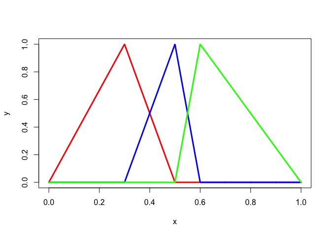
<center>
Figure  1: Piecewise Linear Splines with Simple Knots
</center>
<hr>
There are only two $B$-splines of order 3 on these knots, and the basic interval is empty.
<hr>
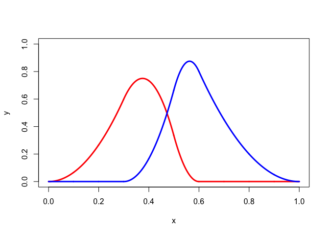
<center>
Figure  2: Piecewise Quadratic Splines with Simple Knots
</center>
<hr>
The programs also work for multiple knots. Consider the example from @deboor_01, page 92. The knots are 0, 1, 1, 3, 4, 6, 6, 6, and the order is three. The basic interval is $[1,6]$.
<hr>
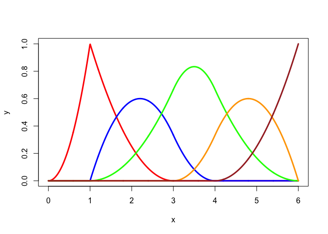
<center>
Figure  3: Piecewise Quadratic Splines with Multiple Knots
</center>
<hr>In @deboor_01, p 89, we find another example in which there are only two distinct knots, an infinite sequence of zeroes, followed by an infinite sequence of ones. In this case there are only $m$ different $B$-splines, restriction to $[0,1]$ of the familiar polynomials
$$
B_{j,m-1}(x)=\binom{m-1}{j}x^{m-1-j}(1-x)^{j}
$$
for $j=0,\cdots,m-1$.
<hr>
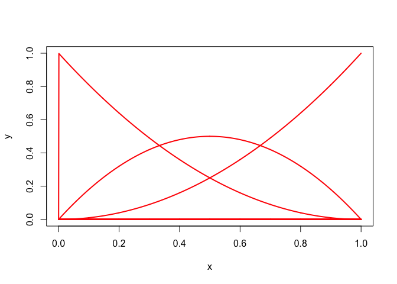
<center>
Figure  4: Quadratic Bernstein Basis
</center>
<hr>


## Using GSL

The GNU Scientific Library (@gsl_manual_16) has $B$-spline code. The function `gslSpline()` in R calls the compiled 
`gslSpline.c`, which is linked with the relevant code from `libgsl.dylib`. We use the Ramsay example again. The GSL implementation automatically adds the extra boundary knots for the extended partition, which makes the basic interval $[0,1]$.


```r
knots <- c(0,.3,.5,.6,1)
order <- 3
x<-seq(0,1,length = 1001)
h <- matrix (0, 1001, 6)
for (i in 1:1001)
  h[i,] <- gslSpline (x[i], order, knots)
```
<hr>

<center>
Figure  5: Piecewise Quadratic Splines using GSL
</center>
<hr>

## Using Recursion

We have previously published spline function code, using an R interface to C code, in @deleeuw_E_15d. That code translated the Fortran code in an unpublished note by @sinha to C. There are some limitations associated with this implementation. First, it is limited to extended partitions with simple inner knots. Second, the function to compute $B$-spline values recursively calls itself, using the basic relation $\eqref{E:Nspline}$, which is computationally not necessarily the best way to go.


```r
innerknots <- c( .3, .5, .6)
degree <- 2
lowknot <- 0
highknot <- 1
x<-seq(0,1,length = 1001)
h <- sinhaBasis (x, degree, innerknots, lowknot, highknot)
```
<hr>
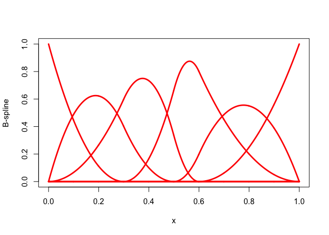
<center>
Figure  6: Piecewise Quadratic Splinesusing Recursion
</center>
<hr>

## De Boor

In this paper we implement the basic BSPLVB algorithm from @deboor_01, page 111, for normalized $B$-splines. There are two auxilary routines, one to create the extended partition, and one that uses bisection to locate the knot interval in which a particular value is located (@schumaker_07, p 191). The function `bsplineBasis()` takes an arbitrary knot sequence. It can be combined with `extendPartition()`, which uses inner knots and boundary points to create the extended partion.

## Illustrations

For our example, which is the same as the one from figure 1 in @ramsay_88, we choose $a=0$, $b=1$, with simple interior knots 0.3, 0.5, 0.6. First the step functions, which have order 1. 
<hr>

```r
innerknots <- c(.3,.5,.6)
multiplicities <- c(1,1,1)
order <- 1
lowend <- 0
highend <- 1
x <- seq (1e-6, 1-1e-6, length = 1000)
knots <- extendPartition (innerknots, multiplicities, order, lowend, highend)$knots
h <- bsplineBasis (x, knots, order)
k <- ncol (h)
par (mfrow=c(2,2))
for (j in 1:k) { 
  ylab <- paste("B-spline", formatC(j, digits = 1, width = 2, format = "d"))
  plot (x, h[, j], type="l", col = "RED", lwd = 3, ylab = ylab, ylim = c(0,1))
}
```

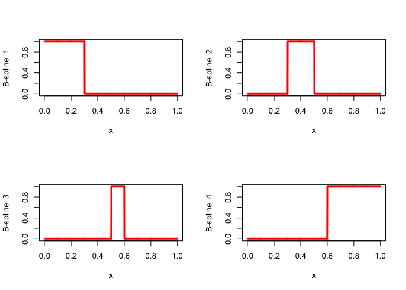
<center>
Figure  7: Zero Degree Splines with Simple Knots
</center>
<hr>
Now the hat functions, which have order 2, again with simple knots.
<hr>

```r
multiplicities <- c(1,1,1)
order <- 2
knots <- extendPartition (innerknots, multiplicities, order, lowend, highend)$knots
h <- bsplineBasis (x, knots, order)
k <- ncol (h)
par (mfrow=c(2,3))
for (j in 1:k) { 
  ylab <- paste("B-spline", formatC(j, digits = 1, width = 2, format = "d"))
  plot (x, h[, j], type="l", col = "RED", lwd = 3, ylab = ylab, ylim = c(0,1))
}
```

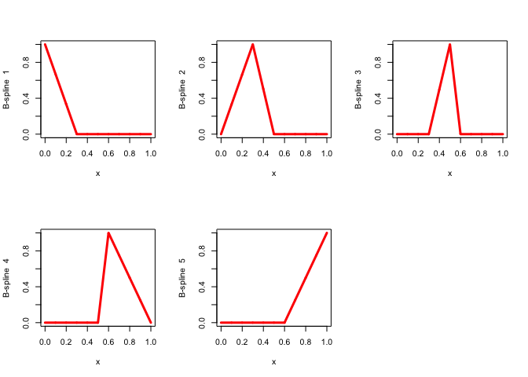
<center>
Figure  8: Piecewise Linear Splines with Simple Knots
</center>
<hr>
Next piecewise quadratics, with simple knots, which implies continuous differentiability at the knots. This are the N-splines corresponding with the M-splines in figure 1 of @ramsay_88.
<hr>

```r
multiplicities <- c(1,1,1)
order <- 3
knots <- extendPartition (innerknots, multiplicities, order, lowend, highend)$knots
h <- bsplineBasis (x, knots, order)
k <- ncol (h)
par (mfrow=c(2,3))
for (j in 1:k) { 
  ylab <- paste("B-spline", formatC(j, digits = 1, width = 2, format = "d"))
  plot (x, h[, j], type="l", col = "RED", lwd = 3, ylab = ylab, ylim = c(0,1))
}
```

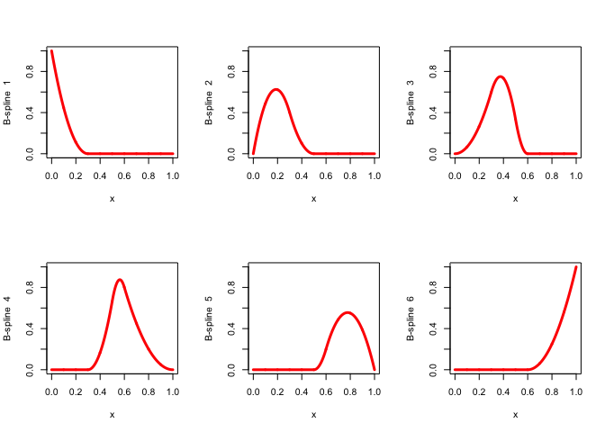
<center>
Figure  9: Piecewise Quadratic Splines with Simple Knots
</center>
<hr>
If we change the multiplicities to 1, 2, 3, then we lose some of the smoothness.
<hr>

```r
multiplicities <- c(1,2,3)
order <- 3
knots <- extendPartition (innerknots, multiplicities, order, lowend, highend)$knots
h <- bsplineBasis (x, knots, order)
k <- ncol (h)
par (mfrow=c(3,3))
for (j in 1:k) { 
  ylab <- paste("B-spline", formatC(j, digits = 1, width = 2, format = "d"))
  plot (x, h[, j], type="l", col = "RED", lwd = 3, ylab = ylab, ylim = c(0,1))
}
```

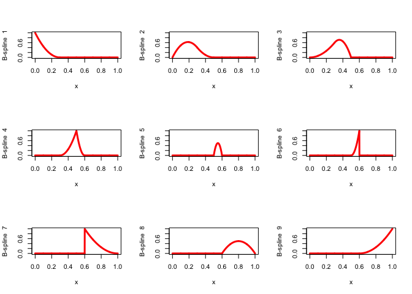
<center>
Figure  10: Piecewise Quadratic Splines with Multiple Knots
</center>
<hr>

# Monotone Splines

## I-splines

There are several ways to restrict splines to be monotone increasing. Since $B$-splines are non-negative, the definite integral of a $B$-spline of order $m$ from the beginning of the interval to a value $x$ in the interval is an increasing spline of order $m+1$. Integrated $B$-splines are known as *I-splines* (@ramsay_88). Non-negative linear combinations $I$-splines can be used as a basis for the convex cone of increasing splines. Note, however, that if we use an extended partition, then all $I$-splines start at value zero and end at value one, which means their convex combinations are the
splines that are also probability distributions on the interval. To get a basis for the increasing splines we need to
add the constant function to the $I$-splines and allow it to enter the linear combination with either sign.

### Low Order I-splines

Straightforward integration, and using $\eqref{E:NM}$, gives some explicit formulas. If we integrate the step functions we get the piecewise linear $I$-splines.
$$
\int_{-\infty}^x M_{j,1}(t)dt=\begin{cases}
0&\text{ if }x\leq t_j,\\
\frac{x-t_j}{t_{j+1}-t_j}&\text{ if }t_j\leq x\leq t_{j+1},\\
1&\text{ if }x\geq t_{j+1}.
\end{cases}
$$
And if we integrate the piecewise linear $B$-splines of order 1 we get piecewise quadratic $I$-splines.
$$
\int_{-\infty}^x M_{j,2}(t)dt=\begin{cases}
0&\text{ if }x\leq t_j,\\
\frac{(x-t_j)^2}{(t_{j+1}-t_j)(t_{j+2}- t_j)}&\text{ if }t_j\leq x\leq t_{j+1},\\
\frac{x-t_j}{t_{j+2}-t_j}+\frac{(x-t_{j+1})(t_{j+2}-x)}{(t_{j+2}-t_j)(t_{j+2}-t_{j+1})}
&\text{ if }t_{j+1}\leq x\leq t_{j+2},\\
1&\text{ if }x\geq t_{j+2}.
\end{cases}
$$
Both sets of $I$-splines are plotted in the next two figures, using R functions from `lowSpline.R`. 
<hr>
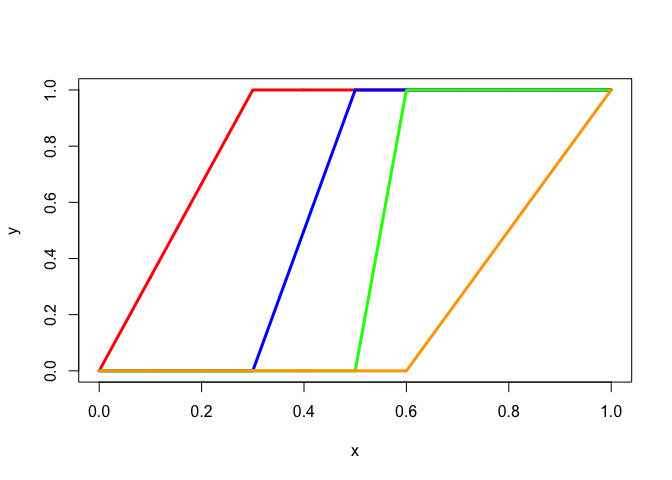
<center>
Figure  11: Monotone Piecewise Linear Splines with Simple Knots
</center>
<hr>

<hr>
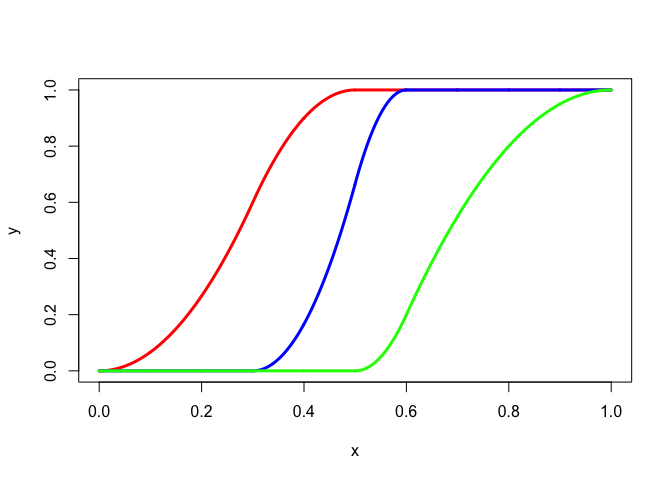
<center>
Figure  12: Monotone Piecewise Quadratic Splines with Simple Knots
</center>
<hr>

### General Case

Integrals of I-splines are most economically computed by using the formula first given by @gaffney_76. If $\ell$ is defined by $t_{j+\ell-1}\leq x<t_{j+\ell}$ then
$$
\int_{x_j}^x M_{j,m}(t)dt=\frac{1}{m}\sum_{r=0}^{ \ell-1}(x-x_{j+r})M_{j+r,m-r}(x)
$$
It is somewhat simpler, however, to use lemma 2.1 of @deboor_lyche_schumaker_76. This says
$$
\int_a^xM_{j,m}(t)dt=\sum_{\ell\geq j}N_{\ell,m+1}(x)-\sum_{\ell\geq j}N_{\ell,m+1}(a),
$$
If we specialize this to $I$-splines, we find , as in @deboor_76, formula 4.11,
$$
\int_{-\infty}^x M_{j,m}(t)dt=\sum_{\ell=j}^{j+r}N_{\ell,m+1}(x)
$$
for $x\leq t_{j+r+1}$. This shows that $I$-splines can be computed by using cumulative sums of $B$-spline values.

Note that using the integration definition does not give a natural way to define increasing splines of degree 1, i.e. increasing step functions. There is no such problem with the cumulative sum approach.

## Increasing Coefficients

As we know, a spline is a linear combination of $B$-splines. The formula for the derivative of a spline, for example in @deboor_01, p 116, shows that a spline is increasing if the coefficients of the linear combination of $B$-splines are increasing. Thus we can fit an increasing spline by restricting the coefficients of the linear combination to be increasing, again using the $B$-spline basis. 

It turns out this is in fact identical to using $I$-splines. If the $B$-spline values at $n$ points are in an $n\times r$ matrix $H$, then increasing coefficients $\beta$ are of the
form $\beta=S\alpha+\gamma e_r$, where $S$ is lower-diagonal with all elements on and below the diagonal equal to one, where $\alpha\geq 0$, where $e_r$ has all elements
equal to one, and where $\gamma$ can be of any sign. So $H\beta=(HS)\alpha+\gamma e_n$. The matrix $Z=HS$ is easily and cheaply found in R by $1-t(apply(h, 1, cumsum))$.

## Increasing Values

Finally, we can simply require that the $n$ elements of $H\beta$ are increasing. This is a less restrictive requirement, because it allows for the possibility that the spline is decresing between data values. It has the rather serious disadvantage, however, that it does
its computations in $n$-dimensional space, and not in $r$-dimensional space, where $r=M+m$, which is usually much smaller than $n$. Software for the increasing-value restrictions has been
written by @deleeuw_E_15e. In this paper, however, we prefer the `cumsum()` approach. It is less general, but considerably more efficient.

## Illustrations

We use the same Ramsay example as before, but now cumulatively. First we integrate step functions with simple knots, which have order 1, using `isplineBasis()`. The corresponding I-splines are piecewise linear with order 2.
<hr>
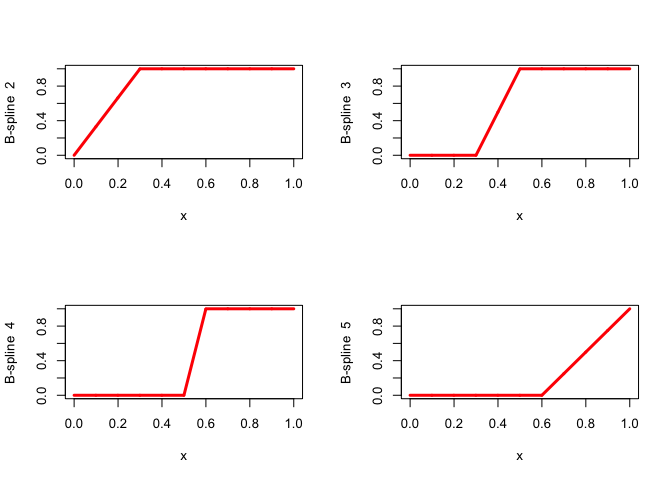
<center>
Figure  23: 
</center>
<hr>
Now we integrate the hat functions, which have order 2, again with simple knots, to find piecewise quadratic I-splines of order 3. These are the functions in the example of @ramsay_88.
<hr>
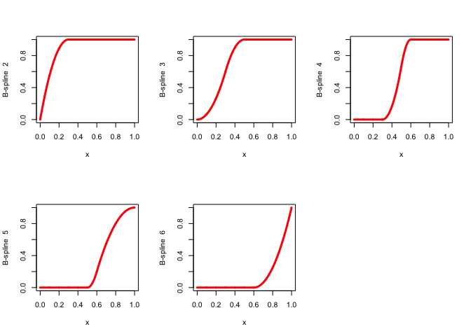
<center>
Figure  13: Monotone Piecewise Linear Splines with Simple Knots
</center>
<hr>
Finally, we change the multiplicities to 1, 2, 3, and compute the corresponding piecewise quadratic I-splines.
<hr>
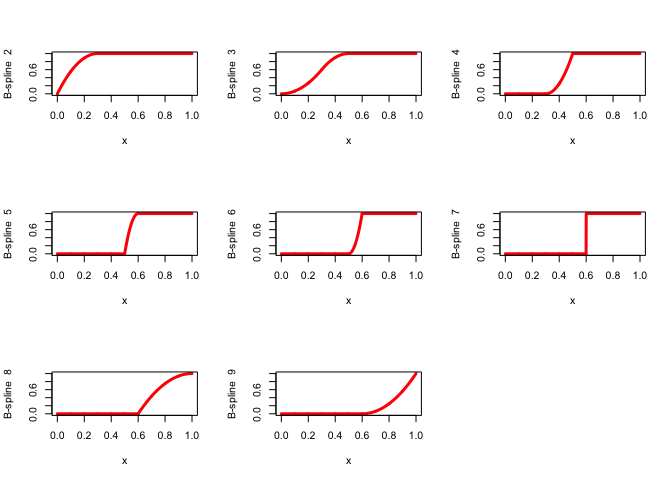
<center>
Figure  15: Monotone Piecewise Quadratic Splines with Multiple Knots
</center>
<hr>

# Time Series Example

Our first example smoothes a time series by fitting a spline. We use the number of births in New York from 1946 to 1959 (on an unknown scale), from Rob Hyndman's time series archive
at http://robjhyndman.com/tsdldata/data/nybirths.dat.


## B-splines

First we fit $B$-splines of order 3. The basis matrix uses $x$ equal to $1:168$,
with inner knots 12, 24, 36, 48, 60, 72, 84, 96, 108, 120, 132, 144, 156, and interval $[1,168]$. 

```r
innerknots <- 12 * 1:13
multiplicities <- rep(1,13)
lowend <- 1
highend <- 168
order <- 3
x <- 1:168
knots <- extendPartition (innerknots, multiplicities, order, lowend, highend)$knots
h <- bsplineBasis (x, knots, order)
u <- lm.fit(h, births)
res <- sum ((births - h%*%u$coefficients)^2)
```
<hr>
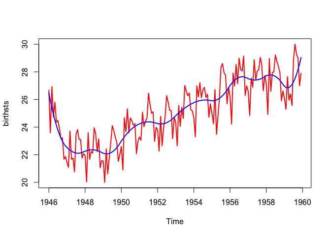
<center>
Figure  16: Monotone Piecewise Quadratic Splines with Simple Knots
</center>
<hr>
The residual sum of squares is 229.3835417745.

## I-splines

We now fit the $I$-spline using the $B$-spline basis. Compute $Z=HS$ using `cumsum()`, and then $\overline y$ and $\overline Z$ by centering (substracting the column means). The formula is
$$
\min_{\alpha\geq 0,\gamma}\mathbf{SSQ}\ (y-Z\alpha-\gamma e_n)=\min_{\alpha\geq 0}\mathbf{SSQ}\ (\overline y-\overline Z\alpha).
$$
We use `pnnls()` from @wang_lawson_hanson_15.


```r
knots <- extendPartition (innerknots, multiplicities, order, lowend, highend)$knots
h <- isplineBasis (x, knots, order)
g <- cbind (1, h[,-1])
u <- pnnls (g, births, 1)$x
v <- g%*%u
```
<hr>

<center>
Figure  17: Monotone Piecewise Linear Splines with Simple Knots
</center>
<hr>
The residual sum of squares is 288.4054982424.

## B-Splines with monotone weights

Just to make sure, we also solve the problem
$$
\min_{\beta_1\leq\beta_2\leq\cdots\leq\beta_p}\mathbf{SSQ}(y-X\beta),
$$
which should give the same solution, and the same loss function value, because it is just another way to fit 
$I$-splines. We use the `lsi()` function from @wang_lawson_hanson_15.


```r
knots <- extendPartition (innerknots, multiplicities, order, lowend, highend)$knots
h <- bsplineBasis (x, knots, order)
nb <- ncol (h)
d <- matrix(0,nb-1,nb)
diag(d)=-1
d[outer(1:(nb-1),1:nb,function(i,j) (j - i) == 1)]<-1
u<-lsi(h,births,e=d,f=rep(0,nb-1))
v <- h %*% u
```

<center>
Figure  18: Monotone Piecewise Quadratic Splines with Simple Knots
</center>
<hr>
The residual sum of squares is 288.4054982424, indeed the same as before.

## B-Splines with monotone values

Finally we solve
$$
\min_{x_1'\beta\leq\cdots\leq x_n'\beta} \mathbf{SSQ}\ (y-X\beta)
$$
using `mregnnM()` from @deleeuw_E_15d, which solves the dual problem using `nnls()` from @wang_lawson_hanson_15.


```r
knots <- extendPartition (innerknots, multiplicities, order, lowend, highend)$knots
h <- bsplineBasis (x, knots, order)
u <- mregnnM(h, births)
```
<hr>
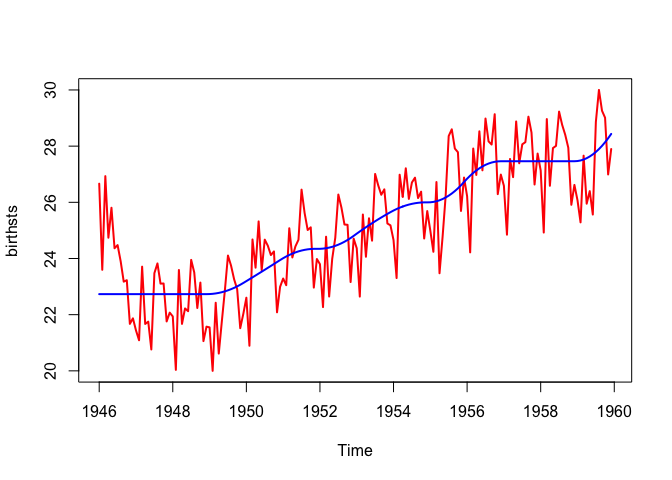
<center>
Figure  19: Monotone Piecewise Quadratic Splines with Multiple Knots
</center>
<hr>

The residual sum of squares is 288.3210359867, which is indeed smaller than the $I$-splines value, although only very slightly so.

# Regression Example

We also analyze a regression example, using the Neumann data that have been analyzed previously in @gifi_B_90, pages 370-376, and in @deleeuw_mair_A_09a,pages 16-17. The predictors are temperature and pressure, the outcome variable is density. We use a step function monotone spline for temperature and a piecewise quadratic monotone spline for
pressure. The lest squares problem is to fit
$$
\mathbf{SSQ}(y-(\gamma e_n+H_1\alpha_1+H_2\alpha_2)),
$$
where $H_1$ and $H_2$ are $I$-spline bases and $\alpha_1$ and $\alpha_2$ are non-negative. We do not transform the
outcome variable density, to keep things relatively simple.


```r
data(neumann, package = "homals")
knots1 <- c(0, 20, 40, 60, 80, 100, 120, 140)
order1 <- 1
knots2 <- c(0,0,0,100,200,300,400,500,600,600,600)
order2 <- 3
h1 <- isplineBasis(200-neumann[,1], knots1, order1)
h2 <- isplineBasis(neumann[,2], knots2, order2)
g <- cbind (1, h1, h2)
u <- pnnls (g, neumann[,3], 1)$x
u1 <- u[1+1:ncol(h1)]
u2 <- u[1+ncol(h1)+1:ncol(h2)]
```
The next two plots give the transformations of the predictors.
<hr>
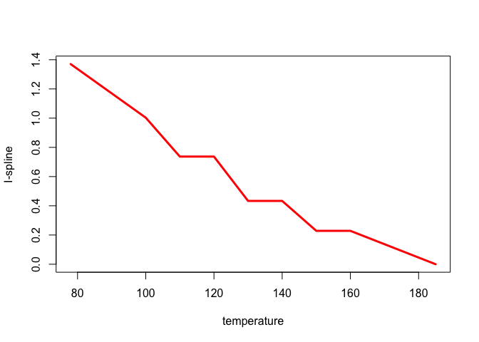
<center>
Figure  20: Regression Example: Piecewise Constant Temperature
</center>
<hr>
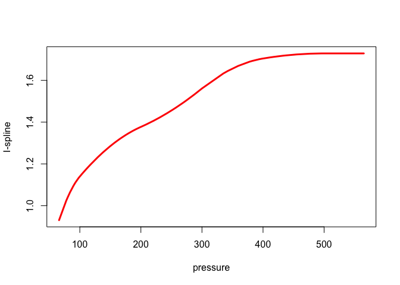
<center>
Figure  21: Regression Example: Piecewise Quadratic Pressure
</center>
<hr>
And finally, we give the residual plot, observed density versus predicted density.
<hr>
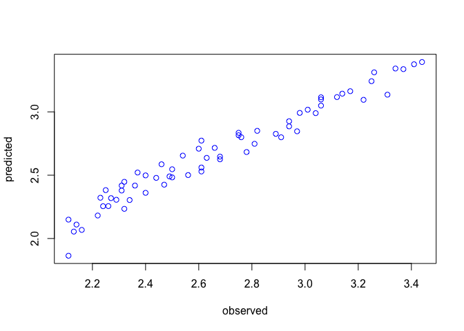
<center>
Figure  22: Regression Example: Fit
</center>
<hr>


# Appendix: Code

## R code

### lowSpline.R


```r
ZbSpline <- function(x, knots, k = 1) {
  ZbSplineSingle <- function(x, knots, k = 1) {
    k0 <- knots[k]
    k1 <- knots[k + 1]
    if ((x > k0) && (x <= k1)) {
      return(1)
    }
    return(0)
  }
  return(sapply(x, function(z)
    ZbSplineSingle(z, knots, k)))
}

LbSpline <- function(x, knots, k = 1) {
  LbSplineSingle <- function(x, knots, k = 1) {
    k0 <- knots[k]
    k1 <- knots[k + 1]
    k2 <- knots[k + 2]
    f1 <- function(x)
      (x - k0) / (k1 - k0)
    f2 <- function(x)
      (k2 - x) / (k2 - k1)
    if ((x > k0) && (x <= k1)) {
      return(f1(x))
    }
    if ((x > k1) && (x <= k2)) {
      return(f2(x))
    }
    return(0)
  }
  return(sapply(x, function(z)
    LbSplineSingle(z, knots, k)))
}

QbSpline <- function(x, knots, k = 1) {
  QbSplineSingle <- function(x, knots, k = 1) {
    k0 <- knots[k]
    k1 <- knots[k + 1]
    k2 <- knots[k + 2]
    k3 <- knots[k + 3]
    f1 <- function(x)
      ((x - k0) ^ 2) / ((k2 - k0) * (k1 - k0))
    f2 <- function(x) {
      term1 <- ((x - k0) * (k2 - x)) / ((k2 - k0) * (k2 - k1))
      term2 <- ((x - k1) * (k3 - x)) / ((k3 - k1) * (k2 - k1))
      return(term1 + term2)
    }
    f3 <- function(x)
      ((k3 - x) ^ 2) / ((k3 - k1) * (k3 - k2))
    if ((x > k0) && (x <= k1)) {
      return(f1(x))
    }
    if ((x > k1) && (x <= k2)) {
      return(f2(x))
    }
    if ((x > k2) && (x <= k3)) {
      return(f3(x))
    }
    return(0)
  }
  return(sapply(x, function(z)
    QbSplineSingle(z, knots, k)))
}

IZbSpline <- function(x, knots, k = 1) {
  IZbSplineSingle <- function(x, knots, k = 1) {
    k0 <- knots[k]
    k1 <- knots[k + 1]
    if (x <= k0) {
      return (0)
    }
    if ((x > k0) && (x <= k1)) {
      return((x - k0) / (k1 - k0))
    }
    if (x > k1) {
      return (1)
    }
  }
  return(sapply(x, function(z)
    IZbSplineSingle(z, knots, k)))
}

ILbSpline <- function(x, knots, k = 1) {
  ILbSplineSingle <- function(x, knots, k = 1) {
    k0 <- knots[k]
    k1 <- knots[k + 1]
    k2 <- knots[k + 2]
    f1 <- function(x)
      ((x - k0) ^ 2) / ((k1 - k0) * (k2 - k0))
    f2 <-
      function(x)
        ((x - k0) / (k2 - k0)) + ((x - k1) * (k2 - x)) / ((k2 - k0) * (k2 - k1))
    if (x <= k0) {
      return (0)
    }
    if ((x > k0) && (x <= k1)) {
      return(f1(x))
    }
    if ((x > k1) && (x <= k2)) {
      return(f2(x))
    }
    if (x > k2) {
      return (1)
    }
    return(0)
  }
  return(sapply(x, function(z)
    ILbSplineSingle(z, knots, k)))
}
```

### gslSpline.R


```r
dyn.load("gslSpline.so")

gslSpline <- function (x, k, br) {
  nbr <- length (br)
  nrs <- k + nbr - 2
  res <-
    .C(
      "BSPLINE",
      as.double (x),
      as.integer (k),
      as.integer (nbr),
      as.double (br),
      results = as.double (rep(0.0, nrs))
    )
  return (res$results)
}
```

### sinhaSpline.R


```r
dyn.load("sinhaSpline.so")

sinhaBasis <-
  function (x, degree, innerknots, lowknot = min(x,innerknots), highknot = max(x,innerknots)) {
    innerknots <- unique (sort (innerknots))
    knots <-
      c(rep(lowknot, degree + 1), innerknots, rep(highknot, degree + 1))
    n <- length (x)
    m <- length (innerknots) + 2 * (degree + 1)
    nf <- length (innerknots) + degree + 1
    basis <- rep (0,  n * nf)
    res <- .C(
      "sinhaBasis", d = as.integer(degree),
      n = as.integer(n), m = as.integer (m), x = as.double (x), knots = as.double (knots), basis = as.double(basis)
    )
    basis <- matrix (res$basis, n, nf)
    basis <- basis[,which(colSums(basis) > 0)]
    return (basis)
  }
```

### deboor.R


```r
dyn.load("deboor.so")

checkIncreasing <- function (innerknots, lowend, highend) {
  h <- .C(
    "checkIncreasing",
    as.double (innerknots),
    as.double (lowend),
    as.double (highend),
    as.integer (length (innerknots)),
    fail = as.integer (0)
  )
  return (h$fail)
}

extendPartition <-
  function (innerknots,
            multiplicities,
            order,
            lowend,
            highend) {
    ninner <- length (innerknots)
    kk <- sum(multiplicities)
    nextended <- kk + 2 * order
    if (max (multiplicities) > order)
      stop ("multiplicities too high")
    if (min (multiplicities) < 1)
      stop ("multiplicities too low")
    if (checkIncreasing (innerknots, lowend, highend))
      stop ("knot sequence not increasing")
    h <-
      .C(
        "extendPartition",
        as.double (innerknots),
        as.integer (multiplicities),
        as.integer (order),
        as.integer (ninner),
        as.double (lowend),
        as.double (highend),
        knots = as.double (rep (0, nextended))
      )
    return (h)
  }

bisect <-
  function (x,
            knots,
            lowindex = 1,
            highindex = length (knots)) {
    h <- .C(
      "bisect",
      as.double (x),
      as.double (knots),
      as.integer (lowindex),
      as.integer (highindex),
      index = as.integer (0)
    )
    return (h$index)
  }

bsplines <- function (x, knots, order) {
  if ((x > knots[length(knots)]) || (x < knots[1]))
    stop ("argument out of range")
  h <- .C(
    "bsplines",
    as.double (x),
    as.double (knots),
    as.integer (order),
    as.integer (length (knots)),
    index = as.integer (0),
    q = as.double (rep(0, order))
  )
  return (list (q = h$q, index = h$ind))
}


bsplineBasis <- function (x, knots, order) {
  n <- length (x)
  k <- length (knots)
  m <- k - order
  result <- rep (0, n * m)
  h <- .C(
    "bsplineBasis",
    as.double (x),
    as.double (knots),
    as.integer (order),
    as.integer (k),
    as.integer (n),
    result = as.double (result)
  )
  return (matrix (h$result, n, m))
}

isplineBasis <-  function (x, knots, order) {
  n <- length (x)
  k <- length (knots)
  m <- k - order
  result <- rep (0, n * m)
  h <- .C(
    "isplineBasis",
    as.double (x),
    as.double (knots),
    as.integer (order),
    as.integer (k),
    as.integer (n),
    result = as.double (result)
  )
  return (matrix (h$result, n, m))
}
```

## C code

### gslSpline.c


```c
#include <gsl/gsl_bspline.h>

void BSPLINE(double *x, int *order, int *nbreak, double *brpnts,
             double *results) {
    gsl_bspline_workspace *my_workspace =
        gsl_bspline_alloc((size_t)*order, (size_t)*nbreak);
    size_t ncoefs = gsl_bspline_ncoeffs(my_workspace);
    gsl_vector *values = gsl_vector_calloc(ncoefs);
    gsl_vector *breaks = gsl_vector_calloc((size_t)*nbreak);
    for (int i = 0; i < *nbreak; i++)
        gsl_vector_set(breaks, (size_t)i, brpnts[i]);
    (void)gsl_bspline_knots(breaks, my_workspace);
    (void)gsl_bspline_eval(*x, values, my_workspace);
    for (int i = 0; i < ncoefs; i++) results[i] = (values->data)[i];
    gsl_bspline_free(my_workspace);
    gsl_vector_free(values);
    gsl_vector_free(breaks);
}
```

### sinhaSpline.c


```c
#include <stddef.h>
#include <stdio.h>
#include <stdlib.h>

double bs(int nknots, int nspline, int degree, double x, double *knots);
int mindex(int i, int j, int nrow);

void sinhaBasis(int *d, int *n, int *m, double *x, double *knots,
                double *basis) {
    int mm = *m, dd = *d, nn = *n;
    int k = mm - dd - 1, i, j, ir, jr;
    for (i = 0; i < nn; i++) {
        ir = i + 1;
        if (x[i] == knots[mm - 1]) {
            basis[mindex(ir, k, nn) - 1] = 1.0;
            for (j = 0; j < (k - 1); j++) {
                jr = j + 1;
                basis[mindex(ir, jr, nn) - 1] = 0.0;
            }
        } else {
            for (j = 0; j < k; j++) {
                jr = j + 1;
                basis[mindex(ir, jr, nn) - 1] = bs(mm, jr, dd + 1, x[i], knots);
            }
        }
    }
}

int mindex(int i, int j, int nrow) { return (j - 1) * nrow + i; }

double bs(int nknots, int nspline, int updegree, double x, double *knots) {
    double y, y1, y2, temp1, temp2;
    if (updegree == 1) {
        if ((x >= knots[nspline - 1]) && (x < knots[nspline]))
            y = 1.0;
        else
            y = 0.0;
    } else {
        temp1 = 0.0;
        if ((knots[nspline + updegree - 2] - knots[nspline - 1]) > 0)
            temp1 = (x - knots[nspline - 1]) /
                    (knots[nspline + updegree - 2] - knots[nspline - 1]);
        temp2 = 0.0;
        if ((knots[nspline + updegree - 1] - knots[nspline]) > 0)
            temp2 = (knots[nspline + updegree - 1] - x) /
                    (knots[nspline + updegree - 1] - knots[nspline]);
        y1 = bs(nknots, nspline, updegree - 1, x, knots);
        y2 = bs(nknots, nspline + 1, updegree - 1, x, knots);
        y = temp1 * y1 + temp2 * y2;
    }
    return y;
}
```

### deboor.c


```c

#include <math.h>
#include <stdbool.h>
#include <stdlib.h>

inline int VINDEX(const int);
inline int MINDEX(const int, const int, const int);

void checkIncreasing(const double *, const double *, const double *,
                     const int *, bool *);
void extendPartition(const double *, const int *, const int *, const int *,
                     const double *, const double *, double *);
void bisect(const double *, const double *, const int *, const int *, int *);
void bsplines(const double *, const double *, const int *, const int *, int *,
              double *);
void bsplineBasis(const double *, const double *, const int *, const int *,
                  const int *, double *);
void isplineBasis(const double *, const double *, const int *, const int *,
                  const int *, double *);
void bsplineSparse(const double *, const double *, const int *, const int *,
                   const int *, int *, double *);
void isplineSparse(const double *, const double *, const int *, const int *,
                   const int *, int *, double *);

inline int VINDEX(const int i) { return i - 1; }

inline int MINDEX(const int i, const int j, const int n) {
    return (i - 1) + (j - 1) * n;
}

inline int IMIN(const int a, const int b) {
    if (a > b) return b;
    return a;
}

inline int IMAX(const int a, const int b) {
    if (a < b) return b;
    return a;
}

void checkIncreasing(const double *innerknots, const double *lowend,
                     const double *highend, const int *ninner, bool *fail) {
    *fail = false;
    if (*lowend >= innerknots[VINDEX(1)]) {
        *fail = true;
        return;
    }
    if (*highend <= innerknots[VINDEX(*ninner)]) {
        *fail = true;
        return;
    }
    for (int i = 1; i < *ninner; i++) {
        if (innerknots[i] <= innerknots[i - 1]) {
            *fail = true;
            return;
        }
    }
}

void extendPartition(const double *innerknots, const int *multiplicities,
                     const int *order, const int *ninner, const double *lowend,
                     const double *highend, double *extended) {
    int k = 1;
    for (int i = 1; i <= *order; i++) {
        extended[VINDEX(k)] = *lowend;
        k++;
    }
    for (int j = 1; j <= *ninner; j++)
        for (int i = 1; i <= multiplicities[VINDEX(j)]; i++) {
            extended[VINDEX(k)] = innerknots[VINDEX(j)];
            k++;
        }
    for (int i = 1; i <= *order; i++) {
        extended[VINDEX(k)] = *highend;
        k++;
    }
}

void bisect(const double *x, const double *knots, const int *lowindex,
            const int *highindex, int *index) {
    int l = *lowindex, u = *highindex, mid = 0;
    while ((u - l) > 1) {
        mid = (int)floor((u + l) / 2);
        if (*x < knots[VINDEX(mid)])
            u = mid;
        else
            l = mid;
    }
    *index = l;
    return;
}

void bsplines(const double *x, const double *knots, const int *order,
              const int *nknots, int *index, double *q) {
    int lowindex = 1, highindex = *nknots, m = *order, j, jp1;
    double drr, dll, saved, term;
    double *dr = (double *)calloc((size_t)m, sizeof(double));
    double *dl = (double *)calloc((size_t)m, sizeof(double));
    (void)bisect(x, knots, &lowindex, &highindex, index);
    int l = *index;
    for (j = 1; j <= m; j++) {
        q[VINDEX(j)] = 0.0;
    }
    if (*x == knots[VINDEX(*nknots)]) {
        q[VINDEX(m)] = 1.0;
        return;
    }
    q[VINDEX(1)] = 1.0;
    j = 1;
    if (j >= m) return;
    while (j < m) {
        dr[VINDEX(j)] = knots[VINDEX(l + j)] - *x;
        dl[VINDEX(j)] = *x - knots[VINDEX(l + 1 - j)];
        jp1 = j + 1;
        saved = 0.0;
        for (int r = 1; r <= j; r++) {
            drr = dr[VINDEX(r)];
            dll = dl[VINDEX(jp1 - r)];
            term = q[VINDEX(r)] / (drr + dll);
            q[VINDEX(r)] = saved + drr * term;
            saved = dll * term;
        }
        q[VINDEX(jp1)] = saved;
        j = jp1;
    }
    free(dr);
    free(dl);
    return;
}

void bsplineBasis(const double *x, const double *knots, const int *order,
                  const int *nknots, const int *nvalues, double *result) {
    int m = *order, l = 0;
    double *q = (double *)calloc((size_t)m + 1, sizeof(double));
    for (int i = 1; i <= *nvalues; i++) {
        (void)bsplines(x + VINDEX(i), knots, order, nknots, &l, q);
        for (int j = 1; j <= m; j++) {
            int r = IMIN(l - m + j, *nknots - m);
            result[MINDEX(i, r, *nvalues)] = q[VINDEX(j)];
        }
    }
    free(q);
    return;
}

void isplineBasis(const double *x, const double *knots, const int *order,
                  const int *nknots, const int *nvalues, double *result) {
    int m = *nknots - *order, n = *nvalues;
    (void)bsplineBasis(x, knots, order, nknots, nvalues, result);
    for (int i = 1; i <= n; i++) {
        for (int j = m - 1; j >= 1; j--) {
            result[MINDEX(i, j, n)] += result[MINDEX(i, j + 1, n)];
        }
    }
    return;
}

void bsplineSparse(const double *x, const double *knots, const int *order,
                   const int *nknots, const int *nvalues, int *columns,
                   double *result) {
    int m = *order, l = 0;
    double *q = (double *)calloc((size_t)m + 1, sizeof(double));
    for (int i = 1; i <= *nvalues; i++) {
        (void)bsplines(x + VINDEX(i), knots, order, nknots, &l, q);
        columns[VINDEX(i)] = l;
        for (int j = 1; j <= m; j++) {
            result[MINDEX(i, j, *nvalues)] = q[VINDEX(j)];
        }
    }
    free(q);
    return;
}

void isplineSparse(const double *x, const double *knots, const int *order,
                   const int *nknots, const int *nvalues, int *columns,
                   double *result) {
    int m = *nknots - *order, n = *nvalues;
    for (int i = 1; i <= *nvalues; i++) {
        (void)bsplineSparse(x + VINDEX(i), knots, order, nknots, nvalues,
                            columns, result);
        for (int j = m - 1; j >= 1; j--) {
            result[MINDEX(i, j, n)] += result[MINDEX(i, j + 1, n)];
        }
    }
    return;
}
```

# References
