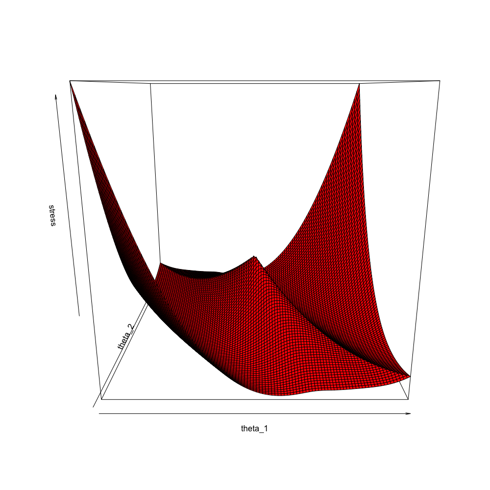
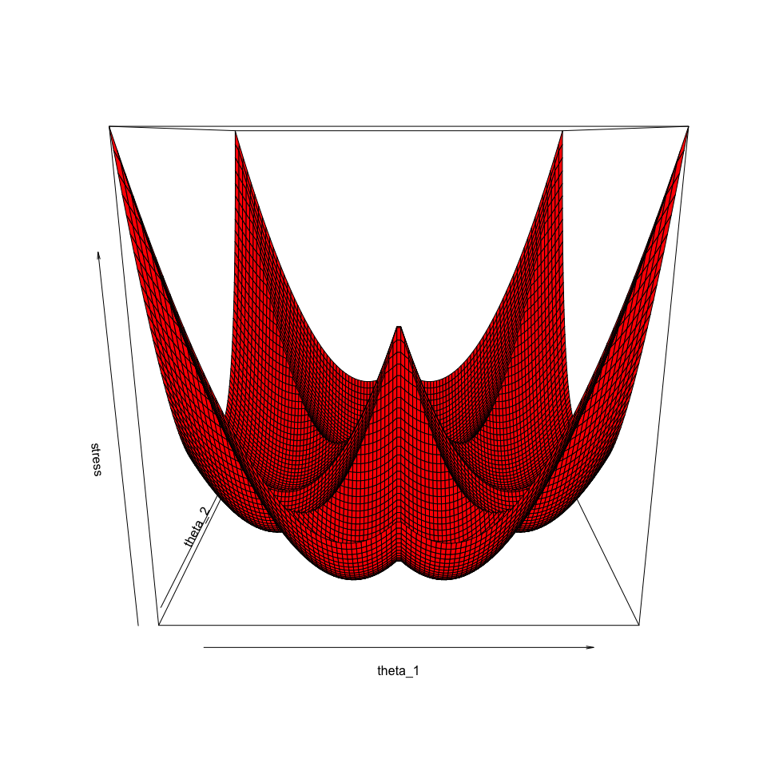
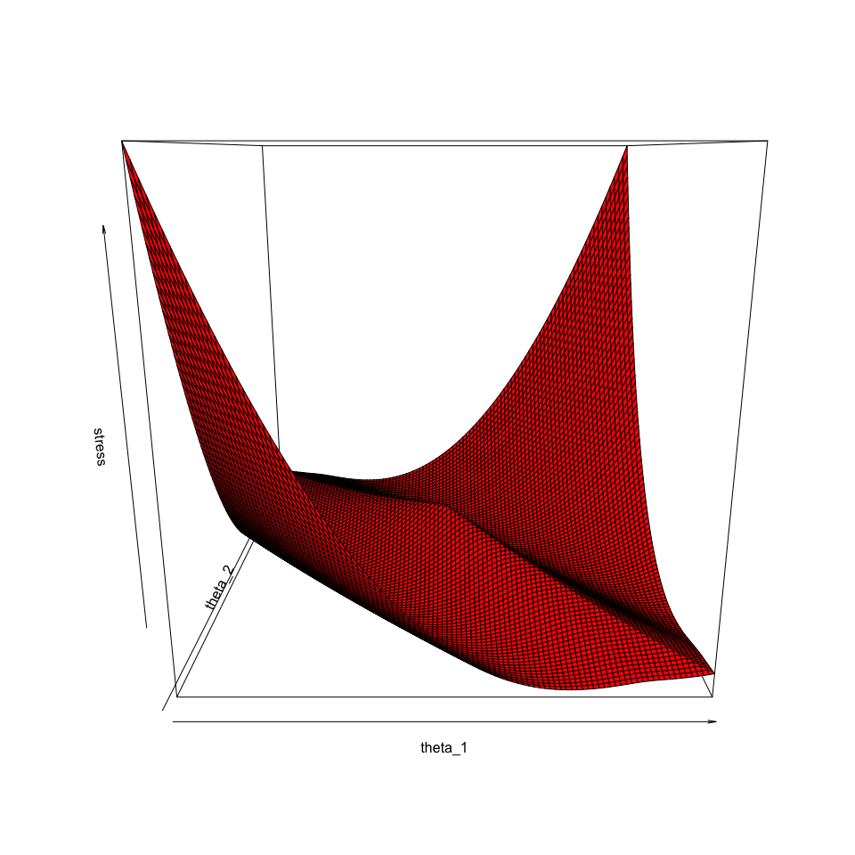

```{=html}
<style type="text/css">

body{ /* Normal  */
   font-size: 18px;
}
td {  /* Table  */
   font-size: 18px;
}
h1 { /* Header 1 */
 font-size: 28px;
 color: DarkBlue;
}
h2 { /* Header 2 */
 font-size: 22px;
 color: DarkBlue;
}
h3 { /* Header 3 */
 font-size: 18px;
 color: DarkBlue;
}
code.r{ /* Code block */
  font-size: 18px;
}
pre { /* Code block */
  font-size: 18px
}
</style>
```
```{=html}
<script type="text/x-mathjax-config">
MathJax.Hub.Config({
  TeX: { equationNumbers: { autoNumber: "AMS" } }
});
</script>
```


**Note:** This is a working paper which will be expanded/updated frequently. All suggestions for improvement are welcome. The directory [deleeuwpdx.net/pubfolders/statioclass](http://deleeuwpdx.net/pubfolders/statioclass) has a pdf version, the bib file, the complete Rmd file with the code chunks, and the R source code.

# Introduction

This book is about the least squares loss function \begin{equation}\label{E:stress}\sigma(X)=\frac12\mathop{\sum}_{1\leq i<j\leq n} w_{ij}(\delta_{ij}-d_{ij}(X))^2.
\end{equation} define on $\mathbb{R}^{n\times p}$, the space of all $n\times p$ matrices. We follow @kruskal_64a and call $\sigma(X)$ the *stress* of *configuration* $X$. Minimizing stress over p-dimensional configurations is the *pMDS problem*.

In $\eqref{E:stress}$ the matrices of *weights* $W=\{w_{ij}\}$ and *dissimilarities* $\Delta=\{\delta_{ij}\}$ are symmetric, non-negative, and hollow (zero diagonal). The matrix-valued function $D(X)=\{d_{ij}(X)\}$ contains Euclidean distances between the rows of the configuration $X$, which are the coordinates of $n$ *points* in $\mathbb{R}^p$. Thus $D(X)$ is also symmetric, non-negative, and hollow.

Two important special cases of pMDS are *Unidimensional Scaling*, which is 1MDS, and *Full-dimensional Scaling*, which is nMDS. Because of their importance, they also have their very own acronyms UDS and FDS, and they have their own chapters in this book.

In pMDS we minimize stress. This means that we are trying to find the *global minimum* over p-dimensional configurations. In practice, however, our algorithms find *local minima*, which may or may not be global. In this paper we will summarize what we know about global and local minima, and what we know about local maxima and saddle points.

# Notation

First some convenient notation, first introduced in @deleeuw_C_77. Vector $e_i$ has $n$ elements, with element $i$ equal to $+1$, and all other elements zero. $A_{ij}$ is the matrix $(e_i-e_j)(e_i-e_j)'$, which means elements $(i,i)$ and $(j,j)$ are equal to $+1$, while $(i,j)$ and $(j,i)$ are $-1$. Thus \begin{equation}\label{E:anot}
d_{ij}^2(X)=(e_i-e_i)'XX'(e_i-e_j)=\text{tr}\ X'A_{ij}X=\text{tr}\ A_{ij}C,
\end{equation} with $C=XX'$.

We also define \begin{equation}\label{E:V}
V=\mathop{\sum}_{1\leq i<j\leq n}w_{ij}A_{ij},
\end{equation} and the matrix-valued function $B(\bullet)$ with \begin{equation}\label{E:B}
B(X)=\mathop{\sum}_{d_{ij}(X)>0}w_{ij}\frac{\delta_{ij}}{d_{ij}(X)}A_{ij},
\end{equation} and $B(X)=0$ if $X=0$. If we assume, without loss of generality, that $$
\frac12\mathop{\sum}_{1\leq i<j\leq n}w_{ij}\delta_{ij}^2=1,
$$ then \begin{equation}\label{E:S}
\sigma(X)=1-\text{tr}\ X'B(X)X+\frac12\text{tr}\ X'VX.
\end{equation}

We also suppose, without loss of generality, that $W$ is *irreducible*, so that the pMDS problem does not separate into a number of smaller pMDS problems. For symmetric matrices irreducibity means that we cannot find a permutation matrix $\Pi$ such that $\Pi'W\Pi$ is the direct sum of a number of smaller matrices.

$V$ is symmetric with non-positive off-diagonal elements. It is doubly-centered (rows and columns add up to zero) and thus weakly diagonally dominant. It follows that it is positive semi-definite (see @varga_62, section 1.5). Because of irreducibility it has rank $n-1$, and the vectors in its null space are all proportional to $e$, the vector with all elements equal to $+1$. The matrix $B(X)$ is also symmetric, positive semi-definite, and doubly-centered for each $X$. It may not be irreducible, because for example $B(0)=0$.

# Differentiability

Obviously $$
\mathcal{D}\eta^2(X)=2VX
$$ Additionally $\rho(\bullet)$ is differentiable at $X$ if and only if $d_{ij}(X)>0$ for all $i<j$ with $w_{ij}\delta_{ij}>0$. In that case $$
\mathcal{D}\rho(X)=B(X)X.
$$ **Result 13: ** $\sigma(\bullet)$ is differentiable at at $X$ if and only if $d_{ij}(X)>0$ for all $i<j$ with $w_{ij}\delta_{ij}>0$. In that case $$
\mathcal{D}\sigma(X)=(V-B(X))X.
$$ **Result 14: ** If $\sigma(\bullet)$ is differentiable at the stationary point $X$ then $(V-B(X))X=0$, or, in fixed point form, $X=V^+B(X)X$.

# DC Functions

Following @deleeuw_C_77 we also define \begin{align}
\rho(X)&=\mathop{\sum}_{1\leq i<j\leq n} w_{ij}\delta_{ij}d_{ij}(X)=\text{tr}\ X'B(X)X,\\
\eta^2(X)&=\mathop{\sum}_{1\leq i<j\leq n} w_{ij}d_{ij}^2(X)=\text{tr}\ X'VX.
\end{align}

**Result 1: [DC]**

1.  $\rho(\bullet)$ is convex, homogeneous of degree one, non-negative, and continuous.
2.  $\eta^2(\bullet)$ is convex, homogeneous of degree two, non-negative, quadratic, and continuous.
3.  $\sigma(\bullet)$ is a difference of convex functions (a.k.a. a *DC function* or a *delta-convex* function).

See @hirriart-urruty_88 or @vesely_zajicek_89 for a general discussion of DC functions.

From the literature we know $\sigma(\bullet)$ is locally Lipschitz, has directional derivatives and nonempty subdifferentials everywhere, and is twice differentiable almost everywhere. In fact $\sigma(\bullet)$ is infinitely many times differentiable at all $X$ that have $d_{ij}(X)>0$ for all $i<j$ with $w_{ij}\delta_{ij}>0$.

# Homogeneity

**Result 2: [Bounded]** At a local minimum point $X$ of $\sigma(\bullet)$ we have $\eta(X)\leq 1$.

**Proof:** Homogeneity gives $\sigma(\lambda X)=1-\lambda\rho(X)+\frac12\lambda^2\eta^2(X)$. If $X$ is a local minimum then the minimum over $\lambda$ is attained for $\lambda=1$, i.e. we must have $\rho(X)=\eta^2(X)$. By Cauchy-Schwartz $\rho(X)\leq\eta(X)$ for all $X$, and thus at a local minimum $\eta^2(X)\leq\eta(X)$, i.e. $\eta(X)\leq 1$. $\blacksquare$

**Result 3: [Local Maxima]** $X=0$ is the unique local maximum point of $\sigma(\bullet)$ and $\sigma(0)=1$ is the unique local maximum.

**Proof:** This is because $\sigma(\lambda X)=1-\lambda\rho(X)+\frac12\lambda^2\eta^2(X)$ is a convex quadratic in $\lambda$. The only maximum on the ray through $X$ occurs at the boundary $\lambda=0$. $\blacksquare$

**Result 4: [Unbounded]** $\sigma(\bullet)$ is unbounded and consequently has no global maximum.

**Proof:** $\blacksquare$

Note that the unboundedness of stress also follows from the proof of result 3.

# Picture

Here is a picture of stress on a two-dimensional subspace which illustrates both result 3 and result 15.


We first make a global perspective plot, over the range $(-2.5,+2.5)$.


<hr>



<hr>

<center>

Figure 1: Picture of Stress

</center>

<hr>

Note the sharp ridge going northwest-southeast in the plot, indicating a ray of configurations where one of more of the distances are zero, and where consequently $\sigma(\bullet)$ is not differentiable.


We first make a global perspective plot, over the range $(-2.5,+2.5)$.


<hr>



<hr>

<center>

Figure 1: Picture of Stress

</center>

<hr>


We first make a global perspective plot, over the range $(-2.5,+2.5)$.


<hr>



<hr>

<center>

Figure 1: Picture of Stress

</center>

<hr>

# One-sided Directional Derivatives

For a function $f:\mathbb{R}^{n\times p}\rightarrow\mathbb{R}$ we define the one-sided (Dini) directional derivative at $X$ in direction $Y$ as $$
df(X;Y)=\lim_{\epsilon\downarrow 0}\frac{f(X+\epsilon Y)-f(X)}{\epsilon},
$$ and the one-sided (Peano) second-order directional derivative at $X$ in direction $Y$ as $$
d^2f(X;Y)=\lim_{\epsilon\downarrow 0}\frac{f(X+\epsilon Y)-f(X)-\epsilon\ \mathcal{D}f(X;Y)}{\frac12\epsilon^2}.
$$ We know that $\sigma(\bullet)$ has one-sided directional derivatives of orders one and two. These can be easily computed by expanding the function at $X$ in direction $Y$.

## Expansion

We start by expanding squared distances and distances. First \begin{equation}\label{E:dd}
d_{ij}^2(X+\epsilon Y)=d_{ij}^2(X)+2\epsilon\ \text{tr}\ Y'A_{ij}X+\epsilon^2\ \text{tr}\ Y'A_{ij}Y.
\end{equation} Then for $d_{ij}(X)>0$ \begin{equation}\label{E:dg}
d_{ij}(X+\epsilon Y)=d_{ij}(X)+\epsilon\frac{\text{tr}\ Y'A_{ij}X}{d_{ij}(X)}+
\frac12\epsilon^2\frac{1}{d_{ij}(X)}\left\{d_{ij}^2(Y)
-\frac{(\text{tr}\ Y'A_{ij}X)^2}{\text{tr}\ X'A_{ij}X}\right\}+o(\epsilon^2),
\end{equation} and for $d_{ij}(X)=0$ \begin{equation}\label{E:d0}
d_{ij}(X+\epsilon Y)=\epsilon\ d_{ij}(Y).
\end{equation} Equations $\eqref{E:dd}$, $\eqref{E:dg}$, and $\eqref{E:d0}$ combine in a straightforward way to an expansion of $\sigma(\bullet)$ at $X$ in direction $Y$.

**Result 5: [Quadratic]** \begin{multline}
\sigma(X+\epsilon Y)=\sigma(X)+\epsilon\left\{\text{tr}\ Y'(V-B(X))X-\sum_{d_{ij}(X)=0}w_{ij}\delta_{ij}d_{ij}(Y)\right\}\\ 
+\frac12\epsilon^2\left\{\text{tr}\ Y'(V-B(X))Y+\sum_{d_{ij}(X)>0}w_{ij}\frac{\delta_{ij}}{d_{ij}(X)}
\frac{(\text{tr}\ Y'A_{ij}X)^2}{\text{tr}\ X'A_{ij}X}\right\}+o(\epsilon^2)
\end{multline}

There are some interesting special cases of this result.

**Result 6: [Antisymmetric]** Suppose $Y=XT$, with $T$ antisymmetric, so that $X+\epsilon Y=X(I+\epsilon T)$. Then \begin{equation}
\sigma(X+\epsilon Y)=\sigma(X)-\epsilon\sum_{d_{ij}(X)=0}w_{ij}\delta_{ij}d_{ij}(Y)
+\frac12\epsilon^2\text{tr}\ Y'(V-B(X))Y+o(\epsilon^2)
\end{equation}

**Result 7: [Singular]** Suppose $\underline{X}=[X\mid 0]$ and $\underline{X}=[0\mid Y]$ so that $\underline{X}+\epsilon\underline{Y}=[X\mid\epsilon Y]$. Here $\underline{X}$ and $\underline{Y}$ are $n\times p$, $X$ is $n\times r$, with $r<p$, and $Y$ is $n\times(p-r)$. Then \begin{equation}
\sigma(\underline{X}+\epsilon \underline{Y})=\sigma(X)-\epsilon\sum_{d_{ij}(X)=0}w_{ij}\delta_{ij}d_{ij}(Y)
+\frac12\epsilon^2\text{tr}\ Y'(V-B(X))Y+o(\epsilon^2)
\end{equation}

**Result 7: [Singular]** Suppose $\underline{X}=[X\mid 0]$ and $\underline{X}=[Z\mid Y]$ so that $\underline{X}+\epsilon\underline{Y}=[X+\epsilon Z\mid\epsilon Y]$. Here $\underline{X}$ and $\underline{Y}$ are $n\times p$, $X$ is $n\times r$, with $r<p$, and $Y$ is $n\times(p-r)$. Then \begin{equation}
\sigma(\underline{X}+\epsilon \underline{Y})=\sigma(X)-\epsilon\sum_{d_{ij}(X)=0}w_{ij}\delta_{ij}d_{ij}(Y)
+\frac12\epsilon^2\text{tr}\ Y'(V-B(X))Y+o(\epsilon^2)
\end{equation}

## Derivatives

The expansion in result 5 immediately gives the first-order and second-order directional derivatives.

**Result 8: [First Directional Derivatives]** \begin{equation}
d\sigma(X;Y)=
\text{tr}\ X'(V-B(X))Y-\sum_{d_{ij}(X)=0}w_{ij}\delta_{ij}d_{ij}(Y).
\end{equation}

**Result 9: [Second Directional Derivatives]** \begin{equation}
d^2\sigma(X;Y)=
\text{tr}\ Y'(V-B(X))Y+\sum_{d_{ij}(X)>0}w_{ij}\frac{\delta_{ij}}{d_{ij}(X)}\frac{(\text{tr}\ Y'A_{ij}X)^2}{\text{tr}\ X'A_{ij}X}.
\end{equation}

The expression for the second order derivatives can be made a bit more matrix and computer friendly by rewriting it differently. Define $y=\text{vec}(Y)$ and $x=\text{vec}(X)$. Thus $x$ and $y$ have length $np$. Also define $\overrightarrow{A}_{ij}=I_p\otimes A_{ij}$, with $I_p$ the identity matrix of order $p$ and $\otimes$ the Kronecker product. Thus the $np\times np$ matrix $\overrightarrow{A}_{ij}$ is the direct sum of $p$ copies of our previous $n\times n$ matrix $A_{ij}$. In the same way we write $\overrightarrow{V}$ for $I_p\otimes V$ and $\overrightarrow{B}(X)$ for $I_p\otimes B(X)$.

With this new notation \begin{equation}
d^2\sigma(X;Y)=y'\left\{\overrightarrow{V}-\overrightarrow{B}(X)+\mathop{\sum}_{d_{ij}(X)>0}w_{ij}\frac{\delta_{ij}}{d_{ij}(X)}\frac{\overrightarrow{A}_{ij}xx'\overrightarrow{A}_{ij}}{x'\overrightarrow{A}_{ij}x}\right\}y.
\end{equation} Define, for some additional shorthand, the $np\times np$ matrix $$
G(X)=\sum_{d_{ij}(X)>0}w_{ij}\frac{\delta_{ij}}{d_{ij}(X)}\frac{\overrightarrow{A}_{ij}xx'\overrightarrow{A}_{ij}}{x'\overrightarrow{A}_{ij}x},
$$ as well as $H(X)=\overrightarrow{B}(X)-G(X)$. Note that $$
H(X)=\sum_{d_{ij}(X)>0}w_{ij}\frac{\delta_{ij}}{d_{ij}(X)}\left\{\overrightarrow{A}_{ij}-\frac{\overrightarrow{A}_{ij}xx'\overrightarrow{A}_{ij}}{x'\overrightarrow{A}_{ij}x}\right\},
$$ and consequently both $G(X)$ and $H(X)$ are positive semi-definite, with $H(X)$ singular because $H(X)x=0$. This implies $$
\text{tr}\ Y'(V-B(X))Y\leq d^2\sigma(X;Y)\leq\text{tr}\ Y'VY.
$$ Also note that if $d_{ij}(X)>0$ for all $i<j$ then $\sigma(\bullet)$ is two times (Fréchet) differentiable at $X$, with \begin{equation}
\mathcal{D}\sigma(X)=(V-B(X))X.
\end{equation} We have to be a bit careful with the formula for the second (Fréchet) derivative, which is a map for which there is no straightforward matrix expression. Its value at $Y$ is \begin{equation}
\mathcal{D}^2\sigma(X)(Y)=d^2\sigma(X;Y)=y'(\overrightarrow{V}-H(X))y,
\end{equation} with $y=\text{vec}(Y)$ as usual.

Note that result 6 imply that

# Necessary Conditions

The formulas for the first and second order one-sided directional derivatives can be used to give necessary conditions for a local minimum (see, for example, @bednarik_pastor_08 or @ivanov_16).

**Result 10: [Local Minimum 1]** If $X$ is a local minimum point of $\sigma(\bullet)$ then

1.  $d_{ij}(X)>0$ for all $i<j$ with $w_{ij}\delta_{ij}>0$,
2.  $(V-B(X))X = 0$.

**Proof:** This follows from 8. Suppose $(V-B(X))X\not= 0$. Then we can find $Y$ such that $\text{tr}\ Y'(V-B(X))X<0$, and $d\sigma(X;Y)<0$. Thus $X$ is not a local minimum point. If $(V-B(X))X=0$ and there is an $i<j$ such that $w_{ij}\delta_{ij}>0$ and $d_{ij}(X)=0$ then again we can find $Y$ such that $d\sigma(X;Y)<0$, and thus $X$is not a local minimum point. $\blacksquare$.

This result was proved for the first time in @deleeuw_A_84f. Note that it implies that if $w_{ij}\delta_{ij}>0$ for all $i<j$ then $\sigma(\bullet)$ is two times (Frechet) differentiable in a neighborhood of each local minimum $X$, because all $d_{ij}(X)$ must be non-zero. But note there are situations where the result does not apply. In multidimensional unfolding there are row-points and column-points. Weights between two row-points and between two-column points are zero, and thus at local minima distances between row points and between column points can be zero, and stress is not differentiable. Also in the case of perfect fit, if $\delta_{ij}=d_{ij}(Z)$ for some $Z$, and one of more of the $d_{ij}(Z)$ are zero, we have $\sigma(Z)=0$ and thus some of the distances for the global minimum, which is clearly a local minimum, are zero.

**Result 11: [Local Minimum 2]** If $X$ is a local minimum point of $\sigma(\bullet)$ then $\overrightarrow{V}-H(X)$ is positive semi-definite.

**Result 12: [Local Minimum 3]** If $[X\mid 0]$ is a local minimum point of $\sigma(\bullet)$ then

1.  $d_{ij}(X)>0$ for all $i<j$ with $w_{ij}\delta_{ij}>0$.
2.  $(V-B(X))X=0$.
3.  $V-B(X)$ is positive semi-definite.

**Result 16: ** If $X$ is a stationary point of $\sigma(\bullet)$ then $\eta(X)\leq 1$.

**Proof:** At a local minimum $(V-B(X))X=0$ which implies $\rho(X)=\eta^2(X)$. By Cauchy-Schwartz $\rho(X)\leq\eta(X)$ and thus $\eta^2(X)\leq\eta(X)$, which implies $\eta(X)\leq 1$. $\blacksquare$

# Full-dimensional Scaling

# Unidimensional Scaling

# Subdifferentials

The subdifferential of a convex function $f(\bullet)$ at a point $x$ is the set $\partial f(x)$ defined by $$
\partial f(x)=\{y\mid f(z)\geq f(x)+y'(z-x)\ \ \ \forall z\}
$$ If $f$ is differentiable at $x$ the subdifferential is a singleton, and $\partial f(x)=\{\mathcal{D}f(x)\}$ (@rockafellar_70, Section 23). In general $$
df(x;y)=\sup\{z'y\mid  z\in\partial f(x)\}
$$ $$
\partial d_{ij}^2(X)=\{2\ A_{ij}X\},
$$ To compute the subdifferential $\partial d_{ij}(X)$ we use the representation $$
d_{ij}(X)=\max_{u'u=1}\ (e_i-e_j)'Xu.
$$ From this we have for $d_{ij}(X)>0$ $$
\partial d_{ij}(X)=\{\frac{1}{d_{ij}(X)}A_{ij}X\},
$$ while for $d_{ij}(X)=0$ $$
\partial d_{ij}(X)=\mathbb{co}\{(e_i-e_j)u'\mid u'u=1\},
$$ where $\mathbb{co}(\bullet)$ is the closed convex hull.

A stationary point of a locally Lipschitz function $f$ is a point $x$ where $0\in\partial f(x)$.

# SMACOF

# References
